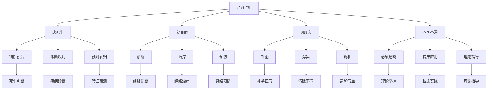

# 素问-经络论篇第五十七

> "黄帝问曰：愿闻经络。岐伯曰：经络者，所以决死生，处百病，调虚实，不可不通也。" - 岐伯

---

## 📜 原文（节选）/ Original Text (Excerpt)

黄帝问曰：愿闻经络。

岐伯曰：经络者，所以决死生，处百病，调虚实，不可不通也。

帝曰：其大要何如？

岐伯曰：经脉十二，络脉无数，经筋十二，皮部十二。

---

## 📖 白话文翻译（节选）/ Modern Chinese Translation (Excerpt)

黄帝问道：我愿意听到经络的理论。

岐伯回答说：经络，是用来决断死生，处理百病，调节虚实，不可不通晓的。

黄帝说：它的大要如何？

岐伯说：经脉有十二条，络脉有无数条，经筋有十二条，皮部有十二个。

---

## 🔍 英文释义 / English Interpretation

Yellow Emperor asked: I would like to hear the theory of meridians and collaterals.

Qibo replied: Meridians and collaterals are used to determine life and death, treat all diseases, regulate deficiency and excess, and cannot be left ununderstood.

Yellow Emperor said: What is the main principle?

Qibo said: There are twelve meridians, countless collaterals, twelve muscle regions, and twelve cutaneous regions.

---

## 🔑 核心要点 / Core Concepts

### 1. 经络系统 / Meridian System

| 系统 | 数量 | 分布 | 作用 |
|------|------|------|------|
| 十二经脉 | 12条 | 全身纵行 | 运行气血，联络脏腑 |
| 奇经八脉 | 8条 | 全身纵横 | 调节气血，联络经脉 |
| 络脉 | 无数 | 全身网络 | 沟通表里，渗灌气血 |
| 经筋 | 12条 | 全身筋膜 | 联络四肢，司关节运动 |
| 皮部 | 12个 | 全身皮肤 | 反映病变，防御外邪 |

### 2. 十二经脉 / Twelve Meridians

| 经脉 | 性质 | 分布 | 主要病症 |
|------|------|------|---------|
| 手太阴肺经 | 阴经 | 上肢内侧前缘 | 咳嗽、气喘、胸痛 |
| 手阳明大肠经 | 阳经 | 上肢外侧前缘 | 腹泻、便秘、牙痛 |
| 足阳明胃经 | 阳经 | 下肢外侧前缘 | 胃痛、呕吐、腹胀 |
| 足太阴脾经 | 阴经 | 下肢内侧前缘 | 腹胀、便溏、水肿 |
| 手少阴心经 | 阴经 | 上肢内侧后缘 | 心悸、失眠、心痛 |
| 手太阳小肠经 | 阳经 | 上肢外侧后缘 | 尿频、耳聋、咽痛 |
| 足太阳膀胱经 | 阳经 | 下肢外侧后缘 | 尿闭、遗尿、腰痛 |
| 足少阴肾经 | 阴经 | 下肢内侧后缘 | 腰痛、水肿、遗精 |
| 手厥阴心包经 | 阴经 | 上肢内侧中间 | 心痛、胸闷、心悸 |
| 手少阳三焦经 | 阳经 | 上肢外侧中间 | 耳鸣、偏头痛、胁痛 |
| 足少阳胆经 | 阳经 | 下肢外侧中间 | 胆绞痛、口苦、偏头痛 |
| 足厥阴肝经 | 阴经 | 下肢内侧中间 | 头痛、眩晕、胁痛 |

### 3. 经络作用 / Meridian Functions

---

## 📚 理论解释 / Theoretical Analysis

### 经络理论 / Meridian Theory

> [!info] 核心概念
- 经络者，所以决死生
- 处百病，调虚实
- 不可不通也

#### 经络详解 / Detailed Meridians

**1. 经络定义 / Meridian Definition**
- **经络系统**：经脉和络脉的总称
- **经脉**：主干，纵行，深在
- **络脉**：分支，横行，浅在
- **作用**：运行气血，联络脏腑，沟通内外

**2. 经络组成 / Meridian Composition**
- **十二经脉**：气血运行的主要通道
- **奇经八脉**：调节气血，联络经脉
- **络脉**：沟通表里，渗灌气血
- **经筋**：联络四肢，司关节运动
- **皮部**：反映病变，防御外邪

**3. 经络作用 / Meridian Functions**
- **决死生**：决断死生，判断预后
- **处百病**：处理百病，诊断治疗
- **调虚实**：调节虚实，平衡阴阳
- **不可不通**：必须通晓，临床应用

### 经别理论 / Meridian Divergence Theory

> [!warning] 核心理念
- 经别别行
- 深入脏腑
- 沟通表里

#### 经别理论详解 / Detailed Meridian Divergence Theory

**1. 经别定义 / Meridian Divergence Definition**
- **经别**：经脉的别行分支
- **特点**：深入脏腑，沟通表里
- **作用**：加强经脉联系，调节气血
- **意义**：补充经脉功能

**2. 经别分布 / Meridian Divergence Distribution**
- **别行于脏腑**：经别别行于脏腑深处
- **沟通表里**：经别沟通表里两经
- **加强联系**：经别加强经脉联系
- **补充功能**：经别补充经脉功能

**3. 经别作用 / Meridian Divergence Functions**
- **深入脏腑**：深入脏腑调节气血
- **沟通表里**：沟通表里两经气血
- **加强联系**：加强经脉之间的联系
- **补充功能**：补充经脉的功能

---

## 🏥 中医实践应用 / TCM Practice Application

### 经络治疗 / Meridian Treatment

#### 现代经络治疗应用 / Modern Meridian Treatment Application

**1. 经络诊断 / Meridian Diagnosis**
- **循经按压**：沿经脉循行按压
- **经络反应**：观察经络反应点
- **色泽变化**：观察经络色泽变化
- **压痛反应**：寻找经络压痛点

**2. 经络针刺 / Meridian Needling**
- **循经取穴**：根据经脉循行取穴
- **远端取穴**：循经远端取穴
- **近端取穴**：病变局部取穴
- **对症取穴**：根据症状取穴

**3. 经络艾灸 / Meridian Moxibustion**
- **循经艾灸**：沿经脉循行艾灸
- **穴位艾灸**：特定穴位艾灸
- **温通经络**：温通经络气血
- **散寒止痛**：散寒止痛

**4. 经络按摩 / Meridian Massage**
- **循经推拿**：沿经脉循行推拿
- **点按穴位**：点按特定穴位
- **疏通经络**：疏通经络气血
- **调和气血**：调和气血阴阳

### 现代医学对应 / Modern Medicine Correspondence

| 中医概念 | 现代解剖 | 临床应用 |
|---------|---------|---------|
| 经脉 | 神经、血管 | 针刺、艾灸 |
| 络脉 | 毛细血管、淋巴管 | 放血、拔罐 |
| 经筋 | 肌腱、韧带 | 针刀、推拿 |
| 皮部 | 皮肤、皮下组织 | 皮内针、贴敷 |

---

## 🔗 相关链接 / Related Links

- [[MOC-黄帝内经知识库]] - 主索引
- [[黄帝内经-素问索引]] - 素问索引
- [[黄帝内经-核心理论]] - 核心理论体系
- [[素问-皮部论篇第五十六]] - 皮部论
- [[素问-气穴论篇第五十八]] - 气穴论
- [[灵枢-经脉第十]] - 经脉篇

### 易学关联 / Yi Jing Connection

- [[MOC-易经知识库]] - 易经索引
- [[20260201-0002 五行]] - 五行理论

**易学与经络的联系:**
- 天人相应：易学的天人相应观与经络理论相通
- 阴阳平衡：易学的阴阳观念与经络平衡相通

---

## 💡 学习要点 / Learning Points

### 掌握重点 / Key Points to Master

- [ ] 理解经络的重要意义
- [ ] 掌握十二经脉的分布
- [ ] 学会经络诊断的方法
- [ ] 了解经络治疗的原理

### 思考问题 / Questions for Reflection

1. **为什么说"经络者，所以决死生，处百病，调虚实"？**
   - 决死生：决断死生，判断预后
   - 处百病：处理百病，诊断治疗
   - 调虚实：调节虚实，平衡阴阳

2. **现代医学如何应用"经络论"？**
   - 神经刺激：基于现代神经生理学
   - 经络诊断：经络反应点诊断
   - 综合治疗：针刺、艾灸、按摩

---

## 📊 学习进度 / Learning Progress

### 完成情况 / Completion Status

| 学习内容 | 状态 | 备注 |
|---------|------|------|
| 原文诵读 | 📝 进行中 | 建议每日诵读 |
| 白话文理解 | ✅ 已完成 | 理解主要含义 |
| 经络理论 | ✅ 已完成 | 掌握理论 |
| 十二经脉 | 📝 进行中 | 需要记忆 |
| 理论分析 | ✅ 已完成 | 理解理论 |

---

## 🔄 更新日志 / Update Log

### 2026-02-03

- ✅ 创建经络论篇第五十七笔记
- ✅ 完成原文、白话文翻译（节选）
- 整理经络系统和十二经脉对照表
- ✅ 编写经络和经别理论

---

**笔记创建日期**：2026年2月3日

**最后更新**：2026年2月3日
