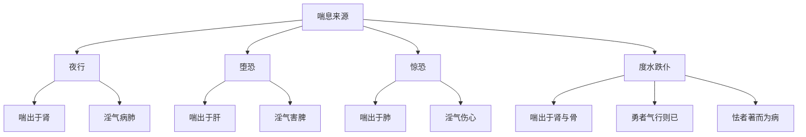

# 素问-经脉别论篇第二十一

> "饮入于胃，游溢精气，上输于脾，脾气散精，上归于肺，通调水道，下输膀胱。" - 岐伯

---

## 📜 原文（节选）/ Original Text (Excerpt)

黄帝问曰：人之居处、动静、勇怯，脉亦为之变乎？

岐伯对曰：凡人之惊恐恚劳、动静，皆为变也。是以夜行则喘出于肾，淫气病肺。有所堕恐，喘出于肝，淫气害脾。有所惊恐，喘出于肺，淫气伤心。度水跌仆，喘出于肾与骨，当是之时，勇者气行则已，怯者则著而为病也。

故曰：诊病之道，观人勇怯、骨肉、皮肤，能知其情，以为诊法也。

故饮食饱甚，汗出于胃。惊而夺精，汗出于心。持重远行，汗出于肾。疾走恐惧，汗出于肝。摇体劳苦，汗出于脾。

故春秋冬夏四时阴阳，生病起于过用，此为常也。

食气入胃，散精于肝，淫气于筋。

食气入胃，浊气归心，淫精于脉。脉气流经，经气归于肺，肺朝百脉，输精于皮毛。毛脉合精，行气于府，府精神明，留于四脏，气归于权衡。权衡以平，气口成寸，以决死生。

饮入于胃，游溢精气，上输于脾，脾气散精，上归于肺，通调水道，下输膀胱。水精四布，五经并行，合于四时五脏阴阳，揆度以为常也。

---

## 📖 白话文翻译（节选）/ Modern Chinese Translation (Excerpt)

黄帝问道：人的居住处所、活动或静止、勇敢或怯懦，脉象也会随之变化吗？

岐伯回答说：凡是人的惊恐、愤怒、劳累，活动或静止，都会使脉象变化。所以夜间行走则喘息出于肾，淫气犯肺。有堕坠恐惧，喘息出于肝，淫气伤脾。有惊恐，喘息出于肺，淫气伤心。渡水跌倒，喘息出于肾与骨，这个时候，勇敢的人气行就痊愈了，怯懦的人则气著而为病。

所以说：诊察疾病的方法，观察人的勇敢怯懦、骨肉、皮肤，能够了解其情志，作为诊察的方法。

所以饮食过饱，汗出于胃。惊而伤精，汗出于心。持重远行，汗出于肾。快速奔跑恐惧，汗出于肝。摇体劳苦，汗出于脾。

所以春夏秋冬四时阴阳，疾病发生都是因为过度使用，这是常理。

食物进入胃中，散精于肝，淫气于筋。

食物进入胃中，浊气归于心，淫精于脉。脉气流于经脉，经气归于肺，肺朝会百脉，输精于皮毛。毛脉合精，行气于腑，腑精神明，留于四脏，气归于权衡。权衡平衡，气口成寸，以决断死生。

饮水进入胃中，游溢精气，上输于脾，脾气散精，上归于肺，通调水道，下输膀胱。水精四布，五经并行，合于四时五脏阴阳，衡量作为常理。

---

## 🔑 核心要点 / Core Concepts

### 1. 饮食入胃的消化过程 / Digestion Process of Food and Drink

| 阶段 | 过程 | 输送 |
|------|------|------|
| 食气入胃 | 散精于肝 | 淫气于筋 |
| 食气入胃 | 浊气归心 | 淫精于脉 |
| 饮入于胃 | 游溢精气 | 上输于脾 |
| 脾气散精 | 上归于肺 | 通调水道 |
| 肺调水道 | 下输膀胱 | 水精四布 |

### 2. 汗出与脏腑关系 / Sweating and Zang-Fu Organs

| 情况 | 汗出来源 |
|------|----------|
| 饮食饱甚 | 汗出于胃 |
| 惊而夺精 | 汗出于心 |
| 持重远行 | 汗出于肾 |
| 疾走恐惧 | 汗出于肝 |
| 摇体劳苦 | 汗出于脾 |

### 3. 喘与脏腑关系 / Panting and Zang-Fu Organs

---

## 📚 理论解释 / Theoretical Analysis

### 饮食消化理论 / Food Digestion Theory

> [!info] 核心概念
- 食物入胃后通过脾胃运化
- 精微物质输布全身
- 肺为水之上源，通调水道

#### 食气入胃过程详解 / Detailed Process of Food Entering Stomach

**1. 散精于肝 / Dispersing Essence to Liver**
- 食物入胃
- 胃腐熟水谷
- 散精于肝
- 淫气于筋

**2. 浊气归心 / Turbid Qi Returning to Heart**
- 食物入胃
- 浊气归心
- 淫精于脉
- 脉气流经

**3. 肺朝百脉 / Lung Meeting All Meridians**
- 经气归于肺
- 肺朝百脉
- 输精于皮毛
- 毛脉合精

**4. 气口成寸 / Qi Kou Becoming Cun**
- 行气于腑
- 腑精神明
- 留于四脏
- 气归于权衡
- 权衡以平
- 气口成寸

### 饮水消化理论 / Drink Digestion Theory

> [!warning] 核心理念
- 饮水入胃后由脾运化
- 肺通调水道
- 膀胱贮存尿液

#### 饮入于胃过程详解 / Detailed Process of Drink Entering Stomach

**1. 游溢精气 / Overflowing Essence**
- 饮入于胃
- 游溢精气
- 上输于脾

**2. 脾气散精 / Spleen Qi Dispersing Essence**
- 脾气散精
- 上归于肺

**3. 通调水道 / Regulating Water Channels**
- 通调水道
- 下输膀胱

**4. 水精四布 / Water Essence Dispersing**
- 水精四布
- 五经并行
- 合于四时五脏阴阳

### 汗出理论 / Sweating Theory

> [!note] 汗出与脏腑
- 汗为心之液
- 不同情况汗出来源不同
- 汗出过度伤气伤阴

#### 汗出与脏腑关系详解 / Detailed Relationship between Sweating and Zang-Fu Organs

**1. 饮食饱甚 / Overeating**
- 汗出于胃
- 胃气上逆
- 汗出过多

**2. 惊而夺精 / Startle and Loss of Essence**
- 汗出于心
- 心神受惊
- 汗出过多

**3. 持重远行 / Carrying Heavy Load and Long Walk**
- 汗出于肾
- 肾气耗损
- 汗出过多

**4. 疾走恐惧 / Fast Running and Fear**
- 汗出于肝
- 肝气郁结
- 汗出过多

**5. 摇体劳苦 / Shaking Body and Hard Labor**
- 汗出于脾
- 脾气耗损
- 汗出过多

---

## 🏥 中医实践应用 / TCM Practice Application

### 饮食调理 / Dietary Regulation

#### 现代饮食调理要点 / Modern Dietary Regulation Key Points

**1. 饮食有节 / Moderate Eating**
- 避免过饱
- 细嚼慢咽
- 定时定量

**2. 饮水适量 / Moderate Drinking**
- 适量饮水
- 分次饮用
- 避免暴饮

**3. 五脏调养 / Five Zang Regulation**
- 肝：酸味养肝
- 心：苦味养心
- 脾：甘味养脾
- 肺：辛味养肺
- 肾：咸味养肾

### 汗出调理 / Sweating Regulation

#### 现代汗出调理要点 / Modern Sweating Regulation Key Points

**1. 避免过度出汗 / Avoid Excessive Sweating**
- 适度运动
- 避免过度劳累
- 及时补充水分

**2. 汗出后调理 / Regulation after Sweating**
- 及时擦干汗
- 避免受风
- 补充水分和电解质

**3. 五脏汗出调理 / Five Zang Sweating Regulation**
- 胃汗：避免过饱
- 心汗：避免惊恐
- 肾汗：避免持重远行
- 肝汗：避免疾走恐惧
- 脾汗：避免摇体劳苦

---

## 🔗 相关链接 / Related Links

- [[MOC-黄帝内经知识库]] - 主索引
- [[黄帝内经-素问索引]] - 素问索引
- [[黄帝内经-核心理论]] - 核心理论体系
- [[素问-脏气法时论篇第二十二]] - 五脏病时
- [[素问-太阴阳明论篇第二十九]] - 太阴阳明

### 易学关联 / Yi Jing Connection

- [[MOC-易经知识库]] - 易经索引
- [[20260201-0002 五行]] - 五行理论

**易学与经脉别论的联系:**
- 五行对应：易学的五行理论与中医五脏消化相通
- 阴阳平衡：易学的阴阳理论与中医气血平衡相通

---

## 💡 学习要点 / Learning Points

### 掌握重点 / Key Points to Master

- [ ] 理解饮食入胃的消化过程
- [ ] 掌握汗出与脏腑的关系
- [ ] 学会喘与脏腑的关系
- [ ] 了解饮食调理方法

### 思考问题 / Questions for Reflection

1. **为什么说"饮食饱甚，汗出于胃"？**
   - 胃气上逆
   - 汗为胃液
   - 过饱伤胃

2. **现代医学如何应用"饮食入胃"？**
   - 消化系统解剖
   - 营养学原理
   - 饮食调理

---

## 📊 学习进度 / Learning Progress

### 完成情况 / Completion Status

| 学习内容 | 状态 | 备注 |
|---------|------|------|
| 原文诵读 | 📝 进行中 | 建议每日诵读 |
| 白话文理解 | ✅ 已完成 | 理解主要含义 |
| 饮食消化 | ✅ 已完成 | 掌握过程 |
| 汗出关系 | 📝 进行中 | 需要临床实践 |
| 理论分析 | ✅ 已完成 | 理解理论 |

---

## 🔄 更新日志 / Update Log

### 2026-02-03

- ✅ 创建经脉别论篇第二十一笔记
- ✅ 完成原文、白话文翻译（节选）
- ✅ 整理饮食消化和汗出关系对照表
- ✅ 编写饮食消化和汗出理论

---

**笔记创建日期**：2026年2月3日

**最后更新**：2026年2月3日
