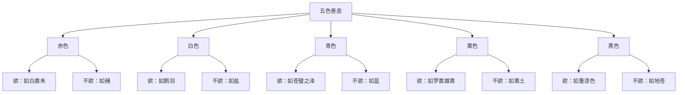

# 素问-脉要精微论篇第十七

> "黄帝曰：诊法何如？岐伯曰：诊法常以平旦，阴气未动，阳气未散，饮食未进，经脉未盛，络脉调匀，气血未乱，故乃可诊有过之脉。" - 岐伯

---

## 📜 原文（节选）/ Original Text (Excerpt)

黄帝问曰：诊法何如？

岐伯曰：诊法常以平旦，阴气未动，阳气未散，饮食未进，经脉未盛，络脉调匀，气血未乱，故乃可诊有过之脉。

切脉动静而视精明，察五色，观五脏有余不足，六腑强弱，形之盛衰，以此参伍，决死生之分。

夫脉者，血之府也。长则气治，短则气病，数则烦心，大则病进，上盛则气高，下盛则气胀，代则气衰，细则气少，涩则心痛，浑浑革至如涌泉，病进而色弊，绵绵其去如弦绝，死。

夫精明五色者，气之华也。赤欲如白裹朱，不欲如赭；白欲如鹅羽，不欲如盐；青欲如苍璧之泽，不欲如蓝；黄欲如罗裹雄黄，不欲如黄土；黑欲如重漆色，不欲如地苍。五色精微象见矣，其寿不久也。

夫精明者，所以视万物，别白黑，审短长。以长为短，以白为黑，如是则精衰矣。

五脏者，中之守也。中盛脏满，气胜伤恐者，声如从室中言，是中气之湿也；言而微，终日乃复言者，此夺气也；衣被不敛，言语善恶不避亲疏者，此神明之乱也；仓廪不藏者，是门户不要也；水泉不止者，是膀胱不藏也。得守者生，失守者死。

---

## 📖 白话文翻译（节选）/ Modern Chinese Translation (Excerpt)

黄帝问道：诊察脉象的方法是什么？

岐伯说：诊脉通常在清晨，这时阴气没有扰动，阳气没有散乱，没有进饮食，经脉没有充盛，络脉调和均匀，气血没有紊乱，所以可以诊察出有病的脉象。

切按脉象的动静，同时观察眼睛的精神，察看五色，观察五脏的有余不足、六腑的强弱、形体的盛衰，把这些综合起来，判断死生。

脉，是血的府库。脉长则气机调和，脉短则气机有病，脉数则心烦，脉大则病势进展，脉上盛则气机上冲，脉下盛则气机胀满，脉代则气机衰竭，脉细则气机不足，脉涩则心痛，脉象浑浑革至如涌泉，病势进展面色败坏，脉象绵绵其去如弦断绝，是死候。

精明和五色，是气的精华。红色应该像白绢裹着朱砂，不应该像赭石；白色应该像鹅毛，不应该像盐；青色应该像苍璧的光泽，不应该像蓝草；黄色应该像薄纱裹着雄黄，不应该像黄土；黑色应该像重漆的色泽，不应该像地色灰暗。五色的精微表现，如果都出现，寿命就不长了。

精明，是用来观察万物，区别黑白，审察长短。把长看成长短，把白看成黑，像这样就是精气衰败了。

五脏，是身体的守卫。中焦盛满脏器胀满，气胜伤恐，声音像从室中说话，这是中焦气湿；说话微弱，整天才说一句话，这是夺气；衣服被子不收敛，说话善恶不避亲疏，这是神明紊乱；仓廪不藏，这是门户不固；水泉不止，这是膀胱不藏。能守住五脏的生，不能守住五脏的死。

---

## 🔑 核心要点 / Core Concepts

### 1. 诊脉时间 / Pulse Diagnosis Timing

| 时间 | 条件 | 原因 |
|------|------|------|
| 平旦 | 阴气未动，阳气未散 | 气血未乱 |
| 平旦 | 饮食未进 | 经脉未盛 |
| 平旦 | 络脉调匀 | 脉象真实 |

### 2. 脉象诊断 / Pulse Diagnosis

| 脉象 | 病机 | 表现 |
|------|------|------|
| 长 | 气治 | 脉长则气机调和 |
| 短 | 气病 | 脉短则气机有病 |
| 数 | 烦心 | 脉数则心烦 |
| 大 | 病进 | 脉大则病势进展 |
| 上盛 | 气高 | 脉上盛则气机上冲 |
| 下盛 | 气胀 | 脉下盛则气机胀满 |
| 代 | 气衰 | 脉代则气机衰竭 |
| 细 | 气少 | 脉细则气机不足 |
| 涩 | 心痛 | 脉涩则心痛 |

### 3. 五色善恶 / Good and Evil Five Colors

---

## 📚 理论解释 / Theoretical Analysis

### 诊脉理论 / Pulse Diagnosis Theory

> [!info] 核心概念
- 诊脉以平旦为最佳时间
- 脉象反映气血盛衰
- 脉象变化反映病情进展

#### 诊脉的最佳时间 / Best Time for Pulse Diagnosis

**1. 平旦诊脉的原因 / Reasons for Morning Pulse Diagnosis**
- 阴气未动，阳气未散：气血未乱
- 饮食未进：经脉未盛
- 络脉调匀：脉象真实

**2. 诊脉的综合方法 / Comprehensive Method of Pulse Diagnosis**
- 切脉动静：切按脉象的动静
- 视精明：观察眼睛的精神
- 察五色：察看五色的变化
- 观五脏六腑：观察五脏六腑的状态
- 观形体：观察形体的盛衰

#### 脉象与病机 / Pulse and Disease Mechanism

**1. 脉象反映气机状态 / Pulse Reflects Qi State**
- 脉长：气治（气机调和）
- 脉短：气病（气机有病）
- 脉代：气衰（气机衰竭）
- 脉细：气少（气机不足）

**2. 脉象反映病情进展 / Pulse Reflects Disease Progress**
- 脉数：烦心（心烦）
- 脉大：病进（病势进展）
- 脉涩：心痛（心脏疼痛）
- 脉上盛：气高（气机上冲）
- 脉下盛：气胀（气机胀满）

### 五色精微理论 / Five Color Essence Theory

> [!warning] 核心理念
- 五色是气的精华表现
- 五色有善恶之分
- 五色精微象见，寿命不久

#### 五色善恶的标准 / Standards of Good and Evil Five Colors

**1. 红色 / Red**
- 欲：如白裹朱（像白绢裹着朱砂）
- 不欲：如赭（像赭石）

**2. 白色 / White**
- 欲：如鹅羽（像鹅毛）
- 不欲：如盐（像盐）

**3. 青色 / Green**
- 欲：如苍璧之泽（像苍璧的光泽）
- 不欲：如蓝（像蓝草）

**4. 黄色 / Yellow**
- 欲：如罗裹雄黄（像薄纱裹着雄黄）
- 不欲：如黄土（像黄土）

**5. 黑色 / Black**
- 欲：如重漆色（像重漆的色泽）
- 不欲：如地苍（像地色灰暗）

### 五脏守候理论 / Five Zang Guarding Theory

> [!note] 五脏守候
- 五脏是身体的守卫
- 得守者生，失守者死

#### 五脏守候的表现 / Manifestations of Five Zang Guarding

**1. 脾守 / Spleen Guarding**
- 中盛脏满，气胜伤恐
- 声如从室中言
- 中气之湿

**2. 气守 / Qi Guarding**
- 言而微，终日乃复言者
- 夺气

**3. 心守 / Heart Guarding**
- 衣被不敛，言语善恶不避亲疏
- 神明之乱

**4. 胃守 / Stomach Guarding**
- 仓廪不藏
- 门户不要

**5. 膀胱守 / Bladder Guarding**
- 水泉不止
- 膀胱不藏

---

## 🏥 中医实践应用 / TCM Practice Application

### 脉诊应用 / Pulse Diagnosis Application

#### 现代脉诊要点 / Modern Pulse Diagnosis Key Points

**1. 诊脉时间 / Pulse Diagnosis Time**
- 最佳：清晨（平旦）
- 现代应用：早晨空腹时

**2. 脉诊方法 / Pulse Diagnosis Method**
- 切脉动静：切按脉象
- 观察精神：观察眼睛
- 察看面色：察看五色
- 综合判断：综合判断

**3. 脉象分析 / Pulse Analysis**
- 脉长：气机调和，预后良好
- 脉短：气机有病，预后较差
- 脉代：气机衰竭，预后不良
- 脉大：病势进展，病情加重

### 望色诊断 / Color Diagnosis Application

#### 现代望色诊断 / Modern Color Diagnosis

**1. 望色要点 / Color Diagnosis Key Points**
- 色泽光泽：有光泽为生，无光泽为死
- 色泽含蓄：含蓄为生，暴露为死
- 色泽均匀：均匀为生，不均为死

**2. 五色与五脏 / Five Colors and Five Zang**
- 赤：心，如白裹朱为生，如赭为死
- 白：肺，如鹅羽为生，如盐为死
- 青：肝，如苍璧之泽为生，如蓝为死
- 黄：脾，如罗裹雄黄为生，如黄土为死
- 黑：肾，如重漆色为生，如地苍为死

---

## 🔗 相关链接 / Related Links

- [[MOC-黄帝内经知识库]] - 主索引
- [[黄帝内经-素问索引]] - 素问索引
- [[黄帝内经-核心理论]] - 核心理论体系
- [[素问-玉版论要篇第十五]] - 色脉相参
- [[素问-平人气象论篇第十八]] - 平人脉象

### 易学关联 / Yi Jing Connection

- [[MOC-易经知识库]] - 易经索引
- [[20260201-0002 五行]] - 五行理论

**易学与脉要精微的联系:**
- 五行对应：易学的五行理论与中医五脏五色相通
- 阴阳调和：易学的阴阳理论与中医脉诊相通

---

## 💡 学习要点 / Learning Points

### 掌握重点 / Key Points to Master

- [ ] 理解诊脉的最佳时间
- [ ] 掌握脉象与病机的关系
- [ ] 学会辨别五色善恶
- [ ] 了解五脏守候的表现

### 思考问题 / Questions for Reflection

1. **为什么诊脉以平旦为最佳时间？**
   - 阴阳未乱，气血调匀
   - 经脉未盛，脉象真实
   - 避免干扰，准确诊断

2. **现代医学如何应用"脉要精微"？**
   - 早晨体检：选择最佳时间
   - 综合诊断：脉诊结合其他诊断
   - 客观指标：现代仪器辅助

---

## 📊 学习进度 / Learning Progress

### 完成情况 / Completion Status

| 学习内容 | 状态 | 备注 |
|---------|------|------|
| 原文诵读 | 📝 进行中 | 建议每日诵读 |
| 白话文理解 | ✅ 已完成 | 理解主要含义 |
| 脉象诊断 | ✅ 已完成 | 掌握脉象 |
| 五色善恶 | 📝 进行中 | 需要临床实践 |
| 理论分析 | ✅ 已完成 | 理解诊断方法 |

---

## 🔄 更新日志 / Update Log

### 2026-02-03

- ✅ 创建脉要精微论篇第十七笔记
- ✅ 完成原文、白话文翻译（节选）
- ✅ 整理脉象诊断和五色善恶对照表
- ✅ 编写诊脉和五色理论

---

**笔记创建日期**：2026年2月3日

**最后更新**：2026年2月3日
