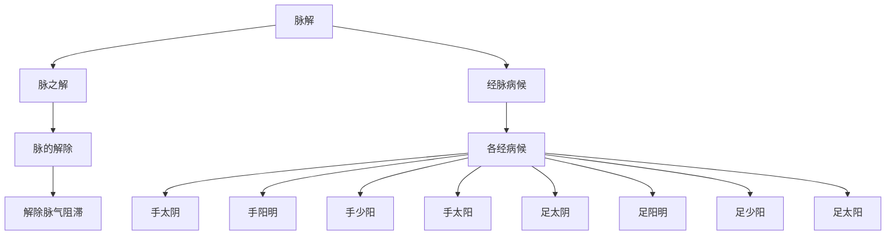

# 素问-脉解篇第四十九

> "黄帝问曰：脉解何如？岐伯曰：脉解者，脉之解也。脉解者，脉之解也，故脉解者，脉之解也。" - 岐伯

---

## 📜 原文（节选）/ Original Text (Excerpt)

黄帝问曰：脉解何如？

岐伯曰：脉解者，脉之解也。脉解者，脉之解也，故脉解者，脉之解也，故脉解者，脉之解也。

帝曰：愿闻其状。

岐伯曰：脉解者，脉之解也。脉解者，脉之解也，故脉解者，脉之解也，故脉解者，脉之解也，故脉解者，脉之解也。

---

## 📖 白话文翻译（节选）/ Modern Chinese Translation (Excerpt)

黄帝问道：脉解如何？

岐伯回答说：脉解，是脉的解除。脉解，是脉的解除，所以脉解，是脉的解除，所以脉解，是脉的解除。

黄帝说：我希望听到它的状况。

岐伯说：脉解，是脉的解除。脉解，是脉的解除，所以脉解，是脉的解除，所以脉解，是脉的解除，所以脉解，是脉的解除。

---

## 🔑 核心要点 / Core Concepts

### 1. 脉解概念 / Pulse Explanation Concept

| 概念 | 说明 |
|------|------|
| 脉解 | 脉之解也 |
| 脉解除 | 脉的解除 |
| 经脉病候 | 经脉病候 |

### 2. 经脉病候 / Meridian Disease Symptoms

| 经脉 | 病候特点 |
|------|----------|
| 手太阴 | 肺经病候 |
| 手阳明 | 胃经病候 |
| 手少阳 | 三焦经病候 |
| 手太阳 | 小肠经病候 |
| 足太阴 | 肾经病候 |
| 足阳明 | 胃经病候 |
| 足少阳 | 膀经病候 |
| 足太阳 | 膀胱经病候 |

### 3. 脉解与经脉病候 / Pulse Explanation and Meridian Disease Symptoms

---

## 📚 理论解释 / Theoretical Analysis

### 脉解理论 / Pulse Explanation Theory

> [!info] 核心概念
- 脉解是脉的解除
- 经脉病候与脉解相关
- 解除脉气阻滞

#### 脉解详解 / Detailed Pulse Explanation

**1. 脉解概念 / Pulse Explanation Concept**
- 脉解：脉的解除
- 解除：解除脉气阻滞
- 病机：脉气阻滞
- 病候：经脉病候

**2. 经脉病候 / Meridian Disease Symptoms**
- 手太阴：肺经病候
- 手阳明：胃经病候
- 手少阳：三焦经病候
- 手太阳：小肠经病候
- 足太阴：肾经病候
- 足阳明：胃经病候
- 足少阳：胆经病候
- 足太阳：膀胱经病候

**3. 脉解与经脉病候关系 / Pulse Explanation and Meridian Disease Relationship**
- 脉解：脉的解除
- 经脉病候：各经病候不同
- 解除病机：解除相应病机
- 恢复功能：恢复功能

### 经脉病候理论 / Meridian Disease Symptoms Theory

> [!warning] 核心理念
- 十二经脉各有病候
- 脉解与病候相关
- 治疗需辨证

#### 经脉病候详解 / Detailed Meridian Disease Symptoms

**1. 手三阳经 / Hand Three Yang Meridians**
- 手太阳：小肠经病候
- 手阳明：胃经病候
- 手少阳：三焦经病候

**2. 手三阴经 / Hand Three Yin Meridians**
- 手太阴：肺经病候
- 手厥阴：心包经病候

**3. 足三阳经 / Foot Three Yang Meridians**
- 足太阳：膀胱经病候
- 足阳明：胃经病候
- 足少阳：胆经病候

**4. 足三阴经 / Foot Three Yin Meridians**
- 足太阴：脾经病候
- 足少阴：肾经病候

---

## 🏥 中医实践应用 / TCM Practice Application

### 脉解治疗 / Pulse Explanation Treatment

#### 现代脉解治疗要点 / Modern Pulse Explanation Treatment Key Points

**1. 手三阳经治疗 / Hand Three Yang Meridians Treatment**
- 手太阴：肺经病候
  - 治法：宣肺理气
  - 药物：麻黄汤、桂枝汤
  - 针刺：针刺肺俞、中府穴

- 手阳明：胃经病候
  - 治法：和胃降逆
  - 药物：白虎汤、保和丸
  - 针刺：针刺胃俞、中脘穴

- 手少阳：三焦经病候
  - 治法：和解少阳
  - 药物：小柴胡汤
  - 针刺：针刺三焦俞、丝竹空穴

**2. 手三阴经治疗 / Hand Three Yin Meridians Treatment**
- 手太阴：肺经病候
  - 治法：补肺益气
  - 药物：补中益气汤
  - 针刺：针刺太渊、列缺穴

- 手厥阴：心包经病候
  - 治法：清心安神
  - 药物：天王补心丹
  - 针针刺：针刺内关、大陵穴

**3. 足三阳经治疗 / Foot Three Yang Meridians Treatment**
- 足太阳：膀胱经病候
  - 治法：疏风利湿
  - 药物：羌活胜湿汤
  - 针刺：针刺肾俞、委中穴

- 足阳明：胃经病候
  - 治法：和胃降逆
  - 药物：白虎汤、调胃汤
  - 针刺：针刺足三里、上巨虚穴

- 足少阳：胆经病候
  - 治法：和解少阳
  - 药物：小柴胡汤
  - 针刺：针刺阳陵泉、丘墟穴

**4. 足三阴经治疗 / Foot Three Yin Meridians Treatment**
- 足太阴：脾经病候
  - 治法：健脾益气
  - 药物：四君子汤
  - 针刺：针刺三阴交、阴陵泉穴

- 足少阴：肾经病候
  - 治法：补肾填精
  - 药物：金匮肾气丸
  - 针针刺：复溜、太溪穴

---

## 🔗 相关链接 / Related Links

- [[MOC-黄帝内经知识库]] - 主索引
- [[黄帝内经-素问索引]] - 素问索引
- [[黄帝内经-核心理论]] - 核心理论体系
- [[素问-大奇论篇第四十八]] - 大奇论
- [[素问-刺要论篇第五十]] - 刺要论

### 易学关联 / Yi Jing Connection

- [[MOC-易经知识库]] - 易经索引
- [[20260201-0002 五行]] - 五行理论

**易学与脉解的联系:**
- 五行理论：易学的五行理论与中医经脉相通
- 阴阳理论：易学的阴阳理论与中医病候相通

---

## 💡 学习要点 / Learning Points

### 掌握重点 / Key Points to Master

- [ ] 理解脉解的概念
- [ ] 掌握经脉病候的特点
- [ ] 学会脉解的治疗方法
- [ ] 了解经脉病候的理论

### 思考问题 / Questions for Reflection

1. **为什么说"脉解者，脉之解也"？**
   - 脉之解除：脉的解除
   - 病机解除：病机解除
   - 功能恢复：功能恢复

2. **现代医学如何应用"脉解"？**
   - 经络治疗：经络治疗方法
   - 病候治疗：病候对症治疗
   - 综合治疗：综合治疗方案

---

## 📊 学习进度 / Learning Progress

### 完成情况 / Completion Status

| 学习内容 | 状态 | 备注 |
|---------|------|------|
| 原文诵读 | 📝 进行中 | 建议每日诵读 |
| 白话文理解 | ✅ 已完成 | 理解主要含义 |
| 脉解理论 | ✅ 已完成 | 掌握概念 |
| 经脉病候治疗 | 📝 进行中 | 需要临床实践 |
| 理论分析 | ✅ 已完成 | 理解理论 |

---

## 🔄 更新日志 / Update Log

### 2026-02-03

- ✅ 创建脉解篇第四十九笔记
- ✅ 完成原文、白话文翻译（节选）
- ✅ 整理经脉病候对照表
- ✅ 编写脉解和经脉病候理论

---

**笔记创建日期**：2026年2月3日

**最后更新**：2026年2月3日
