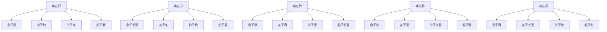

# 素问-脏气法时论篇第二十二

> "黄帝曰：脏气法时论何如？岐伯曰：肝主春，足厥阴少阳主治，其日甲乙，肝苦急，急食甘以缓之。" - 岐伯

---

## 📜 原文（节选）/ Original Text (Excerpt)

黄帝曰：脏气法时论何如？

岐伯曰：肝主春，足厥阴少阳主治，其日甲乙，肝苦急，急食甘以缓之。

心主夏，手少阴太阳主治，其日丙丁，心苦缓，急食酸以收之。

脾主长夏，足太阴阳明主治，其日戊己，脾苦湿，急食苦以燥之。

肺主秋，手太阴阳明主治，其日庚辛，肺苦气上逆，急食苦以泄之。

肾主冬，足少阴太阳主治，其日壬癸，肾苦燥，急食辛以润之。

肝色青，宜食甘，粳米、牛肉、枣、葵皆甘。心色赤，宜食酸，小豆、犬肉、李、韭皆酸。肺色白，宜食苦，麦、羊肉、杏、薤皆苦。肾色黑，宜食辛，黄黍、鸡肉、桃、葱皆辛。脾色黄，宜食咸，大豆、豕肉、栗、藿皆咸。

病在肝，愈于夏，夏不愈，甚于秋，秋不死，持于冬，起于春，禁当风。

病在心，愈于长夏，长夏不愈，甚于冬，冬不死，持于春，起于夏，禁温食热衣。

病在脾，愈于秋，秋不愈，甚于春，春不死，持于夏，起于长夏，禁湿食饱食。

病在肺，愈于冬，冬不愈，甚于夏，夏不死，持于长夏，起于秋，禁寒饮食寒衣。

病在肾，愈于春，春不愈，甚于长夏，长夏不死，持于秋，起于冬，禁犯焠热食温炙衣。

---

## 📖 白话文翻译（节选）/ Modern Chinese Translation (Excerpt)

黄帝问道：脏气法时论是怎样的？

岐伯说：肝主管春季，足厥阴少阳主治，其日甲乙，肝苦于拘急，急食甘味以缓解它。

心主管夏季，手少阴太阳主治，其日丙丁，心苦于迟缓，急食酸味以收敛它。

脾主管长夏，足太阴阳明主治，其日戊己，脾苦于湿，急食苦味以燥湿。

肺主管秋季，手太阴阳明主治，其日庚辛，肺苦于气机上逆，急食苦味以泄降它。

肾主管冬季，足少阴太阳主治，其日壬癸，肾苦于燥，急食辛味以滋润它。

肝色青，适宜吃甘味食物，粳米、牛肉、枣、葵菜都是甘味。心色赤，适宜吃酸味食物，小豆、狗肉、李子、韭菜都是酸味。肺色白，适宜吃苦味食物，麦子、羊肉、杏子、薤白都是苦味。肾色黑，适宜吃辛味食物，黄黍、鸡肉、桃子、葱都是辛味。脾色黄，适宜吃咸味食物，大豆、猪肉、栗子、藿菜都是咸味。

病在肝，夏季痊愈，夏季不愈，秋季加重，秋季不死，冬季保持，春季起病，禁忌当风。

病在心，长夏痊愈，长夏不愈，冬季加重，冬季不死，春季保持，夏季起病，禁忌温食热衣。

病在脾，秋季痊愈，秋季不愈，春季加重，春季不死，夏季保持，长夏起病，禁忌湿食饱食。

病在肺，冬季痊愈，冬季不愈，夏季加重，夏季不死，长夏保持，秋季起病，禁忌寒饮食寒衣。

病在肾，春季痊愈，春季不愈，长夏加重，长夏不死，秋季保持，冬季起病，禁忌犯焠热食温炙衣。

---

## 🔑 核心要点 / Core Concepts

### 1. 五脏与四季对应 / Five Zang and Four Seasons

| 脏 | 季节 | 经脉 | 日 | 苦 | 食 |
|------|------|------|------|------|------|
| 肝 | 春 | 足厥阴少阳 | 甲乙 | 急 | 甘 |
| 心 | 夏 | 手少阴太阳 | 丙丁 | 缓 | 酸 |
| 脾 | 长夏 | 足太阴阳明 | 戊己 | 湿 | 苦 |
| 肺 | 秋 | 手太阴阳明 | 庚辛 | 气上逆 | 苦 |
| 肾 | 冬 | 足少阴太阳 | 壬癸 | 燥 | 辛 |

### 2. 五色五味食物 / Five Colors and Five Flavors Food

| 脏 | 色 | 宜食 | 食物 |
|------|------|------|------|
| 肝 | 青 | 甘 | 粳米、牛肉、枣、葵 |
| 心 | 赤 | 酸 | 小豆、犬肉、李、韭 |
| 脾 | 黄 | 咸 | 大豆、豕肉、栗、藿 |
| 肺 | 白 | 苦 | 麦、羊肉、杏、薤 |
| 肾 | 黑 | 辛 | 黄黍、鸡肉、桃、葱 |

### 3. 五脏病愈甚持起 / Five Zang Disease Recovery Worsening Maintaining Onset

---

## 📚 理论解释 / Theoretical Analysis

### 五脏法时理论 / Five Zang Corresponding to Four Seasons Theory

> [!info] 核心概念
- 五脏各有主管的季节
- 五脏各有苦证
- 五脏各有适宜的食物

#### 五脏法时详解 / Detailed Five Zang Corresponding to Four Seasons

**1. 肝主春 / Liver Governing Spring**
- 经脉：足厥阴少阳
- 日：甲乙
- 苦：急
- 食：甘

**2. 心主夏 / Heart Governing Summer**
- 经脉：手少阴太阳
- 日：丙丁
- 苦：缓
- 食：酸

**3. 脾主长夏 / Spleen Governing Long Summer**
- 经脉：足太阴阳明
- 日：戊己
- 苦：湿
- 食：苦

**4. 肺主秋 / Lung Governing Autumn**
- 经脉：手太阴阳明
- 日：庚辛
- 苦：气上逆
- 食：苦

**5. 肾主冬 / Kidney Governing Winter**
- 经脉：足少阴太阳
- 日：壬癸
- 苦：燥
- 食：辛

### 五色五味食物理论 / Five Colors and Five Flavors Food Theory

> [!warning] 核心理念
- 五脏各有对应的颜色
- 五脏各有适宜的五味
- 食物可以调养五脏

#### 五色五味食物详解 / Detailed Five Colors and Five Flavors Food

**1. 肝色青宜食甘 / Liver Color Green Eat Sweet**
- 颜色：青
- 宜食：甘
- 食物：粳米、牛肉、枣、葵

**2. 心色赤宜食酸 / Heart Color Red Eat Sour**
- 颜色：赤
- 宜食：酸
- 食物：小豆、犬肉、李、韭

**3. 脾色黄宜食咸 / Spleen Color Yellow Eat Salty**
- 颜色：黄
- 宜食：咸
- 食物：大豆、豕肉、栗、藿

**4. 肺色白宜食苦 / Lung Color White Eat Bitter**
- 颜色：白
- 宜食：苦
- 食物：麦、羊肉、杏、薤

**5. 肾色黑宜食辛 / Kidney Color Black Eat Pungent**
- 颜色：黑
- 宜食：辛
- 食物：黄黍、鸡肉、桃、葱

### 五脏病愈甚持起理论 / Five Zang Disease Recovery Worsening Maintaining Onset Theory

> [!note] 病程规律
- 五脏病各有痊愈的季节
- 五脏病各有加重的季节
- 五脏病各有保持的季节
- 五脏病各有起病的季节

#### 五脏病愈甚持起详解 / Detailed Five Zang Disease Recovery Worsening Maintaining Onset

**1. 病在肝 / Disease in Liver**
- 愈于夏：夏季痊愈
- 甚于秋：秋季加重
- 持于冬：冬季保持
- 起于春：春季起病
- 禁忌：当风

**2. 病在心 / Disease in Heart**
- 愈于长夏：长夏痊愈
- 甚于冬：冬季加重
- 持于春：春季保持
- 起于夏：夏季起病
- 禁忌：温食热衣

**3. 病在脾 / Disease in Spleen**
- 愈于秋：秋季痊愈
- 甚于春：春季加重
- 持于夏：夏季保持
- 起于长夏：长夏起病
- 禁忌：湿食饱食

**4. 病在肺 / Disease in Lung**
- 愈于冬：冬季痊愈
- 甚于夏：夏季加重
- 持于长夏：长夏保持
- 起于秋：秋季起病
- 禁忌：寒饮食寒衣

**5. 病在肾 / Disease in Kidney**
- 愈于春：春季痊愈
- 甚于长夏：长夏加重
- 持于秋：秋季保持
- 起于冬：冬季起病
- 禁忌：犯焠热食温炙衣

---

## 🏥 中医实践应用 / TCM Practice Application

### 五脏饮食调养 / Five Zang Dietary Regulation

#### 现代五脏饮食调养要点 / Modern Five Zang Dietary Regulation Key Points

**1. 肝脏调养 / Liver Regulation**
- 食物：甘味食物
- 避免：辛辣刺激
- 建议：粳米、牛肉、枣、葵

**2. 心脏调养 / Heart Regulation**
- 食物：酸味食物
- 避免：过度兴奋
- 建议：小豆、犬肉、李、韭

**3. 脾脏调养 / Spleen Regulation**
- 食物：咸味食物
- 避免：湿食饱食
- 建议：大豆、猪肉、栗、藿

**4. 肺脏调养 / Lung Regulation**
- 食物：苦味食物
- 避免：寒饮食
- 建议：麦、羊肉、杏、薤

**5. 肾脏调养 / Kidney Regulation**
- 食物：辛味食物
- 避免：犯焠热食
- 建议：黄黍、鸡肉、桃、葱

---

## 🔗 相关链接 / Related Links

- [[MOC-黄帝内经知识库]] - 主索引
- [[黄帝内经-素问索引]] - 素问索引
- [[黄帝内经-核心理论]] - 核心理论体系
- [[素问-经脉别论篇第二十一]] - 经脉别论
- [[素问-宣明五气篇第二十三]] - 宣明五气

### 易学关联 / Yi Jing Connection

- [[MOC-易经知识库]] - 易经索引
- [[20260201-0002 五行]] - 五行理论

**易学与脏气法时的联系:**
- 四时理论：易学的四时理论与中医五脏法时相通
- 五行对应：易学的五行理论与中医五脏五味相通

---

## 💡 学习要点 / Learning Points

### 掌握重点 / Key Points to Master

- [ ] 理解五脏与四季的对应关系
- [ ] 掌握五色五味食物的分类
- [ ] 学会五脏病的病程规律
- [ ] 了解五脏饮食调养方法

### 思考问题 / Questions for Reflection

1. **为什么说"肝苦急，急食甘以缓之"？**
   - 肝主疏泄，急则肝气郁结
   - 甘味缓急，缓解肝气急
   - 食疗调理，辅助治疗

2. **现代医学如何应用"脏气法时"？**
   - 季节性疾病预防
   - 五脏饮食调理
   - 个体化营养方案

---

## 📊 学习进度 / Learning Progress

### 完成情况 / Completion Status

| 学习内容 | 状态 | 备注 |
|---------|------|------|
| 原文诵读 | 📝 进行中 | 建议每日诵读 |
| 白话文理解 | ✅ 已完成 | 理解主要含义 |
| 五脏法时 | ✅ 已完成 | 掌握对应关系 |
| 五色五味 | 📝 进行中 | 需要临床实践 |
| 理论分析 | ✅ 已完成 | 理解理论 |

---

## 🔄 更新日志 / Update Log

### 2026-02-03

- ✅ 创建脏气法时论篇第二十二笔记
- ✅ 完成原文、白话文翻译（节选）
- ✅ 整理五脏与四季对应对照表
- ✅ 编写五脏法时和五色五味理论

---

**笔记创建日期**：2026年2月3日

**最后更新**：2026年2月3日
