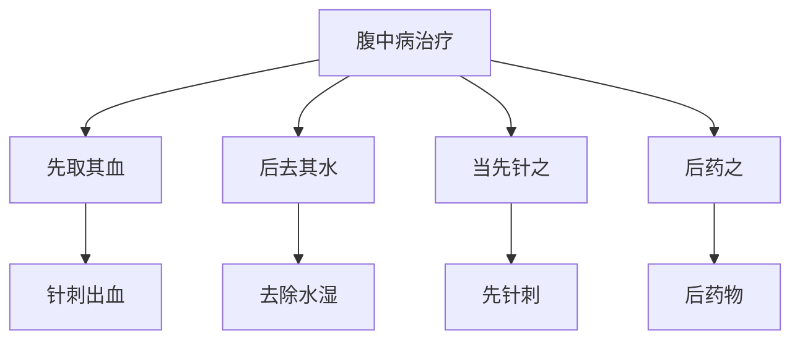

# 素问-腹中论篇第四十

> "黄帝问曰：腹中雷鸣，腹中皆痛，是何病？" - 黄帝

---

## 📜 原文（节选）/ Original Text (Excerpt)

黄帝问曰：腹中雷鸣，腹中皆痛，是何病？

岐伯对曰：此水也。水溢于肠胃之间，故腹中雷鸣，腹中皆痛也。

帝曰：水之所生奈何？

岐伯曰：此得之于水湿之气，其在于下焦，故水溢于肠胃之间。其状也，腹中雷鸣，腹中皆痛，心下结坚，食饮不下，腹中皆痛，甚则不可仰息，不能侧卧，背膺腰股胻皆痛，此其状也。

帝曰：治之奈何？

岐伯曰：治之奈何？当先取其血，后去其水，当先针之，后药之。针之奈何？先取其血，后去其水，当先针之，后药之。

---

## 📖 白话文翻译（节选）/ Modern Chinese Translation (Excerpt)

黄帝问道：腹中雷鸣，腹中都痛，是什么病？

岐伯回答说：这是水。水溢出在肠胃之间，所以腹中雷鸣，腹中都痛。

黄帝说：水的产生如何？

岐伯说：这得到于水湿之气，它在于下焦，所以水溢出在肠胃之间。它的状况，腹中雷鸣，腹中都痛，心下结硬，饮食不能下，腹中都痛，严重就不可以仰息，不能侧卧，背部胸部腰部大腿小腿都痛，这是它的状况。

黄帝说：治疗它如何？

岐伯说：治疗它如何？应当先取它的血，后去除它的水，应当先针刺它，后药物它。针刺它如何？先取它的血，后去除它的水，应当先针刺它，后药物它。

---

## 🔑 核心要点 / Core Concepts

### 1. 腹中病表现 / Abdomen Disease Manifestations

| 症状 | 表现 |
|------|------|
| 腹中雷鸣 | 腹中雷鸣 |
| 腹中皆痛 | 腹中都痛 |
| 心下结坚 | 心下结硬 |
| 食饮不下 | 饮食不能下 |
| 不可仰息 | 不可以仰息 |
| 不能侧卧 | 不能侧卧 |
| 背膺腰股胻皆痛 | 背部胸部腰部大腿小腿都痛 |

### 2. 腹中病机理 / Abdomen Disease Mechanism

| 病机 | 说明 |
|------|------|
| 水溢于肠胃之间 | 水溢出在肠胃之间 |
| 水湿之气 | 得之于水湿之气 |
| 在于下焦 | 它在于下焦 |

### 3. 腹中病治疗 / Abdomen Disease Treatment

---

## 📚 理论解释 / Theoretical Analysis

### 腹中病理论 / Abdomen Disease Theory

> [!info] 核心概念
- 腹中雷鸣，腹中皆痛
- 水溢于肠胃之间
- 得之于水湿之气

#### 腹中病详解 / Detailed Abdomen Disease

**1. 腹中病表现 / Abdomen Disease Manifestations**
- 腹中雷鸣：腹中雷鸣
- 腹中皆痛：腹中都痛
- 心下结坚：心下结硬
- 食饮不下：饮食不能下
- 不可仰息：不可以仰息
- 不能侧卧：不能侧卧
- 背膺腰股胻皆痛：背部胸部腰部大腿小腿都痛

**2. 腹中病机理 / Abdomen Disease Mechanism**
- 水溢于肠胃之间：水溢出在肠胃之间
- 水湿之气：得到于水湿之气
- 在于下焦：它在于下焦

**3. 腹中病病机 / Abdomen Disease Pathogenesis**
- 水湿内生：水湿内生
- 气机阻滞：气机阻滞
- 腠理闭塞：腠理闭塞

### 腹中病治疗理论 / Abdomen Disease Treatment Theory

> [!warning] 核心理念
- 先取其血，后去其水
- 当先针之，后药之
- 综合治疗

#### 腹中病治疗详解 / Detailed Abdomen Disease Treatment

**1. 先取其血 / First Take Its Blood**
- 方法：针刺出血
- 目的：活血通络
- 穴位：选择相关穴位

**2. 后去其水 / Then Remove Its Water**
- 方法：利水渗湿
- 目的：去除水湿
- 药物：五苓散、真武汤

**3. 当先针之 / Should First Needle It**
- 方法：先针刺
- 目的：疏通经络
- 手法：根据病情选择手法

**4. 后药之 / Then Medicine It**
- 方法：后药物
- 目的：调理脏腑
- 药物：根据病情选择药物

---

## 🏥 中医实践应用 / TCM Practice Application

### 腹中病治疗 / Abdomen Disease Treatment

#### 现代腹中病治疗要点 / Modern Abdomen Disease Treatment Key Points

**1. 水湿治疗 / Water Dampness Treatment**
- 症状：腹中雷鸣，腹中皆痛
- 治法：利水渗湿
- 药物：五苓散、猪苓汤

**2. 气滞治疗 / Qi Stagnation Treatment**
- 症状：心下结坚，食饮不下
- 治法：行气导滞
- 药物：半夏厚朴汤、枳实薤白桂枝汤

**3. 气血两虚治疗 / Qi Blood Both Deficiency Treatment**
- 症状：不可仰息，不能侧卧，背膺腰股胻皆痛
- 治法：益气养血
- 药物：八珍汤、十全大补汤

---

## 🔗 相关链接 / Related Links

- [[MOC-黄帝内经知识库]] - 主索引
- [[黄帝内经-素问索引]] - 素问索引
- [[黄帝内经-核心理论]] - 核心理论体系
- [[素问-举痛论篇第三十九]] - 举痛论
- [[素问-刺腰痛篇第四十一]] - 刺腰痛

### 易学关联 / Yi Jing Connection

- [[MOC-易经知识库]] - 易经索引
- [[20260201-0002 五行]] - 五行理论

**易学与腹中论的联系:**
- 五行理论：易学的五行理论与中医水湿相通
- 水火理论：易学的水火理论与中医腹中病相通

---

## 💡 学习要点 / Learning Points

### 掌握重点 / Key Points to Master

- [ ] 理解腹中病的表现
- [ ] 掌握腹中病的机理
- [ ] 学会腹中病的治疗方法
- [ ] 了解腹中病的现代应用

### 思考问题 / Questions for Reflection

1. **为什么说"此水也"？**
   - 水溢于肠胃：水溢出在肠胃之间
   - 水湿之气：得到于水湿之气
   - 在于下焦：它在于下焦

2. **现代医学如何应用"腹中病"？**
   - 腹腔疾病：腹腔疾病治疗
   - 消化系统：消化系统疾病治疗
   - 综合治疗：综合治疗方案

---

## 📊 学习进度 / Learning Progress

### 完成情况 / Completion Status

| 学习内容 | 状态 | 备注 |
|---------|------|------|
| 原文诵读 | 📝 进行中 | 建议每日诵读 |
| 白话文理解 | ✅ 已完成 | 理解主要含义 |
| 腹中病 | ✅ 已完成 | 掌握概念 |
| 腹中病治疗 | 📝 进行中 | 需要临床实践 |
| 理论分析 | ✅ 已完成 | 理解理论 |

---

## 🔄 更新日志 / Update Log

### 2026-02-03

- ✅ 创建腹中论篇第四十笔记
- ✅ 完成原文、白话文翻译（节选）
- ✅ 整理腹中病表现和治疗对照表
- ✅ 编写腹中病理论

---

**笔记创建日期**：2026年2月3日

**最后更新**：2026年2月3日
