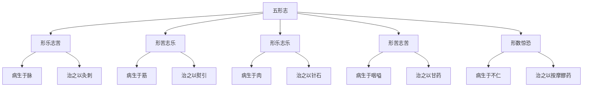

# 素问-血气形志篇第二十四

> "夫人之常数，太阳常多血少气，少阳常少血多气，阳明常多气多血，少阴常少血多气，厥阴常多血少气，太阴常多气少血，此天之常数也。" - 岐伯

---

## 📜 原文（节选）/ Original Text (Excerpt)

夫人之常数，太阳常多血少气，少阳常少血多气，阳明常多气多血，少阴常少血多气，厥阴常多血少气，太阴常多气少血，此天之常数也。

足太阳与足少阴为表里，少阳与厥阴为表里，阳明与太阴为表里，是为足阴阳也。手太阳与手少阴为表里，少阳与厥阴为表里，阳明与太阴为表里，是为手阴阳也。

今知手足阴阳所苦，凡治病必先去其血，乃去其所苦，伺之所欲，然后调有余不足气。

形乐志苦，病生于脉，治之以灸刺。形苦志乐，病生于筋，治之以熨引。形乐志乐，病生于肉，治之以针石。形苦志苦，病生于咽嗌，治之以甘药。

形数惊恐，经络不通，病生于不仁，治之以按摩醪药。是谓五形志也。

刺阳明出血气，刺太阳出血恶气，刺少阳出气恶血，刺太阴出气出血，刺厥阴出血恶气，刺少阴出气恶血，刺足阳明出血气，刺足太阳出血恶气，刺足少阳出气恶血，刺足太阴出气出血，刺足厥阴出血恶气，刺足少阴出气恶血。

---

## 📖 白话文翻译（节选）/ Modern Chinese Translation (Excerpt)

人的正常常数，太阳经常多血少气，少阳经常少血多气，阳明经常多气多血，少阴经常少血多气，厥阴经常多血少气，太阴经常多气少血，这是天地的常数。

足太阳与足少阴为表里，少阳与厥阴为表里，阳明与太阴为表里，这是足的阴阳。手太阳与手少阴为表里，少阳与厥阴为表里，阳明与太阴为表里，这是手的阴阳。

现在知道手足阴阳所苦，凡是治病必须先祛除其血，然后祛除其所苦，观察其所欲，然后调补有余不足之气。

形体快乐而志意苦闷，疾病产生于脉，用灸刺治疗。形体劳苦而志意快乐，疾病产生于筋，用熨引治疗。形体快乐而志意快乐，疾病产生于肉，用针石治疗。形体劳苦而志意苦闷，疾病产生于咽嗌，用甘味药物治疗。

形体多次惊恐，经络不通，疾病产生于麻木不仁，用按摩和药酒治疗。这叫做五形志。

刺阳明出气血，刺太阳出血恶气，刺少阳出气恶血，刺太阴出气出血，刺厥阴出血恶气，刺少阴出气恶血，刺足阳明出气血，刺足太阳出血恶气，刺足少阳出气恶血，刺足太阴出气出血，刺足厥阴出血恶气，刺足少阴出气恶血。

---

## 🔑 核心要点 / Core Concepts

### 1. 六经血气常数 / Six Meridians Blood Qi Constants

| 经脉 | 血 | 气 |
|------|------|------|
| 太阳 | 多血 | 少气 |
| 少阳 | 少血 | 多气 |
| 阳明 | 多气 | 多血 |
| 少阴 | 少血 | 多气 |
| 厥阴 | 多血 | 少气 |
| 太阴 | 多气 | 少血 |

### 2. 表里对应 / Exterior-Interior Correspondence

| 表里 | 手经 | 足经 |
|------|------|------|
| 太阳-少阴 | 手太阳-手少阴 | 足太阳-足少阴 |
| 少阳-厥阴 | 手少阳-手厥阴 | 足少阳-足厥阴 |
| 阳明-太阴 | 手阳明-手太阴 | 足阳明-足太阴 |

### 3. 五形志与治疗 / Five Forms Will and Treatment

---

## 📚 理论解释 / Theoretical Analysis

### 六经血气理论 / Six Meridians Blood Qi Theory

> [!info] 核心概念
- 六经各有血气常数
- 血气多寡不同
- 治疗时考虑血气

#### 六经血气详解 / Detailed Six Meridians Blood Qi

**1. 太阳多血少气 / Taiyang More Blood Less Qi**
- 经脉：太阳
- 血：多
- 气：少
- 刺法：出血恶气

**2. 少阳少血多气 / Shaoyang Less Blood More Qi**
- 经脉：少阳
- 血：少
- 气：多
- 刺法：出气恶血

**3. 阳明多气多血 / Yangming More Qi More Blood**
- 经脉：阳明
- 血：多
- 气：多
- 刺法：出气血

**4. 少阴少血多气 / Shaoyin Less Blood More Qi**
- 经脉：少阴
- 血：少
- 气：多
- 刺法：出气恶血

**5. 厥阴多血少气 / Jueyin More Blood Less Qi**
- 经脉：厥阴
- 血：多
- 气：少
- 刺法：出血恶气

**6. 太阴多气少血 / Taiyin More Qi Less Blood**
- 经脉：太阴
- 血：少
- 气：多
- 刺法：出气出血

### 五形志理论 / Five Forms Will Theory

> [!warning] 核心理念
- 形体与志意的关系
- 不同形志产生不同疾病
- 不同疾病用不同治疗

#### 五形志详解 / Detailed Five Forms Will

**1. 形乐志苦 / Form Happy Will Sad**
- 形体：快乐
- 志意：苦闷
- 疾病：生于脉
- 治疗：灸刺

**2. 形苦志乐 / Form Suffering Will Happy**
- 形体：劳苦
- 志意：快乐
- 疾病：生于筋
- 治疗：熨引

**3. 形乐志乐 / Form Happy Will Happy**
- 形体：快乐
- 志意：快乐
- 疾病：生于肉
- 治疗：针石

**4. 形苦志苦 / Form Suffering Will Sad**
- 形体：劳苦
- 志意：苦闷
- 疾病：生于咽嗌
- 治疗：甘药

**5. 形数惊恐 / Form Often Startled Fearful**
- 形体：多次惊恐
- 经络：不通
- 疾病：生于不仁
- 治疗：按摩醪药

---

## 🏥 中医实践应用 / TCM Practice Application

### 五形志治疗 / Five Forms Will Treatment

#### 现代五形志治疗要点 / Modern Five Forms Will Treatment Key Points

**1. 形乐志苦治疗 / Form Happy Will Sad Treatment**
- 疾病：脉病
- 治疗：灸刺
- 调理：调和志意

**2. 形苦志乐治疗 / Form Suffering Will Happy Treatment**
- 疾病：筋病
- 治疗：熨引
- 调理：舒缓形体

**3. 形乐志乐治疗 / Form Happy Will Happy Treatment**
- 疾病：肉病
- 治疗：针石
- 调理：保持劳逸结合

**4. 形苦志苦治疗 / Form Suffering Will Sad Treatment**
- 疾病：咽嗌病
- 治疗：甘药
- 调理：形体志意并调

**5. 形数惊恐治疗 / Form Often Startled Fearful Treatment**
- 疾病：不仁
- 治疗：按摩醪药
- 调理：安神定志

---

## 🔗 相关链接 / Related Links

- [[MOC-黄帝内经知识库]] - 主索引
- [[黄帝内经-素问索引]] - 素问索引
- [[黄帝内经-核心理论]] - 核心理论体系
- [[素问-宣明五气篇第二十三]] - 宣明五气
- [[素问-宝命全形论篇第二十五]] - 宝命全形

### 易学关联 / Yi Jing Connection

- [[MOC-易经知识库]] - 易经索引
- [[20260201-0002 五行]] - 五行理论

**易学与血气形志的联系:**
- 阴阳对应：易学的阴阳理论与中医六经血气相通
- 表里关系：易学的表里理论与中医表里相通

---

## 💡 学习要点 / Learning Points

### 掌握重点 / Key Points to Master

- [ ] 理解六经血气的常数
- [ ] 掌握表里对应的关系
- [ ] 学会五形志的治疗方法
- [ ] 了解刺法的选择

### 思考问题 / Questions for Reflection

1. **为什么说"太阳常多血少气"？**
   - 太阳主表，血多气少
   - 血气多寡，先天常数
   - 治疗刺血，祛邪外出

2. **现代医学如何应用"形志苦乐"？**
   - 心身疾病研究
   - 心理治疗方法
   - 综合治疗方案

---

## 📊 学习进度 / Learning Progress

### 完成情况 / Completion Status

| 学习内容 | 状态 | 备注 |
|---------|------|------|
| 原文诵读 | 📝 进行中 | 建议每日诵读 |
| 白话文理解 | ✅ 已完成 | 理解主要含义 |
| 六经血气 | ✅ 已完成 | 掌握常数 |
| 五形志 | 📝 进行中 | 需要临床实践 |
| 理论分析 | ✅ 已完成 | 理解理论 |

---

## 🔄 更新日志 / Update Log

### 2026-02-03

- ✅ 创建血气形志篇第二十四笔记
- ✅ 完成原文、白话文翻译（节选）
- ✅ 整理六经血气和五形志对照表
- ✅ 编写六经血气和五形志理论

---

**笔记创建日期**：2026年2月3日

**最后更新**：2026年2月3日
