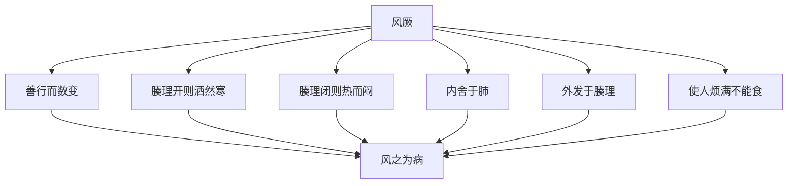

# 素问-评热病论篇第三十三

> "黄帝问曰：有病温者，汗出辄复热，而脉躁疾，不为汗衰，狂言不能食，病名为何？" - 黄帝

---

## 📜 原文（节选）/ Original Text (Excerpt)

黄帝问曰：有病温者，汗出辄复热，而脉躁疾，不为汗衰，狂言不能食，病名为何？

岐伯对曰：病名阴阳交，交者死也。

帝曰：愿闻其说。

岐伯曰：人所以汗出者，皆生于谷，谷生于精。今邪气交争于骨肉之间，而得汗出者，是邪却而精胜也。精胜则当能食而不复热。复热者，是邪胜也。且夫《热论》曰：汗出而脉尚躁盛者死。今脉不与汗相应，此不胜其病也，其死明矣。

汗出而脉尚躁盛者死者，今脉不与汗相应，此不胜其病也，其死明矣。狂言者，是失志，失志者死。今见三死，不见一生，虽愈必死也。

帝曰：有病身热汗出而烦满，烦满不为汗解，此为何病？

岐伯曰：风厥也。

帝曰：愿闻其说。

岐伯曰：风之为病也，善行而数变，腠理开则洒然寒，闭则热而闷。其风之伤人也，内舍于肺，外发于腠理，开则洒然寒，闭则热而闷。使人烦满，不能食，此风厥之病也。

---

## 📖 白话文翻译（节选）/ Modern Chinese Translation (Excerpt)

黄帝问道：有患温病的人，汗出就又发热，而且脉象躁急，不因为出汗而衰减，狂言不能进食，病名叫什么？

岐伯回答说：病名叫阴阳交，阴阳交的就会死。

黄帝说：我希望听到它的说明。

岐伯说：人之所以出汗，都产生于谷物，谷物产生于精气。现在邪气在骨肉之间交争，而能够出汗的，是邪气退却而精气战胜。精气战胜就应当能够进食而不再发热。再发热，是邪气战胜。况且《热论》说：汗出而脉象仍然躁急旺盛的会死。现在脉象与出汗不相应，这是不能战胜疾病，它的死亡很明显了。

汗出而脉象仍然躁急旺盛的会死，现在脉象与出汗不相应，这是不能战胜疾病，它的死亡很明显了。狂言的，是失去志意，失去志意的会死。现在见到三种死候，不见一种生候，虽然痊愈也一定会死。

黄帝说：有患身体发热汗出而且烦闷胀满，烦闷胀满不因为出汗而解除，这是什么病？

岐伯说：风厥。

黄帝说：我希望听到它的说明。

岐伯说：风之为病，善于运行而且多次变化，腠理张开就寒战，腠理闭合就发热而且烦闷。风邪伤人，内舍于肺，外发于腠理，张开就寒战，闭合就发热而且烦闷。使人烦闷胀满，不能进食，这是风厥的病。

---

## 🔑 核心要点 / Core Concepts

### 1. 阴阳交 / Yin-Yang Intersection

| 症状 | 表现 | 预后 |
|------|------|------|
| 汗出辄复热 | 汗出就又发热 | 死候 |
| 脉躁疾 | 脉象躁急 | 死候 |
| 不为汗衰 | 不因为出汗而衰减 | 死候 |
| 狂言不能食 | 狂言不能进食 | 死候 |

### 2. 三死 / Three Deaths

| 死候 | 表现 |
|------|------|
| 一死 | 汗出而脉尚躁盛者死 |
| 二死 | 今脉不与汗相应，此不胜其病也 |
| 三死 | 狂言者，是失志，失志者死 |

### 3. 风厥 / Wind Jue

---

## 📚 理论解释 / Theoretical Analysis

### 阴阳交理论 / Yin-Yang Intersection Theory

> [!info] 核心概念
- 阴阳交是死候
- 三死不见一生
- 汗出辄复热

#### 阴阳交详解 / Detailed Yin-Yang Intersection

**1. 阴阳交表现 / Yin-Yang Intersection Manifestations**
- 汗出辄复热：汗出就又发热
- 脉躁疾：脉象躁急
- 不为汗衰：不因为出汗而衰减
- 狂言不能食：狂言不能进食

**2. 三死候 / Three Fatal Signs**
- 一死：汗出而脉尚躁盛者死
- 二死：脉不与汗相应，此不胜其病也
- 三死：狂言者，是失志，失志者死

**3. 不见一生 / No Life Sign**
- 虽愈必死：虽然痊愈也一定会死
- 预后不良：预后不良

### 风厥理论 / Wind Jue Theory

> [!warning] 核心理念
- 风之为病，善行而数变
- 腠理开则洒然寒，闭则热而闷
- 使人烦满，不能食

#### 风厥详解 / Detailed Wind Jue

**1. 风病特点 / Wind Disease Characteristics**
- 善行：善于运行
- 数变：多次变化
- 腠理开：腠理张开
- 腠理闭：腠理闭合

**2. 风邪伤人 / Wind Evil Injuring Human**
- 内舍于肺：内舍于肺
- 外发于腠理：外发于腠理
- 开则洒然寒：张开就寒战
- 闭则热而闷：闭合就发热而且烦闷

**3. 风厥症状 / Wind Jue Symptoms**
- 烦满：烦闷胀满
- 不能食：不能进食
- 身热汗出：身体发热汗出
- 烦满不为汗解：烦闷胀满不因为出汗而解除

---

## 🏥 中医实践应用 / TCM Practice Application

### 阴阳交治疗 / Yin-Yang Intersection Treatment

#### 现代阴阳交治疗要点 / Modern Yin-Yang Intersection Treatment Key Points

**1. 阴阳交诊断 / Yin-Yang Intersection Diagnosis**
- 症状：汗出辄复热，脉躁疾
- 预后：预后不良
- 治疗：难以治愈

**2. 阴阳交治疗 / Yin-Yang Intersection Treatment**
- 治法：调和阴阳
- 药物：回阳救逆
- 针刺：针刺调理

### 风厥治疗 / Wind Jue Treatment

#### 现代风厥治疗要点 / Modern Wind Jue Treatment Key Points

**1. 风厥诊断 / Wind Jue Diagnosis**
- 症状：身热汗出而烦满
- 病机：风邪伤人
- 预后：预后良好

**2. 风厥治疗 / Wind Jue Treatment**
- 治法：疏风解表
- 药物：桂枝汤、麻黄汤
- 针刺：针刺风穴

---

## 🔗 相关链接 / Related Links

- [[MOC-黄帝内经知识库]] - 主索引
- [[黄帝内经-素问索引]] - 素问索引
- [[黄帝内经-核心理论]] - 核心理论体系
- [[素问-刺热篇第三十二]] - 刺热
- [[素问-逆调论篇第三十四]] - 逆调

### 易学关联 / Yi Jing Connection

- [[MOC-易经知识库]] - 易经索引
- [[20260201-0002 五行]] - 五行理论

**易学与评热病论的联系:**
- 阴阳理论：易学的阴阳理论与中医阴阳交相通
- 风邪理论：易学的风邪理论与中医风厥相通

---

## 💡 学习要点 / Learning Points

### 掌握重点 / Key Points to Master

- [ ] 理解阴阳交的概念
- [ ] 掌握三死候的判断
- [ ] 学会风厥的诊断
- [ ] 了解阴阳交和风厥的治疗

### 思考问题 / Questions for Reflection

1. **为什么说"阴阳交，交者死也"？**
   - 阴阳交：阴气阳气相交
   - 病邪深入：病邪深入
   - 预后不良：预后不良

2. **现代医学如何应用"阴阳交"？**
   - 危重疾病：危重疾病诊断
   - 预后判断：预后判断
   - 综合治疗：综合治疗方案

---

## 📊 学习进度 / Learning Progress

### 完成情况 / Completion Status

| 学习内容 | 状态 | 备注 |
|---------|------|------|
| 原文诵读 | 📝 进行中 | 建议每日诵读 |
| 白话文理解 | ✅ 已完成 | 理解主要含义 |
| 阴阳交 | ✅ 已完成 | 掌握概念 |
| 风厥 | 📝 进行中 | 需要临床实践 |
| 理论分析 | ✅ 已完成 | 理解理论 |

---

## 🔄 更新日志 / Update Log

### 2026-02-03

- ✅ 创建评热病论篇第三十三笔记
- ✅ 完成原文、白话文翻译（节选）
- ✅ 整理阴阳交和风厥对照表
- ✅ 编写阴阳交和风厥理论

---

**笔记创建日期**：2026年2月3日

**最后更新**：2026年2月3日
