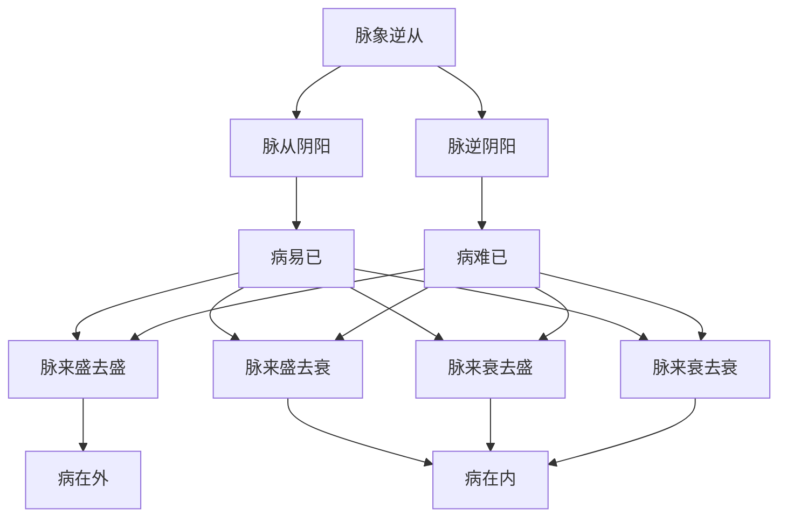

# 素问-逆调论篇第三十四

> "黄帝问曰：人身非常温也，非常热也，为之热病，为之寒病，以别之奈何？" - 黄帝

---

## 📜 原文（节选）/ Original Text (Excerpt)

黄帝问曰：人身非常温也，非常热也，为之热病，为之寒病，以别之奈何？

岐伯对曰：阴气上下，阳气亦上下，是谓逆也。阴气不上，阳气不上，是谓从也。阳主于外，阴主于内，故阳气在表，阴气在里。阳胜则身热，阴胜则身寒。阴阳相搏，是以阳胜则热，阴胜则寒，是以热病为阳胜，寒病为阴胜也。

帝曰：人身非常温也，非常热也，为之热病，为之寒病，以别之奈何？

岐伯曰：脉从阴阳，病易已；脉逆阴阳，病难已。

帝曰：何以知其阴阳之逆从？

岐伯曰：诊其脉来，盛者病在外，衰者病在内。脉来盛去盛者，病在外；脉来盛去衰者，病在内。脉来衰去盛者，病在内；脉来衰去衰者，病在内。脉来盛去衰者，病在内；脉来衰去盛者，病在外。

---

## 📖 白话文翻译（节选）/ Modern Chinese Translation (Excerpt)

黄帝问道：人体不是特别温，不是特别热，成为热病，成为寒病，如何区别它们？

岐伯回答说：阴气上下，阳气也上下，这叫做逆。阴气不向上，阳气不向上，这叫做从。阳主管外表，阴主管内部，所以阳气在表，阴气在里。阳气旺盛则身体发热，阴气旺盛则身体寒冷。阴阳相搏，所以阳气旺盛则发热，阴气旺盛则寒冷，所以热病是阳气旺盛，寒病是阴气旺盛。

黄帝说：人体不是特别温，不是特别热，成为热病，成为寒病，如何区别它们？

岐伯说：脉象顺从阴阳，疾病容易痊愈；脉象违背阴阳，疾病难以痊愈。

黄帝说：如何知道阴阳的逆从？

岐伯说：诊察脉象来，盛的病在外，衰的病在内。脉象来盛去盛的，病在外；脉象来盛去衰的，病在内。脉象来衰去盛的，病在内；脉象来衰去衰的，病在内。脉象来盛去衰的，病在内；脉象来衰去盛的，病在外。

---

## 🔑 核心要点 / Core Concepts

### 1. 阴阳逆从 / Yin-Yang Adverse and Favorable

| 类型 | 特点 | 表现 |
|------|------|------|
| 逆 | 阴气上下，阳气亦上下 | 阴阳相搏 |
| 从 | 阴气不上，阳气不上 | 阴阳相得 |

### 2. 阴阳胜衰 / Yin-Yang Victory and Deficiency

| 阴阳 | 身体表现 | 疾病类型 |
|------|----------|----------|
| 阳胜 | 身热 | 热病 |
| 阴胜 | 身寒 | 寒病 |

### 3. 脉象逆从 / Pulse Adverse and Favorable

---

## 📚 理论解释 / Theoretical Analysis

### 阴阳逆从理论 / Yin-Yang Adverse and Favorable Theory

> [!info] 核心概念
- 阴气上下，阳气亦上下，是谓逆
- 阴气不上，阳气不上，是谓从
- 阳胜则身热，阴胜则身寒

#### 阴阳逆从详解 / Detailed Yin-Yang Adverse and Favorable

**1. 逆证 / Adverse Syndrome**
- 阴气上下，阳气亦上下
- 阴阳相搏
- 阴阳相争

**2. 从证 / Favorable Syndrome**
- 阴气不上，阳气不上
- 阴阳相得
- 阴阳调和

**3. 阴阳胜衰 / Yin-Yang Victory and Deficiency**
- 阳胜则身热：阳气旺盛则身体发热
- 阴胜则身寒：阴气旺盛则身体寒冷
- 阴阳相搏：阴阳相搏

### 脉象逆从理论 / Pulse Adverse and Favorable Theory

> [!warning] 核心理念
- 脉从阴阳，病易已
- 脉逆阴阳，病难已
- 脉象盛衰判断病位

#### 脉象逆从详解 / Detailed Pulse Adverse and Favorable

**1. 脉从阴阳 / Pulse Following Yin-Yang**
- 脉从阴阳：脉象顺从阴阳
- 病易已：疾病容易痊愈
- 阴阳调和：阴阳调和

**2. 脉逆阴阳 / Pulse Against Yin-Yang**
- 脉逆阴阳：脉象违背阴阳
- 病难已：疾病难以痊愈
- 阴阳失调：阴阳失调

**3. 脉象盛衰 / Pulse Strength and Weakness**
- 脉来盛去盛：病在外
- 脉来盛去衰：病在内
- 脉来衰去盛：病在内
- 脉来衰去衰：病在内

---

## 🏥 中医实践应用 / TCM Practice Application

### 阴阳逆从治疗 / Yin-Yang Adverse and Favorable Treatment

#### 现代阴阳逆从治疗要点 / Modern Yin-Yang Adverse and Favorable Treatment Key Points

**1. 阳胜治疗 / Yang Excess Treatment**
- 身热：阳气旺盛，身体发热
- 治法：清热泻火
- 药物：白虎汤、黄连解毒汤

**2. 阴胜治疗 / Yin Excess Treatment**
- 身寒：阴气旺盛，身体寒冷
- 治法：温阳散寒
- 药物：四逆汤、真武汤

**3. 阴阳调和治疗 / Yin-Yang Harmony Treatment**
- 阴阳相搏：阴阳相搏
- 治法：调和阴阳
- 药物：桂枝汤、小建中汤

---

## 🔗 相关链接 / Related Links

- [[MOC-黄帝内经知识库]] - 主索引
- [[黄帝内经-素问索引]] - 素问索引
- [[黄帝内经-核心理论]] - 核心理论体系
- [[素问-评热病论篇第三十三]] - 评热病论
- [[素问-疟论篇第三十五]] - 疟论

### 易学关联 / Yi Jing Connection

- [[MOC-易经知识库]] - 易经索引
- [[20260201-0002 五行]] - 五行理论

**易学与逆调论的联系:**
- 阴阳理论：易学的阴阳理论与中医阴阳逆从相通
- 逆从理论：易学的逆从理论与中医脉象逆从相通

---

## 💡 学习要点 / Learning Points

### 掌握重点 / Key Points to Master

- [ ] 理解阴阳逆从的概念
- [ ] 掌握阴阳胜衰的表现
- [ ] 学会脉象逆从的判断
- [ ] 了解阴阳逆从的治疗方法

### 思考问题 / Questions for Reflection

1. **为什么说"阴气上下，阳气亦上下，是谓逆"？**
   - 阴阳相搏：阴阳相搏
   - 阴阳失调：阴阳失调
   - 预后不良：预后不良

2. **现代医学如何应用"逆调论"？**
   - 阴阳平衡：阴阳平衡治疗
   - 脉象诊断：脉象诊断疾病
   - 个体化治疗：根据个体情况治疗

---

## 📊 学习进度 / Learning Progress

### 完成情况 / Completion Status

| 学习内容 | 状态 | 备注 |
|---------|------|------|
| 原文诵读 | 📝 进行中 | 建议每日诵读 |
| 白话文理解 | ✅ 已完成 | 理解主要含义 |
| 阴阳逆从 | ✅ 已完成 | 掌握概念 |
| 脉象逆从 | 📝 进行中 | 需要临床实践 |
| 理论分析 | ✅ 已完成 | 理解理论 |

---

## 🔄 更新日志 / Update Log

### 2026-02-03

- ✅ 创建逆调论篇第三十四笔记
- ✅ 完成原文、白话文翻译（节选）
- ✅ 整理阴阳逆从对照表
- ✅ 编写阴阳逆从理论

---

**笔记创建日期**：2026年2月3日

**最后更新**：2026年2月3日
