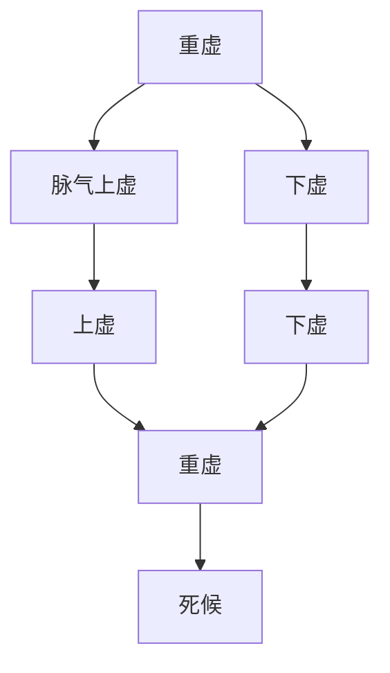

# 素问-通评虚实论篇第二十八

> "黄帝问曰：何谓虚实？岐伯曰：邪气盛则实，精气夺则虚。" - 岐伯

---

## 📜 原文（节选）/ Original Text (Excerpt)

黄帝问曰：何谓虚实？

岐伯曰：邪气盛则实，精气夺则虚。

帝曰：虚实何如？

岐伯曰：气虚者，肺虚也；气逆者，足寒也。非其时则生，当其时则死。

帝曰：何谓重虚？

岐伯曰：脉气上虚，下虚，是谓重虚。重虚者，死。

帝曰：气有余，不足何如？

岐伯曰：气有余，则喘咳上气；不足，则息利少气。

帝曰：血有余，不足何如？

岐伯曰：血有余，则怒；不足，则恐。

---

## 📖 白话文翻译（节选）/ Modern Chinese Translation (Excerpt)

黄帝问道：什么是虚实？

岐伯说：邪气旺盛叫做实，精气被夺叫做虚。

黄帝说：虚实是怎样的？

岐伯说：气虚，是肺虚；气逆，是足寒。不是其时则生，当其时则死。

黄帝说：什么是重虚？

岐伯说：脉气上虚，下虚，这叫做重虚。重虚，是死候。

黄帝说：气有余，不足是怎样的？

岐伯说：气有余，则喘咳气机上逆；不足，则呼吸通利少气。

黄帝说：血有余，不足是怎样的？

岐伯说：血有余，则发怒；不足，则恐惧。

---

## 🔑 核心要点 / Core Concepts

### 1. 虚实定义 / Definition of Deficiency and Excess

| 类型 | 定义 |
|------|------|
| 实 | 邪气盛 |
| 虚 | 精气夺 |

### 2. 气血有余不足 / Qi Blood Excess Deficiency

| 气血 | 有余 | 不足 |
|------|------|------|
| 气 | 喘咳上气 | 息利少气 |
| 血 | 怒 | 恐 |

### 3. 重虚 / Double Deficiency

---

## 📚 理论解释 / Theoretical Analysis

### 虚实理论 / Deficiency and Excess Theory

> [!info] 核心概念
- 邪气盛则实
- 精气夺则虚
- 虚实不同，治法不同

#### 虚实详解 / Detailed Deficiency and Excess

**1. 实证 / Excess Syndrome**
- 定义：邪气旺盛
- 特点：正气不虚，邪气旺盛
- 治法：祛邪

**2. 虚证 / Deficiency Syndrome**
- 定义：精气被夺
- 特点：正气不足，邪气不盛
- 治法：补虚

**3. 虚实并见 / Deficiency and Excess Together**
- 虚实并见：正气不足，邪气旺盛
- 治法：补虚祛邪

### 气血有余不足理论 / Qi Blood Excess Deficiency Theory

> [!warning] 核心理念
- 气有余：喘咳上气
- 气不足：息利少气
- 血有余：怒
- 血不足：恐

#### 气血有余不足详解 / Detailed Qi Blood Excess Deficiency

**1. 气有余 / Qi Excess**
- 表现：喘咳上气
- 病机：气机上逆
- 治法：降气

**2. 气不足 / Qi Deficiency**
- 表现：息利少气
- 病机：气机不足
- 治法：补气

**3. 血有余 / Blood Excess**
- 表现：怒
- 病机：血气旺盛
- 治法：凉血

**4. 血不足 / Blood Deficiency**
- 表现：恐
- 病机：血气不足
- 治法：补血

### 重虚理论 / Double Deficiency Theory

> [!note] 重虚概念
- 脉气上虚，下虚
- 上虚下虚，重虚
- 重虚则死

#### 重虚详解 / Detailed Double Deficiency

**1. 上虚 / Upper Deficiency**
- 定义：脉气上虚
- 表现：上焦虚损
- 预后：不良

**2. 下虚 / Lower Deficiency**
- 定义：下虚
- 表现：下焦虚损
- 预后：不良

**3. 重虚 / Double Deficiency**
- 定义：上虚下虚
- 表现：上下俱虚
- 预后：死候

---

## 🏥 中医实践应用 / TCM Practice Application

### 虚实治疗 / Deficiency Excess Treatment

#### 现代虚实治疗要点 / Modern Deficiency Excess Treatment Key Points

**1. 实证治疗 / Excess Syndrome Treatment**
- 治法：祛邪
- 原则：实则泻之
- 方法：针刺、药物

**2. 虚证治疗 / Deficiency Syndrome Treatment**
- 治法：补虚
- 原则：虚则补之
- 方法：药物、针灸

**3. 虚实并见治疗 / Deficiency Excess Together Treatment**
- 治法：补虚祛邪
- 原则：补泻兼施
- 方法：综合治疗

### 气血调理 / Qi Blood Regulation

#### 现代气血调理要点 / Modern Qi Blood Regulation Key Points

**1. 气有余调理 / Qi Excess Regulation**
- 表现：喘咳上气
- 治法：降气
- 药物：降气药

**2. 气不足调理 / Qi Deficiency Regulation**
- 表现：息利少气
- 治法：补气
- 药物：补气药

**3. 血有余调理 / Blood Excess Regulation**
- 表现：怒
- 治法：凉血
- 药物：凉血药

**4. 血不足调理 / Blood Deficiency Regulation**
- 表现：恐
- 治法：补血
- 药物：补血药

---

## 🔗 相关链接 / Related Links

- [[MOC-黄帝内经知识库]] - 主索引
- [[黄帝内经-素问索引]] - 素问索引
- [[黄帝内经-核心理论]] - 核心理论体系
- [[素问-离合真邪论篇第二十七]] - 离合真邪
- [[素问-太阴阳明论篇第二十九]] - 太阴阳明

### 易学关联 / Yi Jing Connection

- [[MOC-易经知识库]] - 易经索引
- [[20260201-0002 五行]] - 五行理论

**易学与通评虚实的联系:**
- 阴阳理论：易学的阴阳理论与中医虚实相通
- 邪正理论：易学的邪正理论与中医虚实相通

---

## 💡 学习要点 / Learning Points

### 掌握重点 / Key Points to Master

- [ ] 理解虚实的定义
- [ ] 掌握气血有余不足的表现
- [ ] 学会重虚的判断
- [ ] 了解虚实治疗的方法

### 思考问题 / Questions for Reflection

1. **为什么说"邪气盛则实，精气夺则虚"？**
   - 实证：邪气旺盛
   - 虚证：精气被夺
   - 虚实不同，治法不同

2. **现代医学如何应用"虚实理论"？**
   - 虚实证型：判断疾病虚实
   - 治疗方法：根据虚实选择治疗方法
   - 个体化治疗：根据个体情况治疗

---

## 📊 学习进度 / Learning Progress

### 完成情况 / Completion Status

| 学习内容 | 状态 | 备注 |
|---------|------|------|
| 原文诵读 | 📝 进行中 | 建议每日诵读 |
| 白话文理解 | ✅ 已完成 | 理解主要含义 |
| 虚实理论 | ✅ 已完成 | 掌握定义 |
| 气血调理 | 📝 进行中 | 需要临床实践 |
| 理论分析 | ✅ 已完成 | 理解理论 |

---

## 🔄 更新日志 / Update Log

### 2026-02-03

- ✅ 创建通评虚实论篇第二十八笔记
- ✅ 完成原文、白话文翻译（节选）
- ✅ 整理虚实定义和气血有余不足对照表
- ✅ 编写虚实和气血理论

---

**笔记创建日期**：2026年2月3日

**最后更新**：2026年2月3日
