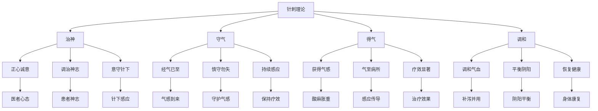

# 素问-针解篇第五十四

> "黄帝问曰：愿闻针解。岐伯曰：针道久矣，其法无穷。" - 岐伯

---

## 📜 原文（节选）/ Original Text (Excerpt)

黄帝问曰：愿闻针解。

岐伯曰：针道久矣，其法无穷。凡刺之真，必先治神。

帝曰：何谓治神？

岐伯曰：治神者，必正其心，而后乃可治神。经气已至，慎守勿失。

---

## 📖 白话文翻译（节选）/ Modern Chinese Translation (Excerpt)

黄帝问道：我愿意听到针刺的解释。

岐伯回答说：针刺之道历史悠久，其方法无穷无尽。大凡针刺的真谛，必须先调治神志。

黄帝说：什么是调治神志？

岐伯说：调治神志，必须先端正心态，然后才能调治神志。经气已至，谨慎守护不要失去。

---

## 🔍 英文释义 / English Interpretation

Yellow Emperor asked: I would like to hear the explanation of acupuncture.

Qibo replied: The way of acupuncture has a long history, and its methods are infinite. The essence of all needling must begin with regulating the spirit.

Yellow Emperor said: What is regulating the spirit?

Qibo said: Regulating the spirit requires first correcting one's state of mind, and then one can regulate the spirit. When the meridian qi has arrived, carefully guard it and do not let it be lost.

---

## 🔑 核心要点 / Core Concepts

### 1. 针刺真谛 / Acupuncture Essence

| 要素 | 内容 | 意义 | 应用 |
|------|------|------|------|
| 治神 | 调治神志 | 针刺的基础 | 首要原则 |
| 守气 | 守护经气 | 针刺的关键 | 持续感应 |
| 得气 | 获得气感 | 针刺的标志 | 疗效判断 |
| 调和 | 调和气血 | 针刺的目的 | 平衡阴阳 |

### 2. 针刺方法 / Acupuncture Methods

| 方法 | 特点 | 手法 | 适应症 |
|------|------|------|---------|
| 治神法 | 端正心态，调治神志 | 意守针下 | 各类病症 |
| 守气法 | 谨慎守护，不失经气 | 守气不散 | 得气后保持 |
| 得气法 | 获得气感，传导病所 | 气至病所 | 各类病症 |
| 调和法 | 调和气血，平衡阴阳 | 补泻并用 | 虚实夹杂 |

### 3. 针刺理论 / Acupuncture Theory

---

## 📚 理论解释 / Theoretical Analysis

### 针解理论 / Acupuncture Explanation Theory

> [!info] 核心概念
- 针道久矣，其法无穷
- 凡刺之真，必先治神
- 经气已至，慎守勿失

#### 针解详解 / Detailed Acupuncture Explanation

**1. 针道久矣 / Long History of Acupuncture Way**
- **历史渊源**：针刺历史悠久，源远流长
- **方法无穷**：针刺方法众多，变化无穷
- **不断传承**：世代相传，不断发展
- **与时俱进**：结合现代，创新发展

**2. 凡刺之真 / Essence of All Needling**
- **必先治神**：必须先调治神志
- **端正心态**：医者要端正心态
- **调治神志**：患者要调治神志
- **意守针下**：医者要意守针下

**3. 慎守勿失 / Carefully Guard and Don't Lose**
- **经气已至**：经气已经到达
- **慎守勿失**：谨慎守护，不要失去
- **持续感应**：保持持续感应
- **疗效持久**：疗效才能持久

### 治神理论 / Regulating Spirit Theory

> [!warning] 核心理念
- 治神为要
- 正心诚意
- 医患同心

#### 治神理论详解 / Detailed Regulating Spirit Theory

**1. 医者治神 / Practitioner Regulating Spirit**
- **端正心态**：医者要心态端正
- **专注精神**：医者要精神专注
- **意守针下**：医者要意守针下
- **调畅气机**：医者要调畅气机

**2. 患者治神 / Patient Regulating Spirit**
- **放松身心**：患者要放松身心
- **配合治疗**：患者要配合治疗
- **感受针感**：患者要感受针感
- **调畅气血**：患者要调畅气血

**3. 医患同心 / Practitioner and Patient Working Together**
- **相互信任**：医患要相互信任
- **配合默契**：医患要配合默契
- **共同努力**：医患要共同努力
- **达成目标**：医患要达成目标

---

## 🏥 中医实践应用 / TCM Practice Application

### 针刺治疗 / Acupuncture Treatment

#### 现代针刺治疗应用 / Modern Acupuncture Treatment Application

**1. 治神法治疗 / Regulating Spirit Treatment**
- 取穴：百会、印堂、内关
- 刺法：轻刺激，意守针下
- 适应症：各类病症，强调治神为先
- 疗效：调和神志，提高疗效

**2. 守气法治疗 / Guarding Qi Treatment**
- 取穴：根据病情选穴
- 刺法：得气后，保持气感
- 适应症：得气后需要持续感应的病症
- 疗效：保持疗效，延长作用时间

**3. 得气法治疗 / Obtaining Qi Treatment**
- 取穴：根据病情选穴
- 刺法：获得气感，传导病所
- 适应症：需要气至病所的病症
- 疗效：疗效显著，直达病所

**4. 调和法治疗 / Harmonizing Treatment**
- 取穴：根据病情选穴
- 刺法：补泻并用，调和气血
- 适应症：虚实夹杂，阴阳失调
- 疗效：调和气血，平衡阴阳

### 现代医学对应 / Modern Medicine Correspondence

| 中医概念 | 现代医学解释 | 临床应用 |
|---------|-------------|---------|
| 治神 | 心理调节 | 提高治疗效果 |
| 守气 | 神经刺激保持 | 维持刺激效应 |
| 得气 | 神经反应 | 判断刺激效果 |
| 调和 | 神经调节 | 调节机体功能 |

---

## 🔗 相关链接 / Related Links

- [[MOC-黄帝内经知识库]] - 主索引
- [[黄帝内经-素问索引]] - 素问索引
- [[黄帝内经-核心理论]] - 核心理论体系
- [[素问-刺齐论篇第五十一]] - 刺齐论
- [[素问-刺志论篇第五十三]] - 刺志论
- [[素问-宝命全形论篇第二十五]] - 宝命全形论

### 易学关联 / Yi Jing Connection

- [[MOC-易经知识库]] - 易经索引
- [[20260201-0002 五行]] - 五行理论

**易学与针解的联系:**
- 治神为要：易学的修身养性与治神理论相通
- 道法自然：易学的自然观念与针刺理论相通

---

## 💡 学习要点 / Learning Points

### 掌握重点 / Key Points to Master

- [ ] 理解针刺真谛的重要性
- [ ] 掌握治神的方法和原则
- [ ] 学会守气的技巧
- [ ] 了解针解的理论依据

### 思考问题 / Questions for Reflection

1. **为什么说"凡刺之真，必先治神"？**
   - 治神为基：治神是针刺的基础
   - 正心诚意：医患双方都需要端正心态
   - 精神专注：专注是施治的前提

2. **现代医学如何应用"针解论"？**
   - 心理调节：重视心理因素
   - 医患沟通：加强医患沟通
   - 综合治疗：身心并重

---

## 📊 学习进度 / Learning Progress

### 完成情况 / Completion Status

| 学习内容 | 状态 | 备注 |
|---------|------|------|
| 原文诵读 | 📝 进行中 | 建议每日诵读 |
| 白话文理解 | ✅ 已完成 | 理解主要含义 |
| 治神理论 | ✅ 已完成 | 掌握理论 |
| 针刺方法 | 📝 进行中 | 需要临床实践 |
| 理论分析 | ✅ 已完成 | 理解理论 |

---

## 🔄 更新日志 / Update Log

### 2026-02-03

- ✅ 创建针解篇第五十四笔记
- ✅ 完成原文、白话文翻译（节选）
- 整理针刺真谛和方法对照表
- ✅ 编写针解和治神理论

---

**笔记创建日期**：2026年2月3日

**最后更新**：2026年2月3日
