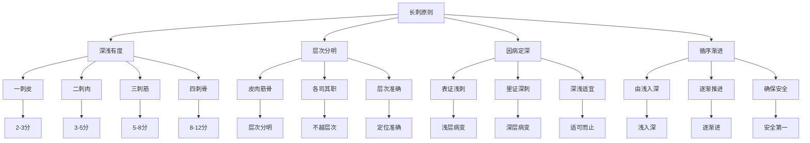

# 素问-长刺节论篇第五十五

> "黄帝问曰：愿闻长刺节。岐伯曰：刺有长节，深浅有度。" - 岐伯

---

## 📜 原文（节选）/ Original Text (Excerpt)

黄帝问曰：愿闻长刺节。

岐伯曰：刺有长节，深浅有度。浅刺皮肤，深刺筋骨。

帝曰：何谓长节？

岐伯曰：长节者，刺之节度也。一刺皮，二刺肉，三刺筋，四刺骨。

---

## 📖 白话文翻译（节选）/ Modern Chinese Translation (Excerpt)

黄帝问道：我愿意听到长刺节的方法。

岐伯回答说：针刺有长节的区别，深浅有度数。浅刺皮肤，深刺筋骨。

黄帝说：什么是长节？

岐伯说：长节，就是针刺的节度。一刺皮，二刺肉，三刺筋，四刺骨。

---

## 🔍 英文释义 / English Interpretation

Yellow Emperor asked: I would like to hear the methods of long needling stages.

Qibo replied: Acupuncture has long and short stages, and depth has its degrees. Shallow needling targets the skin, deep needling targets tendons and bones.

Yellow Emperor said: What are the long stages?

Qibo said: Long stages are the degrees of needling. First needling the skin, second needling the flesh, third needling the tendons, fourth needling the bones.

---

## 🔑 核心要点 / Core Concepts

### 1. 长刺节度 / Long Needling Stages

| 节度 | 层次 | 刺法 | 深度 | 适应症 |
|------|------|------|------|---------|
| 一刺 | 皮肤 | 浅刺 | 2-3分 | 表证、发热 |
| 二刺 | 肌肉 | 中浅刺 | 3-5分 | 痹证、麻木 |
| 三刺 | 筋腱 | 中深刺 | 5-8分 | 拘挛、疼痛 |
| 四刺 | 骨骼 | 深刺 | 8-12分 | 骨病、深部病 |

### 2. 深浅刺法 / Deep and Shallow Needling Methods

| 刺法 | 特点 | 手法 | 适用病症 |
|------|------|------|---------|
| 浅刺 | 刺皮肤层 | 点刺、斜刺 | 表证、发热、皮肤病 |
| 中浅刺 | 刺肌肉层 | 直刺、斜刺 | 痹证、麻木、肌肉病 |
| 中深刺 | 刺筋腱层 | 直刺、透刺 | 拘挛、疼痛、筋腱病 |
| 深刺 | 刺骨骼层 | 直刺、透刺至骨 | 骨病、深部疾病 |

### 3. 长刺原则 / Long Needling Principles

---

## 📚 理论解释 / Theoretical Analysis

### 长刺节理论 / Long Needling Stage Theory

> [!info] 核心概念
- 刺有长节，深浅有度
- 一刺皮，二刺肉，三刺筋，四刺骨
- 层次分明，深浅适宜

#### 长刺节详解 / Detailed Long Needling Stages

**1. 一刺皮 / First Needling Skin**
- **层次**：皮肤层
- **深度**：2-3分
- **手法**：点刺、斜刺
- **适应症**：表证、发热、皮肤病

**2. 二刺肉 / Second Needling Flesh**
- **层次**：肌肉层
- **深度**：3-5分
- **手法**：直刺、斜刺
- **适应症**：痹证、麻木、肌肉病

**3. 三刺筋 / Third Needling Tendons**
- **层次**：筋腱层
- **深度**：5-8分
- **手法**：直刺、透刺
- **适应症**：拘挛、疼痛、筋腱病

**4. 四刺骨 / Fourth Needling Bones**
- **层次**：骨骼层
- **深度**：8-12分
- **手法**：直刺、透刺至骨
- **适应症**：骨病、深部疾病

### 深浅刺法理论 / Deep and Shallow Needling Theory

> [!warning] 核心理念
- 深浅有度
- 层次分明
- 因病定深

#### 深浅刺法理论详解 / Detailed Deep and Shallow Needling Theory

**1. 浅刺法 / Shallow Needling Method**
- **特点**：刺入浅层，刺激量小
- **手法**：点刺、斜刺、快速进出
- **适应症**：表证、发热、皮肤病
- **注意事项**：避免刺入过深

**2. 中浅刺法 / Medium Shallow Needling Method**
- **特点**：刺入肌肉层，刺激量中等
- **手法**：直刺、斜刺、留针
- **适应症**：痹证、麻木、肌肉病
- **注意事项**：注意避开血管神经

**3. 中深刺法 / Medium Deep Needling Method**
- **特点**：刺入筋腱层，刺激量较大
- **手法**：直刺、透刺、手法操作
- **适应症**：拘挛、疼痛、筋腱病
- **注意事项**：注意避开重要结构

**4. 深刺法 / Deep Needling Method**
- **特点**：刺入骨骼层，刺激量大
- **手法**：直刺、透刺至骨、强刺激
- **适应症**：骨病、深部疾病
- **注意事项**：严格掌握深度，确保安全

---

## 🏥 中医实践应用 / TCM Practice Application

### 针刺治疗 / Acupuncture Treatment

#### 现代针刺治疗应用 / Modern Acupuncture Treatment Application

**1. 浅刺治疗 / Shallow Needling Treatment**
- 取穴：井穴、荥穴（如少商、商阳）
- 刺法：浅刺2-3分，点刺出血
- 适应症：发热、感冒、咽喉肿痛
- 疗效：解表散寒，清热解毒

**2. 中浅刺治疗 / Medium Shallow Needling Treatment**
- 取穴：输穴、经穴（如合谷、曲池）
- 刺法：中浅刺3-5分，平补平泻
- 适应症：痹证、麻木、肌肉疼痛
- 疗效：疏通经络，调和气血

**3. 中深刺治疗 / Medium Deep Needling Treatment**
- 取穴：经穴、合穴（如阳陵泉、足三里）
- 刺法：中深刺5-8分，透刺
- 适应症：痉挛、抽搐、关节不利
- 疗效：舒筋活络，止痛解痉

**4. 深刺治疗 / Deep Needling Treatment**
- 取穴：合穴、阿是穴（如肾俞、委中）
- 刺法：深刺8-12分，透刺至骨
- 适应症：骨痛、骨蒸、骨折
- 疗效：强筋壮骨，通经止痛

### 现代医学对应 / Modern Medicine Correspondence

| 中医概念 | 现代解剖 | 临床应用 |
|---------|---------|---------|
| 一刺皮 | 表皮、真皮 | 皮内针、穴位注射 |
| 二刺肉 | 皮下组织、肌肉 | 电针、肌肉刺激 |
| 三刺筋 | 肌腱、韧带 | 针刀、激痛点 |
| 四刺骨 | 骨膜、骨质 | 骨膜针、深部刺激 |

---

## 🔗 相关链接 / Related Links

- [[MOC-黄帝内经知识库]] - 主索引
- [[黄帝内经-素问索引]] - 素问索引
- [[黄帝内经-核心理论]] - 核心理论体系
- [[素问-刺齐论篇第五十一]] - 刺齐论
- [[素问-针解篇第五十四]] - 针解篇
- [[素问-皮部论篇第五十六]] - 皮部论

### 易学关联 / Yi Jing Connection

- [[MOC-易经知识库]] - 易经索引
- [[20260201-0002 五行]] - 五行理论

**易学与长刺节的联系:**
- 层次分明：易学的层次观念与长刺节理论相通
- 循序渐进：易学的渐进思想与针刺深浅相通

---

## 💡 学习要点 / Learning Points

### 掌握重点 / Key Points to Master

- [ ] 理解长刺节的重要意义
- [ ] 掌握深浅刺法的原则
- [ ] 学会各层次的针刺方法
- [ ] 了解长刺节的理论依据

### 思考问题 / Questions for Reflection

1. **为什么说"刺有长节，深浅有度"？**
   - 层次分明：人体结构层次分明
   - 深浅有度：不同层次需要不同深度
   - 循序渐进：由浅入深，确保安全

2. **现代医学如何应用"长刺节论"？**
   - 精准解剖：基于现代解剖学
   - 层次治疗：根据病变层次选择治疗
   - 安全有效：避免误伤正常组织

---

## 📊 学习进度 / Learning Progress

### 完成情况 / Completion Status

| 学习内容 | 状态 | 备注 |
|---------|------|------|
| 原文诵读 | 📝 进行中 | 建议每日诵读 |
| 白话文理解 | ✅ 已完成 | 理解主要含义 |
| 长刺节度 | ✅ 已完成 | 掌握原则 |
| 深浅刺法 | 📝 进行中 | 需要临床实践 |
| 理论分析 | ✅ 已完成 | 理解理论 |

---

## 🔄 更新日志 / Update Log

### 2026-02-03

- ✅ 创建长刺节论篇第五十五笔记
- ✅ 完成原文、白话文翻译（节选）
- 整理长刺节度和刺法对照表
- ✅ 编写长刺节和深浅刺法理论

---

**笔记创建日期**：2026年2月3日

**最后更新**：2026年2月3日
