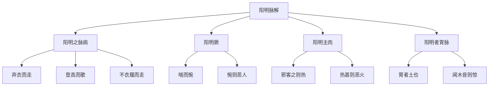

# 素问-阳明脉解篇第三十

> "黄帝问曰：病甚则弃衣而走，登高而歌，或至不衣履而走，是何邪？" - 黄帝

---

## 📜 原文（节选）/ Original Text (Excerpt)

黄帝问曰：病甚则弃衣而走，登高而歌，或至不衣履而走，是何邪？

岐伯对曰：阳明之脉病，恶人与火，闻木音则惕然而惊，钟鼓不为动，闻木音而惊，上气不足，恶人，恶火，闻木音则惊。

黄帝曰：其恶人何也？

岐伯曰：阳明厥则喘而惋，惋则恶人。

帝曰：其恶火何也？

岐伯曰：阳明主肉，其脉血气盛，邪客之则热，热甚则恶火。

帝曰：其闻木音则惊何也？

岐伯曰：阳明者胃脉也，胃者土也，故闻木音则惊，恶闻木音。

---

## 📖 白话文翻译（节选）/ Modern Chinese Translation (Excerpt)

黄帝问道：病严重则抛弃衣服而奔跑，登高而唱歌，有的甚至不穿衣服鞋子而奔跑，这是什么邪气？

岐伯回答说：阳明经脉病，厌恶人和火，听到木音就惊惕而惊，钟鼓不为动，听到木音而惊，上气不足，厌恶人，厌恶火，听到木音就惊。

黄帝说：它厌恶人，为什么？

岐伯说：阳明厥逆则喘息而惋惜，惋惜则厌恶人。

黄帝说：它厌恶火，为什么？

岐伯说：阳明主管肌肉，它的经脉血气旺盛，邪气客居则发热，发热严重则厌恶火。

黄帝说：它听到木音就惊，为什么？

岐伯说：阳明是胃脉，胃属土，所以听到木音就惊，厌恶听到木音。

---

## 🔑 核心要点 / Core Concepts

### 1. 阳明脉病表现 / Yangming Meridian Disease Manifestations

| 表现 | 原因 |
|------|------|
| 弃衣而走 | 阳明之脉病 |
| 登高而歌 | 阳明之脉病 |
| 不衣履而走 | 阳明之脉病 |

### 2. 阳明脉病特征 / Yangming Meridian Disease Characteristics

| 特征 | 表现 |
|------|------|
| 恶人 | 阳明厥则喘而惋 |
| 恶火 | 阳明主肉，热甚则恶火 |
| 闻木音则惊 | 阳明者胃脉也，胃者土也 |

### 3. 阳明脉解理论 / Yangming Meridian Explanation Theory

---

## 📚 理论解释 / Theoretical Analysis

### 阳明脉病理论 / Yangming Meridian Disease Theory

> [!info] 核心概念
- 阳明之脉病，病甚则弃衣而走
- 登高而歌，不衣履而走
- 阳明主肉，血气旺盛

#### 阳明脉病详解 / Detailed Yangming Meridian Disease

**1. 病甚表现 / Severe Disease Manifestations**
- 弃衣而走：抛弃衣服而奔跑
- 登高而歌：登高而唱歌
- 不衣履而走：不穿衣服鞋子而奔跑

**2. 病机分析 / Disease Mechanism Analysis**
- 阳明之脉病：阳明经脉病
- 邪气客居：邪气客居
- 血气旺盛：血气旺盛
- 发热严重：发热严重

### 阳明厥理论 / Yangming Jue Theory

> [!warning] 核心理念
- 阳明厥则喘而惋
- 惋则恶人
- 厥逆上气不足

#### 阳明厥详解 / Detailed Yangming Jue

**1. 阳明厥表现 / Yangming Jue Manifestations**
- 喘而惋：喘息而惋惜
- 上气不足：上气不足
- 恶人：厌恶人

**2. 厥逆病机 / Jue Counterflow Disease Mechanism**
- 阳明厥逆：阳明厥逆
- 气机上逆：气机上逆
- 精神异常：精神异常

### 阳明主肉理论 / Yangming Governing Flesh Theory

> [!note] 阳明主肉概念
- 阳明主管肌肉
- 经脉血气旺盛
- 邪客之则热

#### 阳明主肉详解 / Detailed Yangming Governing Flesh

**1. 阳明主肉 / Yangming Governing Flesh**
- 阳明主管肌肉：阳明主管肌肉
- 肌肉功能：肌肉功能正常
- 肌肉病变：肌肉病变

**2. 邪客之则热 / Evil Guest Then Heat**
- 邪气客居：邪气客居
- 血气旺盛：血气旺盛
- 发热：发热
- 热甚：发热严重

### 阳明者胃脉理论 / Yangming is Stomach Meridian Theory

> [!note] 阳明者胃脉概念
- 阳明是胃脉
- 胃属土
- 闻木音则惊

#### 阳明者胃脉详解 / Detailed Yangming is Stomach Meridian

**1. 阳明者胃脉 / Yangming is Stomach Meridian**
- 阳明是胃脉：阳明是胃脉
- 胃属土：胃属土
- 土畏木：土畏木

**2. 闻木音则惊 / Hearing Wood Sound Startles**
- 闻木音：听到木音
- 则惊：就惊
- 恶闻木音：厌恶听到木音

---

## 🏥 中医实践应用 / TCM Practice Application

### 阳明病治疗 / Yangming Disease Treatment

#### 现代阳明病治疗要点 / Modern Yangming Disease Treatment Key Points

**1. 阳明脉病治疗 / Yangming Meridian Disease Treatment**
- 病甚表现：弃衣而走，登高而歌
- 治法：清热泻火
- 药物：清热泻火药

**2. 阳明厥治疗 / Yangming Jue Treatment**
- 表现：喘而惋，恶人
- 治法：降逆止喘
- 药物：降逆止喘药

**3. 阳明主肉治疗 / Yangming Governing Flesh Treatment**
- 表现：发热，恶火
- 治法：清热养阴
- 药物：清热养阴药

---

## 🔗 相关链接 / Related Links

- [[MOC-黄帝内经知识库]] - 主索引
- [[黄帝内经-素问索引]] - 素问索引
- [[黄帝内经-核心理论]] - 核心理论体系
- [[素问-太阴阳明论篇第二十九]] - 太阴阳明
- [[素问-刺热篇第三十二]] - 刺热

### 易学关联 / Yi Jing Connection

- [[MOC-易经知识库]] - 易经索引
- [[20260201-0002 五行]] - 五行理论

**易学与阳明脉解的联系:**
- 五行理论：易学的五行理论与中医阳明胃脉相通
- 土木相克：易学的土木相克理论与中医闻木音则惊相通

---

## 💡 学习要点 / Learning Points

### 掌握重点 / Key Points to Master

- [ ] 理解阳明脉病的表现
- [ ] 掌握阳明厥的特征
- [ ] 学会阳明主肉的理论
- [ ] 了解阳明者胃脉的理论

### 思考问题 / Questions for Reflection

1. **为什么说"闻木音则惊"？**
   - 阳明者胃脉：阳明是胃脉
   - 胃者土也：胃属土
   - 土畏木：土畏木，闻木音则惊

2. **现代医学如何应用"阳明脉解"？**
   - 神经系统：神经系统疾病
   - 发热疾病：发热疾病治疗
   - 心理疾病：心理疾病治疗

---

## 📊 学习进度 / Learning Progress

### 完成情况 / Completion Status

| 学习内容 | 状态 | 备注 |
|---------|------|------|
| 原文诵读 | 📝 进行中 | 建议每日诵读 |
| 白话文理解 | ✅ 已完成 | 理解主要含义 |
| 阳明脉病 | ✅ 已完成 | 掌握表现 |
| 阳明病治疗 | 📝 进行中 | 需要临床实践 |
| 理论分析 | ✅ 已完成 | 理解理论 |

---

## 🔄 更新日志 / Update Log

### 2026-02-03

- ✅ 创建阳明脉解篇第三十笔记
- ✅ 完成原文、白话文翻译（节选）
- ✅ 整理阳明脉病表现和特征对照表
- ✅ 编写阳明脉病理论

---

**笔记创建日期**：2026年2月3日

**最后更新**：2026年2月3日
