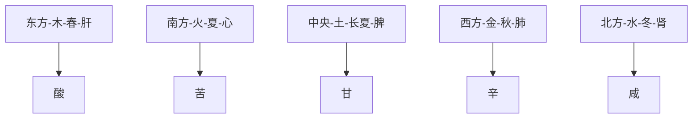

# 素问-阴阳应象大论篇第五

> "阴阳者，天地之道也，万物之纲纪，变化之父母，生杀之本始，神明之府也。" - 岐伯

---

## 📜 原文（节选）/ Original Text (Excerpt)

黄帝曰：阴阳者，天地之道也，万物之纲纪，变化之父母，生杀之本始，神明之府也。治病必求于本。故积阳为天，积阴为地。阴静阳躁，阳生阴长，阳杀阴藏。阳化气，阴成形。寒极生热，热极生寒。寒气生浊，热气生清。清气在下，则生飧泄；浊气在上，则生䐜胀。此阴阳反作，病之逆从也。

故清阳为天，浊阴为地。地气上为云，天气下为雨；雨出地气，云出天气。故清阳出上窍，浊阴出下窍。清阳发腠理，浊阴走五脏；清阳实四肢，浊阴归六腑。水为阴，火为阳。阳为气，阴为味。味归形，形归气，气归精，精化。精食气，形食味，化生精，气生形。味伤形，气伤精。精化为气，气伤于味。阴味出下窍，阳气出上窍。

味厚者为阴，薄为阳之阴。气厚则泄，薄则通。气薄则发泄，厚则发热。壮火之气衰，少火之气壮。壮火食气，气食少火。壮火散气，少火生气。气味，辛甘发散为阳，酸苦涌泄为阴。阴胜则阳病，阳胜则阴病。阳胜则热，阴胜则寒。重寒则热，重热则寒。寒伤形，热伤气。气伤痛，形伤肿。

故先痛而后肿者，气伤形也。先肿而后痛者，形伤气也。风胜则动，热胜则肿，燥胜则干，寒胜则浮，湿胜则濡泻。天有四时五行，以生长收藏，以生寒暑燥湿风。人有五脏化五气，以生喜怒悲忧恐。故喜怒伤气，寒暑伤形，暴怒伤阴，暴喜伤阳。厥气上行，满脉去形。喜怒不节，寒暑过度，生乃不固。故重阴必阳，重阳必阴。故曰：冬伤于寒，春必温病；春伤于风，夏生飧泄；夏伤于暑，秋必痎疟；秋伤于湿，冬生咳嗽。

帝曰：五脏之所生，变化之病形何如？

岐伯对曰：先定其五色五脉之应，其病乃可别也。

黄帝曰：色脉已定，别之奈何？

岐伯对曰：调其脉之缓、急、小、大、滑、涩，而病变定矣。

黄帝曰：调之奈何？

岐伯答曰：脉急者，尺之皮肤亦急；脉缓者，尺之皮肤亦缓；脉小者，尺之皮肤亦减而少气；脉大者，尺之皮肤亦贲而起；脉滑者，尺之皮肤亦滑；脉涩者，尺之皮肤亦涩。凡此变者，有微有甚。故善调尺者，不待于寸；善调脉者，不待于色。能参合而行之者，可以为上工。上工十全九。行二者为中工，中工十全七。行一者为下工。下工十全六。此论五脏所生之病。别其变化。先当调其五色五脉之应。色脉已定，而后调其尺肤与尺寸之脉。夫尺肤之气血，出于胃腑，水谷之精，注于脏腑之经隧，而外布于皮肤。寸口尺脉之血气，出于胃腑，水谷之精，荣行于脏腑经脉之中，变见于手太阴之两脉口，皆五脏之血气所注。故脉急者，尺之皮肤亦急；脉缓者，尺之皮肤亦缓。脉小者，尺之皮肤亦减而少气；脉大者，尺之皮肤亦贲而起；脉滑者，尺之皮肤亦滑；脉涩者，尺之皮肤亦涩。凡此变者，有微有甚。故善调尺者，不待于寸，善调脉者，不待于色。能参合而行之者，可以为上工。上工十全九。行二者为中工。中工十全七。行一者为下工。下工十全六。此论五脏所生之病。别其变化。先当调其五色五脉之应，色脉已定，而后调其尺肤与尺寸之脉。夫尺肤之气血，出于胃腑，水谷之精，注于脏腑之经隧，而外布于皮肤。寸口尺脉之血气，出于胃腑，水谷之精，荣行于脏腑经脉之中，变见于手太阴之两脉口，皆五脏之血气所注。

---

## 📖 白话文翻译（节选）/ Modern Chinese Translation (Excerpt)

黄帝说：阴阳，是天地的规律，是万物的纲领，是变化的父母，是生命产生的本始，是精神智慧所在。治疗疾病必须探求于根本。所以积聚的阳气属于天，积聚的阴气属于地。阴气主静而躁动，阳气主生发而阴长，阳气主肃杀而阴气潜藏。阳气化生津液，阴气构成形体。寒气达到极点就会生热，热气达到极点就会生寒。寒气产生的是浊气，热气产生的是清气。清气在人体下部，就会产生飧泄；浊气在人体上部，就会产生胀满。这种阴阳相互倒置违逆，就是疾病产生的顺逆规律。

所以说，积聚的清阳之气属于天，积聚的浊阴之气属于地。地气向上腾升成为云，天气下降成为雨；雨水从地面出来，地气从地面出来，云气从天气出来。所以清阳从上窍出来，浊阴从下窍出来。清阳发越腠理，浊阴走行五脏；清阳充实四肢，浊阴归入六腑。水属于阴，火属于阳。阳气即津液，阴气即五味。五味归属形体，形体归属气，气归属精，精化生津液，气生发形体。五味损伤形体，气损伤精。精化为气，气被五味所损伤。五味从下窍出来，阳气从上窍出来。

五味浓厚的归属于阴气，五味清淡的归属于阳气。五味浓厚则容易泄泻，五味清淡则容易通畅。五味浓厚则容易发热，五味清淡则不容易发热。壮火之气衰退，少火之气强盛。壮火之气消耗，少火之气生成。壮火容易散气，少火容易生气。气味方面，辛味、甘味容易发散属阳，酸味、苦味容易涌泄属阴。阴气胜过阳气，就会导致阳病；阳邪气胜过阴气，就会导致阴病。阳气胜过就会发热，阴气胜过就会发冷。重寒气相加就会生热，重热气相加就会生冷。寒邪气损伤形体，热邪气损伤气。气机受到伤害，形体就会发生肿胀。

所以先痛后肿，是气损伤形体；先肿后痛，是形体损伤气机。风邪气胜过则肢体躁动，热邪气胜过则肢体肿胀，燥邪气胜过则肢体干涩，寒邪气胜过则肢体浮肿，湿邪气胜过则肢体濡泻。天有四时五行，以春生夏长秋收冬藏，以生寒暑燥湿风。人的五脏化生五气，以产生喜怒悲忧恐等情志变化。所以喜怒损伤气，寒暑邪气损伤形体；暴怒损伤阴气，暴喜损伤阳气。厥气向上运行，经脉充满，气血运行。如果喜怒不节制，寒暑邪气过度，生命元气就不稳固。所以重阴必须配合阳气，重阳必须配合阴气。所以说：冬天伤于寒，春天就会发生温病；春天伤于风，夏天就会发生飧泄；夏天伤于暑，秋天就会发生痎疟；秋天伤于湿，冬天就会发生咳嗽。

黄帝问：五脏所化生的病，其变化形态是怎样的呢？

岐伯回答说：首先确定五色五脉的应象，然后才能辨别其疾病的差异。

黄帝说：五色五脉已经确定了，如何辨别其差异呢？

岐伯回答说：调其脉的缓、急、小、大、滑、涩，病变就可以确定了。

黄帝说：调脉的方法是怎样的呢？

岐伯回答说：脉急促的，尺部的皮肤也急；脉缓和的，尺部的皮肤也缓和；脉微小的，尺部的皮肤也减损而且少气；脉大的，尺部的皮肤也肥大隆起；脉滑利的，尺部的皮肤也滑利；脉涩滞的，尺部的皮肤也涩滞。凡是这些变化，有轻微和严重的分别。所以善于调尺脉的人，不等待寸口脉的变化；善于调脉的人，不等待五色的变化。能够参合各种情况而运用的人，可以作为上工。上工十项全能，九项全能。能行二项的是中工，十项全能七项的是中工。只能行一项的是下工，十项全能六项的是下工。这是论述五脏所化生的疾病，辨别其变化。首先应当调其五色五脉的应象，五色五脉已经确定了，然后再调其尺部皮肤和寸口尺寸的脉。尺部皮肤的气血，源于胃腑，是水谷精微，注入脏腑的经脉隧道，向外敷布在皮肤。寸口尺脉的血气，源于胃腑，是水谷精微，荣行在脏腑经脉之中，变化表现在手太阴经的两脉口，都是五脏血气所注入的。所以脉急促的，尺部皮肤也急促；脉缓和的，尺部皮肤也缓和；脉微小的，尺部皮肤也减损而且少气；脉大的，尺部皮肤也肥大隆起；脉滑利的，尺部皮肤也滑利；脉涩滞的，尺部皮肤也涩滞。凡是这些变化，有轻微和严重的分别。所以善于调尺脉的人，不等待寸口脉的变化；善于调脉的人，不等待五色的变化。能够参合各种情况而运用的人，可以作为上工。上工十项全能，九项全能。能行二项的是中工，十项全能七项的是中工。只能行一项的是下工，十项全能六项的是下工。这是论述五脏所化生的疾病，辨别其变化。首先应当调其五色五脉的应象，五色五脉已经确定了，然后再调其尺部皮肤和寸口尺寸的脉。尺部皮肤的气血，源于胃腑，是水谷精微，注入脏腑的经脉隧道，向外敷布在皮肤。寸口尺脉的血气，源于胃腑，是水谷精微，荣行在脏腑经脉之中，变化表现在手太阴经的两脉口，都是五脏血气所注入的。

---

## 🔑 核心要点 / Core Concepts

### 1. 阴阳的根本 / Root of Yin and Yang

| 概念 | 英文 | 含义 |
|------|------|------|
| **阴阳为天地** | Yin and Yang as heaven and earth | 阴阳是天地的规律 |
| **生杀之本** | Root of life and death | 生命产生的本始 |
| **神明之府** | Residence of divine spirit | 精神智慧的所在 |
| **积阳为天，积阴为地** | Accumulated Yang is heaven, Yin is earth | 积聚的阳气属天，积聚的阴气属地 |

### 2. 阴阳的属性 / Properties of Yin and Yang

| 属性 | 阳 | 阴 |
|------|------|------|
| **动静** | 阳动 | 阴静阳躁 |
| **生长收藏** | 阳杀阴藏 | 阳生阴长 |
| **形态** | 阴成形 | 阳化气 |
| **寒热** | 阴生热，阳生寒 | 阴气寒阳气热 |
| **清浊** | 阴生浊，阳生清 | 阴气浊阳气清 |

### 3. 五行与五脏 / Five Elements and Five Zang

---

## 📚 理论解释 / Theoretical Analysis

### 阴阳应象理论 / Theory of Yin-Yang Correspondence

> [!info] 核心理念
> 本篇阐述了阴阳理论的核心内容，包括阴阳的属性、相互关系、诊断方法。

#### 1. 五行对应五脏 / Five Elements and Five Zang Organs

- **木（春）→肝**：酸味，开窍于目
- **火（夏）→心**：苦味，开窍于耳
- **土（长夏）→脾**：甘味，开窍于口
- **金（秋）→肺**：辛味，开窍于鼻
- **水（冬）→肾**：咸味，开窍于二阴

#### 2. 阴阳胜负 / Yin-Yang Victory and Defeat

- **阴胜则阳病**：阴气胜过，阳气病
- **阳胜则阴病**：阳气胜过，阴气病
- **重寒则热**：重寒气相加生热
- **重热则寒**：重热气相加生冷
- **风胜→动**：风邪气胜过则躁动
- **热胜→肿**：热邪气胜过则肿胀
- **燥胜→干**：燥邪气胜过则干涩
- **湿胜→濡泻**：湿邪气胜过则濡泄

---

## 🏥 中医实践应用 / TCM Practice Application

### 五行养生 / Five Elements Health Preservation

| 季节 | 五行 | 脏腑 | 养生原则 | 饮食建议 |
|------|------|----------|---------|---------|
| 春 | 木 | 肝 | 养肝，疏泄 | 酸味食物，甘味为主 |
| 夏 | 火 | 心 | 养心，静神 | 苦味食物，清淡为主 |
| 长夏 | 土 | 脾 | 养脾，益气 | 甘味食物，适中为度 |
| 秋 | 金 | 肺 | 养肺，清燥 | 辛味食物，润燥为主 |
| 冬 | 水 | 肾 | 养肾，藏精 | 咸味食物，适量为主 |

### 脉诊法 / Pulse Diagnosis

| 脉象 | 阴阳状态 | 病机 |
|------|----------|---------|
| **脉急** | 阳虚 | 气虚 |
| **脉缓** | 阳和 | 气和 |
| **脉大** | 阳盛 | 气盛 |
| **脉小** | 阳不足 | 气衰 |
| **脉滑** | 有痰湿 | 痰湿阻滞 |
| **脉涩** | 血虚 | 气血不足 |

---

## 🔗 相关链接 / Related Links

- [[MOC-黄帝内经知识库]] - 主索引
- [[黄帝内经-素问索引]] - 素问索引
- [[黄帝内经-核心理论]] - 核心理论
- [[素问-金匮真言论篇第四]] - 上一篇
- [[素问-阴阳离合论篇第六]] - 下一篇

### 易学关联 / Yi Jing Connection

- [[MOC-易经知识库]] - 易经索引
- [[20260201-0002 阴阳]] - 阴阳理论

---

## 💡 学习要点 / Learning Points

### 掌握重点 / Key Points to Master

- [ ] 理解阴阳的根本概念
- [ ] 掌握五行与五脏的对应关系
- [ ] 理解阴阳胜负的规律
- [ ] 学会脉诊的基本方法
- [ ] 了解五行的养生应用

### 思考问题 / Questions for Reflection

1. **阴阳理论对中医有何重要意义？**
   - 理论基础
   - 指导临床实践
   - 整体观念

2. **五行与五脏的对应在现代医学中有何意义？**
   - 整体观念的现代应用
   - 辨证治疗基础

---

## 📊 学习进度 / Learning Progress

### 完成情况 / Completion Status

| 学习内容 | 状态 | 备注 |
|---------|------|------|
| 原文诵读 | 📝 进行中 | 建议每日诵读 |
| 白话文理解 | ✅ 已完成 | 理解主要含义 |
| 英文术语 | ✅ 已完成 | 掌握关键术语 |
| 核心要点 | ✅ 已完成 | 理解阴阳理论 |
| 理论分析 | ✅ 已完成 | 理解脉诊方法 |
| 实践应用 | 📝 进行中 | 需要临床实践 |

---

## 🔄 更新日志 / Update Log

### 2026-02-03

- ✅ 创建阴阳应象大论篇笔记
- ✅ 完成原文、白话文翻译（节选）
- ✅ 整理五行与五脏对应关系
- ✅ 编写阴阳胜负理论
- ✅ 添加脉诊方法和五行养生应用

---

**笔记创建日期**：2026年2月3日

**最后更新**：2026年2月3日
