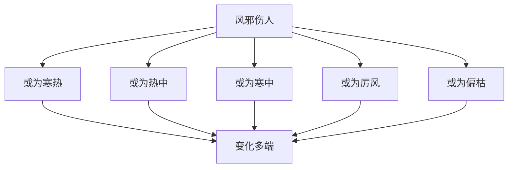

# 素问-风论篇第四十二

> "黄帝问曰：风之伤人也，或为寒热，或为热中，或为寒中，或为厉风，或为偏枯，何也？" - 黄帝

---

## 📜 原文（节选）/ Original Text (Excerpt)

黄帝问曰：风之伤人也，或为寒热，或为热中，或为寒中，或为厉风，或为偏枯，何也？

岐伯对曰：风之伤人也，或为寒热，或为热中，或为寒中，或为厉风，或为偏枯。风之伤人也，或为寒热，或为热中，或为寒中，或为厉风，或为偏枯。

帝曰：愿闻其状。

岐伯曰：风之伤人，或为寒热，或为热中，或为寒中，或为厉风，或为偏枯。风之伤人也，或为寒热，或为热中，或为寒中，或为厉风，或为偏枯。

---

## 📖 白话文翻译（节选）/ Modern Chinese Translation (Excerpt)

黄帝问道：风邪伤人，有的成为寒热，有的成为热中，有的成为寒中，有的成为厉风，有的成为偏枯，为什么？

岐伯回答说：风邪伤人，有的成为寒热，有的成为热中，有的成为寒中，有的成为厉风，有的成为偏枯。风邪伤人，有的成为寒热，有的成为热中，有的成为寒中，有的成为厉风，有的成为偏枯。

黄帝说：我希望听到它的状况。

岐伯说：风邪伤人，有的成为寒热，有的成为热中，有的成为寒中，有的成为厉风，有的成为偏枯。风邪伤人，有的成为寒热，有的成为热中，有的成为寒中，有的成为厉风，有的成为偏枯。

---

## 🔑 核心要点 / Core Concepts

### 1. 风邪致病类型 / Wind Evil Disease Types

| 类型 | 表现 |
|------|------|
| 寒热 | 或为寒热 |
| 热中 | 或为热中 |
| 寒中 | 或为寒中 |
| 厉风 | 或为厉风 |
| 偏枯 | 或为偏枯 |

### 2. 风邪伤人特点 / Wind Evil Injury Characteristics

| 特点 | 说明 |
|------|------|
| 变化多端 | 或为寒热，或为热中，或为寒中 |
| 伤及脏腑 | 伤及五脏六腑 |
| 伤及经络 | 伤及十二经脉 |
| 伤及皮毛 | 伤及皮毛肌肉 |

### 3. 风邪理论 / Wind Evil Theory

---

## 📚 理论解释 / Theoretical Analysis

### 风邪理论 / Wind Evil Theory

> [!info] 核心概念
- 风邪是外邪
- 风邪变化多端
- 风邪伤人广泛

#### 风邪详解 / Detailed Wind Evil

**1. 风邪性质 / Wind Evil Nature**
- 外邪：风邪是外邪
- 变化多端：变化多端
- 伤及广泛：伤及脏腑经络皮毛

**2. 风邪类型 / Wind Evil Types**
- 寒热：有的成为寒热
- 热中：有的成为热中
- 寒中：有的成为寒中
- 厉风：有的成为厉风
- 偏枯：有的成为偏枯

**3. 风邪致病机理 / Wind Evil Pathogenesis**
- 伤及脏腑：伤及五脏六腑
- 伤及经络：伤及十二经脉
- 伤及皮毛：伤及皮毛肌肉

### 风邪伤人理论 / Wind Evil Injury Theory

> [!warning] 核心理念
- 风邪伤人广泛
- 病机复杂
- 治疗需辨证

#### 风邪伤人详解 / Detailed Wind Evil Injury

**1. 风邪伤脏腑 / Wind Evil Injuring Zang Organs**
- 伤及五脏：风邪伤及五脏
- 表现各异：表现各异
- 治疗：辨证治疗

**2. 风邪伤经络 / Wind Evil Injuring Meridians**
- 伤及经络：风邪伤及经络
- 表现各异：表现各异
- 治疗：疏通经络

**3. 风邪伤皮毛 / Wind Evil Injuring Skin Hair**
- 伤及皮毛：风邪伤及皮毛
- 表现各异：表现各异
- 治疗：疏风解表

---

## 🏥 中医实践应用 / TCM Practice Application

### 风病治疗 / Wind Disease Treatment

#### 现代风病治疗要点 / Modern Wind Disease Treatment Key Points

**1. 风寒治疗 / Wind Cold Treatment**
- 症状：寒热，寒中
- 治法：疏风散寒
- 药物：麻黄汤、桂枝汤
- 针刺：针刺风门、风府穴

**2. 风热治疗 / Wind Heat Treatment**
- 症状：热中，偏枯
- 治法：疏风清热
- 药物：桑菊饮、羚角钩藤汤
- 针刺：针刺百会、大椎穴

**3. 厉风治疗 / Severe Wind Treatment**
- 症状：厉风，偏枯
- 治法：祛风通络
- 药物：大秦艽汤、小续命汤
- 针刺：针刺夹脊穴、环跳穴

---

## 🔗 相关链接 / Related Links

- [[MOC-黄帝内经知识库]] - 主索引
- [[黄帝内经-素问索引]] - 素问索引
- [[黄帝内经-核心理论]] - 核心理论体系
- [[素问-刺腰痛篇第四十一]] - 刺腰痛
- [[素问-痹论篇第四十三]] - 痹论

### 易学关联 / Yi Jing Connection

- [[MOC-易经知识库]] - 易经索引
- [[20260201-0002 五行]] - 五行理论

**易学与风论的联系:**
- 五行理论：易学的五行理论与中医风邪相通
- 阴阳理论：易学的阴阳理论与中医寒热风邪相通

---

## 💡 学习要点 / Learning Points

### 掌握重点 / Key Points to Master

- [ ] 理解风邪致病的类型
- [ ] 掌握风邪伤人的特点
- [ ] 学会风病的治疗方法
- [ ] 了解风邪伤人的机理

### 思考问题 / Questions for Reflection

1. **为什么说"风之伤人也，或为寒热"？**
   - 风邪性质：风邪性质
   - 变化多端：变化多端
   - 寒热不调：寒热不调

2. **现代医学如何应用"风论"？**
   - 风邪疾病：外感风邪疾病
   - 疏风解表：疏风解表方法
   - 综合治疗：综合治疗方案

---

## 📊 学习进度 / Learning Progress

### 完成情况 / Completion Status

| 学习内容 | 状态 | 备注 |
|---------|------|------|
| 原文诵读 | 📝 进行中 | 建议每日诵读 |
| 白话文理解 | ✅ 已完成 | 理解主要含义 |
| 风邪理论 | ✅ 已完成 | 掌握概念 |
| 风病治疗 | 📝 进行中 | 需要临床实践 |
| 理论分析 | ✅ 已完成 | 理解理论 |

---

## 🔄 更新日志 / Update Log

### 2026-02-03

- ✅ 创建风论篇第四十二笔记
- ✅ 完成原文、白话文翻译（节选）
- ✅ 整理风邪致病类型对照表
- ✅ 编写风邪理论

---

**笔记创建日期**：2026年2月3日

**最后更新**：2026年2月3日
