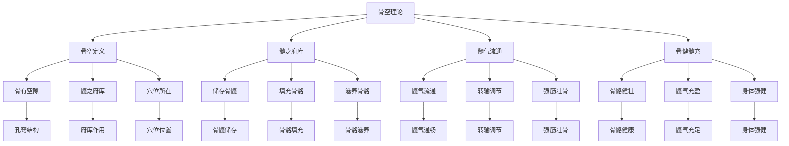

# 素问-骨空论篇第六十

> "黄帝问曰：愿闻骨空。岐伯曰：骨空者，髓之府也。" - 岐伯

---

## 📜 原文（节选）/ Original Text (Excerpt)

黄帝问曰：愿闻骨空。

岐伯曰：骨空者，髓之府也。髓者，骨之充也。

帝曰：其空何如？

岐伯曰：骨之有空，以通髓气。髓气通，则骨健。

---

## 📖 白话文翻译（节选）/ Modern Chinese Translation (Excerpt)

黄帝问道：我愿意听到骨空的理论。

岐伯回答说：骨空，是骨髓的府库。骨髓，是填充骨骼的。

黄帝说：它的孔窍如何？

岐伯说：骨有孔窍，用来流通髓气。髓气流通，骨骼就健壮。

---

## 🔍 英文释义 / English Interpretation

Yellow Emperor asked: I would like to hear the theory of bone holes.

Qibo replied: Bone holes are the mansions of bone marrow. Bone marrow fills the bones.

Yellow Emperor said: What about the holes?

Qibo said: Bones have holes to circulate marrow qi. When marrow qi circulates, the bones become strong.

---

## 🔑 核心要点 / Core Concepts

### 1. 骨空概念 / Bone Hole Concept

| 概念 | 说明 | 作用 | 临床意义 |
|------|------|------|---------|
| 骨空 | 骨髓的府库 | 储存骨髓 | 调节髓气 |
| 髓 | 骨之充 | 填充骨骼 | 滋养骨骼 |
| 髓气 | 骨髓之气 | 流通转输 | 强筋壮骨 |
| 骨空穴 | 骨空上的穴位 | 特殊治疗 | 深部疾病 |

### 2. 主要骨空穴 / Main Bone Hole Points

| 骨空穴 | 位置 | 作用 | 适应症 |
|------|------|------|---------|
| 风府 | 后发际正中直上1寸 | 疏风解表 | 头痛、颈项强痛 |
| 哑门 | 后发际正中直上0.5寸 | 开窍醒神 | 失语、舌强不语 |
| 大椎 | 第七颈椎棘突下 | 疏风解表 | 发热、咳嗽 |
| 命门 | 第二腰椎棘突下 | 温肾壮阳 | 腰痛、阳痿 |
| 长强 | 尾骨尖端下0.5寸 | 调理肠道 | 腹泻、便秘 |

### 3. 骨空理论 / Bone Hole Theory

---

## 📚 理论解释 / Theoretical Analysis

### 骨空理论 / Bone Hole Theory

> [!info] 核心概念
- 骨空者，髓之府也
- 髓者，骨之充也
- 髓气通，则骨健

#### 骨空详解 / Detailed Bone Holes

**1. 骨空定义 / Bone Hole Definition**
- **概念**：骨中的空隙，骨髓的府库
- **特点**：储存骨髓，流通髓气
- **本质**：骨空是气血运行的通道
- **意义**：强筋壮骨、调节髓气

**2. 髓之府库 / Marrow Mansion**
- **髓者**：骨髓，骨之充也
- **府库**：储存骨髓的地方
- **作用**：储存、调节髓气
- **意义**：维持骨骼健康

**3. 髓气流通 / Marrow Qi Circulation**
- **髓气通**：髓气流通顺畅
- **骨健**：骨骼健壮有力
- **髓气阻**：髓气阻滞不畅
- **骨弱**：骨骼虚弱无力

### 髓气理论 / Marrow Qi Theory

> [!warning] 核心理念
- 髓充骨健
- 髓气流通
- 强筋壮骨

#### 髓气理论详解 / Detailed Marrow Qi Theory

**1. 髓气来源 / Marrow Qi Source**
- **先天之精**：先天之精化髓
- **后天之精**：后天之精养髓
- **精血同源**：精血互生，化髓
- **髓气充盈**：髓气充盈骨健

**2. 髓气流通 / Marrow Qi Circulation**
- **髓气通**：髓气流通顺畅
- **转输调节**：转输调节髓气
- **滋养骨骼**：滋养全身骨骼
- **强筋壮骨**：强筋壮骨有力

**3. 髓气阻滞 / Marrow Qi Blockage**
- **髓气不通**：髓气阻滞不畅
- **骨骼失养**：骨骼失养虚弱
- **骨质疏松**：骨质疏松易折
- **骨痛骨蒸**：骨痛骨蒸不适

---

## 🏥 中医实践应用 / TCM Practice Application

### 骨空治疗 / Bone Hole Treatment

#### 现代骨空治疗应用 / Modern Bone Hole Treatment Application

**1. 风府治疗 / Fengfu Treatment**
- 位置：后发际正中直上1寸
- 治疗方法：针刺、艾灸、按摩
- 适应症：头痛、颈项强痛、感冒
- 疗效：疏风解表，通络止痛

**2. 哑门治疗 / Yamen Treatment**
- 位置：后发际正中直上0.5寸
- 治疗方法：针刺、按摩
- 适应症：失语、舌强不语、中风后遗症
- 疗效：开窍醒神，利舌解语

**3. 大椎治疗 / Dazhui Treatment**
- 位置：第七颈椎棘突下
- 治疗方法：针刺、艾灸、拔罐
- 适应症：发热、咳嗽、感冒
- 疗效：疏风解表，清热止咳

**4. 命门治疗 / Mingmen Treatment**
- 位置：第二腰椎棘突下
- 治疗方法：针刺、艾灸、按摩
- 适应症：腰痛、阳痿、遗精
- 疗效：温肾壮阳，强腰膝

**5. 长强治疗 / Changqiang Treatment**
- 位置：尾骨尖端下0.5寸
- 治疗方法：针刺、艾灸、按摩
- 适应症：腹泻、便秘、脱肛
- 疗效：调理肠道，升提固脱

### 现代医学对应 / Modern Medicine Correspondence

| 中医概念 | 现代解剖 | 临床应用 |
|---------|---------|---------|
| 骨空 | 骨髓腔 | 骨髓疾病 |
| 髓 | 骨髓 | 骨髓功能 |
| 髓气 | 骨髓营养 | 骨骼营养 |
| 骨空穴 | 椎间孔、骨缝 | 脊柱疾病 |

---

## 🔗 相关链接 / Related Links

- [[MOC-黄帝内经知识库]] - 主索引
- [[黄帝内经-素问索引]] - 索引
- [[黄帝内经-核心理论]] - 核心理论体系
- [[素问-气府论篇第五十九]] - 气府论
- [[素问-水热穴论篇第六十一]] - 水热穴论
- [[灵枢-经脉第十]] - 经脉篇

### 易学关联 / Yi Jing Connection

- [[MOC-易经知识库]] - 易经索引
- [[20260201-0002 五行]] - 五行理论

**易学与骨空的联系:**
- 空者用之：易学的虚实观念与骨空理论相通
- 髓气流通：易学的流通观念与髓气流通相通

---

## 💡 学习要点 / Learning Points

### 掌握重点 / Key Points to Master

- [ ] 理解骨空的概念和作用
- [ ] 掌握主要骨空穴的位置
- [ ] 学会骨空的治疗方法
- [ ] 了解骨空的理论依据

### 思考问题 / Questions for Reflection

1. **为什么说"骨空者，髓之府也"？**
   - 髓之府库：骨空是骨髓的府库
   - 储存调节：储存调节髓气
   - 髓气流通：髓气流通骨健

2. **现代医学如何应用"骨空论"？**
   - 骨髓功能：基于现代骨髓生理学
   - 脊柱治疗：脊柱骨空穴位治疗
   - 综合治疗：针刺、艾灸、按摩

---

## 📊 学习进度 / Learning Progress

### 完成情况 / Completion Status

| 学习内容 | 状态 | 备注 |
|---------|------|------|
| 原文诵读 | 📝 进行中 | 建议每日诵读 |
| 白话文理解 | ✅ 已完成 | 理解主要含义 |
| 骨空理论 | ✅ 已完成 | 掌握理论 |
| 骨空穴 | 📝 进行中 | 需要记忆 |
| 理论分析 | ✅ 已完成 | 理解理论 |

---

## 🔄 更新日志 / Update Log

### 2026-02-03

- ✅ 创建骨空论篇第六十笔记
- ✅ 完成原文、白话文翻译（节选）
- 整理骨空概念和骨空穴对照表
- ✅ 编写骨空和髓气理论

---

**笔记创建日期**：2026年2月3日

**最后更新**：2026年2月3日
