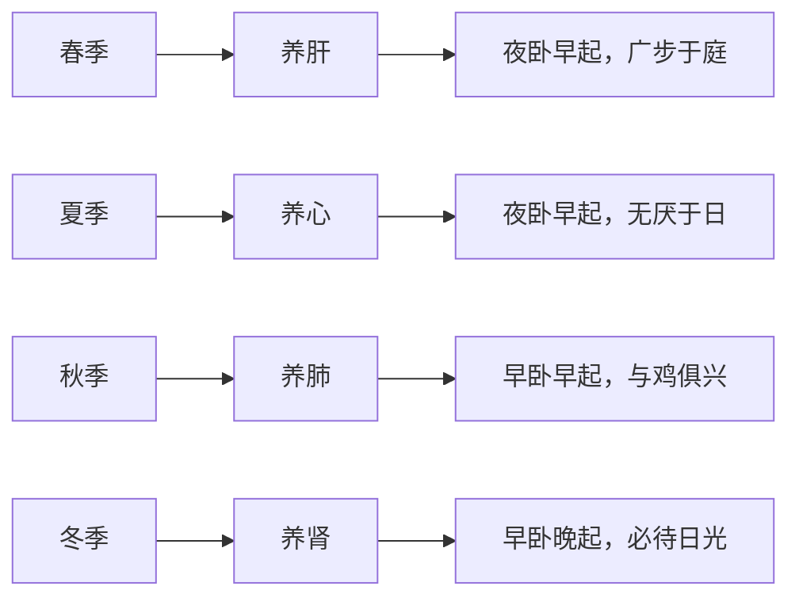

# 素问-上古天真论篇第一

> "上古之人，其知道者，法于阴阳，和于术数，食饮有节，起居有常，不妄作劳。" - 岐伯

---

## 📜 原文 / Original Text

昔在黄帝，生而神灵，弱而能言，幼而徇齐，长而敦敏，成而登天。

乃问于天师曰：余闻上古之人，春秋皆度百岁，而动作不衰；今时之人，年半百而动作皆衰者，时世异耶？人将失之耶？

岐伯对曰：上古之人，其知道者，法于阴阳，和于术数，食饮有节，起居有常，不妄作劳，故能形与神俱，而尽终其天年，度百岁乃去。

今时之人不然也，以酒为浆，以妄为常，醉以入房，以欲竭其精，以耗散其真，不知持满，不时御神，务快其心，逆于生乐，起居无节，故半百而衰也。

夫上古圣人之教下也，皆谓之虚邪贼风，避之有时，恬惔虚无，真气从之，精神内守，病安从来。

是以志闲而少欲，心安而不惧，形劳而不倦，气从以顺，各从其欲，皆得所愿。

故美其食，任其服，乐其俗，高下不相慕，其民故曰朴。

是以嗜欲不能劳其目，淫邪不能惑其心，愚智贤不肖，不惧于物，故合于道。

所以能年皆度百岁而动作不衰者，以其德全不危也。

帝曰：人年老而无子者，材力尽耶，将天数然也。

岐伯曰：女子七岁。肾气盛，齿更发长； 二七而天癸至，任脉通，太冲脉盛，月事以时下，故有子； 三七，肾气平均，故真牙生而长极； 四七，筋骨坚，发长极，身体盛壮； 五七，阳明脉衰，面始焦，发始堕； 六七，三阳脉衰于上，面皆焦，发始白； 七七，任脉虚，太冲脉衰少，天癸竭，地道不通，故形坏而无子也。 丈夫八岁，肾气实，发长齿更； 二八，肾气盛，天癸至，精气溢泻，阴阳和，故能有子； 三八，肾气平均，筋骨劲强，故真牙生而长极； 四八，筋骨隆盛，肌肉满壮； 五八，肾气衰，发堕齿槁； 六八，阳气衰竭于上，面焦，发鬓颁白； 七八，肝气衰，筋不能动；八八天癸竭，精少，肾藏衰，形体皆极；则齿发去。肾者主水，受五藏六府之精而藏之，故五藏盛，乃能泻。 今五藏皆衰，筋骨解堕，天癸尽矣。故发鬓白，身体重，行步不正，而无子耳。

帝曰：有其年已老而有子者何也。

岐伯曰：此其天寿过度，气脉常通，而肾气有余也。此虽有子，男不过尽八八，女不过尽七七，而天地之精气皆竭矣。

帝曰：夫道者年皆百数，能有子乎。

岐伯曰：夫道者能却老而全形，身年虽寿，能生子也。

黄帝曰：余闻上古有真人者，提挈天地，把握阴阳，呼吸精气，独立守神，肌肉若一，故能寿敝天地，无有终时，此其道生。中古之时，有至人者，淳德全道，和于阴阳，调于四时，去世离俗，积精全神，游行天地之间，视听八达之外，此盖益其寿命而强者也，亦归于真人。其次有圣人者，处天地之和，从八风之理，适嗜欲于世俗之间。无恚嗔之心，行不欲离于世，被服章，举不欲观于俗，外不劳形于事，内无思想之患，以恬愉为务，以自得为功，形体不敝，精神不散，亦可以百数。其次有贤人者，法则天地，象似日月，辨列星辰，逆从阴阳，分别四时，将从上古合同于道，亦可使益寿而有极时。

---

## 📖 白话文翻译 / Modern Chinese Translation

从前黄帝，生来十分聪明，很小的时候就善于言谈，幼年时对周围事物领会得很快，长大之后，既敦厚又勤勉，及至成年之时，登上了天子之位。

他向歧伯问道：我听说上古时候的人，年龄都能超过百岁，动作不显衰老；现在的人，年龄刚至半百，而动作就都衰弱无力了，这是由于时代不同所造成的呢，还是因为今天的人们不会养生所造成的呢？

歧伯回答说：上古时代的人，那些懂得养生之道的，能够取法于天地阴阳自然变化之理而加以适应，调和养生的办法，使之达到正确的标准。饮食有所节制，作息有一定规律，既不妄事操劳，又避免过度的房事，所以能够形神俱旺，协调统一，活到天赋的自然年龄，超过百岁才离开人世。

现在的人就不是这样了，把酒当水浆，滥饮无度，使反常的生活成为习惯，醉酒行房，因恣情纵欲，而使阴精竭绝，因满足嗜好而使真气耗散，不知谨慎地保持精气的充满，不善于统驭精神，而专求心志的一时之快，违逆人生乐趣，起居作息，毫无规律，所以到半百之年就衰老了。

古代深懂养生之道的人在教导普通人的时候，总要讲到对虚邪贼风等致病因素，应及时避开，心情要清净安闲，排除杂念妄想，以使真气顺畅，精神守持于内，这样，疾病就无从发生。

因此，人们就可以心志安闲，少有欲望，情绪安定而没有焦虑，形体劳作而不使疲倦，真气因而调顺，各人都能随其所欲而满足自己的愿望。

人们无论吃什麽食物都觉得甘美，随便穿什麽衣服也都感到满意，大家喜爱自己的风俗习尚，愉快地生活，社会地位无论高低，都不相倾慕，所以这些人称得上朴实无华。

因而任何不正当的嗜欲都不会引起他们注目，任何淫乱邪僻的事物也都不能惑乱他们的心志。无论愚笨的，聪明的，能力大的还是能力小的，都不因外界事物的变化而动心焦虑，所以符合养生之道。

他们之所以能够年龄超过百岁而动作不显得衰老，正是由于领会和掌握了修身养性的方法而身体不被内外邪气干扰危害所致。

黄帝说：人年纪老的时候，不能生育子女，是由于精力衰竭了呢，还是受自然规律的限定呢？歧伯说：女子到了七岁，肾气盛旺了起来，乳齿更换，头发开始茂盛。十四岁时，天癸产生，任脉通畅，太冲脉旺盛，月经按时来潮，具备了生育子女的能力。二十一岁时，肾气充满，真牙生出，牙齿就长全了。二十八岁时，筋骨强健有力，头发的生长达到最茂盛的阶段，此时身体最为强壮。三十五岁时，阳明经脉气血渐衰弱，面部开始憔悴，头发也开始脱落。四十二岁时，三阳经脉气血衰弱，面部憔悴无华，头发开始变白。四十九岁时，任脉气血虚弱，太冲脉的气血也衰少了，天葵枯竭，月经断绝，所以形体衰老，失去了生育能力。男子到了八岁，肾气充实起来，头发开始茂盛，乳齿也更换了，十六岁时，肾气旺盛，天癸产生，精气满溢而能外泻，两性|交合，就能生育子女。二十四岁时，肾气充满，筋骨强健有力，真牙生长，牙齿长全。三十二岁时，筋骨丰隆盛实，肌肉亦丰满健壮。四十岁时，肾气衰退，头发开始脱落，牙齿开始枯槁。四十八岁时，上部阳气逐渐衰竭，面部憔悴无华，头发和两鬓花白。五十六岁时，肝气衰弱，筋的活动不能灵活自如。六十四岁时，天癸枯竭，精气少，肾脏衰，牙齿头发脱落，形体衰疲。肾主水，接受其他各脏腑的精气而加以贮藏，所以五脏功能都以衰退，筋骨懈惰无力，天癸以竭。所以发鬓都变白，身体沉重，步伐不稳，也不能生育子女了。黄帝说：有的人年纪已老，仍能生育，是什麽道理呢？歧伯说：这是他天赋的精力超过常人，气血经脉保持畅通，肾气有余的缘故。这种人随有生育能力，但男子一般不超过六十四岁，女子一般不超过四十九岁，精气变枯竭了。黄帝说：掌握养生之道的人，年龄都可以达到一百岁左右，还能生育吗？歧伯说：掌握养生之道的人，能防止衰老而保全形体，虽然年高，也能生育子女。

我听说上古时代有称为真人的人，掌握了天地阴阳变化的规律，能够调节呼吸，吸收精纯的清气，超然独处，令精神守持于内，锻炼身体，使筋骨肌肉与整个身体达到高度的协调，所以他的寿命同于天地而没有终了的时候，这是他修道养生的结果。中古的时候，有称为致人的人，具有醇厚的道德，能全面地掌握养生之道，和调于阴阳四时的变化，离开世俗社会生活的干扰，积蓄精气，集中精神，使其远驰于广阔的天地自然之中，让视觉和听觉的注意力守持于八方之外，这是他延长寿命和强健身体的方法，这种人也可以归属真人的行列。其次有称为圣人的人，能够安处于天地自然的正常环境之中，顺从八风的活动规律，使自己的嗜欲同世俗社会相应，没有恼怒怨恨之情，行为不离开世俗的一般准则，穿着装饰普通纹采的衣服，举动也没有炫耀于世俗的地方，在外，他不使形体因为事物而劳累，在内，没有任何思想负担，以安静、愉快为目的，以悠然自得为满足，所以他的形体不益衰惫，精神不益耗散，寿命也可达到百岁左右。其次有称为贤人的人，能够依据天地的变化，日月的升降，星辰的位置，以顺从阴阳的消长和适应四时的变迁，追随上古真人，使生活符合养生之道，这样的人也能增益寿命，但有终结的时候。

---

## 🌐 英文释义 / English Translation

In ancient times, the Yellow Emperor was born with extraordinary spiritual intelligence. As an infant, he was able to speak. In his early childhood, he was compliant and proper. When he grew up, he was honest and quick-witted. Upon reaching adulthood, he ascended to the throne of heaven.

He asked his Heavenly Teacher (Qibo): I have heard that people in ancient times could all live past one hundred years while their actions did not show signs of aging. Now, people at the age of fifty already show signs of decline. Is this because times have changed, or is it because people today do not know how to preserve their health?

Qibo replied: People in ancient times who understood the Way followed the principles of Yin and Yang, harmonized with the methods of numerology, had regular dietary habits, maintained a regular daily schedule, and did not overexert themselves. Therefore, their body and spirit were in harmony, and they could fulfill their natural lifespan, living past one hundred years before departing from this world.

People today are not like this. They treat wine as water, drinking to excess, and make unconventional living their habit. They engage in sexual intercourse while intoxicated, exhausting their essence through desire and dissipating their true qi. They do not know how to preserve the fullness of their essence, nor do they know how to govern their spirit properly. They seek momentary pleasure for their hearts, going against the true joy of life. Their daily habits have no regularity, so they decline by fifty.

The teachings of ancient sages always taught people to avoid harmful winds and evil influences in a timely manner, to be tranquil and empty of desires, so that true qi would follow, and spirit would be guarded within. How could illness arise then?

Therefore, people's aspirations are at peace with few desires, their minds are calm and without fear, their bodies labor but are not exhausted, their qi follows smoothly, and everyone can satisfy their desires.

They find beauty in whatever they eat, are comfortable in whatever they wear, delight in their customs, and do not envy those of higher or lower status. Thus, these people are said to be simple and honest.

Therefore, improper desires cannot trouble their eyes, and evil influences cannot confuse their minds. Whether foolish, wise, capable, or incompetent, they are not disturbed by external things, thus they accord with the Way.

The reason they can all live past one hundred years while their actions do not show decline is because their virtue is complete and they are not in danger.

---

## 🔑 核心要点 / Core Concepts

### 1. 养生之道 / The Way of Health Preservation

**关键概念 / Key Concepts:**

| 古文 | 英文 | 含义 |
|------|------|------|
| **法于阴阳** | Following the laws of Yin and Yang | 效法天地阴阳变化的自然规律 |
| **和于术数** | Harmonizing with numerological methods | 调和养生的各种方法 |
| **食饮有节** | Moderate and regular diet | 饮食有节制，不过量 |
| **起居有常** | Regular daily schedule | 起居作息有规律 |
| **不妄作劳** | Avoiding overexertion | 不过度劳累，不过度房事 |

### 2. 形神俱旺 / Harmony of Body and Spirit

- **形（Body）**：形体健康，身体机能正常
- **神（Spirit）**：精神饱满，情志舒畅
- **形神俱**：形体与精神相互协调，和谐统一

### 3. 恬淡虚无 / Tranquility and Emptiness

- **恬淡**：心静神安，无杂念
- **虚无**：无欲无求，内心空虚
- **真气从之**：真气顺畅运行
- **精神内守**：精神守持于内而不外耗

### 4. 虚邪贼风 / Evil Winds and Pathogenic Factors

- **虚邪贼风**：四时不正之气，外感病邪
- **避之有时**：适时避开病邪

---

## 📚 理论解释 / Theoretical Analysis

### 养生理论的核心 / Core of Health Preservation Theory

> [!info] 理论核心
> 本篇提出中医养生的核心理论：顺应自然、节制欲望、调摄精神、形神兼养。

#### 1. 天人相应 / Correspondence Between Heaven and Man

- **人与自然**：人体与自然环境密切相关
- **顺应四时**：春生、夏长、秋收、冬藏
- **阴阳平衡**：取法阴阳，调和阴阳

#### 2. 预防为主 / Prevention First

- **治未病**：预防疾病发生
- **避邪有时**：及时避开致病因素
- **养精全神**：保持精气充足，精神内守

#### 3. 形神合一 / Unity of Body and Spirit

- **形为神之宅**：形体是精神的载体
- **神为形之主**：精神主导形体的功能
- **形神俱旺**：健康是形体与精神的和谐统一

#### 4. 修身养性 / Cultivating Virtue

- **德全不危**：品德完善则身体不危
- **恬淡虚无**：内心清净，无欲无求
- **合于道**：符合养生之道

---

## 🏥 中医实践应用 / TCM Practice Application

### 现代养生指南 / Modern Health Guide

> [!tip] 实践建议
> 将《黄帝内经》的养生智慧应用于现代生活。

#### 1. 饮食养生 / Dietary Health

| 古人做法 | 现代建议 | 原理 |
|---------|---------|------|
| 食饮有节 | 定时定量，不过量 | 保护脾胃，避免损伤 |
| 美其食 | 不挑食，饮食清淡 | 营养均衡，心境平和 |

**具体措施 / Specific Measures:**
- 早餐：7-9点（胃经当令）
- 午餐：11-13点（心经当令）
- 晚餐：17-19点（肾经当令）
- 避免暴饮暴食
- 减少生冷、辛辣刺激

#### 2. 起居养生 / Lifestyle Health

| 古人做法 | 现代建议 | 原理 |
|---------|---------|------|
| 起居有常 | 早睡早起，规律作息 | 顺应生物节律 |
| 不妄作劳 | 劳逸结合，适度运动 | 避免过度消耗 |

**具体措施 / Specific Measures:**
- **睡眠时间**：晚上11点前入睡（子时觉）
- **起床时间**：早上6-7点（顺应阳气生发）
- **午休**：中午小睡20-30分钟
- **运动**：适度运动，避免过度疲劳

#### 3. 精神养生 / Mental Health

| 古人做法 | 现代建议 | 原理 |
|---------|---------|------|
| 恬淡虚无 | 减少欲望，保持清净 | 减少精神内耗 |
| 志闲少欲 | 放慢生活节奏 | 降低心理压力 |
| 精神内守 | 专注当下 | 避免分心散神 |

**具体措施 / Specific Measures:**
- **冥想**：每日10-15分钟冥想练习
- **减少信息过载**：限制社交媒体使用
- **培养爱好**：做让自己愉悦的事
- **情绪管理**：及时释放负面情绪

#### 4. 顺应四时 / Seasonal Health

**详细说明 / Detailed Explanation:**

| 季节 | 养生原则 | 起居建议 | 饮食建议 |
|------|---------|---------|---------|
| **春** | 养肝、养阳 | 夜卧早起，广步于庭 | 多食甘味、辛味 |
| **夏** | 养心、养阳 | 夜卧早起，无厌于日 | 多食苦味、辛味 |
| **秋** | 养肺、养阴 | 早卧早起，与鸡俱兴 | 多食酸味、辛味 |
| **冬** | 养肾、养阴 | 早卧晚起，必待日光 | 多食咸味、苦味 |

#### 5. 避邪防病 / Disease Prevention

| 古人做法 | 现代建议 | 原理 |
|---------|---------|------|
| 虚邪贼风，避之有时 | 注意保暖，避免受凉 | 预防外感病邪 |
| 精神内守 | 保持心理健康 | 增强免疫力 |

**具体措施 / Specific Measures:**
- **注意气候变化**：及时增减衣物
- **避开污染**：避免雾霾、二手烟
- **保持卫生**：勤洗手，注意饮食卫生
- **增强体质**：锻炼身体，提高免疫力

---

## 🔗 相关链接 / Related Links

### 内部链接 / Internal Links

- [[MOC-黄帝内经知识库]] - 黄帝内经主索引
- [[黄帝内经-素问索引]] - 素问篇章索引
- [[黄帝内经-核心理论]] - 核心理论体系
- [[黄帝内经-实践应用]] - 中医实践应用
- [[素问02-四气调神大论篇]] - 下一篇：四气调神大论

### 外部链接 / External Links

- [中国哲学书电子化计划 - 素问上古天真论](https://ctext.org/wiki.pl?if=gb&remap=gb&chapter=351842)
- [UNESCO - Huang Di Nei Jing](https://media.unesco.org/sites/default/files/webform/mow001/china_huan_di_nei.pdf)

### 易学关联 / Yi Jing Connection

- [[MOC-易经知识库]] - 易经索引
- [[20260201-0000 易]] - 易经总论
- [[20260201-0002 阴阳]] - 阴阳理论

**易学与中医的联系 / Connection Between Yi Jing and TCM:**
- 阴阳学说：易学的阴阳观是中医理论基础
- 五行理论：易学的五行说应用于中医藏象
- 天人合一：易学的整体观与中医的天人相应

---

## 💡 学习要点 / Learning Points

### 掌握重点 / Key Points to Master

> [!important] 必须掌握
> 以下内容是理解本篇的核心要点。

- [ ] **理解养生的核心原则**：法于阴阳、和于术数、食饮有节、起居有常、不妄作劳
- [ ] **掌握形神合一的理论**：形体与精神的关系
- [ ] **理解恬淡虚无的养生意义**：精神调养的重要性
- [ ] **了解预防为主的思想**：治未病的预防观念
- [ ] **学会四季养生的方法**：顺应四时的养生实践

### 思考问题 / Questions for Reflection

1. **为什么说"形与神俱"是健康的关键？**
   - 形体健康是精神健康的基础
   - 精神健康可以促进形体健康
   - 两者相互影响，缺一不可

2. **如何在现代生活中实践"恬淡虚无"？**
   - 减少物质欲望
   - 培养内心平静
   - 专注当下，不过分担忧未来

3. **中医"治未病"思想对现代医学有何启示？**
   - 预防重于治疗
   - 重视生活方式对健康的影响
   - 早期干预，防止疾病发展

4. **为什么"食饮有节"和"起居有常"对养生如此重要？**
   - 保护脾胃功能
   - 顺应生物节律
   - 避免过度消耗精气

---

## 📊 学习进度 / Learning Progress

### 完成情况 / Completion Status

| 学习内容 | 状态 | 备注 |
|---------|------|------|
| 原文诵读 | ✅ 已完成 | 建议每日诵读 |
| 白话文理解 | ✅ 已完成 | 理解主要含义 |
| 英文术语 | ✅ 已完成 | 掌握关键术语 |
| 核心要点 | ✅ 已完成 | 理解养生原则 |
| 理论分析 | ✅ 已完成 | 理解理论体系 |
| 实践应用 | ✅ 已完成 | 制定个人养生计划 |
| 思考问题 | 📝 进行中 | 持续反思 |

### 个人实践记录 / Personal Practice Log

| 实践项目 | 开始日期 | 完成情况 | 备注 |
|---------|---------|---------|------|
| 饮食调整 | 2026-02-02 | 📝 进行中 | 定时定量 |
| 起居规律 | 2026-02-02 | 📝 进行中 | 早睡早起 |
| 精神调养 | 2026-02-02 | 📝 进行中 | 冥想练习 |
| 顺应四时 | 2026-02-02 | 📝 进行中 | 春季养肝 |

---

## 🔄 更新日志 / Update Log

### 2026-02-02

- ✅ 创建上古天真论篇笔记
- ✅ 完成原文、白话文翻译、英文释义
- ✅ 整理核心要点和理论分析
- ✅ 编写中医实践应用指南
- ✅ 添加相关链接和学习要点

---

## ✅ 掌握要点检查 / Mastery Checklist

在继续学习下一篇之前，请确保：

- [ ] 能够背诵或朗读原文
- [ ] 理解白话文翻译的主要含义
- [ ] 掌握核心养生原则（法于阴阳、和于术数等）
- [ ] 理解形神合一的理论
- [ ] 知道如何在实践中应用养生方法
- [ ] 已制定个人养生计划并开始实践
- [ ] 理解中医"治未病"的思想
- [ ] 能够向他人解释本篇的主要内容

---

**笔记创建日期**：2026年2月2日

**最后更新**：2026年2月2日

**建议下次复习**：2026年2月9日
