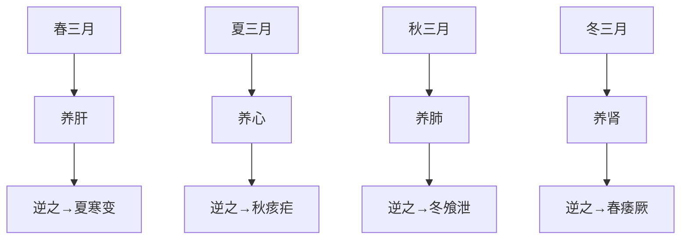

# 素问-四气调神大论篇第二

> "圣人不治已病治未病，不治已乱治未乱。" - 岐伯

---

## 📜 原文 / Original Text

春三月，此谓发陈，天地俱生，万物以荣，夜卧早起，广步于庭，被发缓形，以使志生，生而勿杀，予而勿夺，赏而勿罚，此春气之应，养生之道也。逆之则伤肝，夏为寒变，奉长者少。

夏三月，此谓蕃秀，天地气交，万物华实，夜卧早起，无厌于日，使志无怒，使华英成秀，使气得泄，若所爱在外，此夏气之应，养长之道也。逆之则伤心，秋为痎疟，奉收者少，冬至重病。

秋三月，此谓容平，天气以急，地气以明，早卧早起，与鸡俱兴，使志安宁，以缓秋刑，收敛神气，使秋气平，无外其志，使肺气清，此秋气之应，养收之道也。逆之则伤肺，冬为飧泄，奉藏者少。

冬三月，此谓闭藏，水冰地坼，无扰乎阳，早卧晚起，必待日光，使志若伏若匿，若有私意，若已有得，去寒就温，无泄皮肤，使气亟夺，此冬气之应，养藏之道也。逆之则伤肾，春为痿厥，奉生者少。

天气，清净光明者也，藏德不止，故不下也。天明则日月不明，邪害空窍，阳气者闭塞，地气者冒明，云雾不精，则上应白露不下。交通不表，万物命故不施，不施则名木多死。恶气不发，风雨不节，白露不下，则菀槁不荣。贼风数至，暴雨数起，天地四时不相保，与道相失，则未央绝灭。唯圣人从之，故身无奇病，万物不失，生气不竭。

逆春气则少阳不生，肝气内变。逆夏气则太阳不长，心气内洞。逆秋气则太阴不收，肺气焦满。逆冬气则少阴不藏，肾气独沉。

夫四时阴阳者，万物之根本也。所以圣人春夏养阳，秋冬养阴，以从其根，故与万物沉浮于生长之门。逆其根，则伐其本，坏其真矣。故阴阳四时者，万物之终始也，死生之本也，逆之则灾害生，从之则苛疾不起，是谓得道。道者，圣人行之，愚者佩之。从阴阳则生，逆之则死。从之则治，逆之则乱。反顺为逆，是谓内格。

是故圣人不治已病，治未病，不治已乱，治未乱，此之谓也。夫病已成而后药之，乱已成而后治之，譬犹渴而穿井，斗而铸锥，不亦晚乎？

---

## 📖 白话文翻译 / Modern Chinese Translation

春天的三个月，称作发陈，是草木发芽、枝叶舒展的季节。在这一季节里，天地自然，都富有生气，万物显得欣欣向荣。此时，人们应该入夜即睡眠，早些起身，披散开头发，解开衣带，使形体舒缓，放宽步子，在庭院中漫步，使精神愉快，胸怀开畅，保持万物的生机。不要滥行杀伐，多施与，少敛夺，多奖励，少惩罚，这是适应春季的时令，保养生发之气的方法。如果违逆了春生之气，便变会损伤肝脏，使提供给夏长之气的条件不足，到夏季就会发生寒性病变。

夏天的三个月，称作蕃秀，是自然界万物繁茂秀美的时令。此时，天气下降，地气上腾，天地之气相交，植物开花结实，长势旺盛，人们应该在夜晚睡眠，早早起身，不要厌恶长日，情志应保持愉快，切勿发怒，要使精神之英华适应夏气以成其秀美，使气机宣畅，通泄自如，精神外向，对外界事物有浓厚的兴趣。这是适应夏天的时令，保护身体机能旺盛滋长的法则。违逆了这一法则，就会伤害心气，到了秋天容易发生疟疾，冬天再次发生疾病。

秋天的三个月，称作容平，自然界景象因万物成熟而平定收敛。此时，天高风急，地气清肃，人应早睡早起，和鸡的活动时间相仿，以保持神志的安宁，减缓秋季肃杀之气对人体的影响；收敛神气，以适应秋季容平的特征，不使神思外驰，以保持肺气的清肃功能，这就是适应秋令的特点而保养人体收敛之气的方法。若为违逆了秋收之气，就会伤及肺脏，使提供给同藏之气的条件不足，冬天就要发生飧泄病。

冬天的三个月，称作闭藏，是生机潜伏，万物蛰藏的时令。当此时节，水寒成冰，大地龟裂，人应该早睡晚起，待到日光照耀时起床才好，不要轻易地扰动阳气，妄事操劳，要使神志深藏于内，安静自若，好象有个人的隐秘，严守而不外泄，又象得到的渴望得到的东西，把他密藏起来一样；要守避寒冷，求取温暖，不要使皮肤开泄而令阳气不断地损失，这是适应冬季的气候而保养人体闭藏机能的方法。违逆了冬令的闭藏之气，就要损伤肾脏，使提供给春生之气的条件不足，春天就会发生痿厥之疾。

天气能够总是清爽洁净、一片光明，是由于上天所具的化生万物之道藏而不露并健运不息、永不衰减的缘故。如果天上阴霾笼罩、晦暗不清，日月就不能放射光明。在这样的时候，邪气就会侵入人的孔窍而造成疾病。如果天上的阳气闭塞不通，地上的阴气不能萌发上腾，云雾不能消散而使天空放晴，那么天上下应地气的甘露就不会降下，天地之气不交，万物的生命就不能绵延。万物的生机不能延续，自然界高大的树木也会死亡。有害于万物生长的恶劣气候不能终止，风雨不能按时到来，雨露当降而不降，草木不得滋润，生机郁塞，茂盛的禾苗也会枯槁不荣。邪风频频而至，暴雨不时而作，天地四时的变化失去了秩序，违背了正常的规律，致使万物的生命未及一半就夭折了。只有圣人能适应自然变化，注重养生之道，所以身无大病，因不背离自然万物得发展规律，而生机不会竭绝。

违逆了春生的时令规律，人体的少阳之气就不能焕发生机，肝气就会因此内郁而发生病变。违逆了夏长的时令规律，人体的太阳之气就不能旺盛滋长，心气就会因此内空。违逆了秋收的时令规律，人体的太阴之气就不能起到收敛的作用，肺气就会因此枯萎而导致肺部胀满。违逆了东藏的时令规律，人体的少阴之气就不能起到闭藏的作用，肾气就会因此失常而发生注泻等疾病。

四季的阴阳变化，是万物生命的根本，所以圣人在春夏季节保养阳气以适应生长的需要，在秋冬季节保养阴气以适应收藏的需要，顺从了生命发展的根本规律，就能与万物一样，在生、长、收、藏的生命过程中运动发展。如果违逆了这个规律，就会摧残生命力，破坏真元之气。因此，阴阳四时是万物的起点与终点，是盛衰存亡的根本，违逆了它，就会产生灾害，顺从了它，就不会发生重病，这样变可谓懂得了养生之道。对于养生之道，圣人能够加以实行，愚人则时常有所违背。顺从阴阳的消长，就能生存，违逆了就会死亡。顺从了它，就会正常，违逆了它，就会乖乱。相反，如背道而行，就会使机体与自然环境相格拒。

因此圣人不是在生病之后才去治疗，而是在还没生病的时候就加以防止；不是在已经混乱之后才去治理，而是在还没混乱的时候就加以预防。这个道理，就象人已经很渴了才去挖井，已经很困了才去铸造锥子一样，不也晚了吗？

---

## 🌐 英文释义 / English Translation

The three months of spring are called "Fa Chen" (releasing the old), the season when grass sprouts and branches unfold. In this season, heaven and earth are both generating life, and all things appear prosperous. At this time, people should sleep early at night and rise early in the morning, loosen their hair and untie their clothing to relax their body, take leisurely walks in the courtyard, make their spirit happy and their mind open, maintain the vitality of all things. Do not indiscriminately kill, give more and take less, reward more and punish less. This is the way to adapt to the season of spring and preserve the energy of generation. If you go against this, you will injure the liver, and when summer comes, cold transformations will occur because there is insufficient energy provided for growth.

The three months of summer are called "Fan Xiu" (flourishing and elegant), the season when everything in nature flourishes beautifully. At this time, heaven's qi descends and earth's qi rises, heaven and earth's qi intersect, plants bloom and bear fruit, and growth is vigorous. People should sleep early at night and rise early in the morning, not dislike the long days, keep their emotions peaceful without anger, so that the spiritual brilliance adapts to summer qi to achieve its beauty, allow the qi to be released, and turn their spirit outward toward external things with strong interest. This is the way to adapt to the season of summer and protect the flourishing function of the body. If you go against this, you will injure the heart qi, and in autumn, malaria will easily occur, and diseases will occur again in winter.

The three months of autumn are called "Rong Ping" (peaceful and level), when nature's appearance becomes stable and convergent because all things have matured. At this time, heaven is high and winds are urgent, earth's qi is clear and solemn. People should sleep early and rise early, keeping time with chickens to maintain peace of spirit, alleviate the impact of autumn's killing qi on the human body, converge the spirit, adapt to the characteristics of autumn's stability, not let the mind wander outward, and maintain the clear and solemn function of lung qi. This is the way to adapt to the autumn season and preserve the convergent function of the human body. If you go against this, you will injure the lungs, and conditions for supporting storage will be insufficient, leading to leakage diseases in winter.

The three months of winter are called "Bi Cang" (closed storage), the season when vitality is hidden and all things hibernate. During this season, water freezes and earth cracks. People should sleep early and rise late, only getting up when sunlight shines, not easily disturbing yang qi, not overexerting in tasks. They should keep their spirit hidden within, quiet as if someone has a secret, strictly guarded without leaking outward, just like someone who has obtained their desired treasure and keeps it hidden; avoid cold and seek warmth, do not let the skin open and sweat causing continuous loss of yang qi. This is the way to adapt to winter's climate and preserve the closed storage function of the human body. If you go against the closed storage qi of winter, you will injure the kidneys, and conditions for supporting spring generation will be insufficient, leading to weakness and cold reversal diseases in spring.

Heaven's qi is always pure and bright because the way of generating all things possessed by heaven is hidden without showing and operates ceaselessly without ever decaying. If the sky is covered by haze and dark and unclear, the sun and moon cannot radiate brightness. In such times, evil qi will invade the human orifices and cause diseases. If the yang qi in heaven is blocked and not flowing, and the yin qi on earth cannot sprout and rise upward, and clouds and fog cannot disperse to make the sky clear, then the sweet dew responding to heaven and earth will not fall down. When heaven and earth's qi do not interact, the life of all things cannot continue. When the vitality of all things cannot continue, even the tall trees in nature will die in large numbers. Harmful climate that harms the growth of all things cannot be stopped, wind and rain cannot arrive on time, when rain and dew should fall they do not, grass and trees cannot be moistened, vitality is blocked, and the flourishing seedlings will also wither and not prosper. Evil winds come frequently, sudden rains occur untimely, the changes of heaven and earth's four seasons lose their order, deviating from normal laws, causing the lives of all things to perish before reaching half their lifespan. Only sages can adapt to natural changes, value the way of health preservation, so their bodies have no serious diseases. Because they do not deviate from the laws of development of all things in nature, their vitality will not be exhausted.

If you go against the season of spring generation, the body's lesser yang qi cannot be generated, and liver qi will become stagnant inside and cause diseases. If you go against the season of summer growth, the body's greater yang qi cannot flourish vigorously, and heart qi will become empty inside. If you go against the season of autumn convergence, the body's greater yin qi cannot perform the function of convergence, and lung qi will wither and cause lung fullness. If you go against the season of winter storage, the body's lesser yin qi cannot perform the function of closed storage, and kidney qi will become abnormal and cause leakage and other diseases.

The changes of yin and yang in the four seasons are the root of the life of all things. Therefore, sages preserve yang qi in spring and summer seasons to adapt to the needs of growth, and preserve yin qi in autumn and winter seasons to adapt to the needs of storage, following the fundamental laws of life development, they can move and develop together with all things in the processes of generation, growth, convergence, and storage. If you go against this law, you will destroy vitality and damage the primal qi. Therefore, the yin and yang of the four seasons are the starting point and end point of all things, the root of death and life. If you go against it, disasters will arise; if you follow it, serious diseases will not occur. This can be said to have mastered the way of health preservation. Regarding the way of health preservation, sages can practice it, while foolish people often deviate from it. Following the waxing and waning of yin and yang leads to survival; going against it leads to death. Following it leads to normal functioning; going against it leads to disorder. Contrary to following becomes going against, which is called "internal obstruction" (nei ge).

Therefore, sages do not treat diseases after they have already formed, but rather prevent them before they occur; they do not manage after chaos has already formed, but rather prevent it before chaos occurs. This principle is like someone only digging a well after becoming very thirsty, or only casting an awl after being very exhausted - isn't it too late?

---

## 🔑 核心要点 / Core Concepts

### 1. 四季养生法则 / Four Seasons Health Preservation

| 季节 | 养生原则 | 起居建议 | 精神调摄 | 脏腑养护 |
|------|---------|---------|---------|---------|
| **春** | 养生、养阳 | 夜卧早起，广步于庭 | 使志生，生而勿杀 | 养肝 |
| **夏** | 养长、养阳 | 夜卧早起，无厌于日 | 使志无怒，若所爱在外 | 养心 |
| **秋** | 养收、养阴 | 早卧早起，与鸡俱兴 | 使志安宁，收敛神气 | 养肺 |
| **冬** | 养藏、养阴 | 早卧晚起，必待日光 | 使志若伏若匿，去寒就温 | 养肾 |

### 2. 四时与脏腑 / Four Seasons and Zang-Fu

### 3. 天地之气交 / Interaction of Heaven and Earth Qi

- **天气清净光明**：天气清爽洁净，天地化生万物
- **天地之气相交**：天气下降，地气上腾，阴阳相交
- **四时相保**：天地四时保持协调
- **交通不表**：天地之气不交，万物生命不能延续

### 4. 阴阳根本 / Root of Yin and Yang

**关键概念 / Key Concepts:**

| 概念 | 英文 | 含义 |
|------|------|------|
| **春夏养阳** | Nourish yang in spring and summer | 顺应阳气生长 |
| **秋冬养阴** | Nourish yin in autumn and winter | 适应阴气收藏 |
| **从其根** | Following the root | 顺应生命根本 |
| **伐其本** | Destroying the root | 违背根本规律 |

---

## 📚 理论解释 / Theoretical Analysis

### 治未病思想 / Prevention Before Disease

> [!info] 核心理念
> "圣人不治已病治未病"是中医预防医学的核心思想。

#### 1. 预防为主的三层含义

**第一层：未病先防（Before Disease Occurs）**
- 顺应四时阴阳变化
- 保持良好的生活习惯
- 调摄精神情志
- 预防外感病邪

**第二层：既病防变（Prevent Disease Progression）**
- 早期发现疾病苗头
- 及时治疗，防止发展
- 防止传变到其他脏腑

**第三层：瘥后防复（Prevent Relapse）**
- 病愈后继续调养
- 避免疾病复发
- 巩固治疗成果

#### 2. 四季养生的理论基础

**天人相应 / Correspondence Between Heaven and Man:**
- 人与自然界是一个有机整体
- 人体生理随四季变化而变化
- 顺应四时是养生的根本

**阴阳消长 / Waxing and Waning of Yin and Yang:**
- 春夏：阳气生发增长
- 秋冬：阳气收敛收藏
- 顺应阴阳变化是健康的关键

**脏腑与季节 / Zang-Fu and Seasons:**
- 春应肝（木）
- 夏应心（火）
- 秋应肺（金）
- 冬应肾（水）

#### 3. 违逆四时的后果

| 季节 | 违逆 | 所伤脏腑 | 后果 |
|------|------|---------|------|
| 春 | 逆春气 | 肝 | 夏为寒变，奉长者少 |
| 夏 | 逆夏气 | 心 | 秋为痎疟，冬至重病 |
| 秋 | 逆秋气 | 肺 | 冬为飧泄，奉藏者少 |
| 冬 | 逆冬气 | 肾 | 春为痿厥，奉生者少 |

---

## 🏥 中医实践应用 / TCM Practice Application

### 现代四季养生指南 / Modern Four Seasons Health Guide

> [!tip] 实践建议
> 将《黄帝内经》四季养生思想应用于现代生活。

#### 1. 春季养生（立春-立夏）/ Spring Health

**养生原则 / Health Principles:**
- 养肝为主，阳气生发
- 舒缓形体，精神愉快
- 广步于庭，接触自然
- 生而勿杀，多施少夺

**起居建议 / Lifestyle Recommendations:**

| 方面 | 建议 | 原理 |
|------|------|------|
| **睡眠** | 夜卧早起，顺应阳气生发 | 春季阳气生发 |
| **运动** | 广步于庭，户外活动 | 舒展形体，生发阳气 |
| **精神** | 使志生，胸怀开畅 | 保持精神愉快 |
| **行为** | 多奖励，少惩罚，多施与 | 培养正向情绪 |

**饮食建议 / Dietary Recommendations:**

- **宜食**：甘味、辛味（养肝、生发阳气）
  - 韭菜、韭菜、菠菜、葱、姜
  - 酸味食物（养肝敛肝）
- **忌食**：过度寒凉、过度油腻
  - 损伤脾胃阳气
  - 影响肝气生发

#### 2. 夏季养生（立夏-立秋）/ Summer Health

**养生原则 / Health Principles:**
- 养心为主，阳气旺盛
- 夜卧早起，适应长日
- 使志无怒，精神外向
- 使华英成秀，气得宣泄

**起居建议 / Lifestyle Recommendations:**

| 方面 | 建议 | 原理 |
|------|------|------|
| **睡眠** | 夜卧早起，适当午休 | 夏季夜短，阳气旺盛 |
| **运动** | 适度运动，防过度消耗 | 夏季阳气旺盛，不宜过度 |
| **精神** | 使志无怒，保持愉快 | 避免心火内扰 |
| **社交** | 精神外向，与人交流 | 夏季宜外向，不宜内郁 |

**饮食建议 / Dietary Recommendations:**

- **宜食**：苦味、辛味（养心、清解暑热）
  - 苦瓜、苦瓜、芹菜
  - 绿豆、西瓜、冬瓜（清解暑热）
- **忌食**：过度寒凉、过度油腻
  - 损伤心阳
  - 影响消化功能

#### 3. 秋季养生（立秋-立冬）/ Autumn Health

**养生原则 / Health Principles:**
- 养肺为主，阳气收敛
- 早卧早起，与鸡俱兴
- 使志安宁，收敛神气
- 使肺气清，无外其志

**起居建议 / Lifestyle Recommendations:**

| 方面 | 建议 | 原理 |
|------|------|------|
| **睡眠** | 早睡早起，与鸡俱兴 | 秋季收敛，阳气收敛 |
| **运动** | 适度运动，收敛神气 | 不宜过度兴奋 |
| **精神** | 使志安宁，收敛神气 | 秋季肃杀，宜内敛 |
| **环境** | 收敛神气，无外其志 | 避免精神外耗 |

**饮食建议 / Dietary Recommendations:**

- **宜食**：酸味、辛味（养肺、收敛阳气）
  - 酸味水果（苹果、梨、葡萄）
  - 银耳、百合、梨（润肺）
- **忌食**：过度辛辣、过度刺激
  - 损伤肺气
  - 影响收敛功能

#### 4. 冬季养生（立冬-立春）/ Winter Health

**养生原则 / Health Principles:**
- 养肾为主，阳气闭藏
- 早卧晚起，必待日光
- 使志若伏若匿，深藏神气
- 去寒就温，无泄皮肤

**起居建议 / Lifestyle Recommendations:**

| 方面 | 建议 | 原理 |
|------|------|------|
| **睡眠** | 早卧晚起，必待日光 | 冬季闭藏，宜早睡晚起 |
| **运动** | 适度运动，不宜过度 | 保护阳气，避免过度消耗 |
| **精神** | 使志若伏若匿，深藏神气 | 冬季宜内敛，不宜外露 |
| **保暖** | 去寒就温，避寒保暖 | 保护阳气，避免寒邪侵袭 |

**饮食建议 / Dietary Recommendations:**

- **宜食**：咸味、苦味（养肾、收藏阳气）
  - 咸味食物（适量食盐、海带、紫菜）
  - 黑豆、黑米、黑芝麻（补肾）
  - 核桃、栗子、山药（收藏阳气）
- **忌食**：过度寒凉、过度生冷
  - 损伤肾阳
  - 影响闭藏功能

---

## 🔗 相关链接 / Related Links

### 内部链接 / Internal Links

- [[MOC-黄帝内经知识库]] - 黄帝内经主索引
- [[黄帝内经-素问索引]] - 素问篇章索引
- [[黄帝内经-核心理论]] - 核心理论体系
- [[黄帝内经-实践应用]] - 中医实践应用
- [[素问01-上古天真论篇]] - 上一篇：上古天真论
- [[素问03-生气通天论篇]] - 下一篇：生气通天论

### 外部链接 / External Links

- [中国哲学书电子化计划 - 素问四气调神大论](https://ctext.org/wiki.pl?if=gb&remap=gb&chapter=351842)
- [WHO - Preventive Medicine](https://www.who.int/health-topics/health-promotion)

### 易学关联 / Yi Jing Connection

- [[MOC-易经知识库]] - 易经索引
- [[20260201-0002 阴阳]] - 阴阳理论

**易学与四季养生的联系 / Connection Between Yi Jing and Four Seasons Health:**
- 易学八卦与四季：震（春）、离（夏）、兑（秋）、坎（冬）
- 阴阳消长与四季：春夏阳气生发，秋冬阴气收藏
- 天人相应思想：人与自然和谐统一

---

## 💡 学习要点 / Learning Points

### 掌握重点 / Key Points to Master

> [!important] 必须掌握
> 以下内容是理解本篇的核心要点。

- [ ] **理解四季养生的基本原则**
- [ ] **掌握四时与脏腑的对应关系**
- [ ] **理解"治未病"的思想内涵**
- [ ] **学会在现代生活中实践四季养生**
- [ ] **了解违逆四时的后果**

### 思考问题 / Questions for Reflection

1. **为什么说"圣人不治已病治未病"？**
   - 预防比治疗更重要
   - 早期干预可以防止疾病发展
   - 养生防病是上策

2. **现代生活如何实践"春夏养阳，秋冬养阴"？**
   - 春夏：增加户外活动，早睡早起
   - 秋冬：调整作息，减少过度消耗
   - 饮食：根据季节调整饮食

3. **四季养生对现代预防医学有何启示？**
   - 重视生活方式对健康的影响
   - 强调预防胜于治疗
   - 顺应自然规律

---

## 📊 学习进度 / Learning Progress

### 完成情况 / Completion Status

| 学习内容 | 状态 | 备注 |
|---------|------|------|
| 原文诵读 | 📝 进行中 | 建议每日诵读 |
| 白话文理解 | ✅ 已完成 | 理解主要含义 |
| 英文术语 | ✅ 已完成 | 掌握关键术语 |
| 核心要点 | ✅ 已完成 | 理解四季养生原则 |
| 理论分析 | ✅ 已完成 | 理解治未病思想 |
| 实践应用 | 📝 进行中 | 制定个人四季养生计划 |

### 个人实践记录 / Personal Practice Log

| 季节 | 实践项目 | 开始日期 | 完成情况 |
|------|---------|---------|---------|
| 春季 | 调整作息，广步于庭 | 待定 | 📝 待开始 |
| 夏季 | 避暑降温，保持心志平和 | 待定 | 📝 待开始 |
| 秋季 | 收敛神气，早睡早起 | 待定 | 📝 待开始 |
| 冬季 | 保暖防寒，收藏阳气 | 待定 | 📝 待开始 |

---

## 🔄 更新日志 / Update Log

### 2026-02-02

- ✅ 创建四气调神大论篇笔记
- ✅ 完成原文、白话文翻译、英文释义
- ✅ 整理四季养生核心要点
- ✅ 编写理论分析（治未病思想）
- ✅ 添加现代四季养生实践指南

---

## ✅ 掌握要点检查 / Mastery Checklist

在继续学习下一篇之前，请确保：

- [ ] 能够背诵或朗读原文
- [ ] 理解白话文翻译的主要含义
- [ ] 掌握四季养生的基本原则
- [ ] 知道四时与脏腑的对应关系
- [ ] 理解"治未病"的思想内涵
- [ ] 已制定个人四季养生计划
- [ ] 能够向他人解释本篇的主要内容

---

**笔记创建日期**：2026年2月2日

**最后更新**：2026年2月2日

**建议下次复习**：2026年2月9日
