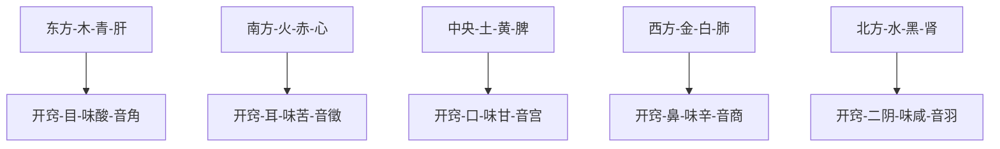

# 素问-金匮真言论篇第四

> "东方青色，入通于肝，开窍于目，藏精于肝。" - 岐伯

---

## 📜 原文（节选）/ Original Text (Excerpt)

黄帝曰：天有八风，经有五风，何谓？

岐伯对曰：八风发邪，以为经风，触五藏，邪气发病。所谓得四时之胜者：春胜长夏，长夏胜冬，冬胜夏，夏胜秋，秋胜春，所谓四时之胜也。

东风生于春，病在肝，俞在颈项；南风生于夏，病在心，俞在胸胁；西风生于秋，病在肺，俞在肩背；北风生于冬，病在肾，俞在腰股；中央为土，病在脾，俞在脊。

故春气者，病在头；夏气者，病在藏；秋气者，病在肩背；冬气者，病在四支。

故春善病鼽衄，仲夏善病胸胁，长夏善病洞泄寒中，秋善病风疟，冬善病痹厥。

故冬不按跷，春不鼽衄，春不病颈项，仲夏不病胸胁，长夏不病洞泄寒中，秋不病风疟，冬不病痹厥，飧泄而汗出也。

夫精者，身之本也。故藏于精者，春不病温。夏暑汗不出者，秋成风疟。此平人脉法也。

故曰：阴中有阴，阳中有阳。平旦至日中，天之阳，阳中之阳也；日中至黄昏，天之阳，阳中之阴也；合夜至鸡鸣，天之阴，阴中之阴也；鸡鸣至平旦，天之阴，阴中之阳也。故人亦应之。

夫言人之阴阳，则外为阳，内为阴；言人身之阴阳，则背为阳，腹为阴；言人身之藏腑中阴阳，则藏者为阴，腑者为阳，肝、心、脾、肺、肾五藏皆为阴，胆、胃、大肠、小肠、膀胱、三焦六腑皆为阳。所以欲知阴中之阴、阳中之阳者何也？为冬病在阴，夏病在阳，春病在阴，秋病在阳，皆视其所在，为施针石也。

故背为阳，阳中之阳，心也；背为阳，阳中之阴，肺也；腹为阴，阴中之阴，肾也；腹为阴，阴中之阳，肝也；腹为阴，阴中之至阴，脾也。此皆阴阳表里、内外、雌雄相输应也，故以应天之阴阳也。

帝曰：五藏应四时，各有收受乎？

岐伯曰：有。东方青色，入通于肝，开窍于目，藏精于肝，其病发惊骇；其味酸，其类草木，其畜鸡，其谷麦，其应四时，上为岁星，是以春气在头也，其音角，其数八，是以知病之在筋也，其臭臊。

南方赤色，入通于心，开窍于耳，藏精于心，故病在五藏；其味苦，其类火，其畜羊，其谷黍，其应四时，上为荧惑星，是以知病之在脉也，其音徵，其数七，其臭焦。

中央黄色，入通于脾，开窍于口，藏精于脾，故病在舌本；其味甘，其类土，其畜牛，其谷稷，其应四时上为镇星，是以知病之在肉也，其音宫，其数五，其臭香。

西方白色，入通于肺，开窍于鼻，藏精于肺，故病在背；其味辛，其类金，其畜马，其谷稻，其应四时，上为太白星，是以知病之在皮毛也，其音商，其数九，其臭腥。

北方黑色，入通于肾，开窍于二阴，藏精于肾，故病在溪；其味咸，其类水，其畜彘，其谷豆，其应四时，上为辰星，是以知病之在骨也，其音羽，其数六，其臭腐。

故善为脉者，谨察五藏六府，一逆一从，阴阳、表里、雌雄之纪，藏之心意，合心于精。非其人勿教，非其真勿授，是谓得道。

---

## 📖 白话文翻译（节选）/ Modern Chinese Translation (Excerpt)

黄帝问道：自然界有八风，人的经脉病变又有五风的说法，这是怎么回事呢？

歧伯回答说：自然界的八风是外部的致病邪气，它们侵犯经脉，产生经脉的风病，风邪还会沿着经脉而侵害五脏，使五脏发生病变。一年的四个季节，有相克的关系，如春胜长夏，长夏胜冬，冬胜夏，夏胜秋，秋胜春，某个季节出现了克制它的季节气候，这就是所谓四时相胜。

东风生于春季，病多发生在肝，肝的经气输注于颈项；南风生于夏季，病多发生于心，心的经气输注于胸胁；西风生于秋季，病多发生在肺，肺的经气输注于肩背；北风生于冬季，病多发生在肾，肾的经气输注于腰股；长夏季节和中央的方位属于土，病多发生在脾，脾的经气输注于脊。

所以春季邪气伤人，多病在头部；夏季邪气伤人，多病在心；秋季邪气伤人，多病在肩背；冬季邪气伤人，多病在四肢。

所以春天多发生鼻衄，仲夏多发生胸胁疼痛，长夏多发生泄泻一类的里寒病，秋天多发生风疟病，冬天多发生痹厥病。

因此冬天不进行按摩等扰动阳气的活动，来年春天就不会发生鼻衄等部位的疾病，夏天就不会发生胸胁的疾患，长夏季节就不会发生泄泻一类的里寒病，秋天就不会发生风疟病，冬天也不会发生厥厥、泄泻、汗出过多等病症。

精，是人体的根本。所以阴精内藏而不妄泄，春天就不会得温热病。夏暑阳盛，如果不能排汗散热，到秋天就会酿成风疟病。这是诊察普通人四时发病的一般规律。

所以说：阴阳之中，还各有阴阳。白昼属阳，平旦到中午，为阳中之阳；中午到黄昏，为阳中之阴。黑夜属阴，合夜到鸡鸣，为阴中之阴；鸡鸣到平旦，为阴中之阳。人的情况也与此相应。

就人体阴阳而论，外部属阳，内部属阴。就身体的部位来分阴阳，则背为阳，腹为阴。从脏腑的阴阳划分来说，则脏属阴，腑属阳，肝、心、脾、肺、肾五脏都属阴。胆、胃、大肠、小肠、膀胱、三焦六腑都属阳。了解阴阳之中复有阴阳的道理是什麽呢？这是要分析四时疾病的在阴在阳，以作为治疗的依据，如冬病在阴，夏病在阳，春病在阴，秋病在阳，都要根据疾病的部位来施用针刺和贬石的疗法。

此外，背为阳，阳中之阳为心；背为阳，阳中之阴为肺。腹为阴，阴中之阴为肾；腹为阴，阴中之阳为肝；腹为阴，阴中的至阴为脾。以上这些都是人体阴阳表里、内外、雌雄相互联系又相互对应的例证，所以人与自然界的阴阳是相应的。

黄帝说：五脏除与四时相应外，它们各自还有相类的事物可以归纳起来吗？

歧伯说：有。比如东方青色，与肝相通，肝开窍于目，经气内藏于肝，发病常表现为惊骇，在五味为酸，与草木同类，在五畜为鸡，在五谷为麦，与四时中的夏季相应，在天体为岁星，春天阳气上升，所以其气在头，在五音为角，其成数为八，因肝主筋。此外，在嗅味为臊。

南方赤色，与心相通，心开窍于耳，经气内藏于心，在五味为苦，与火同类，在五畜为羊，在五谷为黍，与四时中的夏季相应，在天体为荧惑星，他的疾病多发生在脉和五脏，在五音为徵，其成数为七。此外，在嗅味为焦。

中央黄色，与脾相通，脾开窍于口，经气内藏于脾，在五味为甘，与土同类，在五畜为牛，在五谷为稷，与四时中的长夏相应，在天体为镇星，他的疾病多发生在舌根和肌肉，在五音为宫，其成数为五。此外，在嗅味为香。

西方白色，与肺相通，肺开窍于鼻，经气内藏于肺，在五味为辛，与金同类，在五畜为马，在五谷为稻，与四时中的秋季相应，在天体为太白星，他的疾病多发生在背部和皮毛，在五音为商，其成数为九。此外，在嗅味为腥。

北方黑色，与肾相通，肾开窍于前后二阴，经气内藏于肾，在五味为咸，与水同类，在五畜为彘，在五谷为豆，与四时中的冬季相应，在天体为辰星，他的疾病多发生在溪和骨，在五音为羽，其成数为六。此外，在嗅味为腐。

所以善于诊脉的医生，能够谨慎细心地审查五脏六腑的变化，了解其顺逆的情况，把阴阳、表里、雌雄的对应和联系，纲目分明地加以归纳，并把这些精深的道理，深深地记在心中。这些理论至为宝贵，对于那些不是真心实意地学习而又不具备一定条件的人，切勿轻易传授，这才爱护和珍视这门学问的正确态度。

---

## 🔑 核心要点 / Core Concepts

### 1. 五方四时与五脏 / Five Directions, Four Seasons, and Five Zang Organs

| 方位 | 五行 | 色 | 脏 | 窍 | 味 | 谷 | 畜 | 星 | 音 | 数 | 气输 |
|------|------|------|------|------|------|------|------|------|------|------|------|
| 东 | 木 | 青 | 肝 | 目 | 酸 | 麦 | 鸡 | 岁星 | 角 | 8 | 颈项 |
| 南 | 火 | 赤 | 心 | 耳 | 苦 | 黍 | 羊 | 荧惑星 | 徵 | 7 | 胸胁 |
| 中 | 土 | 黄 | 脾 | 口 | 甘 | 稷 | 牛 | 镇星 | 宫 | 5 | 脊 |
| 西 | 金 | 白 | 肺 | 鼻 | 辛 | 稻 | 马 | 太白星 | 商 | 9 | 肩背 |
| 北 | 水 | 黑 | 肾 | 二阴 | 咸 | 豆 | 彘 | 辰星 | 羽 | 6 | 腰股 |

### 2. 八风五风与四时之胜 / Eight Winds, Five Winds, and Seasonal Dominance

**八风 / Eight Winds:**
- 东风（春）
- 南风（夏）
- 西风（秋）
- 北风（冬）
- 东南风、西南风、西北风、东北风

**四时之胜 / Seasonal Dominance:**
- 春胜长夏
- 长夏胜冬
- 冬胜夏
- 夏胜秋
- 秋胜春

---

## 📚 理论解释 / Theoretical Analysis

### 藏象理论 / Zang-Fu Theory

> [!info] 核心理念
> 五脏与五方、五行、五味、五谷、五畜、五星、五音的对应关系。

#### 五脏与五行的对应 / Zang Organs and Five Elements

---

## 🏥 中医实践应用 / TCM Practice Application

### 五脏养生 / Five Zang Health Preservation

| 脏 | 养生原则 | 饮食建议 | 起居建议 |
|------|---------|---------|---------|
| 肝 | 春季养肝，情志舒畅 | 酸味食物，绿色蔬菜 | 适度运动，保持心情愉快 |
| 心 | 夏季养心，保持心志平和 | 苦味食物，适量清热 | 午休，避免过度劳累 |
| 脾 | 长夏养脾，饮食有节 | 甘味食物，适量 | 细嚼慢咽，保护脾胃 |
| 肺 | 秋季养肺，润燥清肺 | 辛味食物，润燥食物 | 早睡早起，锻炼肺气 |
| 肾 | 冬季养肾，收藏阳气 | 咸味食物，黑色食物 | 保暖，避免过度出汗 |

---

## 🔗 相关链接 / Related Links

- [[MOC-黄帝内经知识库]] - 主索引
- [[黄帝内经-素问索引]] - 素问索引
- [[黄帝内经-核心理论]] - 核心理论体系
- [[素问01-上古天真论篇]] - 上篇
- [[素问02-四气调神大论篇]] - 第二篇
- [[素问03-生气通天论篇]] - 第三篇

### 易学关联 / Yi Jing Connection

- [[MOC-易经知识库]] - 易经索引
- [[20260201-0004 四象]] - 四象理论

**易学与藏象理论的联系:**
- 五行对应：易学的五行理论与中医藏象理论相通
- 方位对应：后天八卦方位与五脏对应

---

## 💡 学习要点 / Learning Points

### 掌握重点 / Key Points to Master

- [ ] 理解五脏与五方、五行、五味、五谷、五畜、五星、五音的对应关系
- [ ] 掌握八风、五风与四时之胜的概念
- [ ] 了解四时疾病的特点和预防方法
- [ ] 学会根据季节调整养生方法

### 思考问题 / Questions for Reflection

1. **为什么说五脏与五方、五行等有对应关系？**
   - 整体观念：人与自然是一个有机整体
   - 取象比类：用自然事物比喻人体脏腑功能
   - 实践应用：根据季节和五行调整养生

2. **四时之胜（相克）对现代医学有何启示？**
   - 顺应自然规律
   - 预防为主
   - 整体平衡

---

## 📊 学习进度 / Learning Progress

### 完成情况 / Completion Status

| 学习内容 | 状态 | 备注 |
|---------|------|------|
| 原文诵读 | 📝 进行中 | 建议每日诵读 |
| 白话文理解 | ✅ 已完成 | 理解主要含义 |
| 英文术语 | ✅ 已完成 | 掌握关键术语 |
| 核心要点 | ✅ 已完成 | 理解五脏对应 |
| 理论分析 | ✅ 已完成 | 理解藏象理论 |
| 实践应用 | 📝 进行中 | 需要临床实践 |

---

## 🔄 更新日志 / Update Log

### 2026-02-03

- ✅ 创建金匮真言论篇笔记
- ✅ 完成原文、白话文翻译（节选）
- ✅ 整理五脏对应关系表
- ✅ 编写理论分析

---

**笔记创建日期**：2026年2月3日

**最后更新**：2026年2月3日
