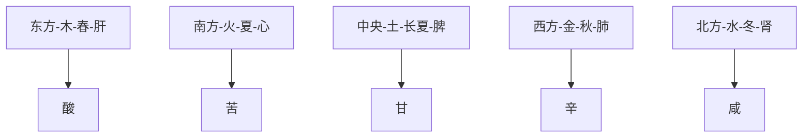

# 素问-阴阳应象大论篇第五

> "阴阳者，天地之道也，万物之纲纪，变化之父母，生杀之本始，神明之府也。" - 岐伯

---

## 📜 原文（节选）/ Original Text (Excerpt)

黄帝曰：阴阳者，天地之道也，万物之纲纪，变化之父母，生杀之本始，神明之府也。治病必求于本。故积阳为天，积阴为地。阴静阳躁，阳生阴长，阳杀阴藏。阳化气，阴成形。寒极生热，热极生寒。寒气生浊，热气生清。清气在下，则生飧泄；浊气在上，则生䐜胀。此阴阳反作，病之逆从也。

故清阳为天，浊阴为地。地气上为云，天气下为雨；雨出地气，云出天气。故清阳出上窍，浊阴出下窍。清阳发腠理，浊阴走五脏；清阳实四肢，浊阴归六腑。

水为阴，火为阳。阳为气，阴为味。味归形，形归气，气归精，精化。精食气，形食味，化生精，气生形。味伤形，气伤精。精化为气，气伤于味。阴味出下窍，阳气出上窍。

味厚者为阴，薄为阳之阴。气厚则泄，薄则通。气薄则发泄，厚则发热。壮火之气衰，少火之气壮。壮火食气，气食少火。壮火散气，少火生气。气味，辛甘发散为阳，酸苦涌泄为阴。阴胜则阳病，阳胜则阴病。阳胜则热，阴胜则寒。重寒则热，重热则寒。寒伤形，热伤气。气伤痛，形伤肿。

故先痛而后肿者，气伤形也。先肿而后痛者，形伤气也。

风胜则动，热胜则肿，燥胜则干，寒胜则浮，湿胜则濡泻。天有四时五行，以生长收藏，以生寒暑燥湿风。人有五脏化五气，以生喜怒悲忧恐。故喜怒伤气，寒暑伤形，暴怒伤阴，暴喜伤阳。厥气上行，满脉去形。喜怒不节，寒暑过度，生乃不固。故重阴必阳，重阳必阴。故曰：冬伤于寒，春必温病；春伤于风，夏生飧泄；夏伤于暑，秋必痎疟；秋伤于湿，冬生咳嗽。

帝曰：五脏之所生，变化之病形何如？

岐伯对曰：先定其五色五脉之应，其病乃可别也。

黄帝曰：色脉已定，别之奈何？

岐伯对曰：调其脉之缓、急、小、大、滑、涩，而病变定矣。

黄帝曰：调之奈何？

岐伯答曰：脉急者，尺之皮肤亦急；脉缓者，尺之皮肤亦缓；脉小者，尺之皮肤亦减而少气；脉大者，尺之皮肤亦贲而起；脉滑者，尺之皮肤亦滑；脉涩者，尺之皮肤亦涩。凡此变者，有微有甚。故善调尺者，不待于寸；善调脉者，不待于色。能参合而行之者，可以为上工。上工十全九。行二者为中工，中工十全七。行一者为下工。下工十全六。此论五脏所生之病。别其变化。先当调其五色五脉之应。色脉已定，而后调其尺肤与尺寸之脉。夫尺肤之气血，出于胃腑，水谷之精，注于脏腑之经隧，而外布于皮肤。寸口尺脉之血气，出于胃腑，水谷之精，荣行于脏腑经脉之中，变见于手太阴之两脉口，皆五脏之血气所注。故脉急者，尺之皮肤亦急；脉缓者，尺之皮肤亦缓。脉小者，尺之皮肤亦减而少气；脉大者，尺之皮肤亦贲而起；脉滑者，尺之皮肤亦滑；脉涩者，尺之皮肤亦涩。凡此变者，有微有甚。故善调尺者，不待于寸，善调脉者，不待于色。能参合而行之者，可以为上工。上工十全九。行二者为中工。中工十全七。行一者为下工。下工十全六。此论五脏所生之病。别其变化。先当调其五色五脉之应，色脉已定，而后调其尺肤与尺寸之脉。夫尺肤之气血，出于胃腑，水谷之精，注于脏腑之经隧，而外布于皮肤。寸口尺脉之血气，出于胃腑，水谷之精，荣行于脏腑经脉之中，变见于手太阴之两脉口，皆五脏之血气所注。

帝曰：余闻上古圣人，论理人形，列别藏府，端络经脉，会通六合，各从其经；气穴所发，各有处名；溪谷属骨，皆有所起；分部逆从，各有条理；四时阴阳，尽有经纪；外内之应，皆有表里，其信然乎？

岐伯对曰：东方生风，风生木，木生酸，酸生肝，肝生筋，筋生心，肝主目。其在天为玄，在人为道，在地为化。化生五味，道生智，玄生神。神在天为风，在地为木，在体为筋，在藏为肝，在色为苍，在音为角，在声为呼，在变动为握，在窍为目，在味为酸，在志为怒。怒伤肝，悲胜怒；风伤筋，燥胜风；酸伤筋，辛胜酸。

南方生热，热生火，火生苦，苦生心，心生血，血生脾，心主舌。其在天为热，在地为火，在体为脉，在藏为心，在色为赤，在音为徵，在声为笑，在变动为忧，在窍为舌，在味为苦，在志为喜，喜伤心，恐胜喜；热伤气，寒胜热，苦伤气，咸胜苦。

中央生湿，湿生土，土生甘，甘生脾，脾生肉，肉生肺，脾主口。其在天为湿，在地为土，在体为肉，在藏为脾，在色为黄，在音为宫，在声为歌，在变动为哕[yuě]，在窍为口，在味为甘，在志为思。思伤脾，怒胜思；湿伤肉，风胜湿；甘伤肉，酸胜甘。

西方生燥，燥生金，金生辛，辛生肺，肺生皮毛，皮毛生肾，肺主鼻。其在天为燥，在地为金，在体为皮毛，在藏为肺，在色为白，在音为商，在声为哭，在变动为咳，在窍为鼻，在味为辛，在志为忧。忧伤肺，喜胜忧；热伤皮毛，寒胜热；辛伤皮毛，苦胜辛。

北方生寒，寒生水，水生咸，咸生肾，肾生骨髓，髓生肝，肾主耳。其在天为寒，在地为水，在体为骨，在藏为肾，在色为黑，在音为羽，在声为呻，在变动为栗，在窍为耳，在味为咸，在志为恐。恐伤肾，思胜恐；寒伤血，燥胜寒；咸伤血，甘胜咸。

故曰：天地者，万物之上下也；阴阳者，血气之男女也；左右者，阴阳之道路也；水火者，阴阳之征兆也；阴阳者，万物之能始也。故曰：阴在内，阳之守也；阳在外，阴之使也。

帝曰：法阴阳奈何？

岐伯曰：阳胜则身热，腠理闭，喘粗为之俯仰，汗不出而热，齿干以烦冤，腹满死，能冬不能夏。阴胜则身寒，汗出，身常清，数栗而寒，寒则厥，厥则腹满死，能夏不能冬。此阴阳更胜之变，病之形能也。

帝曰：调此二者奈何？

岐伯曰：能知七损八益，则二者可调，不知用此，则早衰之节也。年四十而阴气自半也，起居衰矣；年五十，体重，耳目不聪明矣；年六十，阴萎，气不衰，九窍不利，下虚上实，涕泣俱出矣。故曰：知之则强，不知则老，故同出而名异耳。智者察同，愚者察异。愚者不足，智者有余；有余则而目聪明，身体轻强，老者复壮，壮者益治。是以圣人为无为之事，乐恬淡之能，从欲快志于虚无之守，故寿命无穷，与天地终，此圣人之治身也。

天不足西北，故西北方阴也，而人右耳目不如左明也；地不满东南，故东南方阳也，而人左手足不如右强也。

帝曰：何以然？

岐伯曰：东方阳也，阳者其精并于上，并于上，则上明而下虚，故使耳目聪明，而手足不便也；西方阴也，阴者其精并于下，并于下，则下盛而上虚，故其耳目不聪明，而手足便也。故俱感于邪，其在上则右甚，在下则左甚，此天地阴阳所不能全也，故邪居之。

故天有精，地有形；天有八纪，地有五里，故能为万物之父母。清阳上天，浊阴归地，是故天地之动静，神明为之纲纪，故能以生长收藏，终而复始。惟贤人上配天以养头，下象地以养足，中傍人事以养五藏。天气通于肺，地气通于嗌，风气通于肝，雷气通于心，谷气通于脾，雨气通于肾。六经为川，肠胃为海，九窍为水注之气。以天地为之阴阳，阳之汗，以天地之雨名之；阳之气，以天地之疾风名之。暴气象雷，逆气象阳。故治不法天之纪，不用地之理，则灾害至矣。

故邪风之至，疾如风雨。故善治者治皮毛，其次治肌肤，其次治筋脉，其次治六府，其次治五藏。治五藏者，半死半生也。

故天之邪气，感则害人五藏；水谷之寒热，感则害于六府；地之湿气，感则害皮肉筋脉。

故善用针者，从阴引阳，从阳引阴；以右治左，以左治右；以我知彼，以表知里；以观过与不及之理，见微得过，用之不殆。善诊者，察色按脉，先别阴阳；审清浊，而知部分；视喘息、听音声，而知所苦；观权衡规矩，而知病所主；按尺寸，观浮沉滑涩，而知病所生。以治无过，以诊则不失矣。

故曰：病之始起也，可刺而已；其盛，可待衰而已。故因其轻而扬之；因其重而减之；因其衰而彰之。形不足者，温之以气；精不足者，补之以味。其高者，因而越之；其下者，引而竭之；中满者，泻之于内；其有邪者，渍形以为汗；其在皮者，汗而发之，其彪悍者，按而收之；其实者，散而泻之。审其阴阳，以别柔刚，阳病治阴，阴病治阳；定其血气，各守其乡，血实宜决之，气虚宜掣引之。

---

## 📖 白话文翻译（节选）/ Modern Chinese Translation (Excerpt)

黄帝说：阴阳，是天地的规律，是万物的纲领，是变化的父母，是生命产生的本始，是精神智慧所在。治疗疾病必须探求于根本。所以积聚的阳气属于天，积聚的阴气属于地。阴气主静而躁动，阳气主生发而阴长，阳气主肃杀而阴气潜藏。阳气化生津液，阴气构成形体。寒气达到极点就会生热，热气达到极点就会生寒。寒气产生的是浊气，热气产生的是清气。清气在人体下部，就会产生飧泄；浊气在人体上部，就会产生胀满。这种阴阳相互倒置违逆，就是疾病产生的顺逆规律。

所以说，积聚的清阳之气属于天，积聚的浊阴之气属于地。地气向上腾升成为云，天气下降成为雨；雨水从地面出来，地气从地面出来，云气从天气出来。所以清阳从上窍出来，浊阴从下窍出来。清阳发越腠理，浊阴走行五脏；清阳充实四肢，浊阴归入六腑。水属于阴，火属于阳。阳气即津液，阴气即五味。五味归属形体，形体归属气，气归属精，精化生津液，气生发形体。五味损伤形体，气损伤精。精化为气，气被五味所损伤。五味从下窍出来，阳气从上窍出来。

五味浓厚的归属于阴气，五味清淡的归属于阳气。五味浓厚则容易泄泻，五味清淡则容易通畅。五味浓厚则容易发热，五味清淡则不容易发热。壮火之气衰退，少火之气强盛。壮火之气消耗，少火之气生成。壮火容易散气，少火容易生气。气味方面，辛味、甘味容易发散属阳，酸味、苦味容易涌泄属阴。阴气胜过阳气，就会导致阳病；阳邪气胜过阴气，就会导致阴病。阳气胜过就会发热，阴气胜过就会发冷。重寒气相加就会生热，重热气相加就会生冷。寒邪气损伤形体，热邪气损伤气。气机受到伤害，形体就会发生肿胀。

所以先痛后肿，是气损伤形体；先肿后痛，是形体损伤气机。风邪气胜过则肢体躁动，热邪气胜过则肢体肿胀，燥邪气胜过则肢体干涩，寒邪气胜过则肢体浮肿，湿邪气胜过则肢体濡泻。天有四时五行，以春生夏长秋收冬藏，以生寒暑燥湿风。人的五脏化生五气，以产生喜怒悲忧恐等情志变化。所以喜怒损伤气，寒暑邪气损伤形体；暴怒损伤阴气，暴喜损伤阳气。厥气向上运行，经脉充满，气血运行。如果喜怒不节制，寒暑邪气过度，生命元气就不稳固。所以重阴必须配合阳气，重阳必须配合阴气。所以说：冬天伤于寒，春天就会发生温病；春天伤于风，夏天就会发生飧泄；夏天伤于暑，秋天就会发生痎疟；秋天伤于湿，冬天就会发生咳嗽。

黄帝问：五脏所化生的病，其变化形态是怎样的呢？

岐伯回答说：首先确定五色五脉的应象，然后才能辨别其疾病的差异。

黄帝说：五色五脉已经确定了，如何辨别其差异呢？

岐伯回答说：调其脉的缓、急、小、大、滑、涩，病变就可以确定了。

黄帝说：调脉的方法是怎样的呢？

岐伯回答说：脉急促的，尺部的皮肤也急；脉缓和的，尺部的皮肤也缓和；脉微小的，尺部的皮肤也减损而且少气；脉大的，尺部的皮肤也肥大隆起；脉滑利的，尺部的皮肤也滑利；脉涩滞的，尺部的皮肤也涩滞。凡是这些变化，有轻微和严重的分别。所以善于调尺脉的人，不等待寸口脉的变化；善于调脉的人，不等待五色的变化。能够参合各种情况而运用的人，可以作为上工。上工十项全能，九项全能。能行二项的是中工，十项全能七项的是中工。只能行一项的是下工，十项全能六项的是下工。这是论述五脏所化生的疾病，辨别其变化。首先应当调其五色五脉的应象，五色五脉已经确定了，然后再调其尺部皮肤和寸口尺寸的脉。尺部皮肤的气血，源于胃腑，是水谷精微，注入脏腑的经脉隧道，向外敷布在皮肤。寸口尺脉的血气，源于胃腑，是水谷精微，荣行在脏腑经脉之中，变化表现在手太阴经的两脉口，都是五脏血气所注入的。所以脉急促的，尺部皮肤也急促；脉缓和的，尺部皮肤也缓和；脉微小的，尺部皮肤也减损而且少气；脉大的，尺部皮肤也肥大隆起；脉滑利的，尺部皮肤也滑利；脉涩滞的，尺部皮肤也涩滞。凡是这些变化，有轻微和严重的分别。所以善于调尺脉的人，不等待寸口脉的变化；善于调脉的人，不等待五色的变化。能够参合各种情况而运用的人，可以作为上工。上工十项全能，九项全能。能行二项的是中工，十项全能七项的是中工。只能行一项的是下工，十项全能六项的是下工。这是论述五脏所化生的疾病，辨别其变化。首先应当调其五色五脉的应象，五色五脉已经确定了，然后再调其尺部皮肤和寸口尺寸的脉。尺部皮肤的气血，源于胃腑，是水谷精微，注入脏腑的经脉隧道，向外敷布在皮肤。寸口尺脉的血气，源于胃腑，是水谷精微，荣行在脏腑经脉之中，变化表现在手太阴经的两脉口，都是五脏血气所注入的。

黄帝问道：我听说上古时代的圣人，讲求人体的形态，分辨内在的脏腑，了解经脉的分布，交会、贯通有六合，各依其经之许循行路线；气穴之处，各有名称；肌肉空隙以及关节，各有其起点；分属部位的或逆或顺，各有条理；与天之四时阴阳，都有经纬纪纲；外面的环境与人体内部相关联，都有表有里。这些说法都正确吗？歧伯回答说：东方应春，阳生而日暖风和，草木生发，木气能生酸味，酸味能滋养肝气，肝气又能滋养于筋，筋膜柔和则又能生养于心，肝气关联于目。它在自然界是深远微妙而无穷的，在人能够知道自然界变化的道理，在地为生化万物。大地有生化，所以能产生一切生物；人能知道自然界变化的道理，就能产生一切智慧；宇宙间的深远微妙，是变化莫测的。变化在天空中为风气，在地面上为木气，在人体为筋，在五脏为肝，在五色为苍，在五音为角，在五声为呼，在病变的表现为握，在七窍为目，在五味为酸，在情志的变动为怒。怒气能伤肝，悲能够抑制怒；风气能伤筋，燥能够抑制风；过食酸味能伤筋，辛味能抑制酸味。

南方应夏，阳气盛而生热，热甚则生火，火气能产生苦味，苦味能滋长心气，心气能化生血气，血气充足，则又能生脾，心气关联于舌。它的变化在天为热气，在地为火气，在人体为血脉，在五脏为心，在五色为赤，在五音为徽，在五声为笑，在病变的表现为忧，在窍为舌，在五味为苦，在情志的变动为喜。喜能伤心，以恐惧抑制喜；热能伤气，以寒气抑制热；苦能伤气，咸味能抑制苦味。中央应长夏，长夏生湿，湿与土气相应，土气能产生甘味，甘味能滋养脾气，脾气能滋养肌肉，肌肉丰满，则又能养肺，脾气关联于口。它的变化在天为湿气，在地为土气，在人体为肌肉，在五脏为脾，在五色为黄，在五音为宫，在五声为歌，在病变的表现为哕，在窍为口，在五味为甘，在情志的变动为思。思虑伤脾，以怒气抑制思虑；湿气能伤肌肉，以风气抑制湿气，甘味能伤肌肉，酸味能抑制甘味。

西方应秋，秋天天气急而生燥，燥与金气相应，金能产生辛味，辛味能滋养肺气，肺气能滋养皮毛，皮毛润泽则又能养肾，肺气关联于鼻。它的变化在天为燥气，在地为金气，在人体为皮毛，在五脏为肺，在五色为白，在五音为商，在五声为哭，在病变的表现为咳，在窍为鼻，在无味为辛，在情致的变动为忧。忧能伤肺，以喜抑制忧；热能伤皮毛，寒能抑制热；辛味能伤皮毛，苦味能抑制辛味。

北方应冬，冬天生寒，寒气与水气相应，水气能产生咸味，咸味能滋养肾气，肾气能滋长骨髓，骨髓充实，则又能养肝，肾气关联于耳。它的变化在天为寒气，在地为水气，在人体为骨髓，在五脏为肾，在五色为黑，在五音为羽，在五声为呻，在病变的表现为战栗，在窍为耳，在五味为咸，在情致的变动为恐。恐能伤肾，思能够抑制恐；寒能伤血，燥（湿）能够抑制寒；咸能伤血，甘味能抑制咸味。

所以说：天地是在万物的上下；阴阳如血气与男女之相对待；左右为阴阳运行不息的道路；水性寒，火性热，是阴阳的象征；阴阳的变化，是万物生长的原始能力。所以说：阴阳是互相为用的，阴在内，为阳之镇守；阳在外，为阴之役使。黄帝道：阴阳的法则怎样运用于医学上呢？歧伯回答说：如阳气太过，则身体发热，腠理紧闭，气粗喘促，呼吸困难，身体亦为之俯仰摆动，无汗发热，牙齿干燥，烦闷，如见腹部帐满，是死症，这是属于阳性之病，所以冬天尚能支持，[夏天](https://www.guoxuemeng.com/gushici/xiatiandegushi/)就不能耐受了。阴气盛则身发寒而汗多，或身体常觉冷而不时战栗发寒，甚至手足厥逆，如见手足厥逆而腹部胀满的，是死症，这是属于阴盛的病，所以夏天尚能支持，冬天就不能耐受了。这就是阴阳互相胜负变化所表现的病态。

黄帝问道：调摄阴阳的办法怎样？歧伯说：如果懂得了七损八益的养生之道，则人身的阴阳就可以调摄，如其不懂得这些道理，就会发生早衰现象。一般的人，年到四十，阴气已经自然的衰减一半了，其起居动作，亦渐渐衰退；到了五十岁，身体觉得沉重，耳目也不够聪明了；到了六十岁，阴气萎弱，肾气大衰，九窍不能通利，出现下虚上实的现象，会常常流着眼泪鼻涕。所以说：知道调摄的人身体就强健，不知到调摄的人身体就容易衰老；本来是同样的身体，结果却出现了强弱不同的两种情况。懂得养生之道的人，能够注意共有的健康本能；不懂得养生之道的人，只知道强弱异形。不善于调摄的人，常感不足，而重视调摄的人，就常能有余；有余则耳目聪明，身体轻强，即使已经年老，亦可以身体强壮，当然本来强壮的就更好了。所以圣人不作勉强的事情，不胡思乱想，有乐观愉快的旨趣，常使心旷神怡，保持着宁静的生活，所以能够寿命无穷，尽享天年。这是圣人保养身体的方法。

天气是不足与西北方的，所以西北方属阴，而人的右耳也不及左边的聪明；地气是不足于东南方的，所以东南方属阳，而人的左手足也不及右边的强。黄帝问道，这是什麽道理？歧伯说：东方属阳，阳性向上，所以人体的精神集合于下部，集合于下部则夏部强盛而上部虚弱，所以耳目不聪明而手足便利。如虽左右同样感受了外邪，但在上部则身体的右侧较重，在下部则身体的左侧较重，这是天地阴阳之所不能全，而人身亦有阴阳左右之不同，所以邪气就能乘虚而居留了。

所以天有精气，地有形体；天有八节之纲纪，地有五方的道理，因此天地是万物生长的根本。无形的清阳上生于天，有形的浊阴下归于地，所以天地的运动与静止，是由阴阳的神妙变化为纲纪，而能始万物春生、夏长、秋收、冬藏，终而复始，循环不休。懂得这些道理的人，他把人体上部的头来比天，下部的足来比地，中部的五脏来比人事以调养身体。天的轻清通于肺，地的水谷之气通于嗌，风木之气通于肝，雷火之气通于心，溪谷之气通于脾，[雨水](https://www.guoxuemeng.com/ershisijieqi/yushui/)之气通于肾。六经犹如河流，肠胃犹如大海，上下九窍以水津之气贯注。如以天地来比类人体的阴阳，则阳气发泄的汗，象天的下雨；人身的阳气，象天地疾风。人的暴怒之气，像天有雷霆；逆上之气，象阳热的火。所以调养身体而不取法于自然的道理，那麽疾病就要发生了。

所以外感致病因素伤害人体，急如疾风暴雨。善于治病的医生，于邪在皮毛的时候，就给予治疗；技术较差的，至邪在肌肤才治疗；又更差的，至邪在五脏才治疗。假如病邪传入到五脏，就非常严重，这时治疗的效果，只有半死半生了。

所以自然界中的邪气，侵袭了人体就能伤害五脏；饮食之或寒或热，就会损害人的六腑；地之湿气，感受了就能损害皮肉筋脉。

所以善于运针法的，病在阳，从阴以诱导之，病在阴，从阳以诱导之；取右边以治疗左边的病，取左边以治疗右边的病，以自己的正常状态来比较病人的异常状态，以在表的症状，了解里面的病变；并且判断太过或不及，就能在疾病初起的时候，便知道病邪之所在，此时进行治疗，不致使病情发展到危险的地步了。

所以善于诊治的医生，通过诊察病人的色泽和脉搏，先辨别病症的属阴属阳；审察五色的浮泽或重浊，而知道病的部位；观察呼吸，听病人发出的声音，可以得知所患的病苦；诊察四时色脉的正常是否，来分析为何脏何腑的病，诊察寸口的脉，从它的浮、沉、滑、涩，来了解疾病所产生之原因。这样在诊断上就不会有差错，治疗也没有过失了。

所以说：病在初起的时候，可用刺法而愈；及其病势正盛，必须待其稍微衰退，然后刺之而愈。所以病轻的，使用发散轻扬之法治之；病重的，使用消减之法治之；其气血衰弱的，应用补益之法治之。形体虚弱的，当以温补其气；精气不足的，当补之以厚味。如病在上的，可用吐法；病在下的，可用疏导之法；病在中为胀满的，可用泻下之法；其邪在外表，可用汤药浸渍以使出汗；邪在皮肤，可用发汗，使其外泄；病势急暴的，可用按得其状，以制伏之；实症，则用散法或泻法。观察病的在阴在阳，以辨别其刚柔，阳病应当治阴，阴病应当治阳；确定病邪在气在血，更防其血病再伤及气，气病再伤及血，所以血适宜用泻血法，气虚宜用导引法。

---

## 🔑 核心要点 / Core Concepts

### 1. 阴阳的根本 / Root of Yin and Yang

| 概念 | 英文 | 含义 |
|------|------|------|
| **阴阳为天地** | Yin and Yang as heaven and earth | 阴阳是天地的规律 |
| **生杀之本** | Root of life and death | 生命产生的本始 |
| **神明之府** | Residence of divine spirit | 精神智慧的所在 |
| **积阳为天，积阴为地** | Accumulated Yang is heaven, Yin is earth | 积聚的阳气属天，积聚的阴气属地 |

### 2. 阴阳的属性 / Properties of Yin and Yang

| 属性 | 阳 | 阴 |
|------|------|------|
| **动静** | 阳动 | 阴静阳躁 |
| **生长收藏** | 阳杀阴藏 | 阳生阴长 |
| **形态** | 阴成形 | 阳化气 |
| **寒热** | 阴生热，阳生寒 | 阴气寒阳气热 |
| **清浊** | 阴生浊，阳生清 | 阴气浊阳气清 |

### 3. 五行与五脏 / Five Elements and Five Zang

---

## 📚 理论解释 / Theoretical Analysis

### 阴阳应象理论 / Theory of Yin-Yang Correspondence

> [!info] 核心理念
> 本篇阐述了阴阳理论的核心内容，包括阴阳的属性、相互关系、诊断方法。

#### 1. 五行对应五脏 / Five Elements and Five Zang Organs

- **木（春）→肝**：酸味，开窍于目
- **火（夏）→心**：苦味，开窍于耳
- **土（长夏）→脾**：甘味，开窍于口
- **金（秋）→肺**：辛味，开窍于鼻
- **水（冬）→肾**：咸味，开窍于二阴

#### 2. 阴阳胜负 / Yin-Yang Victory and Defeat

- **阴胜则阳病**：阴气胜过，阳气病
- **阳胜则阴病**：阳气胜过，阴气病
- **重寒则热**：重寒气相加生热
- **重热则寒**：重热气相加生冷
- **风胜→动**：风邪气胜过则躁动
- **热胜→肿**：热邪气胜过则肿胀
- **燥胜→干**：燥邪气胜过则干涩
- **湿胜→濡泻**：湿邪气胜过则濡泄

---

## 🏥 中医实践应用 / TCM Practice Application

### 五行养生 / Five Elements Health Preservation

| 季节 | 五行 | 脏腑 | 养生原则 | 饮食建议 |
|------|------|----------|---------|---------|
| 春 | 木 | 肝 | 养肝，疏泄 | 酸味食物，甘味为主 |
| 夏 | 火 | 心 | 养心，静神 | 苦味食物，清淡为主 |
| 长夏 | 土 | 脾 | 养脾，益气 | 甘味食物，适中为度 |
| 秋 | 金 | 肺 | 养肺，清燥 | 辛味食物，润燥为主 |
| 冬 | 水 | 肾 | 养肾，藏精 | 咸味食物，适量为主 |

### 脉诊法 / Pulse Diagnosis

| 脉象 | 阴阳状态 | 病机 |
|------|----------|---------|
| **脉急** | 阳虚 | 气虚 |
| **脉缓** | 阳和 | 气和 |
| **脉大** | 阳盛 | 气盛 |
| **脉小** | 阳不足 | 气衰 |
| **脉滑** | 有痰湿 | 痰湿阻滞 |
| **脉涩** | 血虚 | 气血不足 |

---

## 🔗 相关链接 / Related Links

- [[MOC-黄帝内经知识库]] - 主索引
- [[黄帝内经-素问索引]] - 素问索引
- [[黄帝内经-核心理论]] - 核心理论
- [[素问04-金匮真言论篇]] - 上一篇
- [[素问06-阴阳离合论篇]] - 下一篇

### 易学关联 / Yi Jing Connection

- [[MOC-易经知识库]] - 易经索引
- [[20260201-0002 阴阳]] - 阴阳理论

---

## 💡 学习要点 / Learning Points

### 掌握重点 / Key Points to Master

- [ ] 理解阴阳的根本概念
- [ ] 掌握五行与五脏的对应关系
- [ ] 理解阴阳胜负的规律
- [ ] 学会脉诊的基本方法
- [ ] 了解五行的养生应用

### 思考问题 / Questions for Reflection

1. **阴阳理论对中医有何重要意义？**
   - 理论基础
   - 指导临床实践
   - 整体观念

2. **五行与五脏的对应在现代医学中有何意义？**
   - 整体观念的现代应用
   - 辨证治疗基础

---

## 📊 学习进度 / Learning Progress

### 完成情况 / Completion Status

| 学习内容 | 状态 | 备注 |
|---------|------|------|
| 原文诵读 | 📝 进行中 | 建议每日诵读 |
| 白话文理解 | ✅ 已完成 | 理解主要含义 |
| 英文术语 | ✅ 已完成 | 掌握关键术语 |
| 核心要点 | ✅ 已完成 | 理解阴阳理论 |
| 理论分析 | ✅ 已完成 | 理解脉诊方法 |
| 实践应用 | 📝 进行中 | 需要临床实践 |

---

## 🔄 更新日志 / Update Log

### 2026-02-03

- ✅ 创建阴阳应象大论篇笔记
- ✅ 完成原文、白话文翻译（节选）
- ✅ 整理五行与五脏对应关系
- ✅ 编写阴阳胜负理论
- ✅ 添加脉诊方法和五行养生应用

---

**笔记创建日期**：2026年2月3日

**最后更新**：2026年2月3日
