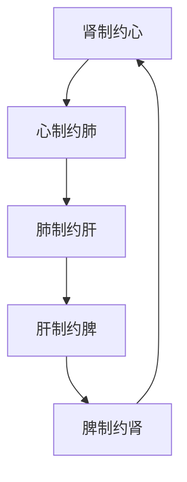

# 素问-五脏生成篇第十

> "心之合脉也，其荣色也，其主肾也。" - 岐伯

---

## 📜 原文（节选）/ Original Text (Excerpt)

心之合脉也，其荣色也，其主肾也。肺之合皮也，其荣毛也，其主心也。肝之合筋也，其荣爪也，其主肺也。脾之合肉也，其荣唇也，其主肝也。肾之合骨也，其荣发也，其主脾也。

是故多食咸，则脉凝泣而变色；多食苦，则皮槁而毛拔；多食辛，则筋急而爪枯；多食酸，则肉胝䐝而唇揭；多食甘，则骨痛而发落。此五味之所伤也。

故心欲苦，肺欲辛，肝欲酸，脾欲甘，肾欲咸。此五味之所合也。

五脏之气，故色见青如草兹者死，黄如枳实者死，黑如炱者死，赤如衃血者死，白如枯骨者死，此五色之见死也。

青如翠羽者生，赤如鸡冠者生，黄如蟹腹者生，白如豕膏者生，黑如乌羽者生，此五色之见生也。

生于心，如以缟裹朱；生于肺，如以缟裹红；生于肝，如以缟裹绀；生于脾，如以缟裹栝楼实；生于肾，如以缟裹紫。此五脏所生之外荣也。

色味当五脏：白当肺、辛；赤当心、苦；青当肝、酸；黄当脾、甘；黑当肾、咸。故白当皮，赤当脉，青当筋，黄当肉，黑当骨。

诸脉者，皆属于目；诸髓者，皆属于脑，诸筋者，皆属于节；诸血者，皆属于心；诸气者，皆属于肺。此四支八溪之朝夕也。故人卧血归于肝，肝受血而能视，足受血而能步，掌受血而能握，指受血而能摄。卧出而风吹之，血凝于肤者为痹，凝于脉者为泣，凝于足者为厥，此三者，血行而不得反其空，故为痹厥也。人有大谷十二分，小溪三百五十四名，少十二俞，此皆卫气之所留止，邪气之所客也，针石缘而去之。

诊病之始，五决为纪，欲知其始，先建其母。所谓五决者，五脉也。

是以头痛巅,疾，下虚上实，过在足少阴、巨阳，甚则入肾。徇蒙招尤，目冥耳聋，下实上虚，过在足少阳、厥阴，甚则入肝，腹满月真 胀，支鬲月去 胁，下厥上冒，过在足太阴、阳明。咳嗽上气，厥在胸中，过在手阳明、太阴。心烦头痛，病在鬲中，过在手巨阳、少阴。

夫脉之小、大、滑、涩、浮、沉，可以指别；五藏之象，可以类推；五藏相音可以意识；五色微诊，可以目察。能合脉色，可以万全。

赤脉之至也，喘而坚，诊曰有积气在中，时害于食，名曰心痹，得之外疾，思虑而心虚，故邪从之。白脉之至也喘而浮，上虚下实，惊，有积气在胸中，喘而虚，名曰肺痹，寒热，得之醉而使内也。青脉之至也长而左右弹，有积气在心下支月去，名曰肝痹，得之寒湿，与疝同法，腰痛，足清，头痛。黄脉之至也，大而虚，有积气在腹中，有厥气，名曰厥疝，女子同法，得之疾使四支汗出当风。黑脉之至也上坚而大，有积气在小腹与阴，名曰肾痹，得之沐浴清水而卧。

凡相五色之奇脉，面黄目青，面黄目赤，面黄目白，面黄目黑者，皆不死也。面青目赤，面赤目白，面青目黑，面黑目白，面赤目青，皆死也。

---

## 📖 白话文翻译（节选）/ Modern Chinese Translation (Excerpt)

心的配合对象是脉，其荣华表现于面色，其制约者是肾。肺的配合对象是皮，其荣华表现于毫毛，其制约者是心。肝的配合对象是筋，其荣华表现于爪甲，其制约者是肺。脾的配合对象是肉，其荣华表现于嘴唇，其制约者是肝。肾的配合对象是骨，其荣华表现于头发，其制约者是脾。

所以过多食用咸味，会使血脉凝涩不畅而面容色泽发生变化；过多食用苦味，会使皮肤枯槁而毫毛脱落；过多食用辛味，会使筋脉拘急而爪甲干枯；过多食用酸味，会使皮肉变厚变粗而嘴唇掀起；过多食用甘味，会使骨骼疼痛而头发脱落。这些都是五味偏嗜对五脏造成的伤害。

因此，心喜苦味，肺喜辛味，肝喜酸味，脾喜甘味，肾喜咸味。这是五味与五脏相宜的关系。

五脏的脉象与色泽变化：面色青如死草的为死候，黄如枳实的为死候，黑如烟煤的为死候，赤如败血的为死候，白如枯骨的为死候，这些都是五脏精气败竭的五色死象。

面色青如翠鸟羽毛的为生候，赤如鸡冠的为生候，黄如蟹腹的为生候，白如猪脂的为生候，黑如乌鸦羽毛的生候，这些都是五脏精气未衰的五色生象。

心的荣华，如同白绢裹着朱砂；肺的荣华，如同白绢裹着红帛；肝的荣华，如同白绢裹着青绀；脾的荣华，如同白绢裹着栝楼果实；肾的荣华，如同白绢裹着紫色。这是五脏精气表现在外的荣华色泽。

色泽与五味应当相应于五脏：白色对应肺、辛味；赤色对应心、苦味；青色对应肝、酸味；黄色对应脾、甘味；黑色对应肾、咸味。所以白色对应皮毛，赤色对应血脉，青色对应筋脉，黄色对应肌肉，黑色对应骨骼。

各条脉络，都属于目，而诸髓都属于脑，诸筋都属于骨节，诸血都属于心，诸气都属于肺。同时，气血的运行则朝夕来往，不离于四肢八溪的部位。所以当人睡眠时，血归藏于肝，肝得血而濡养于目，则能视物；足得血之濡养，就能行走；手掌得血之濡，就能握物；手指得血之濡养就能拿取。如果刚刚睡醒就外出受风，血液的循环就要凝滞，凝于肌肤的，发生痹证；凝于经脉的，发生气血运行的滞涩；凝于足部的，该部发生厥冷。这三种情况，都是由于气血运行的不能返回组织间隙的孔穴之处，所以造成痹厥等症。全身有大谷十二处，小溪三百五十四处，这里面减除了十二脏腑各自的逾穴数目。这些都是卫气留止的地方，也是邪气客居之所。治病时，可循着这些部位施以针石，以祛除邪气。

诊病的根本，要以五决为纲纪。想要了解疾病的要关键，必先确定病变的原因。所谓五决，就是五脏之脉，以此诊病，即可决断病本的所在。

比如头痛等巅顶部位的疾患，属于下虚上实的，病变在足少阴和足太阳经，病甚的，可内传于肾。头晕眼花，身体摇动，目暗耳聋，属下实上虚的，病变在足少阳和足厥阴经，病甚的，可内传于肝。腹满瞋胀，支持胸膈协助，属于下部逆气上犯的，病变在足太阴和足阳明经。咳嗽气喘，气机逆乱于胸中，病变在手阳明和手太阳经。心烦头痛，胸膈不适的，病变在手太阳和手少阴经。

脉象的小、大、滑、浮、沉等，可以通过医生的手指加以鉴别；五脏功能表现于外，可以通过相类事物的比象，加以推测；五脏各自的声音，可以凭意会而识别，五色的微小变化，可以用眼睛来观察。诊病时，如能将色、脉两者合在一起进行分析，就可以万无一失了。

外现赤色，脉来急疾而坚实的，可诊为邪气积聚于中脘，常表现为妨害饮食，病名叫做心痹。这种病得之于外邪的侵袭，是由于思虑过度以至心气虚弱，邪气才随之而入的。外现白色，脉来急疾而浮，这是上虚下实，故常出现惊骇，病邪积聚于胸中，迫肺而作喘，但肺气本身是虚弱的，这种病的病名叫做肺痹，它有时发寒热，常因醉后行房而诱发。青色外现，脉来长而左右搏击手指，这是病邪积聚于心下，支撑协助，这种病的病名叫做肝痹，多因受寒湿而得，与疝的病理相同，它的症状有腰痛、足冷、头痛等。外现黄色，而脉来虚大的，这是病邪积聚在腹中，有逆气产生，病名叫做厥疝，女子也有这种情况，多由四肢剧烈的活动，汗出当风所诱发。外现黑色，脉象尺上坚实而大，这是病邪积聚在小腹与前阴，病名叫做肾痹，多因冷水沐浴后睡卧受凉所引起。

观察五色与脉象的关系，面黄目青，面黄目赤，面黄目白，面黄目黑的，都不是死候。面青目赤，面赤目白，面青目黑，面黑目白，面赤目青的，都是死候。

---

## 🔑 核心要点 / Core Concepts

### 1. 五脏与体表组织的对应 / Five Zang Organs and Corresponding Body Tissues

| 脏腑 | 配合 | 荣华 | 制约 | 欲味 | 对应色 | 对应体 |
|------|------|------|------|------|--------|--------|
| 心 | 脉 | 色 | 肾 | 苦 | 赤 | 脉 |
| 肺 | 皮 | 毛 | 心 | 辛 | 白 | 皮毛 |
| 肝 | 筋 | 爪 | 肺 | 酸 | 青 | 筋 |
| 脾 | 肉 | 唇 | 肝 | 甘 | 黄 | 肉 |
| 肾 | 骨 | 发 | 脾 | 咸 | 黑 | 骨 |

### 2. 五味偏嗜的伤害 / Harm of Excessive Flavors

| 过食 | 伤害 | 表现 |
|------|------|------|
| 咸 | 脉凝泣 | 面色改变 |
| 苦 | 皮槁毛拔 | 皮肤枯槁、毛发脱落 |
| 辛 | 筋急爪枯 | 筋脉拘急、爪甲干枯 |
| 酸 | 肉胝䐝唇揭 | 皮肉变厚、嘴唇掀起 |
| 甘 | 骨痛发落 | 骨骼疼痛、头发脱落 |

---

## 📚 理论解释 / Theoretical Analysis

### 五脏相克关系 / Zang Organ Restraint Relationship

> [!info] 核心理论
> 五脏之间存在相克关系，一脏可制约另一脏。

#### 五脏相克图 / Five Zang Organ Restraint Diagram

**相克机制 / Restraint Mechanism:**
- 肾（水）制约心（火）：水克火
- 心（火）制约肺（金）：火克金
- 肺（金）制约肝（木）：金克木
- 肝（木）制约脾（土）：木克土
- 脾（土）制约肾（水）：土克水

### 望诊五色 / Five Color Diagnosis

> [!warning] 死色与生色
> 望色诊断是中医重要诊断方法，色有生死之分。

#### 五色生死对照表 / Five Color Life-Death Comparison Table

| 色系 | 死色 | 生色 | 荣华 |
|------|------|------|------|
| 青 | 如草兹 | 如翠羽 | 如缟裹绀 |
| 赤 | 如衃血 | 如鸡冠 | 如缟裹朱 |
| 黄 | 如枳实 | 如蟹腹 | 如缟裹栝楼实 |
| 白 | 如枯骨 | 如豕膏 | 如缟裹红 |
| 黑 | 如炱 | 如乌羽 | 如缟裹紫 |

---

## 🏥 中医实践应用 / TCM Practice Application

### 五味养生 / Five Flavors Health Preservation

| 脏 | 适宜味 | 养生原则 | 推荐食物 | 禁忌 |
|------|--------|----------|----------|------|
| 心 | 苦 | 清心火 | 莲子、苦瓜、绿茶 | 过咸 |
| 肺 | 辛 | 宣肺气 | 生姜、萝卜、葱白 | 过苦 |
| 肝 | 酸 | 养肝血 | 山楂、乌梅、酸枣仁 | 过甘 |
| 脾 | 甘 | 健脾胃 | 红枣、山药、南瓜 | 过酸 |
| 肾 | 咸 | 补肾精 | 海带、紫菜、黑豆 | 过甘 |

### 望色诊断要点 / Color Diagnosis Key Points

#### 生死色判断 / Life-Death Color Judgment

**生色特点 / Life Color Features:**
- 光泽明亮
- 含蓄不露
- 如帛裹色
- 均匀调和

**死色特点 / Death Color Features:**
- 晦暗无光
- 枯槁无华
- 暴露无遗
- 色泽异常

#### 面部色诊 / Facial Color Diagnosis

**不死之色 / Non-Fatal Colors:**
- 面黄目青、赤、白、黑：脾胃尚旺，有生机

**死色 / Fatal Colors:**
- 面青目赤：木火刑金
- 面赤目白：火克金，肺绝
- 面青目黑：肝肾同病
- 面黑目白：肾肺同病
- 面赤目青：心肝同病，火木相刑

---

## 🔗 相关链接 / Related Links

- [[MOC-黄帝内经知识库]] - 主索引
- [[黄帝内经-素问索引]] - 素问索引
- [[黄帝内经-核心理论]] - 核心理论体系
- [[素问04-金匮真言论篇]] - 五藏应四时
- [[素问09-六节藏象论篇]] - 五脏功能

### 易学关联 / Yi Jing Connection

- [[MOC-易经知识库]] - 易经索引
- [[20260201-0002 五行]] - 五行理论

**易学与五脏理论的联系:**
- 五行相克：易学的五行相克理论应用于五脏
- 五色对应：易学的五色理论与中医望诊相通

---

## 💡 学习要点 / Learning Points

### 掌握重点 / Key Points to Master

- [ ] 理解五脏与体表组织的对应关系
- [ ] 掌握五味偏嗜的伤害机理
- [ ] 学会望色诊断的基本方法
- [ ] 理解五脏相克的关系

### 思考问题 / Questions for Reflection

1. **为什么五味偏嗜会伤害脏腑？**
   - 五味与五脏相应，过则伤其主脏
   - 五味相克，过则克制他脏
   - 中庸之道，调和为贵

2. **如何理解"如以缟裹朱"的荣华表现？**
   - 含蓄不露，真色内蕴
   - 精气充盈，外荣有度
   - 诊断要点，生死关键

---

## 📊 学习进度 / Learning Progress

### 完成情况 / Completion Status

| 学习内容 | 状态 | 备注 |
|---------|------|------|
| 原文诵读 | 📝 进行中 | 建议每日诵读 |
| 白话文理解 | ✅ 已完成 | 理解主要含义 |
| 五味对应 | ✅ 已完成 | 掌握五味养生 |
| 望色诊断 | 📝 进行中 | 需要临床实践 |
| 理论分析 | ✅ 已完成 | 理解相克关系 |

---

## 🔄 更新日志 / Update Log

### 2026-02-03

- ✅ 创建五脏生成篇第十笔记
- ✅ 完成原文、白话文翻译（节选）
- ✅ 整理五脏对应关系表
- ✅ 编写望色诊断要点

---

**笔记创建日期**：2026年2月3日

**最后更新**：2026年2月3日
