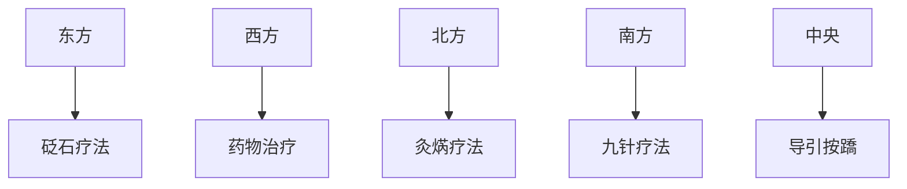

# 素问-异法方宜论篇第十二

> "地势使然也。" - 岐伯

---

## 📜 原文（节选）/ Original Text (Excerpt)

黄帝问曰：医之治病也，一病而治各不同，皆愈何也？

岐伯对曰：地势使然也。故东方之域，天地之所始生也，鱼盐之地，海滨傍水，其民食鱼而嗜咸，皆安其处，美其食。鱼者使人热中，盐者胜血，故其民皆黑色疏理，其病皆为痈疡，其治宜砭石。故砭石者，亦从东方来。

西方者，金玉之域，沙石之处，天地之所收引也，其民陵居而多风，水土刚强，其民不衣而褐荐，其民华食而脂肥，故邪不能伤其形体，其病生于内，其治宜毒药。故毒药者，亦从西方来。

北方者，天地所闭藏之域也，其地高陵居，风寒冰冽，其民乐野处而乳食，脏寒生满病，其治宜灸焫。故灸焫者，亦从北方来。

南方者，天地之所长养，阳之所盛处也，其地下，水土弱，雾露之所聚也，其民嗜酸而食胕，故其民皆致理而赤色，其病挛痹，其治宜微针。故九针者，亦从南方来。

中央者，其地平以湿，天地所以生万物也众，其民食杂而不劳，故其病多痿厥寒热，其治宜导引按蹻。故导引按蹻者，亦从中央出也。

故圣人杂合以治，各得其所宜，故治所以异而病皆愈者，得病之情，知治之大体也。

---

## 📖 白话文翻译（节选）/ Modern Chinese Translation (Excerpt)

黄帝问道：医生治疗疾病，同一种病用不同的治疗方法都能治愈，这是什么道理呢？

岐伯回答说：这是地域环境造成的。东方地区，是天地万物开始生发的地方，盛产鱼盐，临海靠水，当地居民吃鱼类而且喜欢吃咸味，都安居在这个地方，认为当地的饮食很美味。鱼类使人内热，咸味损伤血脉，所以当地居民肤色发黑、腠理疏松，他们多患痈肿疮疡之类的疾病，治疗适宜用砭石。所以砭石疗法，也是从东方传来的。

西方地区，是出产金玉的地方，多沙石，是天地收引的地方，当地居民依山陵而居，多风沙，水土性质刚强，居民不穿丝绸而穿毛布草席，饮食丰盛而脂肪多，所以外邪不能伤害他们的形体，疾病多从内生，治疗适宜用药物。所以药物治疗，也是从西方传来的。

北方地区，是天地闭藏的地方，地势高耸，居民依山陵而居，寒冷冰冻，居民喜欢野外居住而吃乳制品，内脏受寒易生胀满病，治疗适宜用灸法。所以灸法，也是从北方传来的。

南方地区，是天地万物长养的地方，阳气最盛的地方，地势低洼，水土柔弱，多雾露，居民喜欢吃酸味和发酵食品，所以居民皮肤致密而发红，多患筋脉拘急、麻痹之类的疾病，治疗适宜用微针。所以九针疗法，也是从南方传来的。

中央地区，地势平坦湿润，天地所生的万物很多，居民食物杂多而不劳累，所以多患痿证、厥证、寒热病，治疗适宜用导引按蹻。所以导引按蹻的方法，也是从中央发展出来的。

所以圣人综合运用各种治疗方法，各取其适宜之处，所以治疗方法不同而疾病都能治愈，是因为掌握了疾病的本质，懂得了治疗的大体原则。

---

## 🔑 核心要点 / Core Concepts

### 1. 五方地域与疾病治疗 / Five Directions and Disease Treatment

| 方位 | 地理特点 | 饮食习惯 | 体质特点 | 易患疾病 | 治疗方法 |
|------|----------|----------|----------|----------|----------|
| 东方 | 鱼盐海滨 | 食鱼嗜咸 | 黑色疏理 | 痈疡 | 砭石 |
| 西方 | 金玉沙石 | 华食脂肥 | 形体坚实 | 内病 | 毒药 |
| 北方 | 高陵寒冷 | 野处乳食 | 脏寒 | 满病 | 灸焫 |
| 南方 | 低洼潮湿 | 嗜酸食胕 | 致理赤色 | 挛痹 | 微针 |
| 中央 | 平湿 | 食杂不劳 | 多痿厥寒热 | 痿厥寒热 | 导引按蹻 |

### 2. 五方治疗方法的起源 / Origin of Five Direction Treatment Methods

---

## 📚 理论解释 / Theoretical Analysis

### 因地制宜理论 /因地制宜 Theory

> [!info] 核心理念
> 治疗疾病要根据地域环境、生活习惯等因素，选择适宜的治疗方法。

#### 五方治疗理论详解 / Five Direction Treatment Theory Details

**东方 / East:**
- 地理：天地之所始生，海滨傍水
- 饮食：食鱼嗜咸
- 体质：黑色疏理（热中、胜血）
- 疾病：痈疡（热毒壅滞）
- 治疗：砭石（排脓泻热）

**西方 / West:**
- 地理：金玉沙石，天地之所收引
- 饮食：华食脂肥
- 体质：形体坚实
- 疾病：内病（饮食不节）
- 治疗：毒药（攻内祛邪）

**北方 / North:**
- 地理：天地所闭藏，高陵寒冷
- 饮食：乳食
- 体质：脏寒
- 疾病：满病（寒凝气滞）
- 治疗：灸焫（温阳散寒）

**南方 / South:**
- 地理：天地之所长养，阳盛
- 饮食：嗜酸食胕
- 体质：致理赤色
- 疾病：挛痹（湿热阻络）
- 治疗：微针（疏通经络）

**中央 / Central:**
- 地理：地平以湿，生万物
- 饮食：食杂不劳
- 体质：多痿厥寒热
- 疾病：痿厥寒热（气血不畅）
- 治疗：导引按蹻（调理气血）

### 治疗方法特点 / Treatment Method Characteristics

#### 砭石 / Bian Stone
- 适应症：痈疡、热毒
- 作用：排脓泻热
- 起源：东方

#### 毒药 / Poisonous Drugs
- 适应症：内病、饮食不节
- 作用：攻内祛邪
- 起源：西方

#### 灸焫 / Moxibustion
- 适应症：满病、寒证
- 作用：温阳散寒
- 起源：北方

#### 微针 / Fine Needle
- 适应症：挛痹、经络阻
- 作用：疏通经络
- 起源：南方

#### 导引按蹻 / Guided Breathing and Massage
- 适应症：痿厥寒热、气血不畅
- 作用：调理气血
- 起源：中央

---

## 🏥 中医实践应用 / TCM Practice Application

### 因地制宜的现代应用 / Modern Application of 因地制宜

#### 地域养生 / Regional Health Preservation

| 地域 | 养生原则 | 饮食建议 | 运动建议 |
|------|----------|----------|----------|
| 东方 | 清热解毒 | 清淡少盐 | 游泳、散步 |
| 西方 | 健脾消食 | 控制脂肪 | 登山、跑步 |
| 北方 | 温阳散寒 | 温热食物 | 室内运动 |
| 南方 | 清热化湿 | 清淡少酸 | 太极、气功 |
| 中央 | 调和气血 | 饮食均衡 | 导引、按蹻 |

### 现代医学的启示 / Modern Medical Insights

**1. 地域医学 / Regional Medicine**
- 不同地区疾病谱不同
- 治疗方法应因地制宜
- 预防措施需考虑地域因素

**2. 个体化治疗 / Individualized Treatment**
- 根据患者生活环境选择治疗方案
- 考虑饮食习惯对疾病的影响
- 综合运用多种治疗方法

**3. 综合疗法 / Comprehensive Therapy**
- 杂合以治，各得其所宜
- 不同疗法配合使用
- 提高治疗效果

---

## 🔗 相关链接 / Related Links

- [[MOC-黄帝内经知识库]] - 主索引
- [[黄帝内经-素问索引]] - 素问索引
- [[黄帝内经-核心理论]] - 核心理论体系
- [[素问12-异法方宜论篇]] - 异法方宜

### 易学关联 / Yi Jing Connection

- [[MOC-易经知识库]] - 易经索引
- [[20260201-0003 八卦]] - 八卦方位

**易学与异法方宜的联系:**
- 五方理论：易学的五方方位与中医因地制宜相通
- 天人合一：地域环境与人体健康的关系

---

## 💡 学习要点 / Learning Points

### 掌握重点 / Key Points to Master

- [ ] 理解因地制宜的治疗原则
- [ ] 掌握五方的地理特点和疾病特点
- [ ] 了解各种治疗方法的适应症
- [ ] 学会综合运用多种治疗方法

### 思考问题 / Questions for Reflection

1. **为什么说"地势使然也"？**
   - 地域环境决定生活习惯
   - 生活习惯影响体质
   - 体质决定易患疾病
   - 疾病决定适宜治疗方法

2. **现代医学如何体现"异法方宜"？**
   - 地域医学研究
   - 个体化精准医疗
   - 综合疗法应用

---

## 📊 学习进度 / Learning Progress

### 完成情况 / Completion Status

| 学习内容 | 状态 | 备注 |
|---------|------|------|
| 原文诵读 | 📝 进行中 | 建议每日诵读 |
| 白话文理解 | ✅ 已完成 | 理解主要含义 |
| 五方对照 | ✅ 已完成 | 掌握五方特点 |
| 因地制宜 | 📝 进行中 | 需要临床实践 |
| 理论分析 | ✅ 已完成 | 理解治疗原则 |

---

## 🔄 更新日志 / Update Log

### 2026-02-03

- ✅ 创建异法方宜论篇第十二笔记
- ✅ 完成原文、白话文翻译（节选）
- ✅ 整理五方地域与疾病治疗对照表
- ✅ 编写因地制宜理论分析

---

**笔记创建日期**：2026年2月3日

**最后更新**：2026年2月3日
