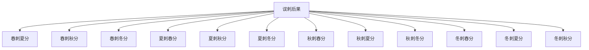

# 素问-诊要经终论篇第十六

> "黄帝曰：诊要何如？岐伯曰：正月二月，天气始方，地气始发，人气在肝。" - 岐伯

---

## 📜 原文（节选）/ Original Text (Excerpt)

黄帝问曰：诊要何如？

岐伯曰：正月二月，天气始方，地气始发，人气在肝。三月四月，天气正方，地气定发，人气在脾。五月六月，天气盛，地气高，人气在头。七月八月，阴气始杀，阳气始消，人气在肺。九月十月，阴气始冰，阳气始伏，人气在心。十一月十二月，冰复，地气合，人气在肾。

故春刺散俞，及于分理，血出而止，甚者传气，间者环也。夏刺络俞，见血而止，尽气闭环，痛病必下。秋刺皮肤，循理，上下同法，神变而止。冬刺俞窍于分理，甚者直下，间者散下，春刺夏分，脉乱气微，入淫骨髓，病不能愈，令人不嗜食，又且少气。

春刺秋分，筋挛，逆气环为咳嗽，病不愈，令人时惊，又且哭。春刺冬分，邪气著藏，令人胀，病不愈，又且欲言语。

夏刺春分，病不愈，令人气倦。夏刺秋分，病不愈，令人心中欲无言，惕惕如人将捕之。夏刺冬分，病不愈，令人少气，时欲怒。

秋刺春分，病不愈，令人惕然欲有所为，起而忘之。秋刺夏分，病不愈，令人益嗜卧，又且善梦。秋刺冬分，病不愈，令人洒洒时寒。

冬刺春分，病不愈，令人欲卧不能眠，眠而有见。冬刺夏分，病不愈，气上，发为诸痹。冬刺秋分，病不愈，令人善渴。

---

## 📖 白话文翻译（节选）/ Modern Chinese Translation (Excerpt)

黄帝问道：诊察疾病的要点是什么？

岐伯说：正月二月，天气开始萌发，地气开始发泄，人气在肝。三月四月，天气正式萌发，地气稳定发泄，人气在脾。五月六月，天气盛壮，地气高扬，人气在头。七月八月，阴气开始肃杀，阳气开始消退，人气在肺。九月十月，阴气开始结冰，阳气开始伏藏，人气在心。十一月十二月，冰层复结，地气闭合，人气在肾。

所以春季针刺分肉之间的腧穴，到达分理，出血就停止，严重的传导气机，轻微的循环。夏季针刺络脉腧穴，见血就停止，气尽就闭合环状，疼痛的疾病一定会下行。秋季针刺皮肤，沿着纹理，上下同样的方法，精神变化就停止。冬季针刺分肉之间的孔窍，严重的直下，轻微的散下，春季针刺夏季的部位，脉象紊乱气机衰微，侵入淫乱骨髓，疾病不能治愈，使人不思饮食，而且少气。

春季针刺秋季的部位，筋脉拘挛，逆气循环成为咳嗽，疾病不能治愈，使人时常惊悸，而且哭泣。春季针刺冬季的部位，邪气附着于脏，使人胀满，疾病不能治愈，而且想要说话。

夏季针刺春季的部位，疾病不能治愈，使人气机倦怠。夏季针刺秋季的部位，疾病不能治愈，使人心中不想说话，恐惧得好象有人要抓捕他。夏季针刺冬季的部位，疾病不能治愈，使人少气，时常想要发怒。

秋季针刺春季的部位，疾病不能治愈，使人惊恐想要有所作为，站起来就忘记了。秋季针刺夏季的部位，疾病不能治愈，使人更加嗜卧，而且多梦。秋季针刺冬季的部位，疾病不能治愈，使人恶寒时常发冷。

冬季针刺春季的部位，疾病不能治愈，使人想要躺下不能睡眠，睡眠时有所见。冬季针刺夏季的部位，疾病不能治愈，气机上冲，发生各种痹证。冬季针刺秋季的部位，疾病不能治愈，使人容易口渴。

---

## 🔑 核心要点 / Core Concepts

### 1. 四时人气所在 / Human Qi Location in Four Seasons

| 月份 | 季节 | 天气 | 地气 | 人气所在 |
|------|------|------|------|----------|
| 正月二月 | 春 | 始方 | 始发 | 肝 |
| 三月四月 | 春夏之交 | 正方 | 定发 | 脾 |
| 五月六月 | 夏 | 盛 | 高 | 头 |
| 七月八月 | 秋 | 始杀 | 始消 | 肺 |
| 九月十月 | 秋冬之交 | 始冰 | 始伏 | 心 |
| 十一十二月 | 冬 | 冰复 | 合 | 肾 |

### 2. 四时刺法 / Acupuncture Methods in Four Seasons

| 季节 | 刺法 | 部位 | 操作要点 | 止血标准 |
|------|------|------|----------|----------|
| 春 | 刺散俞 | 分理 | 甚者传气，间者环也 | 血出而止 |
| 夏 | 刺络俞 | 络脉 | 见血而止 | 尽气闭环 |
| 秋 | 刺皮肤 | 循理 | 上下同法 | 神变而止 |
| 冬 | 刺俞窍 | 分理 | 甚者直下，间者散下 | 气尽而止 |

### 3. 四时误刺后果 / Consequences of Mistimed Acupuncture

---

## 📚 理论解释 / Theoretical Analysis

### 四时人气理论 / Human Qi Theory in Four Seasons

> [!info] 核心概念
- 人气随四时变化而迁移
- 针刺必须顺应四时人气所在
- 误刺会导致严重后果

#### 四时人气变化规律 / Law of Human Qi Changes in Four Seasons

**1. 春季 / Spring (正月二月)**
- 天气始方：天气开始萌发
- 地气始发：地气开始发泄
- 人气在肝：肝气旺盛

**2. 春夏之交 / Spring-Summer Transition (三月四月)**
- 天气正方：天气正式萌发
- 地气定发：地气稳定发泄
- 人气在脾：脾气旺盛

**3. 夏季 / Summer (五月六月)**
- 天气盛：天气盛壮
- 地气高：地气高扬
- 人气在头：阳气上冲

**4. 秋季 / Autumn (七月八月)**
- 阴气始杀：阴气开始肃杀
- 阳气始消：阳气开始消退
- 人气在肺：肺气旺盛

**5. 秋冬之交 / Autumn-Winter Transition (九月十月)**
- 阴气始冰：阴气开始结冰
- 阳气始伏：阳气开始伏藏
- 人气在心：心气旺盛

**6. 冬季 / Winter (十一十二月)**
- 冰复：冰层复结
- 地气合：地气闭合
- 人气在肾：肾气旺盛

### 四时刺法理论 / Acupuncture Methods Theory in Four Seasons

> [!warning] 核心理念
- 四时各有所宜的刺法
- 针刺部位、方法、止血标准各不相同
- 必须严格遵循四时刺法

#### 四时刺法详解 / Detailed Acupuncture Methods in Four Seasons

**1. 春季刺法 / Spring Acupuncture**
- 刺法：刺散俞
- 部位：分理（分肉之间）
- 操作：血出而止
- 深浅：甚者传气，间者环也

**2. 夏季刺法 / Summer Acupuncture**
- 刺法：刺络俞
- 部位：络脉
- 操作：见血而止
- 深浅：尽气闭环

**3. 秋季刺法 / Autumn Acupuncture**
- 刺法：刺皮肤
- 部位：循理（沿着纹理）
- 操作：上下同法
- 深浅：神变而止

**4. 冬季刺法 / Winter Acupuncture**
- 刺法：刺俞窍
- 部位：分理（分肉之间）
- 操作：甚者直下，间者散下
- 深浅：气尽而止

---

## 🏥 中医实践应用 / TCM Practice Application

### 针刺治疗原则 / Acupuncture Treatment Principles

#### 四时针刺原则 / Acupuncture Principles in Four Seasons

| 季节 | 针刺原则 | 适应症 | 禁忌 |
|------|----------|----------|------|
| 春 | 浅刺，血出而止 | 肝病、风病 | 深刺、多出血 |
| 夏 | 刺络，见血而止 | 心病、热病 | 误刺秋冬季部位 |
| 秋 | 刺皮肤，神变而止 | 肺病、燥病 | 深刺、久留针 |
| 冬 | 深刺，气尽而止 | 肾病、寒病 | 浅刺、误刺其他季节部位 |

### 现代医学启示 / Modern Medical Insights

**1. 时辰医学 / Chronomedicine**
- 生物节律：人体生理功能随时间变化
- 最佳治疗时间：根据生理节律选择治疗时间
- 个体化治疗：考虑个体差异

**2. 循证医学 / Evidence-Based Medicine**
- 治疗规范：遵循治疗指南
- 避免误治：避免不适当的治疗方法
- 评估疗效：客观评估治疗效果

---

## 🔗 相关链接 / Related Links

- [[MOC-黄帝内经知识库]] - 主索引
- [[黄帝内经-素问索引]] - 素问索引
- [[黄帝内经-核心理论]] - 核心理论体系
- [[素问15-玉版论要篇]] - 色脉相参
- [[素问17-脉要精微论篇]] - 脉象精微

### 易学关联 / Yi Jing Connection

- [[MOC-易经知识库]] - 易经索引
- [[20260201-0003 八卦]] - 八卦方位

**易学与诊要经终的联系:**
- 四时理论：易学的四时理论与中医四时刺法相通
- 顺应自然：易学的顺应自然思想与中医天人合一相通

---

## 💡 学习要点 / Learning Points

### 掌握重点 / Key Points to Master

- [ ] 理解四时人气所在的规律
- [ ] 掌握四时刺法的操作要点
- [ ] 了解误刺的严重后果
- [ ] 学会运用四时刺法治疗疾病

### 思考问题 / Questions for Reflection

1. **为什么必须顺应四时人气所在进行针刺？**
   - 人气随四时变化
   - 顺应人气，疗效显著
   - 违背人气，误刺伤人

2. **现代医学如何体现"四时治疗"？**
   - 时辰医学研究
   - 生物节律应用
   - 最佳治疗时间选择

---

## 📊 学习进度 / Learning Progress

### 完成情况 / Completion Status

| 学习内容 | 状态 | 备注 |
|---------|------|------|
| 原文诵读 | 📝 进行中 | 建议每日诵读 |
| 白话文理解 | ✅ 已完成 | 理解主要含义 |
| 四时人气 | ✅ 已完成 | 掌握规律 |
| 四时刺法 | 📝 进行中 | 需要临床实践 |
| 理论分析 | ✅ 已完成 | 理解刺法原理 |

---

## 🔄 更新日志 / Update Log

### 2026-02-03

- ✅ 创建诊要经终论篇第十六笔记
- ✅ 完成原文、白话文翻译（节选）
- ✅ 整理四时人气所在和四时刺法对照表
- ✅ 编写四时刺法理论

---

**笔记创建日期**：2026年2月3日

**最后更新**：2026年2月3日
