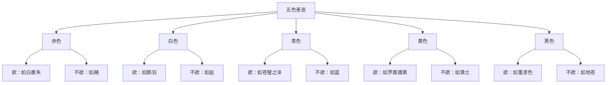

# 素问-脉要精微论篇第十七

> "黄帝曰：诊法何如？岐伯曰：诊法常以平旦，阴气未动，阳气未散，饮食未进，经脉未盛，络脉调匀，气血未乱，故乃可诊有过之脉。" - 岐伯

---

## 📜 原文（节选）/ Original Text (Excerpt)

黄帝问曰：诊法何如？

岐伯曰：诊法常以平旦，阴气未动，阳气未散，饮食未进，经脉未盛，络脉调匀，气血未乱，故乃可诊有过之脉。

切脉动静而视精明，察五色，观五脏有余不足，六腑强弱，形之盛衰，以此参伍，决死生之分。

夫脉者，血之府也。长则气治，短则气病，数则烦心，大则病进，上盛则气高，下盛则气胀，代则气衰，细则气少，涩则心痛，浑浑革至如涌泉，病进而色弊，绵绵其去如弦绝，死。

夫精明五色者，气之华也。赤欲如白裹朱，不欲如赭；白欲如鹅羽，不欲如盐；青欲如苍璧之泽，不欲如蓝；黄欲如罗裹雄黄，不欲如黄土；黑欲如重漆色，不欲如地苍。五色精微象见矣，其寿不久也。

夫精明者，所以视万物，别白黑，审短长。以长为短，以白为黑，如是则精衰矣。

五脏者，中之守也。中盛脏满，气胜伤恐者，声如从室中言，是中气之湿也；言而微，终日乃复言者，此夺气也；衣被不敛，言语善恶不避亲疏者，此神明之乱也；仓廪不藏者，是门户不要也；水泉不止者，是膀胱不藏也。得守者生，失守者死。夫五脏者，身之强也。头者，精明之府，头倾视深，精神将夺矣；背者，胸中之府，背曲肩随，府将坏矣；腰者，肾之府，转摇不能，肾将惫矣；膝者，筋之府，屈伸不能，行则偻附，筋将惫矣；骨者，髓之府，不能久立，行则振掉，骨将惫矣。得强则生，失强则死。

岐伯曰：反四时者，有余为精，不足为消。应太过，不足为精；应不足，有余为消。阴阳不相应，病名曰关格。

帝曰：脉其四时动奈何？知病之所在奈何？知病之所变奈何？知病乍在内奈何？知病乍在外奈何？请问此五者，可得闻乎？

岐伯曰：请言其与天运转大也。万物之外，六合之内，天地之变，阴阳之应，彼春之暖，为夏之暑，彼秋之忿，为冬之怒。四变之动，脉与之上下，以春应中规，夏应中矩，秋应中衡，冬应中权。是故[冬至](https://www.guoxuemeng.com/ershisijieqi/dongzhi/)四十五日，阳气微上，阴气微下；[夏至](https://www.guoxuemeng.com/ershisijieqi/xiazhi/)四十五日，阴气微上，阳气微下。阴阳有时，与脉为期，期而相失，知脉所分，分之有期，故知死时。微妙在脉，不可不察，察之有纪，从阴阳始，始之有经，从[五行](https://www.guoxuemeng.com/guoxue/wuxing/)生，生之有度，四时为宜，补泻勿失，与天地如一，得一之情，以知死生。是故声合五音，色合五行，脉合阴阳。

是知阴盛则梦涉大水恐惧，阳盛则梦大火燔灼，阴阳俱盛则梦相杀毁伤；上盛则梦飞，下盛则梦堕；甚饱则梦予，甚饥则梦取；肝气盛则梦怒，肺气盛则梦哭；短虫多则梦聚众，长虫多则相击毁伤。

是故持脉有道，虚静为保。[春日](https://www.guoxuemeng.com/gushici/80309.html)浮，如鱼之游在波；夏日在肤，泛泛乎万物有余；秋日下肤，蛰虫将去；冬日在骨，蛰虫周密，君子居室。故曰：知内者按而纪之，知外者终而始之。此六者，持脉之大法。

心脉搏坚而长，当病舌卷不能言；其软而散者，当消环自己。肺脉搏坚而长，当病唾血；其软而散者，当病灌汗，至今不复散发也。肝脉搏坚而长，色不青，当病坠若搏，因血在胁下，令人喘逆；其软而散，色泽者，当病溢饮。溢饮者，渴暴多饮，而易入肌皮肠胃之外也。胃脉搏坚而长，其色赤，当病折髀；其软而散者，当病食痹。脾脉搏坚而长，其色黄，当病少气；其软而散，色不泽者，当病足胫肿，若水状也。肾脉搏坚而长，其色黄而赤者，当病折腰；其软而散者，当病少血，至今不复也。

帝曰：诊得心脉而急，此为何病？病形何如？

岐伯曰：病名心疝，少腹当有形也。

帝曰：何以言之？

岐伯曰：心为牡藏，小肠为之使，故曰少腹当有形也。

帝曰：诊得胃脉，病形何如？

岐伯曰：胃脉实则胀，虚则泄。

帝曰：病成而变何谓？

岐伯曰：风成为寒热；瘅成为消中；厥成为巅疾；久风为飧泄；脉风成为疠。病之变化，不可胜数。

帝曰：诸痈肿筋挛骨痛，此皆安生？

　　岐伯曰：此寒气之肿，八风之变也。

　　帝曰：治之奈何？

　　岐伯曰：此四时之病，以其胜治之愈也。

　　帝曰：有故病五藏发动，因伤脉色，各何以知其久暴至之病乎？

　　岐伯曰：悉乎哉问也！徵其脉小色不夺者，新病也；徵其脉不夺，其色夺者，此久病也；徵其脉与五色俱夺者，此久病也；徵其脉与五色俱不夺者，新病也。肝与肾脉并至，其色苍赤，当病毁伤，不见血，已见血，湿若中水也。

　　尺内两傍，则季胁也，尺外以候肾，尺里以候腹。中附上，左外以候肝，内以候鬲；右外以候胃，内以候脾。上附上，右外以候肺，内以候胸中；左外以候心，内以候膻中。前以候前，后以候后。上竟上者，胸喉中事也；下竟下者，少腹腰股膝胫足中事也。

　　粗大者，阴不足，阳有余，为热中也。来疾去徐，上实下虚，为厥巅疾；来徐去疾，上虚下实，为恶风也，故中恶风者，阳气受也。有脉俱沉细数者，少阴厥也。沉细数散者，寒热也。浮而散者，为眩仆。诸浮不躁者，皆在阳，则为热；其有躁者在手。诸细而沉者，皆在阴，则为骨痛；其有静者在足。数动一代者，病在阳之脉也，泄及便脓血。诸过者，切之涩者，阳气有余也；滑者，阴气有余也。阳气有余为身热无汗；阴气有余为多汗身寒；阴阳有余则无汗而寒。推而外之，内而不外，有心腹积也；推而内之，外而不内，身有热也；推而上之，上而不下，腰足清也；推而下之，下而不上，头项痛也。按之至骨，脉气少者，腰脊痛而身有痹也。

---

## 📖 白话文翻译（节选）/ Modern Chinese Translation (Excerpt)

黄帝问道：诊察脉象的方法是什么？

岐伯说：诊脉通常在清晨，这时阴气没有扰动，阳气没有散乱，没有进饮食，经脉没有充盛，络脉调和均匀，气血没有紊乱，所以可以诊察出有病的脉象。

切按脉象的动静，同时观察眼睛的精神，察看五色，观察五脏的有余不足、六腑的强弱、形体的盛衰，把这些综合起来，判断死生。

脉，是血的府库。脉长则气机调和，脉短则气机有病，脉数则心烦，脉大则病势进展，脉上盛则气机上冲，脉下盛则气机胀满，脉代则气机衰竭，脉细则气机不足，脉涩则心痛，脉象浑浑革至如涌泉，病势进展面色败坏，脉象绵绵其去如弦断绝，是死候。

精明和五色，是气的精华。红色应该像白绢裹着朱砂，不应该像赭石；白色应该像鹅毛，不应该像盐；青色应该像苍璧的光泽，不应该像蓝草；黄色应该像薄纱裹着雄黄，不应该像黄土；黑色应该像重漆的色泽，不应该像地色灰暗。五色的精微表现，如果都出现，寿命就不长了。

精明，是用来观察万物，区别黑白，审察长短。把长看成长短，把白看成黑，像这样就是精气衰败了。

五脏，是身体的守卫。中焦盛满脏器胀满，气胜伤恐，声音像从室中说话，这是中焦气湿；说话微弱，整天才说一句话，这是夺气；衣服被子不收敛，说话善恶不避亲疏，这是神明紊乱；仓廪不藏，这是门户不固；水泉不止，这是膀胱不藏。能守住五脏的生，不能守住五脏的死。

　　黄帝问道：诊脉的方法是怎样的呢？

　　岐伯回答说：诊脉通常是以清晨的时间为最好，此时人还没有劳于事，阴气未被扰动，阳气尚未耗散，饮食也未曾进过，经脉之气尚未充盛，络脉之气也很匀静，气血未受到扰乱，因而可以诊察出有病的脉象。在诊察脉搏动静变化的同时，还应观察目之精明，以候神气，诊察五色的变化，以审脏腑之强弱虚实及形体的盛衰，相互参合比较，以判断疾病的吉凶转归。

　　脉是血液汇聚的所在。长脉为气血流畅和平，故为气治；短脉为气不足，故为气病；数脉为热，热则心烦；大脉为邪气方张，病势正在向前发展；上部脉盛，为邪壅于上，可见呼吸急促，喘满之症；下部脉盛，是邪滞于下，可见胀满之病；代脉为元气衰弱；细脉，为正气衰少；涩脉为血少气滞，主心痛之症。脉来大而急速如泉水上涌者，为病势正在进展，且有危险；脉来隐约不现，微细无力，或如弓弦猝然断绝而去，为气血已绝，生机已断，故主死。

　　精明见于目，五色现于面，这都是内脏的精气所表现出来的光华。赤色应该象帛裹朱砂一样，红润而不显露，不应该象砂石那样，色赤带紫，没有光泽；白色应该象鹅的羽毛，白而光泽，不应该象盐那样白而带灰暗色；青色应该青而明润如璧玉，不应该象蓝色那样青而带沉暗色；黄色应该象丝包着雄黄一样，黄而明润，不应该象黄土那样，枯暗无华；黑色应该象重漆之色，光彩而润，不应该象地苍那样，枯暗如尘。假如五脏真色暴露于外，这是真气外脱的现象，人的寿命也就不长了。目之精明是观察万物，分别黑白，审察长短的，若长短不明，黑白不清，这是精气衰竭的现象。

　　五脏主藏精神在内，在体内各有其职守。如果邪盛于腹中，脏气壅满，气盛而喘，善伤于恐，讲话声音重浊不清，如在室中说话一样，这是中气失权而有湿邪所致。语音低微而气不接续，语言不能相继者，这是正气被劫夺所致。衣服不知敛盖，言语不知善恶，不辩亲疏远近的，这是神明错乱的现象。脾胃不能藏纳水谷精气而泄利不禁的，是中气失守，肛门不能约束的缘故。小便不禁的，是膀胱不能闭藏的缘故。若五脏功能正常，得其职守者则生；若五脏精气不能固藏，失其职守则死。五脏精气充足，为身体强健之本。头为精明之府，若见到头部低垂，目陷无光的，是精神将要衰败。背悬五脏，为胸中之府，若见到背弯曲而肩下垂的，是胸中脏气将要败坏。肾位居于腰，故腰为肾之府，若见到不能转侧摇动，是肾气将要衰惫。骨为髓之府，不能久立，行则震颤摇摆，这是髓虚，骨的功能将要衰惫。若脏气能够恢复强健，则虽病可以复生；若脏气不能复强，则病情不能挽回，人也就死了。

　　岐伯说：脉气与四时阴阳之气相反的，如相反的形象为有余，皆为邪气盛于正气，相反的形象为不足，为血气先己消损。根据时令变化，脏气当旺，脉气应有余，却反见不足的，这是邪气盛于正气；脉气应不足，却反见有余的，这是正不胜邪，邪气盛，而血气消损。这种阴阳不相顺从，气血不相营运，邪正不相适应而发生的疾病名叫关格。

　　黄帝问道：脉象是怎样应四时的变化而变动的呢？怎样从脉诊上知道病变的所在呢？怎样从脉诊上知道疾病的变化呢？怎样从脉诊上知道病忽然发生在内部呢？怎样从脉诊上知道病忽然发生在外部呢？请问这五个问题，可以讲给我听吗？

　　岐伯说：让我讲一讲人体的阴阳升降与天运之环转相适应的情况。万物之外，六合之内，天地间的变化，阴阳四时与之相应。如[春天](https://www.guoxuemeng.com/gushici/chuntiandegushi/)的气候温暖，发展为[夏天](https://www.guoxuemeng.com/gushici/xiatiandegushi/)的气候暑热，[秋天](https://www.guoxuemeng.com/gushici/qiutiandegushi/)得劲急之气，发展为[冬天](https://www.guoxuemeng.com/gushici/dongtiandegushi/)的寒杀之气，这种四时气候的变化，人体的脉象也随着变化而升降浮沉。春脉如规之象；夏脉如矩之象；秋脉如称衡之象，冬脉如称权之象。四时阴阳的情况也是这样，[冬至](https://www.guoxuemeng.com/ershisijieqi/dongzhi/)到[立春](https://www.guoxuemeng.com/ershisijieqi/lichun/)的四十五天，阳气微升，阴气微降；[夏至](https://www.guoxuemeng.com/ershisijieqi/xiazhi/)到[立秋](https://www.guoxuemeng.com/ershisijieqi/liqiu/)的四十五天，阴气微升，阳气微降。四时阴阳的升降是有一定的时间和规律的，人体脉象的变化，亦与之相应，脉象变化与四时阴阳不相适应，即使病态，根据脉象的异常变化就可以知道病属何脏，再根据脏气的盛衰和四时衰旺的时期，就可以判断出疾病和死亡的时间。四时阴阳变化之微妙，都是从辨别阴阳开始，结合人体十二经脉进行分析研究，而十二经脉应[五行](https://www.guoxuemeng.com/guoxue/wuxing/)而有生生之机；观测生生之机的尺度，则是以四时阴阳为准则；遵循四时阴阳的变化规律，不使有失，则人体就能保持相对平衡，并与天地之阴阳相互统一；知道了天人统一的道理，就可以预决死生。所以五声是和五音相应合的；五色是和五行相应合的；脉象是和阴阳相应合的。

　　阴气盛则梦见渡大水而恐惧；阳气盛则梦见打火烧灼；阴阳俱盛则梦见相互残杀毁伤；上部盛则梦飞腾；下部盛则梦下堕；吃的过饱的时候，就会梦见送食物给人；饥饿时就会梦见去取食物；肝气盛，则做梦好发怒气，肺气盛则做梦悲哀啼哭；腹内短虫多，则梦众人集聚；腹内长虫多则梦打架损伤。

　　所以诊脉是有一定方法和要求的，必须虚心静气，才能保证诊断的正确。春天的脉应该浮而在外，好象鱼浮游于水波之中；夏天的脉在肤，洪大而浮，泛泛然充满于指下，就象夏天万物生长的茂盛状态；秋天的劢处于皮肤之下，就象蛰虫将要伏藏；冬天的脉沉在骨，就象冬眠之虫闭藏不出，人们也都深居简出一样。因此说：要知道内脏的情况，可以从脉象上区别出来；要知道外部经气的情况，可以经脉循行的经络上诊察而知其终始。春、夏、秋、冬、内、外这六个方面，乃是诊脉的大法。

　　心脉坚而长，搏击指下，为心经邪盛，火盛气浮，当病舌卷而不能言语；其脉软而散的，当病消渴，待其胃气来复，病自痊愈。肺脉坚而长，搏击指下，为火邪犯肺，当病痰中带血；其脉软而散的，为肺脉不足，当病汗出不止，在这种情况下，不可在用发散的方法治疗。肝脉坚而长，搏击指下，其面色当青，今反不青，知其病非由内生，当为跌坠或搏击所伤，因淤血积于胁下，阻碍肺气升降，所以使人喘逆；如其脉软而散，加之面目颜色鲜泽的，当发溢饮病，溢饮病口渴暴饮，因水不化气，而水气容易流入肌肉皮肤之间、肠胃之外所引起。胃脉坚而长，搏击指下，面色赤，当病髀痛如折；如其脉软而散的，则胃气不足，当病食痹。脾脉坚而长，搏击指下，面部色黄，乃脾气不运，当病少气；如其脉软而散，面色不泽，为脾虚，不能运化水湿，当病足胫浮肿如水状。肾脉坚长，搏击指下，面部黄而带赤，是心脾之邪盛侵犯于肾，肾受邪伤，当病腰痛如折；如其脉软而散者，当病精血虚少，使身体不能恢复健康。

　　黄帝说：诊脉时，其心脉劲急，这是什麽病？病的症状是怎样的呢？

　　岐伯说：这种病名叫心疝，少腹部位一定有形征出现。

　　黄帝说：诊察到胃脉有病，会出现什麽病变呢？

　　岐伯说：胃脉实则邪气有余，将出现腹胀满病；胃脉虚则胃气不足，将出现泄泻病。

　　黄帝说：疾病的形成及其发展变化又是怎样的呢？

　　岐伯说：因于风邪，可变为寒热病；瘅热既久，可成为消中病；气逆上而不己，可成为癫蕳病；风气通于肝，风邪经久不愈，木邪侮土，可成为飧泻病；风邪客于脉，留而不去则成为疠风病；疾病的发展变化是不能够数清的。

　　黄帝说：各种痈肿、筋挛、骨痛的病变，是怎样产生的呢？

　　岐伯说：这都是因为寒气聚集和八风邪气侵犯人体后而发生的变化。

　　黄帝说：怎样进行治疗呢？

　　岐伯说：由于四时偏胜之邪气所引起的病变，根据五行相胜的规律确定治则去治疗就会痊愈。

　　黄帝说：有旧病从五脏发动，都会影响到脉色而发生变化，怎样区别它是久病还是新病呢？

　　岐伯说：你问的很详细啊！只要验看它脉色就可以区别开来：如脉虽小而气色不失于正常的，乃是久病；如脉象与气色均失于正常状态的，也是久病；如脉象与面色都不失于正常的，乃是新病。脉见沉弦，是肝脉与肾脉并致，而外部没有血，或外部已见血，其经脉必滞，血气必凝，血凝经滞，形体必肿，有似乎因湿邪或水气中伤的现象，成为一种淤血肿胀。

　　迟脉两旁的内侧侯于季胁部，外侧侯于肾脏，中间候于腹部。尺肤部的中段、左臂的外侧侯于肝脏，内侧侯于膈部；右臂的外侧后于胃腑，内侧侯于脾脏。尺肤部的上段，右臂外侧侯于肺脏，内侧侯于胸中；左臂外侧侯于心脏，内侧侯于膻中。尺肤部的前面，侯身前即胸腹部；后面，后身侯即背部。从尺肤上段直达鱼际处，主胸部与侯中的疾病；从尺肤上段处，主少腹、腰、股、膝、胫、足等处的疾病。

　　脉象洪大的，是由于阴精不足而阳有余，故发为热中之病。脉象来时急疾而去时徐缓，这是由于上部实而下部虚，气逆于上，多好发为癫仆一类的疾病。脉象来时徐缓而去时急疾，这是由于上部虚而下部实，多好发为疠风之病。患这种病的原因，是因为阳气虚而失去捍卫的功能，所以才感受邪气而发病。有两手脉均见沉细数的，沉细为肾之脉体，数为热，故发为少阴之阳厥；如见脉沉细数散，为阴血亏损，多发为阴虚阳亢之虚劳寒热病。脉浮而散，好发为眩晕仆倒之病。凡见浮脉而不躁急，其病在阳分，则出现发热的症状，病在足三阴经；如浮而躁急的，则病在手三阳经。凡见细脉而沉，其病在阴分，发为骨节疼痛，病在手三阴经；如果脉细沉而静，其病在足三阴经。发现数动，而见一次歇止的脉象，是病在阳分，为阳热郁滞的脉象，可出现泄利或大便带脓血的疾病。诊察到各种有病的脉象而切按时，如见涩脉是阳气有余则多汗而身寒，阴气阳气均有余，则无汗而身寒。按脉浮取不见，沉取则脉沉迟不浮，是病在内而非在外，故知其心腹有积聚病。按脉沉取不显，浮取则脉浮数不沉，是病在外而不在内，当有深发热之症。凡诊脉推求于上部，只见于上部，下部脉弱的，这是上实下虚，故出现腰足清冷之症。凡诊脉推求于下部，只见于下部，而上部脉弱的，这是上虚下实，故出现头项疼痛之症。若重按至骨，而脉气少的，是生阳之气不足，故可以出现腰脊疼痛及身体痹证。

---

## 🔑 核心要点 / Core Concepts

### 1. 诊脉时间 / Pulse Diagnosis Timing

| 时间 | 条件 | 原因 |
|------|------|------|
| 平旦 | 阴气未动，阳气未散 | 气血未乱 |
| 平旦 | 饮食未进 | 经脉未盛 |
| 平旦 | 络脉调匀 | 脉象真实 |

### 2. 脉象诊断 / Pulse Diagnosis

| 脉象 | 病机 | 表现 |
|------|------|------|
| 长 | 气治 | 脉长则气机调和 |
| 短 | 气病 | 脉短则气机有病 |
| 数 | 烦心 | 脉数则心烦 |
| 大 | 病进 | 脉大则病势进展 |
| 上盛 | 气高 | 脉上盛则气机上冲 |
| 下盛 | 气胀 | 脉下盛则气机胀满 |
| 代 | 气衰 | 脉代则气机衰竭 |
| 细 | 气少 | 脉细则气机不足 |
| 涩 | 心痛 | 脉涩则心痛 |

### 3. 五色善恶 / Good and Evil Five Colors

---

## 📚 理论解释 / Theoretical Analysis

### 诊脉理论 / Pulse Diagnosis Theory

> [!info] 核心概念
- 诊脉以平旦为最佳时间
- 脉象反映气血盛衰
- 脉象变化反映病情进展

#### 诊脉的最佳时间 / Best Time for Pulse Diagnosis

**1. 平旦诊脉的原因 / Reasons for Morning Pulse Diagnosis**
- 阴气未动，阳气未散：气血未乱
- 饮食未进：经脉未盛
- 络脉调匀：脉象真实

**2. 诊脉的综合方法 / Comprehensive Method of Pulse Diagnosis**
- 切脉动静：切按脉象的动静
- 视精明：观察眼睛的精神
- 察五色：察看五色的变化
- 观五脏六腑：观察五脏六腑的状态
- 观形体：观察形体的盛衰

#### 脉象与病机 / Pulse and Disease Mechanism

**1. 脉象反映气机状态 / Pulse Reflects Qi State**
- 脉长：气治（气机调和）
- 脉短：气病（气机有病）
- 脉代：气衰（气机衰竭）
- 脉细：气少（气机不足）

**2. 脉象反映病情进展 / Pulse Reflects Disease Progress**
- 脉数：烦心（心烦）
- 脉大：病进（病势进展）
- 脉涩：心痛（心脏疼痛）
- 脉上盛：气高（气机上冲）
- 脉下盛：气胀（气机胀满）

### 五色精微理论 / Five Color Essence Theory

> [!warning] 核心理念
- 五色是气的精华表现
- 五色有善恶之分
- 五色精微象见，寿命不久

#### 五色善恶的标准 / Standards of Good and Evil Five Colors

**1. 红色 / Red**
- 欲：如白裹朱（像白绢裹着朱砂）
- 不欲：如赭（像赭石）

**2. 白色 / White**
- 欲：如鹅羽（像鹅毛）
- 不欲：如盐（像盐）

**3. 青色 / Green**
- 欲：如苍璧之泽（像苍璧的光泽）
- 不欲：如蓝（像蓝草）

**4. 黄色 / Yellow**
- 欲：如罗裹雄黄（像薄纱裹着雄黄）
- 不欲：如黄土（像黄土）

**5. 黑色 / Black**
- 欲：如重漆色（像重漆的色泽）
- 不欲：如地苍（像地色灰暗）

### 五脏守候理论 / Five Zang Guarding Theory

> [!note] 五脏守候
- 五脏是身体的守卫
- 得守者生，失守者死

#### 五脏守候的表现 / Manifestations of Five Zang Guarding

**1. 脾守 / Spleen Guarding**
- 中盛脏满，气胜伤恐
- 声如从室中言
- 中气之湿

**2. 气守 / Qi Guarding**
- 言而微，终日乃复言者
- 夺气

**3. 心守 / Heart Guarding**
- 衣被不敛，言语善恶不避亲疏
- 神明之乱

**4. 胃守 / Stomach Guarding**
- 仓廪不藏
- 门户不要

**5. 膀胱守 / Bladder Guarding**
- 水泉不止
- 膀胱不藏

---

## 🏥 中医实践应用 / TCM Practice Application

### 脉诊应用 / Pulse Diagnosis Application

#### 现代脉诊要点 / Modern Pulse Diagnosis Key Points

**1. 诊脉时间 / Pulse Diagnosis Time**
- 最佳：清晨（平旦）
- 现代应用：早晨空腹时

**2. 脉诊方法 / Pulse Diagnosis Method**
- 切脉动静：切按脉象
- 观察精神：观察眼睛
- 察看面色：察看五色
- 综合判断：综合判断

**3. 脉象分析 / Pulse Analysis**
- 脉长：气机调和，预后良好
- 脉短：气机有病，预后较差
- 脉代：气机衰竭，预后不良
- 脉大：病势进展，病情加重

### 望色诊断 / Color Diagnosis Application

#### 现代望色诊断 / Modern Color Diagnosis

**1. 望色要点 / Color Diagnosis Key Points**
- 色泽光泽：有光泽为生，无光泽为死
- 色泽含蓄：含蓄为生，暴露为死
- 色泽均匀：均匀为生，不均为死

**2. 五色与五脏 / Five Colors and Five Zang**
- 赤：心，如白裹朱为生，如赭为死
- 白：肺，如鹅羽为生，如盐为死
- 青：肝，如苍璧之泽为生，如蓝为死
- 黄：脾，如罗裹雄黄为生，如黄土为死
- 黑：肾，如重漆色为生，如地苍为死

---

## 🔗 相关链接 / Related Links

- [[MOC-黄帝内经知识库]] - 主索引
- [[黄帝内经-素问索引]] - 素问索引
- [[黄帝内经-核心理论]] - 核心理论体系
- [[素问15-玉版论要篇]] - 色脉相参
- [[素问18-平人气象论篇]] - 平人脉象

### 易学关联 / Yi Jing Connection

- [[MOC-易经知识库]] - 易经索引
- [[20260201-0002 五行]] - 五行理论

**易学与脉要精微的联系:**
- 五行对应：易学的五行理论与中医五脏五色相通
- 阴阳调和：易学的阴阳理论与中医脉诊相通

---

## 💡 学习要点 / Learning Points

### 掌握重点 / Key Points to Master

- [ ] 理解诊脉的最佳时间
- [ ] 掌握脉象与病机的关系
- [ ] 学会辨别五色善恶
- [ ] 了解五脏守候的表现

### 思考问题 / Questions for Reflection

1. **为什么诊脉以平旦为最佳时间？**
   - 阴阳未乱，气血调匀
   - 经脉未盛，脉象真实
   - 避免干扰，准确诊断

2. **现代医学如何应用"脉要精微"？**
   - 早晨体检：选择最佳时间
   - 综合诊断：脉诊结合其他诊断
   - 客观指标：现代仪器辅助

---

## 📊 学习进度 / Learning Progress

### 完成情况 / Completion Status

| 学习内容 | 状态 | 备注 |
|---------|------|------|
| 原文诵读 | 📝 进行中 | 建议每日诵读 |
| 白话文理解 | ✅ 已完成 | 理解主要含义 |
| 脉象诊断 | ✅ 已完成 | 掌握脉象 |
| 五色善恶 | 📝 进行中 | 需要临床实践 |
| 理论分析 | ✅ 已完成 | 理解诊断方法 |

---

## 🔄 更新日志 / Update Log

### 2026-02-03

- ✅ 创建脉要精微论篇第十七笔记
- ✅ 完成原文、白话文翻译（节选）
- ✅ 整理脉象诊断和五色善恶对照表
- ✅ 编写诊脉和五色理论

---

**笔记创建日期**：2026年2月3日

**最后更新**：2026年2月3日
