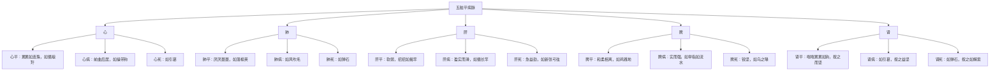

# 素问-平人气象论篇第十八

> "黄帝曰：平人何如？岐伯曰：人一呼脉再动，一吸脉亦再动，呼吸定息脉五动，闰以太息，命曰平人。" - 岐伯

---

## 📜 原文（节选）/ Original Text (Excerpt)

黄帝曰：平人何如？

岐伯曰：人一呼脉再动，一吸脉亦再动，呼吸定息脉五动，闰以太息，命曰平人。平人者，不病也。常以不病调病人，医不病，故为病人平息以调之为法。

人一呼脉一动，一吸脉一动，曰少气。人一呼脉三动，一吸脉三动而躁，尺热，曰病温；尺不热，脉滑，曰病风；脉涩，曰痹。人一呼脉四动以上，曰死；脉绝不至，曰死；乍疏乍数，曰死。

人一呼脉再动，一吸脉再动，曰平人。平人无太过，无不及。一呼脉三动，一吸脉三动，曰太过；一呼脉一动，一吸脉一动，曰不及。

脉来累累如连珠，如循琅玕，曰心平。夏以胃气为本。脉来喘喘累累如钩，曰心平。脉来前曲后居，如操带钩，曰心病。脉来如引葛，曰死。

脉来厌厌聂聂，如落榆荚，曰肺平。秋以胃气为本。脉来不上不下，如循鸡羽，曰肺平。脉来如风吹毛，曰肺病。脉来如弹石，曰死。

脉来软弱，招招如揭竿，曰肝平。春以胃气为本。脉来盈实而滑，如循长竿，曰肝病。脉来急益劲，如新张弓弦，曰死。

脉来和柔相离，如鸡践地，曰脾平。长夏以胃气为本。脉来实而强，如举指如流水，曰脾病。脉来锐坚，如乌之喙，如鸟之距，如屋之漏，如水之流，曰死。

脉来喘喘累累如钩，按之而坚，曰肾平。冬以胃气为本。脉来如引葛，按之益坚，曰肾病。脉来如弹石，按之如解索，曰死。

　　黄帝问曰：平人何如？

　　岐伯对曰：人一呼脉再动，一吸脉亦再动，呼吸定息脉五动，闰以太息，命曰平人。平人者不病也。常以不病调病人，医不病，故为病人平息以调之为法。

　　人一呼脉一动，一吸脉一动，曰少气。人一呼脉三动，一吸脉三动而躁，尺热曰病温；尺不热脉滑曰病风；脉涩曰痹。人一呼脉四动以上曰死；脉绝不至曰死；乍疏乍数曰死。

　　平人之常气禀于胃，胃者平人之常气也；人无胃气曰逆，逆者死。春胃微弦曰平，弦多胃少曰肝病，但弦无胃曰死；胃而有毛曰秋病，毛甚曰今病。藏真散于肝，肝藏筋膜之气也。夏胃微钩曰平，钩多胃少曰心病，但钩无胃曰死；胃而有石曰冬病，石甚曰今病。藏真通于心，心藏血脉之气也。长夏胃微弱曰平，弱多胃少曰脾病，但代无胃曰死；软弱有石曰冬病，弱甚曰今病。藏真濡于脾，脾藏肌肉之气也。秋胃微毛曰平，毛多胃少曰肺病，但毛无胃曰死；毛而有弦曰春病，弦甚曰今病。藏真高于肺，以行荣卫阴阳也。冬胃微石曰平，石多胃少曰肾病，但石无胃曰死；石而有钩曰夏病，钩甚曰今病。藏真下于肾，肾藏骨髓之气也。

　　胃之大络，名曰虚里。贯鬲络肺，出于左乳下，其动应衣，脉宗气也。盛喘数绝者，则病在中；结则横，有积矣；绝不至，曰死。乳之下，其动应衣，宗气泄也。

　　欲知寸口太过与不及。寸口之脉中手短者，曰头痛。寸口脉中手长者，曰足胫痛。寸口脉中手促上击者，曰肩背病。寸口脉沉而坚者，曰病在中。寸口脉浮而盛者，曰病在外。寸口脉沉而弱，曰寒热及疝瘕、少腹痛。寸口脉沉而横，曰胁下有积，腹中有横积痛。寸口脉沉而喘，曰寒热。脉盛滑坚者，曰病在外。脉小实而坚者，病在内。脉小弱以涩，谓之久病。脉滑浮而疾者，谓之新病。脉急者，曰疝瘕少腹痛。脉滑曰风。脉涩曰痹。缓而滑曰热中。盛而紧曰胀。脉从阴阳，病易已；脉逆阴阳，病难已。脉得四时之顺，曰病无他；脉反四时及不间脏，曰难已。

　　臂多青脉，曰脱血。尺脉缓涩，谓之解惰，安卧。脉盛，谓之脱血。尺涩脉滑，谓之多汗。尺寒脉细，谓之后泄。脉尺粗常热者，谓之热中。肝见庚辛死，心见壬癸死，脾见甲乙死，肺见丙丁死，肾见戊已死，是谓真藏见皆死。颈脉动喘疾咳，曰水。目裹微肿，如卧蚕起之状，曰水。溺黄赤，安卧者，黄疸。已食如饥者，胃疸。面肿曰风。足胫肿曰水。目黄者曰黄疸。

　　妇人手少阴脉动甚者，妊子也。

　　脉有逆从四时，未有脏形，春夏而脉瘦，秋冬而脉浮大，命曰逆四时也。风热而脉静，泄而脱血脉实，病在中脉虚，病在外脉涩坚者，皆难治，命曰反四时也。

　　人以水谷为本，故人绝水谷则死，脉无胃气亦死。所谓无胃气者，但得真脏脉，不得胃气也。所谓脉不得胃气者，肝不弦，肾不石也。太阳脉至，洪大以长；少阳脉至，乍数乍疏，乍短乍长；阳明脉至，浮大而短。 夫平心脉来，累累如连珠，如循琅玕，曰心平，夏以胃气为本；病心脉来，喘喘连属，其中微曲，曰心病；死心脉来，前曲后居，如操带钩，曰心死。

　　平肺脉来，厌厌聂聂，如落榆荚，曰肺平，秋以胃气为本；病肺脉来，不上不下，如循鸡羽，曰肺病；死肺脉来，如物之浮，如风吹毛，曰肺死。

　　平肝脉来，弱弱招招，如揭长竿末梢，曰肝平，春以胃气为本；病肝脉来，盈实而滑，如循长竿，曰肝病；死肝脉来，急益劲，如新张弓弦，曰肝死。

　　平脾脉来，和柔相离，如鸡践地，曰脾平，长夏以胃气为本；病脾脉来，实而盈数，如鸡举足，曰脾病；死脾脉来，锐坚如鸟之喙，如鸟之距，如屋之漏，如水之流，曰脾死。

　　平肾脉来，喘喘累累如钩，按之而坚，曰肾平，冬以胃气为本；病肾脉来，如引葛，按之益坚，曰肾病；死肾脉来，发如夺索，辟辟如弹石，曰肾死。

---

## 📖 白话文翻译（节选）/ Modern Chinese Translation (Excerpt)

黄帝问道：正常人（平人）的脉象是什么样的？

岐伯说：人呼气一次脉搏跳动两次，吸气一次脉搏跳动两次，呼吸定息脉搏跳动五次，加上长呼吸，叫做平人。平人，就是没有病的人。经常用没有病的人来调节病人，医生没有病，所以为病人平息以调节作为法则。

人呼气一次脉搏跳动一次，吸气一次脉搏跳动一次，叫做少气。人呼气一次脉搏跳动三次，吸气一次脉搏跳动三次而且躁动，尺部发热，叫做病温；尺部不发热，脉象滑，叫做病风；脉象涩，叫做痹。人呼气一次脉搏跳动四次以上，叫做死；脉象断绝不到，叫做死；脉象忽疏忽数，叫做死。

人呼气一次脉搏跳动两次，吸气一次脉搏跳动两次，叫做平人。平人没有太过，没有不及。呼气一次脉搏跳动三次，吸气一次脉搏跳动三次，叫做太过；呼气一次脉搏跳动一次，吸气一次脉搏跳动一次，叫做不及。

脉来累累如连珠，如循琅玕，叫做心平。夏季以胃气为本。脉来喘喘累累如钩，叫做心平。脉来前曲后居，如操带钩，叫做心病。脉来如引葛，叫做死。

脉来厌厌聂聂，如落榆荚，叫做肺平。秋季以胃气为本。脉来不上不下，如循鸡羽，叫做肺平。脉来如风吹毛，叫做肺病。脉来如弹石，叫做死。

脉来软弱，招招如揭竿，叫做肝平。春季以胃气为本。脉来盈实而滑，如循长竿，叫做肝病。脉来急益劲，如新张弓弦，叫做死。

脉来和柔相离，如鸡践地，叫做脾平。长夏以胃气为本。脉来实而强，如举指如流水，叫做脾病。脉来锐坚，如乌之喙，如鸟之距，如屋之漏，如水之流，叫做死。

脉来喘喘累累如钩，按之而坚，叫做肾平。冬季以胃气为本。脉来如引葛，按之益坚，叫做肾病。脉来如弹石，按之如解索，叫做死。

　　黄帝问道：正常人的脉象是怎样的呢？

　　岐伯回答说：人一呼脉跳动两次，一吸脉也跳动两次，呼吸之余，是为定息，若一吸劢跳动五次，是因为有时呼吸较长以尽脉跳余数的缘故，这是平人的脉象。平人就是无病之人，通常以无病之人的呼吸为标准，来测侯病人的呼吸至数及脉跳次数，医生无病，就可以用自己的呼吸来计算病人脉搏的至数，这是诊脉的法则。如果一呼与一吸脉各跳动三次而且急疾，尺之皮肤发热，乃是温病的表现；如尺肤不热，脉象滑，乃为感受风邪而发生的病变；如脉象涩，是为痹证。人一呼一吸脉跳动八次以上是精气衰夺的死脉；脉气断绝不至，亦是死脉；脉来忽迟忽数，为气血已乱，亦是死脉。

　　健康人的正气来源于胃，胃为水谷之海，乃人体气血生化之源，所以胃气为健康人之常气，人若没有胃气，就是危险的现象，甚者可造成死亡。[春天](https://www.guoxuemeng.com/gushici/chuntiandegushi/)有胃气的脉应该是弦而柔和的微弦脉，乃是无并之平脉；如果弦象很明显而缺少柔和之胃气，为肝脏有病；脉见纯弦而无柔和之象的真脏脉，主死；若虽有胃气而兼见轻虚以浮的毛脉，是春见秋脉，故预测其到了[秋天](https://www.guoxuemeng.com/gushici/qiutiandegushi/)就要生病，如毛脉太甚，则木被金伤，现时就会发病。肝旺于春，春天脏真之气散于肝，以养筋膜之气。[夏天](https://www.guoxuemeng.com/gushici/xiatiandegushi/)有胃气的脉应该是钩而柔和的微心脏有病；脉见纯钩而无柔和之象的真脏脉，主死；若虽有胃气而兼见沉象的石脉，是夏见冬脉，故预测其到了[冬天](https://www.guoxuemeng.com/gushici/dongtiandegushi/)就要生病；如石脉太甚，则火被水伤，现时就会发病。心旺于夏，故夏天脏真之气通于心，心主血脉，而心之所藏则是血脉之气。长夏有胃气的脉应该是微耎弱的脉，乃是无病之平脉，如果若甚无力而缺少柔和之胃气，为脾脏有病；如果见无胃气的代脉，主死；若软弱脉中兼见沉石，是长夏见冬脉，这是火土气衰而水反侮的现象，故预测其到了冬天就要生病；如弱火甚，现时就会发病。脾旺于长夏，故长夏脏真之气濡养于脾，脾主肌肉，故脾藏肌肉之气。秋天有胃气的脉应该是轻虚以浮而柔和的微毛脉，乃是无病之平脉；如果是脉见轻虚以浮而缺少柔和之胃气，为肺脏有病；如见纯毛脉而无胃气的真脏脉，就要死亡；若毛脉中兼见弦象，这是金气衰而木反侮的现象，故预测其到了春天就要生病；如弦脉太甚，现时就会发病。肺旺于秋而居上焦，故秋季脏真之气上藏于肺，肺主气而朝百脉，乃是无病之平脉；如果脉见沉石而缺少柔和的胃气，为肾脏有病；如脉见纯石而不柔和的真脏脉，主死；若沉石脉中兼见钩脉，是水气衰而火反侮的现象，故预测其到了夏天就要生病；如钩脉太甚，现时就会发病。肾旺于冬而居人体的下焦，，冬天脏真之气下藏与肾，肾主骨，故肾藏骨髓之气。

　　胃经的大络，名叫虚里，其络从胃贯膈而上络于肺，其脉出现于左乳下，搏动时手可以感觉得到，这是积于胸中的宗气鼓舞其脉跳动的结果。如果虚里脉搏动急数而兼有短时中断之象，这是中气不守的现象，是病在膻中的征候；如脉来迟而有歇止兼见跳动甚剧而外见于衣，这是宗气失藏而外泄的现象。

　　切脉要知道寸口脉的太过和不及。寸口脉象应指而短，主头痛。寸口脉应指而长，主足胫痛。寸口应指急促而有力，上搏指下，主肩背痛。寸口脉沉而坚硬，主病在内。寸口脉浮而盛大，主病在外。寸口脉沉而弱，主寒热、疝少腹疼痛。寸口脉沉而横居，主胁下有积病，或腹中有横积而疼痛。寸口脉沉而急促，主病寒热。脉盛大滑而坚，主病在外。脉小实而坚，主病在内。脉小弱而涩，是为久病。脉来滑利浮而疾数，是为新病。脉来紧急，主疝瘕少腹疼痛。脉来滑利，主病风。脉来涩滞，主痹证。脉来缓而滑利，为脾胃有热，主病热中。脉来盛紧，为寒气痞满，主胀病。脉与病之阴阳想一致，如阳病见阳脉，阴病见阴脉，病难愈。脉与四时相应为顺，如春弦、夏钩、秋毛、冬石，即使患病，亦无什麽危险；如脉与四时相反，及不间脏而传变的，病难愈。臂多青脉，乃血少脉空，乃由于失血。尺肤缓而脉来涩，主气血不足，多为倦怠懈惰，但欲安卧。尺肤发热而脉象盛大，是火盛于内，主脱血。尺肤涩而脉象滑，阳气有余于内，故为多汗。尺肤寒而脉象细，阴寒之气盛于内，故为泄泻。脉见粗大而尺肤常热的，阳盛于内，为热中。

　　肝的真脏脉出现，至庾辛日死；心的真脏脉出现，至任癸日死；脾的真脏脉出现，至甲乙日死；肺的真脏脉出现，至丙丁日死；肾的真脏脉出现，至戊已日死。这是说的真脏脉见，均主死亡。

　　颈部之脉搏动甚，且气喘咳嗽，主水病。眼睑浮肿如卧蚕之状。也是水病。小便颜色黄赤，而且嗜卧，是黄疸病。风为阴邪，下先受之，面部浮肿，为风邪引起的风水病。水湿为阴邪，下先受之，足胫肿，是水湿引起的水肿病。眼白睛发黄，是黄疸病。妇人手少阴心脉搏动明显，是怀孕的征象。

　　脉与四时有像适应，也有不相适应的，如果脉搏不见本脏脉的正常脉象，春夏而不见弦、洪，而反见沉、涩；秋冬而不见毛、石，而反见浮大，这都是与四时相反的脉象。风热为阳邪脉应浮大，今反沉静；泄利脱血，津血受伤，脉因虚细，今反实大；病在内，脉应有力，乃正气尚盛足以抗邪，今反脉虚；病在外，脉应浮滑，乃邪气仍在于表，今反见脉强坚，脉证像反，都是难治之病，着就叫做“反四时”。

　　人依靠水谷的营养而生存，所以人断绝水谷后，就要死亡；胃气化生于水谷，如脉无胃气也要死亡。所谓无胃气的脉，就是单见真脏脉，而不见柔和的胃气脉。所谓不得胃气的脉，就是肝脉见不到微弦脉，肾脉见不到微石脉等。

　　太阳主时，脉来洪大而长；少阳主时，脉来不定，忽快忽慢，忽长忽短；阳明主时，脉来浮大而短。

　　正常的心脉来时，圆润象珠子一样，相贯而至，又象安抚琅杆美玉一样的柔滑，这是心脏的平脉。夏天以胃气为本，脉当柔和而微钩。如果脉来时，喘急促，连串急数之中，带有微曲之象，这是心的病脉。将死的心脉来时，脉前曲回，后则端直，如摸到革带之钩一样的坚硬，全无和缓之意，这是心的死脉。

　　正常的肺脉来时，轻虚而浮，像榆荚下落一样的轻浮和缓，这是肺的平脉。秋天以胃气为本，脉当柔和而微毛。有病的肺脉来时，不上不下，如抚摩鸡毛一样，这是肺的病脉。将死的肺脉来时，轻浮而无根，如物之漂浮，如风吹毛一样，飘忽不定，散动无根，这是肺的死脉

　　正常的肝脉来时，柔软而弦长，如长竿之末梢一样的柔软摆动，这是肝的平脉。春天以胃气为本，脉当柔和而微弦。有病的肝脉来时，弦长硬满而滑利，如以手模长竿一样的长而不软，这是肝的病脉。将死的肝脉来时，弦急而坚劲，如新张弓弦一样紧绷而强劲，这是肝的死脉。

　　正常的脾脉来时，从容和缓，至数匀净分明，好象鸡足缓缓落地一样的轻缓而从容不迫，这是脾的平脉。长夏以胃气为本，脉当和缓。有病的脾脉来时，充实硬满而急数，如鸡举足一样急疾，这是脾的病脉。将死的脾脉来时，或锐坚而无柔和之气，如乌之嘴，鸟之爪那样坚硬而锐，或时动复止而无规律，或脉去而无不至，如屋之漏水点滴无伦，或如水之流逝，去而不返，这是脾的死脉。

　　正常的肾脉来时，沉石滑利连续不断而又有曲回之象，按之坚实，有如心之钩脉这是肾的平脉。冬天以胃气为本，脉当柔软而微石。有病的肾脉来时，坚搏牵连如牵引葛藤一样，愈按愈坚硬，这是肾的病脉。将死的肾脉来时，象夺索一般，长而坚硬劲急，或坚实如以指弹石，这是肾的死。

---

## 🔑 核心要点 / Core Concepts

### 1. 平人脉象 / Normal Pulse

| 呼吸 | 脉动次数 | 脉象特征 |
|------|----------|----------|
| 一呼 | 再动 | 两次 |
| 一吸 | 再动 | 两次 |
| 呼吸定息 | 五动 | 五次 |
| 闰以太息 | 变化 | 加长呼吸 |

### 2. 异常脉象与疾病 / Abnormal Pulse and Diseases

| 脉动次数 | 脉象特征 | 病名 | 预后 |
|----------|----------|------|------|
| 呼一吸一 | 脉一动 | 少气 | - |
| 呼三吸三 | 脉三动躁 | 尺热：病温 | - |
| 呼三吸三 | 脉滑 | 尺不热：病风 | - |
| 呼三吸三 | 脉涩 | - | 痹 |
| 呼四以上 | 四动以上 | - | 死 |
| 脉绝不至 | 脉断绝 | - | 死 |
| 乍疏乍数 | 脉不匀 | - | 死 |

### 3. 五脏平病脉 / Five Zang Normal and Sick Pulse

---

## 📚 理论解释 / Theoretical Analysis

### 平人气象理论 / Normal Person Qi Theory

> [!info] 核心概念
- 平人脉象的标准
- 异常脉象的诊断
- 五脏平病脉的区别

#### 平人脉象标准 / Normal Pulse Standard

**1. 呼吸与脉动 / Breathing and Pulse Beat**
- 一呼脉再动：呼气一次脉搏跳动两次
- 一吸脉再动：吸气一次脉搏跳动两次
- 呼吸定息脉五动：呼吸定息脉搏跳动五次
- 闰以太息：加上长呼吸

**2. 平人脉象特点 / Normal Pulse Characteristics**
- 无太过：没有过多
- 无不及：没有不足
- 平和调和：脉象平和调和

#### 异常脉象诊断 / Abnormal Pulse Diagnosis

**1. 少气 / Less Qi**
- 脉动次数：呼一吸一
- 脉象特征：脉搏跳动次数少
- 病机：气机不足

**2. 病温 / Wen Disease**
- 脉动次数：呼三吸三
- 脉象特征：脉三动躁，尺热
- 病机：温热病

**3. 病风 / Wind Disease**
- 脉动次数：呼三吸三
- 脉象特征：脉滑，尺不热
- 病机：风邪致病

**4. 痹 / Bi Disease**
- 脉动次数：呼三吸三
- 脉象特征：脉涩
- 病机：痹证

**5. 死脉 / Death Pulse**
- 脉动次数：呼四以上
- 脉象特征：脉四动以上、脉绝不至、乍疏乍数
- 病机：死候

### 五脏平病脉理论 / Five Zang Normal and Sick Pulse Theory

> [!warning] 核心理念
- 五脏各有平脉、病脉、死脉
- 平脉柔和有胃气
- 病脉失去胃气
- 死脉真脏脉见

#### 五脏平脉 / Five Zang Normal Pulse

**1. 心平 / Heart Normal Pulse**
- 脉象：累累如连珠，如循琅玕
- 季节：夏以胃气为本
- 特征：脉象圆润，如连珠如琅玕

**2. 肺平 / Lung Normal Pulse**
- 脉象：厌厌聂聂，如落榆荚
- 季节：秋以胃气为本
- 特征：脉象柔和，如落榆荚

**3. 肝平 / Liver Normal Pulse**
- 脉象：软弱，招招如揭竿
- 季节：春以胃气为本
- 特征：脉象软弱，如揭竿

**4. 脾平 / Spleen Normal Pulse**
- 脉象：和柔相离，如鸡践地
- 季节：长夏以胃气为本
- 特征：脉象和柔，如鸡践地

**5. 肾平 / Kidney Normal Pulse**
- 脉象：喘喘累累如钩，按之而坚
- 季节：冬以胃气为本
- 特征：脉象如钩，按之坚

#### 五脏病脉 / Five Zang Sick Pulse

**1. 心病 / Heart Sick Pulse**
- 脉象：前曲后居，如操带钩
- 特征：脉象失去胃气，如操带钩

**2. 肺病 / Lung Sick Pulse**
- 脉象：如风吹毛
- 特征：脉象失去胃气，如风吹毛

**3. 肝病 / Liver Sick Pulse**
- 脉象：盈实而滑，如循长竿
- 特征：脉象失去胃气，如循长竿

**4. 脾病 / Spleen Sick Pulse**
- 脉象：实而强，如举指如流水
- 特征：脉象失去胃气，如举指如流水

**5. 肾病 / Kidney Sick Pulse**
- 脉象：如引葛，按之益坚
- 特征：脉象失去胃气，如引葛

#### 五脏死脉 / Five Zang Death Pulse

**1. 心死 / Heart Death Pulse**
- 脉象：如引葛
- 特征：真脏脉见，如引葛

**2. 肺死 / Lung Death Pulse**
- 脉象：如弹石
- 特征：真脏脉见，如弹石

**3. 肝死 / Liver Death Pulse**
- 脉象：急益劲，如新张弓弦
- 特征：真脏脉见，如新张弓弦

**4. 脾死 / Spleen Death Pulse**
- 脉象：锐坚，如乌之喙，如鸟之距，如屋之漏，如水之流
- 特征：真脏脉见，如乌之喙

**5. 肾死 / Kidney Death Pulse**
- 脉象：如弹石，按之如解索
- 特征：真脏脉见，如弹石

---

## 🏥 中医实践应用 / TCM Practice Application

### 脉诊应用 / Pulse Diagnosis Application

#### 现代脉诊要点 / Modern Pulse Diagnosis Key Points

**1. 平人脉象标准 / Normal Pulse Standard**
- 一呼脉再动，一吸脉再动
- 呼吸定息脉五动
- 脉象平和调和

**2. 异常脉象诊断 / Abnormal Pulse Diagnosis**
- 呼一吸一：少气
- 呼三吸三躁：病温
- 呼三吸三滑：病风
- 呼三吸三涩：痹
- 呼四以上：死

**3. 五脏平病脉诊断 / Five Zang Normal and Sick Pulse Diagnosis**
- 心平：累累如连珠，如循琅玕
- 肺平：厌厌聂聂，如落榆荚
- 肝平：软弱，招招如揭竿
- 脾平：和柔相离，如鸡践地
- 肾平：喘喘累累如钩，按之而坚

### 现代医学启示 / Modern Medical Insights

**1. 脉搏频率 / Pulse Frequency**
- 正常脉搏频率：每分钟60-100次
- 呼吸与脉搏比例：1:4（呼吸一次脉搏跳动四次）
- 异常脉搏：过快、过慢、不均匀

**2. 脉搏强弱 / Pulse Strength**
- 正常脉搏：有力而柔和
- 异常脉搏：过强、过弱
- 脉搏均匀度：均匀或不均匀

---

## 🔗 相关链接 / Related Links

- [[MOC-黄帝内经知识库]] - 主索引
- [[黄帝内经-素问索引]] - 素问索引
- [[黄帝内经-核心理论]] - 核心理论体系
- [[素问17-脉要精微论篇]] - 脉象精微
- [[素问19-玉机真脏论篇]] - 真脏脉

### 易学关联 / Yi Jing Connection

- [[MOC-易经知识库]] - 易经索引
- [[20260201-0002 五行]] - 五行理论

**易学与平人气象的联系:**
- 五行对应：易学的五行理论与中医五脏脉象相通
- 阴阳调和：易学的阴阳理论与中医平人脉象相通

---

## 💡 学习要点 / Learning Points

### 掌握重点 / Key Points to Master

- [ ] 理解平人脉象的标准
- [ ] 掌握异常脉象与疾病的关系
- [ ] 学会辨别五脏平病脉
- [ ] 了解死脉的特征

### 思考问题 / Questions for Reflection

1. **为什么说"平人者，不病也"？**
   - 平人脉象调和，气血流通
   - 无太过，无不及
   - 阴阳平衡，气血调和

2. **现代医学如何应用"平人气象"？**
   - 正常脉搏标准：每分钟60-100次
   - 脉搏均匀度：均匀不均匀
   - 脉搏强弱：有力柔和

---

## 📊 学习进度 / Learning Progress

### 完成情况 / Completion Status

| 学习内容 | 状态 | 备注 |
|---------|------|------|
| 原文诵读 | 📝 进行中 | 建议每日诵读 |
| 白话文理解 | ✅ 已完成 | 理解主要含义 |
| 平人脉象 | ✅ 已完成 | 掌握标准 |
| 五脏脉象 | 📝 进行中 | 需要临床实践 |
| 理论分析 | ✅ 已完成 | 理解脉象理论 |

---

## 🔄 更新日志 / Update Log

### 2026-02-03

- ✅ 创建平人气象论篇第十八笔记
- ✅ 完成原文、白话文翻译（节选）
- ✅ 整理平人脉象和异常脉象对照表
- ✅ 编写五脏平病脉理论

---

**笔记创建日期**：2026年2月3日

**最后更新**：2026年2月3日
