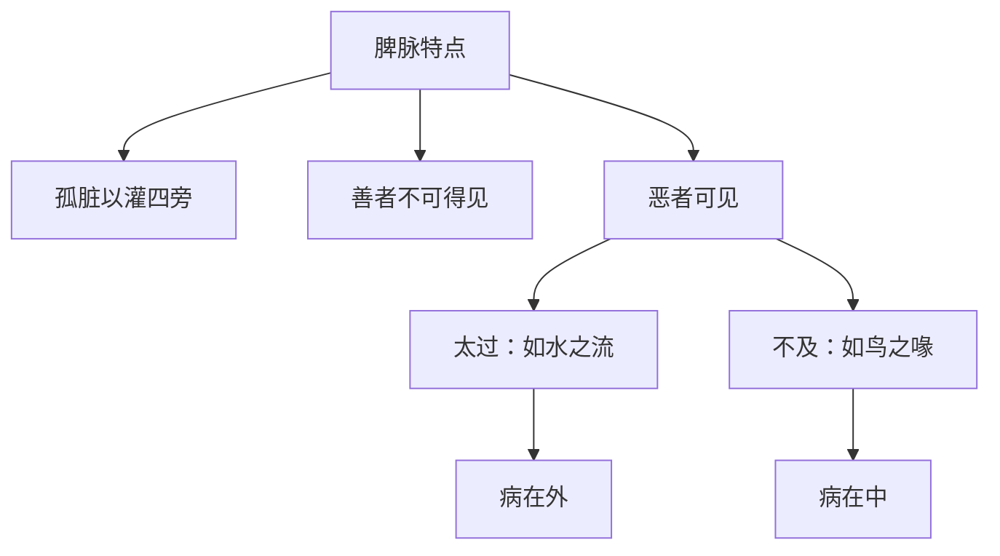

# 素问-玉机真脏论篇第十九

> "黄帝曰：凡治病，察其形气色泽，脉之盛衰，病之新故，乃治之无后其时。" - 黄帝

---

## 📜 原文（节选）/ Original Text (Excerpt)

黄帝问曰：春脉如弦，何如而弦？

岐伯对曰：春脉者肝也，东方木也，万物之所以始生也，故其气来软弱，轻虚而滑，端直以长，故曰弦，反此者病。

帝曰：何如而反？

岐伯曰：其气来实而强，此谓太过，病在外；其气来不实而微，此谓不及，病在中。

帝曰：春脉太过与不及，其病皆何如？

岐伯曰：太过则令人善忘，忽忽眩冒而巅疾；不及则令人胸痛引背，下则两胁胠满。

帝曰：善。夏脉如钩，何如而钩？

岐伯曰：夏脉者心也，南方火也，万物之所以盛长也，故其气来盛去衰，故曰钩，反此者病。

帝曰：何如而反？

岐伯曰：其气来盛去亦盛，此谓太过，病在外；其气来不盛去反盛，此谓不及，病在中。太过则令人身热而肤痛，为浸淫；不及则令人烦心，上见咳唾，下为气泄。

帝曰：秋脉如浮，何如而浮？

岐伯曰：秋脉者肺也，西方金也，万物之所以收成也，故其气来轻虚以浮，来急去散，故曰浮，反此者病。

帝曰：何如而反？

岐伯曰：其气来毛而中央坚，两旁虚，此谓太过，病在外；其气来毛而微，此谓不及，病在中。太过则令人逆气而背痛，愠愠然；不及则令人喘，呼吸少气而咳，上气见血，下闻病音。

帝曰：冬脉如营，何如而营？

岐伯曰：冬脉者肾也，北方水也，万物之所以合藏也，故其气来沉以搏，故曰营，反此者病。

帝曰：何如而反？

岐伯曰：其气来如弹石，此谓太过，病在外；其气去如数者，此谓不及，病在中。太过则令人解㑊，脊脉痛而少气不欲言；不及则令人心悬如病饥，䏚中清，脊中痛，少腹满，小便变。

帝曰：四时之序，逆从之变异也，然脾脉独何主？

岐伯曰：脾脉者土也，孤脏以灌四旁者也。

帝曰：然则脾善恶可得见之乎？

岐伯曰：善者不可得见，恶者可见。

帝曰：恶者何如可见？

岐伯曰：其来如水之流者，此为太过，病在外；如鸟之喙者，此为不及，病在中。

　　黄帝问曰：春脉如弦，何如而弦？

　　岐伯对曰：春脉者肝也，东方木也，万物之所以始生也，故其气来，软弱轻虚而滑，端直以长，故曰弦，反此者病。

　　帝曰：何如而反。

　　岐伯曰：其气来实而强，此谓太过，病在外；其气来不实而微，此谓不及，病在中。

　　帝曰：春脉太过与不及，其病皆何如？

　　岐伯曰：太过则令人善忘，忽忽眩冒而巅疾；其不及，则令人胸痛引背，下则两胠胁满。

　　帝曰：善。夏脉如钩，何如而钩？

　　岐伯曰：夏脉者心也，南方火也，万物之所以盛长也，故其气来盛去衰，故曰钩，反此者病。

　　帝曰：何如而反。

　　岐伯曰：其气来盛去亦盛，此谓太过，病在外；其气来不盛去反盛，此谓不及，病在中。

　　帝曰：夏脉太过与不及，其病皆何如？

　　岐伯曰：太过则令人身热而肤痛，为浸淫；其不及，则令人烦心，上见欬唾，下为气泄。

　　帝曰：善。秋脉如浮，何如而浮？

　　岐伯曰：秋脉者肺也，西方金也，万物之所以收成也，故其气来，轻虚以浮，来急去散，故曰浮，反此者病。

　　帝曰：何如而反。

　　岐伯曰：其气来，毛而中央坚，两傍虚，此谓太过，病在外；其气来，毛而微，此谓不及，病在中。

　　帝曰：秋脉太过与不及，其病皆何如？

　　岐伯曰：太过则令人逆气而背痛，愠愠然；其不及，则令人喘，呼吸少气而欬，上气见血，下闻病音。

　　帝曰：善。冬脉如营，何如而营？

　　岐伯曰：冬脉者肾也，北方水也，万物之所以合藏也，故其气来，沉以搏，故曰营，反此者病。

　　帝曰：何如而反。

　　岐伯曰：其气来如弹石者，此谓太过，病在外；其去如数者，此谓不及，病在中。

　　帝曰：冬脉太过与不及，其病皆何如？

　　岐伯曰：太过，则令人解㑊[yì]，脊脉痛而少气不欲言；其不及，则令人心悬如病饥，䏚miǎo中清，脊中痛，少腹满，小便变。

　　帝曰：善。四时之序，逆从之变异也，然脾脉独何主。

　　岐伯曰：脾脉者土也，孤藏以灌四傍者也。

　　帝曰：然则脾善恶，可得见之乎。

　　岐伯曰：善者不可得见，恶者可见。

　　帝曰：恶者何如可见。

　　岐伯曰：其来如水之流者，此谓太过，病在外；如鸟之喙者，此谓不及，病在中。

　　帝曰：夫子言脾为孤藏，中央土以灌四傍，其太过与不及，其病皆何如？

　　岐伯曰：太过，则令人四支不举；其不及，则令人九窍不通，名曰重强。

　　帝瞿然而起，再拜而稽首曰：善。吾得脉之大要，天下至数，五色脉变，揆度奇恒，道在于一，神转不回，回则不转，乃失其机，至数之要，迫近以微，着之玉版，藏之藏府，每旦读之，名曰玉机。五藏受气于其所生，传之于其所胜，气舍于其所生，死于其所不胜。病之且死，必先传行至其所不胜，病乃死。此言气之逆行也，故死。肝受气于心，传之于脾，气舍于肾，至肺而死。心受气于脾，传之于肺，气舍于肝，至肾而死。脾受气于肺，传之于肾，气舍于心，至肝而死。肺受气于肾，传之于肝，气舍于脾，至心而死。肾受气于肝，传之于心，气舍于肺，至脾而死。此皆逆死也。一日一夜五分之，此所以占死生之早暮也。

　　黄帝曰：五藏相通，移皆有次，五藏有病，则各传其所胜。不治，法三月若六月，若三日若六日，传五藏而当死，是顺传所胜之次。故曰：别于阳者，知病从来；别于阴者，知死生之期。言知至其所困而死。

　　是故风者百病之长也，今风寒客于人，使人毫毛毕直，皮肤闭而为热，当是之时，可汗而发也；或痹不仁肿痛，当是之时，可汤熨及火灸刺而去之。弗治，病入舍于肺，名曰肺痹，发欬上气。弗治，肺即传而行之肝，病名曰肝痹，一名曰厥，胁痛出食，当是之时，可按若刺耳。弗治，肝传之脾，病名曰脾风，发瘅，腹中热，烦心出黄，当此之时，可按可药可浴。弗治，脾传之肾，病名曰疝瘕，少腹冤热而痛，出白，一名曰蛊，当此之时，可按可药。弗治，肾传之心，病筋脉相引而急，病名曰瘛，当此之时，可灸可药。弗治，满十日，法当死。肾因传之心，心即复反传而行之肺，发寒热，法当三岁死，此病之次也。

　　然其卒发者，不必治于传，或其传化有不以次，不以次入者，忧恐悲喜怒，令不得以其次，故令人有大病矣。因而喜大虚则肾气乘矣，怒则肝气乘矣，悲则肺气乘矣，恐则脾气乘矣，忧则心气乘矣，此其道也。故病有五，五五二十五变，及其传化。传，乘之名也。 大骨枯槁，大肉陷下，胸中气满，喘息不便，其气动形，期六月死，真藏脉见，乃予之期日。大骨枯槁，大肉陷下，胸中气满，喘息不便，内痛引肩项，期一月死，真藏见，乃予之期日。大骨枯槁，大肉陷下，胸中气满，喘息不便，内痛引肩项，身热脱肉破䐃[jiǒng]，真藏见，十月之内死。大骨枯槁，大肉陷下，肩髓内消，动作益衰，真藏来见，期一岁死，见其真藏，乃予之期日。大骨枯槁，大肉陷下，胸中气满，腹内痛，心中不便，肩项身热，破䐃[jiǒng]脱肉，目匡陷，真藏见，目不见人，立死，其见人者，至其所不胜之时则死。

　　急虚身中卒至，五藏绝闭，脉道不通，气不往来，譬如堕溺，不可为期。其脉绝不来，若人一息五六至，其形肉不脱，真藏虽不见，犹死也。

　　真肝脉至，中外急，如循刀刃责责然，如按琴瑟弦，色青白不泽，毛折，乃死。真心脉至，坚而搏，如循薏苡子累累然，色赤黑不泽，毛折，乃死。真肺脉至，大而虚，如以毛羽中人肤，色白赤不泽，毛折，乃死。真肾脉至，搏而绝，如指弹石辟辟然，色黑黄不泽，毛折，乃死。真脾脉至，弱而乍数乍疏，色黄青不泽，毛折，乃死。诸真藏脉见者，皆死，不治也。

　　黄帝曰：见真藏曰死，何也。

　　岐伯曰：五藏者，皆禀气于胃，胃者，五藏之本也，藏气者，不能自致于手太阴，必因于胃气，乃至于手太阴也，故五藏各以其时，自为而至于手太阴也。故邪气胜者，精气衰也，故病甚者，胃气不能与之俱至于手太阴，故真藏之气独见，独见者病胜藏也，故曰死。

　　帝曰：善。

　　黄帝曰：凡治病，察其形气色泽，脉之盛衰，病之新故，乃治之无后其时。形气相得，谓之可治；色泽以浮，谓之易己；脉从四时，谓之可治；脉弱以滑，是有胃气，命曰易治，取之以时。形气相失，谓之难治；色夭不泽，谓之难已；脉实以坚，谓之益甚；脉逆四时，为不可治。必察四难，而明告之。

　　所谓逆四时者，春得肺脉，夏得肾脉，秋得心脉，冬得脾脉，其至皆悬绝沉涩者，命曰逆。四时未有藏形，于春夏而脉沉涩，秋冬而脉浮大，名曰逆四时也。

　　病热脉静，泄而脉大，脱血而脉实，病在中脉实坚，病在外，脉不实坚者，皆难治。

　　黄帝曰：余闻虚实以决死生，愿闻其情。

　　岐伯曰：五实死，五虚死。

　　帝曰：愿闻五实五虚。

　　岐伯曰：脉盛，皮热，腹胀，前后不通，闷瞀，此谓五实。脉细，皮寒，气少，泄利前后，饮食不入，此谓五虚。

　　帝曰：其时有生者，何也。

　　岐伯曰：浆粥入胃，泄注止，则虚者活；身汗得后利，则实者活。此其候也。

---

## 📖 白话文翻译（节选）/ Modern Chinese Translation (Excerpt)

黄帝问道：春季脉象如弦，怎样才叫弦？

岐伯回答说：春季脉属于肝，东方属木，是万物开始生发的时候，所以它的脉气来软弱，轻虚而滑，端直而长，所以叫弦，与此相反的就是病。

黄帝说：怎样才叫相反？

岐伯说：它的脉气来实而强，这叫太过，病在外；它的脉气来不实而微，这叫不及，病在中。太过就使人健忘，忽然眩晕昏冒而头顶有病；不及就使人胸痛牵引背部，向下则两胁肋胀满。

黄帝说：夏季脉象如钩，怎样才叫钩？

岐伯回答说：夏季脉属于心，南方属火，是万物盛长的时候，所以它的脉气来盛去衰，所以叫钩，与此相反的就是病。

黄帝说：怎样才叫相反？

岐伯说：它的脉气来盛去也盛，这叫太过，病在外；它的脉气来不盛去反盛，这叫不及，病在中。太过就使人身体发热而皮肤疼痛，成为浸淫；不及就使人烦心，上面出现咳嗽唾血，下面气机下泄。

黄帝说：秋季脉象如浮，怎样才叫浮？

岐伯回答说：秋季脉属于肺，西方属金，是万物收成的时候，所以它的脉气来轻虚而浮，来急去散，所以叫浮，与此相反的就是病。

黄帝说：怎样才叫相反？

岐伯说：它的脉气来如毛而中央坚，两旁虚，这叫太过，病在外；它的脉气来如毛而微，这叫不及，病在中。太过就使人气机上逆而背部疼痛，抑郁不乐；不及就使人喘息，呼吸少气而咳嗽，气机上逆见血，下面听到病音。

黄帝说：冬季脉象如营，怎样才叫营？

岐伯回答说：冬季脉属于肾，北方属水，是万物合藏的时候，所以它的脉气来沉而搏，所以叫营，与此相反的就是病。

黄帝说：怎样才叫相反？

岐伯说：它的脉气来如弹石，这叫太过，病在外；它的脉气去如数，这叫不及，病在中。太过就使人解㑊，脊脉疼痛而少气不想说话；不及就使人心悬如病饥，季肋中清冷，脊中疼痛，小腹胀满，小便变化。

黄帝说：四季的次序，逆从的变化，但是脾脉单独主管什么？

岐伯说：脾脉属土，是孤脏，用来灌溉四旁的。

黄帝说：那么脾的善恶可以看到吗？

岐伯说：好的脾脉看不到，坏的脾脉可以看到。

黄帝说：坏的脾脉怎样可以看到？

岐伯说：它的脉气来如水流，这叫太过，病在外；如鸟喙，这叫不及，病在中。

　　黄帝问道：春时的脉象如弦，怎样才算弦？

　　岐伯回答说：春脉主应肝脏，属东方之木。在这个季节里，万物开始生长，因此脉气来时，软弱轻虚而滑，端直而长，所以叫做弦，假如违反了这种现象，就是病脉。

　　黄帝道：怎样才称反呢？

　　岐伯说：其脉气来，应指实而有力，这叫做太过，主病在外；如脉来不实而微弱，这叫做不及，主病在里。

　　黄帝道：春脉太过与不及，发生的病变怎样？

　　岐伯说：太过会使人记忆力衰退，精神恍惚，头昏而两目视物眩转，而发生巅顶疾病；其不及会使人胸部作痛，牵连背部，往下则两侧胁助部位胀满。

　　黄帝道：讲得对！夏时的脉象如钩，怎样才算钩？

　　岐伯说：夏脉主应心脏，属南方之火，在这个季节里，万物生长茂盛，因此脉气来时充盛，去时轻微，犹如钩之形象，所以叫做钩脉，假如违反了这种现象，就是病脉。

　　黄帝道：怎样才称反呢？

　　岐伯说：其脉气来盛去亦盛，这叫做太过，主病在外；如脉气来时不盛，去时反充盛有余，这叫做不及，主病在里。

　　黄帝道：夏脉太过与不及，发生的病变怎样？

　　岐伯说：太过会使人身体发热，皮肤痛，热邪侵淫成疮；不及会使人心虚作烦，上部出现咳嗽涎沫，下部出现失气下泄。

　　黄帝道：讲得对！[秋天](https://www.guoxuemeng.com/gushici/qiutiandegushi/)的脉象如浮，怎样才算浮？

　　岐伯说：秋脉主应肺脏，属西方之金，在这个季节里，万物收成，因此脉气来时轻虚以浮，来急去散，所以叫做浮。假如违反了这种现象，就是病脉。

　　黄帝道：怎样才称反呢？

　　岐伯说：其脉气来浮软而中央坚，两旁虚，这叫做太过，主病在外；其脉气来浮软而微，这叫做不及，主病在里。

　　黄帝道：秋脉太过于不及，发生的病变怎样？

　　岐伯说：太过会使人气逆，背部作痛，愠愠然郁闷而不舒畅；其不及会使人呼吸短气，咳嗽气喘，其上逆而出血，喉间有喘息声音。

　　黄帝道：讲得对！冬时的脉象如营，怎样才算营？

　　岐伯说：冬脉主应肾脏，属北方之水，在这个季节里，万物闭藏，因此脉气来时沉而搏手，所以叫做营。假如违反了这种现象，就是病脉。

　　黄帝道：怎样才称反呢？

　　岐伯说：其脉来如弹石一般坚硬，这叫做太过，主病在外；如脉去虚数，这叫做不及，主病在里。

　　黄帝道：冬脉太过与不及，发生的病变怎样？

　　岐伯说：太过会使人精神不振，身体懈怠，脊骨疼痛，气短，懒于说话；不及则使人心如悬，如同腹中饥饿之状，季胁下空软部位清冷，脊骨作痛，少腹胀满，小便变常。

　　黄帝道：讲得对！春夏秋冬四时的脉象，有逆有从，其变化各异，但独未论及脾脉，究竟脾脉主何时令？

　　岐伯说：脾脉属土，位居中央为孤脏，以灌溉四旁。

　　黄帝道：脾脉的正常与异常可以得见吗？

　　岐伯说：正常的脾脉不可能见到，有病的脾脉是可以见到的。

　　黄帝道：有病的脾脉怎样？

　　岐伯说：其来如水之流散，这叫做太过，主病在外；其来尖锐如鸟之喙，这叫做不及，主病在中。

　　黄帝道：先生说脾为孤脏，位居中央属土，以灌溉四旁，他的太过和不及各发生什麽病变？

　　岐伯说：太过会使人四肢不能举动，不及则使人九窍不通，名叫重强。

　　黄帝惊悟书肃然起立，敬个礼道：很好！我懂得诊脉的要领了，这是天下极其重要的道理。《五色》、《脉变》、《揆度》、《奇恒》等书，阐述的道理都是一致的，总的精神在于一个“神”字。神的功用运转不息，向前而不能回却，倘若回而不转，就失掉它的生机了。极其重要的道理，往往迹象不显而尽于微妙，把它著录在玉版上面，藏于枢要内府，每天早上诵读，称它为《玉机》。五脏疾病的传变，是受病气于其所生之脏，传于其所胜之脏，病气留舍于生我之脏，死于我所不胜之脏。当病到将要死的时候，必先传行于相克之脏，病者乃死。这是病气的逆传，所以会死亡。例如，肝受病气于心脏，而又传行于脾脏，其病气留舍于肾脏，传到肺脏而死。心受病气于脾脏，其病气留舍于肝脏，传到肝脏而死。肺受病气于肾脏，传行于肝脏，病气留舍于脾脏，传到心脏而死。以一日一夜划分为五个阶段，分属五脏，就可以推测死后的早晚时间。

　　黄帝道：五脏是相通连的，病气的转移，都有一定的次序。假如五脏有病，则各传其所胜；若不能掌握治病的时机，那麽三个月或六个月，或三天，或六天，传遍五脏就当死了，这是相克的顺传次序。所以说：能辨别三阳的，可以知道病从何经而来；能辨别三阴的，可以知道病的死生日期，这就是说，知道他至其所不胜而死。

　　风为六淫之首，所以说它是百病之长。风寒中人，使人毫毛直竖，皮肤闭而发热，在这个时候，可用发汗的方法治疗；至风寒入于经络，发生麻痹不仁或肿痛等症状，此时可用汤熨（热敷）及火罐、艾炙、针刺等方法来祛散。如果不及时治疗，病气内传于肺，叫做肺痹，又叫做肝厥，发生胁痛、吐食的症状，在这个时候，可用按摩、药物或热汤沐浴等方法；如不及时治疗，就会传行于脾，叫做脾风，发生黄，腹中热，烦心，小便黄色等症状，在这个时候，可用按摩、药物或热汤沐浴等方法；如再不治，就会传行于肾，叫做疝疸，少腹烦热疼痛，小便色白而混浊，又叫做盅病，在这个时候，可用按摩、或用药物；如再不治，病就由肾传心，发生筋脉牵引拘挛，叫做瘛病，在这个时候，可用至法，或用药物；如再不治，十日之后，当要死亡。倘若病邪由肾传心，心又复反传于肺脏，发为寒热，发当三日即死，这是疾病传行的一般次序。假如骤然爆发的病，就不必根据这个相传的次序而治。有些病不依这个次序传变的，如忧、恐、悲、喜、怒情志之病，病邪就不能依照这个次序相传，因而使人生大病了。如因喜极伤心，心虚则肾气相乘；或因大怒，则肝气乘脾；或因悲伤，则肺气乘肝；或因惊恐，则肾气虚，脾气乘肾；或因大忧，则肺气内虚，心气乘肺。这是无志激动，使病邪不以次序传变的道理。所以病虽有五，及其传化，就有五五二十五变。所谓传化，就是相乘的名称。

　　大骨软弱，大肉瘦削，胸中气满，呼吸困难，呼吸困难，呼吸时身体振动，为期六个月就要死亡。见了真脏脉，就可以预知死日。胸中疼痛，牵引肩项，全身发热，脱肉破腘，真脏脉现，大骨软弱，大肉瘦削，胸中气满，呼吸困难，十个月之内就要死亡。大骨软弱，大肉瘦削，两肩下垂，骨髓内消，动作衰颓，真脏脉未出现，为期一年死亡，若见到真脏脉，就可以预知死日。大骨软弱，大肉瘦削，胸中气满，腹中痛，心中气郁不舒，肩项身上俱热，破腘脱肉，目眶下陷，真脏脉出现，精脱目不见人，立即死亡；如尚能见人，是精未全脱，到了它所不声胜之时，便死亡了。如果正气暴虚，外邪陡然中人，仓卒获病，五脏气机闭塞，周身脉道不通，气不往来，譬如从高堕下，或落水淹溺一样，猝然的病变，就无法预测死期了。其脉息绝而不至，或跳动异常疾数，一呼脉来五、六至，虽然形肉不脱，真脏不见，仍然要死亡的。

　　肝脏之真脏脉至，中外劲急，如象按在刀口上一样的锋利，或如按在琴弦上一样硬直，面部显青白颜色而不润泽，毫毛枯焦乃死。肺脏的真脏脉至，大而空虚，好象毛羽着人皮肤一般地轻虚，面部显白赤。颜色而不润泽，毫毛枯焦，就要死亡。肾脏的真脏脉至，搏手若索欲断，或如以指弹石一样坚实，面部显黑黄颜色而不润泽，毫毛枯焦，就要死亡。脾脏的真脏脉至，软弱无力，快慢不匀，面部显黄青颜色而不润泽，毫毛枯焦，就要死亡。凡是见到五脏真脏脉，皆为不治的死侯。

　　黄帝道：见到真脏脉象，就要死亡，是什麽道理？

　　岐伯道：五脏的营养，都赖于胃腑水谷之精微，因此胃是五脏的根本。故五脏之脏脉气，不能自行到达于手太阴寸口，必须赖借胃气的敷布，才能达于手太阴。所以五脏之气能够在其所主之时，出现于手太阴寸口，就是有了胃气。如果邪气胜，必定使精气衰。所以病气严重时，胃气就不能与五脏之气一起到达手太阴，而为某一脏真脏脉象单独出现，真脏独见，是邪气胜而脏气伤，所以说是要死亡的。

　　黄帝道：讲得对！

　　黄帝道：大凡治病，必先诊察形体盛衰，气之强弱，色之润枯，脉之虚实，病之新久，然后及时治疗，不能错过时机。病人形七相称，是可治之症；面色光润鲜明，病亦易愈；脉搏与四时相适应，亦为可治；脉来弱而流利，是有胃气的现象，病亦易治，必须抓紧时间，进行治疗。形气不相称，此谓难治；面色枯槁，没有光泽，病亦难愈；脉实而坚，病必加重；脉与四时相逆，为不可治。必须审察这四种难治之证，清楚地告诉病家。

　　所谓脉与四时相逆，是春见到肺脉，夏见到肾脉，秋见到心脉，冬见到脾脉，其脉皆悬绝无根，或沉涩不起，这就叫做逆四时。如五脏脉气不能随着时令表现于外，在春夏的时令，反见沉涩的脉象，秋冬的时令，反见浮大的脉象，这也叫做逆四时。

　　热病脉宜洪大而反静；泄泻脉应小而反大；脱血脉应虚而反实；病在中而脉不实坚；病在外而脉反坚实。这些都是症脉相反，皆为难治。

　　黄帝道：我听说根据虚实的病情可以预决死生，希望告诉我其中道理！

　　岐伯说：五实死，五虚亦死。

　　黄帝道：请问什麽叫做五实、五虚？

　　岐伯说：脉盛是心受邪盛，皮热是肺受邪盛，腹胀是脾受邪盛，二便不通是肾受邪盛，闷瞀是肝受邪盛，这叫做五实。脉细是心气不足，皮寒是肺气不足，气少是肝气不足，泄利前后是肾气不足，饮食不入是脾气不足，这叫做五虚。

　　黄帝道：五实、五虚，有时亦有痊愈的，又是什麽道理？

　　岐伯说：能够吃些粥浆，慢慢地胃气恢复，大便泄泻停止，则虚者也可以痊愈。如若原来身热无汗的，而现在得汗，原来二便不通的，而现在大小便通利了，则实者也可以痊愈。这就是五虚、五实能够痊愈的机转。

---

## 🔑 核心要点 / Core Concepts

### 1. 四时正常脉象 / Normal Pulse in Four Seasons

| 季节 | 脏腑 | 五行 | 脉象特征 | 比喻 |
|------|------|------|----------|------|
| 春 | 肝 | 木 | 软弱，轻虚而滑，端直以长 | 如弦 |
| 夏 | 心 | 火 | 来盛去衰 | 如钩 |
| 秋 | 肺 | 金 | 轻虚以浮，来急去散 | 如浮 |
| 冬 | 肾 | 水 | 沉以搏 | 如营 |

### 2. 四时太过脉象 / Excessive Pulse in Four Seasons

| 季节 | 太过脉象 | 病位 | 症状 |
|------|----------|------|------|
| 春 | 实而强 | 病在外 | 善忘，忽忽眩冒而巅疾 |
| 夏 | 来盛去亦盛 | 病在外 | 身热而肤痛，为浸淫 |
| 秋 | 毛而中央坚，两旁虚 | 病在外 | 逆气而背痛，愠愠然 |
| 冬 | 如弹石 | 病在外 | 解㑊，脊脉痛而少气不欲言 |

### 3. 四时不及脉象 / Deficient Pulse in Four Seasons

| 季节 | 不及脉象 | 病位 | 症状 |
|------|----------|------|------|
| 春 | 不实而微 | 病在中 | 胸痛引背，下则两胁胠满 |
| 夏 | 来不盛去反盛 | 病在中 | 烦心，上见咳唾，下为气泄 |
| 秋 | 毛而微 | 病在中 | 喘，呼吸少气而咳，上气见血，下闻病音 |
| 冬 | 去如数 | 病在中 | 心悬如病饥，䏚中清，脊中痛，少腹满，小便变 |

### 4. 脾脉特点 / Spleen Pulse Characteristics

---

## 📚 理论解释 / Theoretical Analysis

### 四时脉象理论 / Four Seasons Pulse Theory

> [!info] 核心概念
- 四时各有正常的脉象特征
- 四时脉象有太过不及之分
- 脉象变化反映病情进展

#### 四时正常脉象详解 / Detailed Normal Pulse in Four Seasons

**1. 春脉如弦 / Spring Pulse like String**
- 脏腑：肝
- 五行：木
- 脉象特征：软弱，轻虚而滑，端直以长
- 比喻：如弦

**2. 夏脉如钩 / Summer Pulse like Hook**
- 脏腑：心
- 五行：火
- 脉象特征：来盛去衰
- 比喻：如钩

**3. 秋脉如浮 / Autumn Pulse like Floating**
- 脏腑：肺
- 五行：金
- 脉象特征：轻虚以浮，来急去散
- 比喻：如浮

**4. 冬脉如营 / Winter Pulse like Camp**
- 脏腑：肾
- 五行：水
- 脉象特征：沉以搏
- 比喻：如营

#### 四时太过脉象详解 / Detailed Excessive Pulse in Four Seasons

**1. 春脉太过 / Spring Pulse Excessive**
- 脉象：实而强
- 病位：病在外
- 症状：善忘，忽忽眩冒而巅疾

**2. 夏脉太过 / Summer Pulse Excessive**
- 脉象：来盛去亦盛
- 病位：病在外
- 症状：身热而肤痛，为浸淫

**3. 秋脉太过 / Autumn Pulse Excessive**
- 脉象：毛而中央坚，两旁虚
- 病位：病在外
- 症状：逆气而背痛，愠愠然

**4. 冬脉太过 / Winter Pulse Excessive**
- 脉象：如弹石
- 病位：病在外
- 症状：解㑊，脊脉痛而少气不欲言

#### 四时不及脉象详解 / Detailed Deficient Pulse in Four Seasons

**1. 春脉不及 / Spring Pulse Deficient**
- 脉象：不实而微
- 病位：病在中
- 症状：胸痛引背，下则两胁胠满

**2. 夏脉不及 / Summer Pulse Deficient**
- 脉象：来不盛去反盛
- 病位：病在中
- 症状：烦心，上见咳唾，下为气泄

**3. 秋脉不及 / Autumn Pulse Deficient**
- 脉象：毛而微
- 病位：病在中
- 症状：喘，呼吸少气而咳，上气见血，下闻病音

**4. 冬脉不及 / Winter Pulse Deficient**
- 脉象：去如数
- 病位：病在中
- 症状：心悬如病饥，䏚中清，脊中痛，少腹满，小便变

### 脾脉理论 / Spleen Pulse Theory

> [!warning] 核心理念
- 脾脉属土，是孤脏
- 孤脏以灌四旁
- 善者不可得见，恶者可见

#### 脾脉特点 / Spleen Pulse Characteristics

**1. 孤脏以灌四旁 / Lonely Organ Irrigates Four Sides**
- 脾脉属土
- 土生万物
- 灌溉四旁（四季、四脏）

**2. 善者不可得见 / Good Cannot Be Seen**
- 正常脾脉柔和
- 与四季脉象融合
- 不单独显现

**3. 恶者可见 / Evil Can Be Seen**
- 脾脉病时显现
- 太过：如水之流
- 不及：如鸟之喙

---

## 🏥 中医实践应用 / TCM Practice Application

### 四时脉诊应用 / Four Seasons Pulse Diagnosis Application

#### 现代四时脉诊要点 / Modern Four Seasons Pulse Diagnosis Key Points

**1. 春季脉诊 / Spring Pulse Diagnosis**
- 正常脉象：弦脉
- 太过脉象：实而强
- 不及脉象：不实而微

**2. 夏季脉诊 / Summer Pulse Diagnosis**
- 正常脉象：钩脉
- 太过脉象：来盛去亦盛
- 不及脉象：来不盛去反盛

**3. 秋季脉诊 / Autumn Pulse Diagnosis**
- 正常脉象：浮脉
- 太过脉象：毛而中央坚，两旁虚
- 不及脉象：毛而微

**4. 冬季脉诊 / Winter Pulse Diagnosis**
- 正常脉象：营脉
- 太过脉象：如弹石
- 不及脉象：去如数

### 现代医学启示 / Modern Medical Insights

**1. 季节与疾病 / Season and Disease**
- 季节变化影响疾病
- 不同季节易患不同疾病
- 预防季节性疾病

**2. 个体化治疗 / Individualized Treatment**
- 根据季节调整治疗方案
- 考虑个体差异
- 综合治疗

---

## 🔗 相关链接 / Related Links

- [[MOC-黄帝内经知识库]] - 主索引
- [[黄帝内经-素问索引]] - 素问索引
- [[黄帝内经-核心理论]] - 核心理论体系
- [[素问17-脉要精微论篇]] - 脉象精微
- [[素问18-平人气象论篇]] - 平人脉象

### 易学关联 / Yi Jing Connection

- [[MOC-易经知识库]] - 易经索引
- [[20260201-0002 五行]] - 五行理论

**易学与玉机真脏的联系:**
- 四时理论：易学的四时理论与中医四时脉象相通
- 五行对应：易学的五行理论与中医五脏脉象相通

---

## 💡 学习要点 / Learning Points

### 掌握重点 / Key Points to Master

- [ ] 理解四时正常脉象的特征
- [ ] 掌握四时太过不及脉象
- [ ] 学会辨别脾脉的善恶
- [ ] 了解脉象与症状的关系

### 思考问题 / Questions for Reflection

1. **为什么说"脾脉者土也，孤脏以灌四旁者也"？**
   - 脾属土，土生万物
   - 脾灌溉四旁，滋养四脏
   - 脾为后天之本

2. **现代医学如何应用"四时脉象"？**
   - 季节性疾病研究
   - 个体化治疗
   - 预防医学

---

## 📊 学习进度 / Learning Progress

### 完成情况 / Completion Status

| 学习内容 | 状态 | 备注 |
|---------|------|------|
| 原文诵读 | 📝 进行中 | 建议每日诵读 |
| 白话文理解 | ✅ 已完成 | 理解主要含义 |
| 四时脉象 | ✅ 已完成 | 掌握脉象 |
| 脾脉特点 | 📝 进行中 | 需要临床实践 |
| 理论分析 | ✅ 已完成 | 理解脉象理论 |

---

## 🔄 更新日志 / Update Log

### 2026-02-03

- ✅ 创建玉机真脏论篇第十九笔记
- ✅ 完成原文、白话文翻译（节选）
- ✅ 整理四时脉象对照表
- ✅ 编写四时脉象和脾脉理论

---

**笔记创建日期**：2026年2月3日

**最后更新**：2026年2月3日
