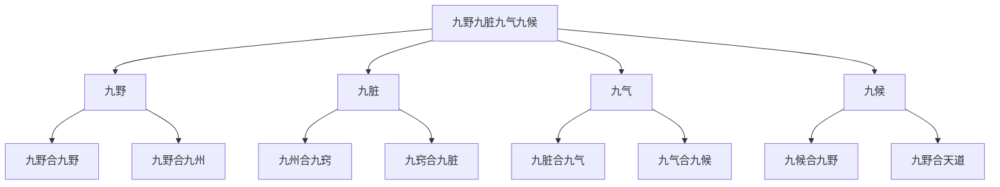

# 素问-三部九候论篇第二十

> "黄帝曰：余闻九针于夫子，众多博大，不可胜数。余愿闻要道，以属子孙，传之后世，著之骨髓，藏之肺肝，歃血而受，不敢妄泄，令合天道，必有终始，上应天光，星辰历纪，下副四时五行，贵贱更立，冬阴夏阳，以人应之奈何？" - 黄帝

---

## 📜 原文（节选）/ Original Text (Excerpt)

黄帝问曰：余闻九针于夫子，众多博大，不可胜数。余愿闻要道，以属子孙，传之后世，著之骨髓，藏之肺肝，歃血而受，不敢妄泄，令合天道，必有终始，上应天光，星辰历纪，下副四时五行，贵贱更立，冬阴夏阳，以人应之奈何？

岐伯对曰：妙乎哉问也！此天地之合，四海之内，九州之野，九野之数也。

帝曰：以人应之奈何？

岐伯曰：人有九野，九野合九野，九野合九州，九州合九窍，九窍合九脏，九脏合九气，九气合九候，九候合九野，九野合天道。

帝曰：何谓三部？

岐伯曰：有下部，有中部，有上部。部各有三候，三候者，有天有地有人也。必指而导之，乃以为真。

上部天，两额之动脉；上部地，两颊之动脉；上部人，耳前之动脉。

中部天，手太阴也；中部地，手阳明也；中部人，手少阴也。

下部天，足厥阴也；下部地，足少阴也；下部人，足太阴也。

故下部之天以候肝，地以候肾，人以候脾胃之气。

帝曰：中部之候奈何？

岐伯曰：亦有天，亦有地，亦有人。天以候肺，地以候胸中之气，人以候心。

帝曰：上部以候何脏？

岐伯曰：亦有天，亦有地，亦有人。天以候头角之气，地以候口齿之气，人以候耳目之气。

三部者，各有天，各有地，各有人。三而成天，三而成地，三而成人，三而三之，合为九候。

　　黄帝问曰：余闻九针于夫子，众多博大，不可胜数。余愿闻要道，以属子孙，传之后世，着之骨髓，藏之肝肺，歃血而受，不敢妄泄，令合[天道](https://www.guoxuemeng.com/gushici/72001.html)，必有终始，上应天光星辰历纪，下副四时[五行](https://www.guoxuemeng.com/guoxue/wuxing/)，贵贱更互，冬阴夏阳，以人应之奈何，愿闻其方。

　　岐伯对曰：妙乎哉问也!此天地之至数。

　　帝曰：愿闻天地之至数，合于人形，血气通，决死生，为之奈何？

　　岐伯曰：天地之至数，始于一，终于九焉。一者天，二者地，三者人，因而三之，三三者九，以应九野。故人有三部，部有三候，以决死生，以处百病，以调虚实，而除邪疾。

　　帝曰：何谓三部。

　　岐伯曰：有下部，有中部，有上部，部各有三候，三候者，有天有地有人也，必指而导之，乃以为真。上部天，两额之动脉；上部地，两颊之动脉；上部人，耳前之动脉。中部天，手太阴也；中部地，手阳明也；中部人，手少阴也。下部天，足厥阴也；下部地，足少阴也；下部人，足太阴也。故下部之天以候肝,地以候肾,人以候脾胃之气。

　　帝曰：中部之候奈何？

　　岐伯曰：亦有天，亦有地，亦有人。天以候肺，地以候胸中之气，人以候心。

　　帝曰：上部以何候之。

　　岐伯曰：亦有天，亦有地，亦有人，天以候头角之气，地以候口齿之气，人以候耳目之气。三部者，各有天，各有地，各有人。三而成天，三而成地，三而成人，三而三之，合则为九，九分为九野，九野为九藏。故神藏五，形藏四，合为九藏。五藏已败，其色必夭，夭必死矣。

　　帝曰：以候奈何？

　　岐伯曰：必先度其形之肥瘦，以调其气之虚实，实则泻之，虚则补之。必先去其血脉而后调之，无问其病，以平为期。

　　帝曰：决死生奈何？

　　岐伯曰：形盛脉细，少气不足以息者，危。形瘦脉大，胸中多气者，死。形气相得者，生。参伍不调者，病。三部九候皆相失者，死。上下左右之脉相应如参舂者，病甚。上下左右相失不可数者，死。中部之候虽独调，与众藏相失者，死。中部之候相减者，死。目内陷者死。

　　帝曰：何以知病之所在。

　　岐伯曰：察九候，独小者病，独大者病，独疾者病，独迟者病，独热者病，独寒者病，独陷下者病。以左手足上，去踝五寸按之，庶右手足当踝而弹之，其应过五寸以上，蠕蠕然者，不病；其应疾，中手浑浑然者，病；中手徐徐然者，病；其应上不能至五寸，弹之不应者，死。是以脱肉身不去者，死。中部乍疏乍数者，死。其脉代而钩者，病在络脉。九候之相应也，上下若一，不得相失。一候后则病，二候后则病甚，三候后则病危。所谓后者，应不俱也。察其府藏，以知死生之期。必先知经脉，然后知病脉，真藏脉见者胜死。足太阳气绝者，其足不可屈伸，死必戴眼。

　　帝曰：冬阴夏阳奈何？

　　岐伯曰：九候之脉，皆沉细悬绝者为阴，主冬，故以夜半死。盛躁喘数者为阳，主夏，故以日中死。是故寒热病者，以平旦死。热中及热病者，以日中死。病风者，以日夕死。病水者，以夜半死。其脉乍疏乍数乍迟乍疾者，日乘四季死。形肉已脱，九候虽调，犹死。七诊虽见，九候皆从者不死。所言不死者，风气之病，及经月之病，似七诊之病而非也，故言不死。若有七诊之病，其脉候亦败者死矣，必发哕噫。必审问其所始病，与今之所方病，而后各切循其脉，视其经络浮沉，以上下逆从循之，其脉疾者不病，其脉迟者病，脉不往来者死，皮肤着者死。

　　帝曰：其可治者奈何？

　　岐伯曰：经病者治其经，孙络病者治其孙络血，血病身有痛者，治其经络。其病者在奇邪，奇邪之脉则缪刺之。留瘦不移，节而刺之。上实下虚，切而从之，索其结络脉，刺出其血，以见通之。瞳子高者，太阳不足，戴眼者，太阳已绝，此决死生之要，不可不察也。手指及手外踝上五指，留针。

---

## 📖 白话文翻译（节选）/ Modern Chinese Translation (Excerpt)

黄帝问道：我听您讲九针的道理，众多博大，不可胜数。我希望听到其中的要道，用来传给子孙，传给后世，刻在骨髓中，藏在肺肝中，歃血接受，不敢随意泄露，让它合乎天道，一定有始有终，上应天光星辰历纪，下合四时五行，贵贱更替，冬阴夏阳，以人体相应是怎样的？

岐伯回答说：问得太好了！这是天地的配合，四海之内，九州的田野，九野的数目。

黄帝说：以人体相应是怎样的？

岐伯说：人有九野，九野合九野，九野合九州，九州合九窍，九窍合九脏，九脏合九气，九气合九候，九候合九野，九野合天道。

黄帝说：什么是三部？

岐伯说：有下部，有中部，有上部。每部各有三候，三候就是有天有地有人。必须指点引导，才能认为真实。

上部天，两额的动脉；上部地，两颊的动脉；上部人，耳前的动脉。

中部天，手太阴；中部地，手阳明；中部人，手少阴。

下部天，足厥阴；下部地，足少阴；下部人，足太阴。

所以下部的天用来候肝，地用来候肾，人用来候脾胃之气。

黄帝说：中部的候怎样？

岐伯说：也有天，也有地，也有人。天用来候肺，地用来候胸中之气，人用来候心。

黄帝说：上部候什么脏？

岐伯说：也有天，也有地，也有人。天用来候头角的气，地用来候口齿的气，人用来候耳目的气。

三部，各有天，各有地，各有人。三而成天，三而成地，三而成人，三而三之，合为九候。

　　黄帝问道：我听先生讲了九针道理后，觉得丰富广博，不可尽述。我想了解其中的主要道理，以嘱咐子孙，传于后世，铭心刻骨，永志不忘，并严守誓言，不敢妄泄。如何使这些道理符合于天体运行的规律，有始有终，上应于日月星辰周历天度之标志，下符合四时[五行](https://www.guoxuemeng.com/guoxue/wuxing/)阴阳盛衰的变化，人是怎样适应这些自然规律的呢？希望你讲解这方面的道理。

　　岐伯回答说：问得多好啊！这是天地间至为深奥的道理。

　　黄帝道：我愿闻天地的至数，与人的形体气血相通，以决断死生，是怎样一回事？

　　岐伯说：天地的至数，开始于一，终止于九。一奇数为阳，代表天，二偶数为阴代表地，人生天地之间，故以三代表人；天地人合而为三，三三为九，以应九野之数。所以人有三部，每部各有三侯，可以用它来决断死生，处理百病，从而调治虚实，祛除病邪。

　　黄帝道：什麽叫做三部呢？

　　岐伯说：有下部，有中部，有上部。每部各有三侯，所谓三侯，是以天、地、人来代表的。必须有[老师](https://www.guoxuemeng.com/gushici/zanmeilaoshi/)的当面指导，方能懂得部侯准确之处。上部天，即两额太阳脉处动脉；上部地，即两颊大迎穴处动脉；上部人，即耳前耳门穴处动脉；中部天，即两手太阴气口、经渠穴处动脉；中部地，即两手阴明经合谷处动脉；中部人，即两手少阴经神门处动脉；下部天，即足厥阴经五里穴或太冲穴处动脉；下部地，即足少阴经太溪穴处动脉；下部人，即足太阴经箕门穴处动脉。故而下部之可以天候肝脏之病变，下部之地可以侯肾脏之病变，下部之人可以侯脾胃之病变。

　　黄帝道：中部之侯怎样？

　　岐伯说：中部亦有天、地、人三侯。中部之天可以侯肺脏之病变，肿不之地可以侯胸中之病变。中部之人可以侯心脏之病变。

　　黄帝道：上部之侯又怎样？

　　岐伯说：上布也有天、地、人三侯。上部之天可以侯头角之病变，上部之地可以侯口齿之病变，上部之人可以侯耳目之病变。三部之中，各有天、各有地、各有人。三侯为天，三侯为地，三侯为人，三三相乘，合为九侯。脉之九侯，以应地之九野，以应人之九脏。所以人有肝、肺、心、脾、肾五神脏和膀胱、胃、大肠、小肠四形脏，合为九脏。若五脏以败，必见神色枯槁，枯槁者是病情危重，乃至死亡征象。

　　黄帝道：诊察的方法怎样？

　　岐伯说：必先度量病人的身形肥瘦，了解它的正气虚实，实证用泻法，虚症用补法。但必先去除血脉中的凝滞，而后调补气血的不足，不论治疗什麽病都是以达到气血平调为准则。

　　黄帝道：怎样决断死生？

　　岐伯说：形体盛，脉反细，气短，呼吸困难，危险；如形体瘦弱，脉反大，胸中喘满而多气的是死亡之症。一般而论；形体与脉一致的主生；若脉来三五不调者主病，三部九侯之脉与疾病完全不相适应的，主死；上下左右之脉，相应鼓指如春杵捣谷，参差不齐，病必严重；若见上下之脉相差甚大，而又息数错乱不可计数的，是死亡征候；中部之脉虽然独自调匀，而与其他众脏不相协调的，也是死侯；目内陷的为正气衰竭现象，也是死侯。

　　黄帝道：怎样知道病的部位呢？

　　岐伯说：从诊察九侯脉的异常变化，就能知病变部位。九侯之中，有一部独小，或独大，或独疾，或独迟，或独热，或独寒，或独陷下（沉伏），均是有病的现象。以左手加于病人的左足上，距离内踝五寸处按着，以右手指在病人足内踝上弹之，医者之左手即有振动的感觉，如其振动的范围超过五寸以上，蠕蠕而动，为正常现象；如其振动急剧而大，应手快速而浑乱不清的，为病态；若振动微弱，应手迟缓，应为病态；如若振动不能上及五寸，用较大的力量弹之，仍没有反应，是为死侯。身体极度消瘦，体弱不能行动，是死亡之征。中部之脉或快或慢，无规律，为气脉败乱之兆，亦为死征。如脉代而钩，为病在络脉。九侯之脉，应相互适应，上下如一，不应该有参差。如九侯之中有一侯不一致，则病必危险。所谓不一致，就是九侯之间，脉动的不相适应。诊察病邪所在之脏腑，以知死生的时间。临症诊察，必先知道正常之脉，然后才能知道有病之脉；若见到真脉脉象，胜己的时间，变要死亡。足太阳经脉气绝，则两足不能屈伸，死亡之时，必目睛上视。

　　黄帝道：冬为阴，夏为阳，脉象与之相应如何？

　　岐伯说：九侯的脉象，都是沉细悬绝的，为阴，冬令死于阴气极盛之夜半；如脉盛大躁动喘而疾数的，为阳，主夏令，所以死于阳气旺盛之日中；寒热交作的病，死于阴阳交会的平旦之时；热中及热病，死于日中阳极之时；病风死于傍晚阳衰之时；病水死于夜半阴极之时。其脉象忽疏忽数，忽迟忽急，乃脾气内绝，死于辰＃丑未之时，，也就是平旦、日中、日夕、夜半、日乘四季的时候；若形坏肉脱，虽九侯协调，犹是死亡的征象；假使七诊之脉虽然出现，而九侯都顺于四时的，就不一定是死侯。所说不死的病，指心感风病，或月经之病，虽见类似七诊之病脉，而实不相同，所以说不是死侯。若七诊出现、其脉侯有败坏现象的，这是死征，死的时候，必发呃逆等证侯。所以治病之时，必须详细询问他的起病情形和现在症状，然后按各部分，切其脉搏，以观察其经络的浮沉，以及上下逆顺。如其脉来流利的，不病；脉来迟缓的，是病；脉不往来的，是死侯；久病肉脱，皮肤干枯着于筋骨的，亦是死侯。

　　黄帝道：那些可治的病，应怎样治疗呢？

　　岐伯说：病在经的，刺其经；病在孙络的，刺其孙络使它出血；血病而有身痛症状的，则治其经与络。若病邪留在大络，则用右病刺左、左病刺右的缪刺法治之。若邪气久留不移，当于四肢八溪之间、骨节交会之处刺之。上实下虚，当切按气脉，而探索气脉络郁结的所在，刺出其血，以通其气。如目上视的，是太阳经气不足。目上视而又定直不动的，是太阳经气已绝。这是判断死生的要诀，不可不认真研究。

---

## 🔑 核心要点 / Core Concepts

### 1. 三部九候系统 / Three Regions and Nine Observations System

| 部位 | 天 | 地 | 人 |
|------|------|------|------|
| 上部 | 两额之动脉 | 两颊之动脉 | 耳前之动脉 |
| 中部 | 手太阴（肺） | 手阳明（胸中） | 手少阴（心） |
| 下部 | 足厥阴（肝） | 足少阴（肾） | 足太阴（脾胃） |

### 2. 三部九候对应脏腑 / Three Regions and Nine Observations Corresponding to Zang-Fu

| 部位 | 天候 | 地候 | 人候 |
|------|------|------|------|
| 上部 | 头角之气 | 口齿之气 | 耳目之气 |
| 中部 | 肺 | 胸中之气 | 心 |
| 下部 | 肝 | 肾 | 脾胃之气 |

### 3. 九野九脏九气九候 / Nine Fields Nine Zang Nine Qi Nine Observations

---

## 📚 理论解释 / Theoretical Analysis

### 三部九候理论 / Three Regions and Nine Observations Theory

> [!info] 核心概念
- 人分三部，每部有三候
- 三部九候合为九候
- 九候合天道

#### 三部详解 / Detailed Three Regions

**1. 上部 / Upper Region**
- 上部天：两额之动脉
- 上部地：两颊之动脉
- 上部人：耳前之动脉

**2. 中部 / Middle Region**
- 中部天：手太阴（肺）
- 中部地：手阳明（胸中）
- 中部人：手少阴（心）

**3. 下部 / Lower Region**
- 下部天：足厥阴（肝）
- 下部地：足少阴（肾）
- 下部人：足太阴（脾胃）

#### 九候详解 / Detailed Nine Observations

**1. 上部三候 / Upper Region Three Observations**
- 上部天：候头角之气
- 上部地：候口齿之气
- 上部人：候耳目之气

**2. 中部三候 / Middle Region Three Observations**
- 中部天：候肺
- 中部地：候胸中之气
- 中部人：候心

**3. 下部三候 / Lower Region Three Observations**
- 下部天：候肝
- 下部地：候肾
- 下部人：候脾胃之气

### 九野九脏九气九候理论 / Nine Fields Nine Zang Nine Qi Nine Observations Theory

> [!warning] 核心理念
- 人有九野，合天道
- 九野合九州，九州合九窍
- 九窍合九脏，九脏合九气
- 九气合九候，九候合天道

#### 九野九脏九气九候关系 / Relationship of Nine Fields Nine Zang Nine Qi Nine Observations

**1. 九野 / Nine Fields**
- 四海之内，九州之野
- 九野之数
- 九野合天道

**2. 九脏 / Nine Zang**
- 九州合九窍
- 九窍合九脏
- 九脏合九气

**3. 九气 / Nine Qi**
- 九脏合九气
- 九气合九候
- 九候合九野

**4. 九候 / Nine Observations**
- 九候合九野
- 九野合天道
- 上应天光，下副四时五行

---

## 🏥 中医实践应用 / TCM Practice Application

### 三部九候脉诊应用 / Three Regions and Nine Observations Pulse Diagnosis Application

#### 现代三部九候脉诊要点 / Modern Three Regions and Nine Observations Pulse Diagnosis Key Points

**1. 上部脉诊 / Upper Region Pulse Diagnosis**
- 上部天：两额之动脉（头角之气）
- 上部地：两颊之动脉（口齿之气）
- 上部人：耳前之动脉（耳目之气）

**2. 中部脉诊 / Middle Region Pulse Diagnosis**
- 中部天：手太阴（肺）
- 中部地：手阳明（胸中之气）
- 中部人：手少阴（心）

**3. 下部脉诊 / Lower Region Pulse Diagnosis**
- 下部天：足厥阴（肝）
- 下部地：足少阴（肾）
- 下部人：足太阴（脾胃之气）

### 现代医学启示 / Modern Medical Insights

**1. 综合诊断 / Comprehensive Diagnosis**
- 多部位检查：头、胸、腹、四肢
- 多指标评估：脉搏、呼吸、血压、体温
- 整体观念：人体各部位相互关联

**2. 个体化治疗 / Individualized Treatment**
- 根据不同部位的情况制定治疗方案
- 考虑个体差异
- 综合评估

---

## 🔗 相关链接 / Related Links

- [[MOC-黄帝内经知识库]] - 主索引
- [[黄帝内经-素问索引]] - 素问索引
- [[黄帝内经-核心理论]] - 核心理论体系
- [[素问17-脉要精微论篇]] - 脉象精微
- [[素问18-平人气象论篇]] - 平人脉象

### 易学关联 / Yi Jing Connection

- [[MOC-易经知识库]] - 易经索引
- [[20260201-0008 八卦]] - 八卦理论

**易学与三部九候的联系:**
- 三才理论：易学的三才理论与中医三部九候相通
- 天人合一：易学的天人合一思想与中医天人相应相通

---

## 💡 学习要点 / Learning Points

### 掌握重点 / Key Points to Master

- [ ] 理解三部九候的概念
- [ ] 掌握三部九候的部位
- [ ] 学会运用三部九候诊断疾病
- [ ] 了解九野九脏九气九候的关系

### 思考问题 / Questions for Reflection

1. **为什么说"三部者，各有天，各有地，各有人"？**
   - 三部各有三候：天、地、人
   - 三而三之，合为九候
   - 上应天光，下副四时五行

2. **现代医学如何应用"三部九候"？**
   - 多部位检查
   - 综合诊断
   - 个体化治疗

---

## 📊 学习进度 / Learning Progress

### 完成情况 / Completion Status

| 学习内容 | 状态 | 备注 |
|---------|------|------|
| 原文诵读 | 📝 进行中 | 建议每日诵读 |
| 白话文理解 | ✅ 已完成 | 理解主要含义 |
| 三部九候 | ✅ 已完成 | 掌握系统 |
| 诊断应用 | 📝 进行中 | 需要临床实践 |
| 理论分析 | ✅ 已完成 | 理解理论 |

---

## 🔄 更新日志 / Update Log

### 2026-02-03

- ✅ 创建三部九候论篇第二十笔记
- ✅ 完成原文、白话文翻译（节选）
- ✅ 整理三部九候对照表
- ✅ 编写三部九候理论

---

**笔记创建日期**：2026年2月3日

**最后更新**：2026年2月3日
