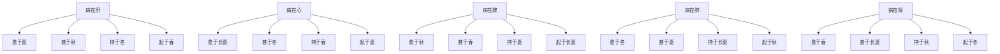

# 素问-脏气法时论篇第二十二

> "黄帝曰：脏气法时论何如？岐伯曰：肝主春，足厥阴少阳主治，其日甲乙，肝苦急，急食甘以缓之。" - 岐伯

---

## 📜 原文（节选）/ Original Text (Excerpt)

黄帝曰：脏气法时论何如？

岐伯曰：肝主春，足厥阴少阳主治，其日甲乙，肝苦急，急食甘以缓之。

心主夏，手少阴太阳主治，其日丙丁，心苦缓，急食酸以收之。

脾主长夏，足太阴阳明主治，其日戊己，脾苦湿，急食苦以燥之。

肺主秋，手太阴阳明主治，其日庚辛，肺苦气上逆，急食苦以泄之。

肾主冬，足少阴太阳主治，其日壬癸，肾苦燥，急食辛以润之。

肝色青，宜食甘，粳米、牛肉、枣、葵皆甘。心色赤，宜食酸，小豆、犬肉、李、韭皆酸。肺色白，宜食苦，麦、羊肉、杏、薤皆苦。肾色黑，宜食辛，黄黍、鸡肉、桃、葱皆辛。脾色黄，宜食咸，大豆、豕肉、栗、藿皆咸。

病在肝，愈于夏，夏不愈，甚于秋，秋不死，持于冬，起于春，禁当风。

病在心，愈于长夏，长夏不愈，甚于冬，冬不死，持于春，起于夏，禁温食热衣。

病在脾，愈于秋，秋不愈，甚于春，春不死，持于夏，起于长夏，禁湿食饱食。

病在肺，愈于冬，冬不愈，甚于夏，夏不死，持于长夏，起于秋，禁寒饮食寒衣。

病在肾，愈于春，春不愈，甚于长夏，长夏不死，持于秋，起于冬，禁犯焠热食温炙衣。

　　黄帝问曰：合人形以法四时[五行](https://www.guoxuemeng.com/guoxue/wuxing/)而治，何如而从，何如而逆，得失之意，愿闻其事。

　　岐伯对曰：五行者，金木水火土也，更贵更贱，以知死生，以决成败，而定五藏之气，间甚之时，死生之期也。

　　帝曰：愿卒闻之。

　　岐伯曰：肝主春，足厥阴少阳主治，其日甲乙，肝苦急，急食甘以缓之。心主夏，手少阴太阳主治，其日丙丁，心苦缓，急食酸以收之。脾主长夏，足太阴阳明主治，其日戊己，脾苦湿，急食苦以燥之。肺主秋，手太阴阳明主治，其日庚辛，肺苦气上逆，急食苦以泄之。肾主冬，足少阴太阳主治，其日壬癸，肾苦燥，急食辛以润之，开腠理，致津液，通气也。

　　病在肝，愈于夏，夏不愈，甚于秋，秋不死，持于冬，起于春，禁当风。肝病者，愈在丙丁，丙丁不愈，加于庚辛，庚辛不死，持于壬癸，起于甲乙。肝病者，平旦慧，下晡甚，夜半静。肝欲散，急食辛以散之，用辛补之，酸泻之。

　　病在心，愈在长夏，长夏不愈，甚于冬，冬不死，持于春，起于夏，禁温食热衣。心病者，愈在戊己，戊己不愈，加于壬癸，壬癸不死，持于甲乙，起于丙丁。心病者，日中慧，夜半甚，平旦静。心欲软，急食咸以软之，用咸补之，甘泻之。

　　病在脾，愈在秋，秋不愈，甚于春，春不死，持于夏，起于长夏，禁温食饱食湿地濡衣。脾病者，愈在庚辛，庚辛不愈，加于甲乙，甲乙不死，持于丙丁，起于戊己。脾病者，日昳慧，日出甚，下晡静。脾欲缓，急食甘以缓之，用苦泻之，甘补之。

　　病在肺，愈在冬，冬不愈，甚于夏，夏不死，持于长夏，起于秋，禁寒饮食寒衣。肺病者，愈在壬癸，壬癸不愈，加于丙丁，丙丁不死，持于戊己，起于庚辛。肺病者，下晡慧，日中甚，夜半静。肺欲收，急食酸以收之，用酸补之，辛泻之。

　　病在肾，愈在春，春不愈，甚于长夏，长夏不死，持于秋，起于冬，禁犯焠㶼[xī] 热食温灸衣。肾病者，愈在甲乙，甲乙不愈，甚于戊己，戊己不死，持于庚辛，起于壬癸。肾病者，夜半慧，四季甚，下晡静。肾欲坚，急食苦以坚之，用苦补之，咸泻之。

　　夫邪气之客于身也，以胜相加，至其所生而愈，至其所不胜而甚，至于所生而持，自得其位而起。必先定五藏之脉，乃可言间甚之时，死生之期也。肝病者，两胁下痛引少腹，令人善怒，虚则目盳盳无所见，耳无所闻，善恐，如人将捕之，取其经，厥阴与少阳，气逆，则头痛耳聋不聪颊肿。取血者。

　　心病者，胸中痛，胁支满，胁下痛，膺背肩甲间痛，两臂内痛；虚则胸腹大，胁下与腰相引而痛，取其经，少阴太阳，舌下血者。其变病，刺郄中血者。

　　脾病者，身重善肌肉痿，足不收行，善瘈，脚下痛；虚则腹满肠鸣，飧泄食不化，取其经，太阴阳明少阴血者。

　　肺病者，喘咳逆气，肩背痛，汗出，尻阴股膝髀腨胻足皆痛；虚则少气不能报息，耳聋嗌干，取其经，太阴足太阳之外厥阴内血者。

　　肾病者，腹大胫肿，喘咳身重，寝汗出，憎风；虚则胸中痛，大腹小腹痛，清厥意不乐，取其经，少阴太阳血者。

　　肝色青，宜食甘，粳米牛肉枣葵皆甘。心色赤，宜食酸，小豆犬肉李韭皆酸。肺色白，宜食苦，麦羊肉杏薤皆苦。脾色黄，宜食咸，大豆豕肉栗藿皆咸。肾色黑，宜食辛，黄黍鸡肉桃葱皆辛。辛散，酸收，甘缓，苦坚，咸软。

　　毒药攻邪，五谷为养，五果为助，五畜为益，五菜为充，气味合而服之，以补精益气。此五者，有辛酸甘苦咸，各有所利，或散，或收，或缓，或急，或坚，或软，四时五藏，病随五味所宜也。

---

## 📖 白话文翻译（节选）/ Modern Chinese Translation (Excerpt)

黄帝问道：脏气法时论是怎样的？

岐伯说：肝主管春季，足厥阴少阳主治，其日甲乙，肝苦于拘急，急食甘味以缓解它。

心主管夏季，手少阴太阳主治，其日丙丁，心苦于迟缓，急食酸味以收敛它。

脾主管长夏，足太阴阳明主治，其日戊己，脾苦于湿，急食苦味以燥湿。

肺主管秋季，手太阴阳明主治，其日庚辛，肺苦于气机上逆，急食苦味以泄降它。

肾主管冬季，足少阴太阳主治，其日壬癸，肾苦于燥，急食辛味以滋润它。

肝色青，适宜吃甘味食物，粳米、牛肉、枣、葵菜都是甘味。心色赤，适宜吃酸味食物，小豆、狗肉、李子、韭菜都是酸味。肺色白，适宜吃苦味食物，麦子、羊肉、杏子、薤白都是苦味。肾色黑，适宜吃辛味食物，黄黍、鸡肉、桃子、葱都是辛味。脾色黄，适宜吃咸味食物，大豆、猪肉、栗子、藿菜都是咸味。

病在肝，夏季痊愈，夏季不愈，秋季加重，秋季不死，冬季保持，春季起病，禁忌当风。

病在心，长夏痊愈，长夏不愈，冬季加重，冬季不死，春季保持，夏季起病，禁忌温食热衣。

病在脾，秋季痊愈，秋季不愈，春季加重，春季不死，夏季保持，长夏起病，禁忌湿食饱食。

病在肺，冬季痊愈，冬季不愈，夏季加重，夏季不死，长夏保持，秋季起病，禁忌寒饮食寒衣。

病在肾，春季痊愈，春季不愈，长夏加重，长夏不死，秋季保持，冬季起病，禁忌犯焠热食温炙衣。

　　黄帝问道：结合人体五脏之气的具体情况，取法四时[五行](https://www.guoxuemeng.com/guoxue/wuxing/)的生克制化规律，作为救治疾病的法则，怎样是从？怎样是逆呢？我想了解治法中的从逆和得失是怎麽一会事。

　　岐伯回答说：五行就是金、木、水、火、土，配合时令气候，有衰旺盛克的变化，从这些变化中可以测知疾病的死生，分析医疗的成败，并能确定五脏之气的盛衰、疾病轻重的时间，以及死生的日期。

　　黄帝说：我想听你详尽地讲一讲。

　　岐伯说：肝属木、旺于春，肝与胆为表里，[春天](https://www.guoxuemeng.com/gushici/chuntiandegushi/)是足厥阴肝和足少阳胆主治的时间，甲乙属木，足少阳胆主甲木，足厥阴肝主乙木，所以肝胆旺日为甲乙；肝在志为怒，怒则气急，甘味能缓急，故宜急食甘以缓之。心属火，旺于夏，心与小肠为表里，[夏天](https://www.guoxuemeng.com/gushici/xiatiandegushi/)是手少阴和手太阳小肠主治的时间；丙丁属火，手少阴心主丁火，手太阳小肠主丙火，所以心与小肠的旺日为丙丁；心在志为喜，喜则气缓，心气过缓则心气虚而散，酸味能收敛，故宜急食酸以收之。脾属土，旺于长夏（六月），脾与胃为表里，长夏是足太阴脾和足阳明胃主治的时间；戊已属土，主太阴脾主已土，主阳明胃主戊土，所以脾与胃的旺日为戊已；脾性恶湿，湿盛则伤脾，苦味能燥湿，故宜急食苦以燥之。肺属金，旺于秋；肺与大肠为表里，[秋天](https://www.guoxuemeng.com/gushici/qiutiandegushi/)是手太阴肺和手阳明大肠主治的时间；庚辛属金，手太阴肺主辛金，手阳明大肠主庚金，所以肺与大肠的旺日为庚辛；肺主气，其性清肃，若气上逆则肺病，苦味能泄，故宜急食苦以泄之。肾属水，旺于冬，肾与膀胱为表里，[冬天](https://www.guoxuemeng.com/gushici/dongtiandegushi/)是足少阴肾与足太阴膀胱主治的时间；壬癸属水，足少阴肾主癸水，足太阳膀胱主壬水，所以肾与膀胱的旺日为壬癸；肾为水脏，喜润而恶燥，故宜急食辛以润之。如此可以开发腠理，运行津液，宜通五脏之气。

　　肝脏有病，在夏季当愈，若至夏季不愈，到秋季病情就要加重；如秋季不死，至冬季病情就会维持稳定不变状态，到来年春季，病即好转。因风气通于肝，故肝并最禁忌受风。有肝病的人，愈于丙丁日；如果丙丁日不愈，到庚辛日病就加重；如果庚辛日不死，到壬癸日病情就会维持稳定不变状态，到了甲乙日病即好转。患肝病的人，在早晨的时候精神清爽，傍晚的时候病就加重。到半夜时便安静下来。肝木性喜条达而恶抑郁，故肝病急用辛味以散之，若需要补以辛味补之，若需要泻，以酸味泻之。

　　心脏有病，愈于长夏；若至长夏不愈，到了冬季病情就会加重；如果在冬季不死，到了明年的春季病情就会维持稳定不变状态，到了夏季病即好转。心有病的人应禁忌温热食物，衣服也不能穿的太暖。有心病的人，愈于戊已日；如果戊已日不愈，到壬癸日病就加重；如果在壬癸日不死，到甲已日病情就会维持稳定不变状态，到丙丁日病即好转。心脏有病的人，在中午的时候神情爽慧，半夜时病就加重，早晨时便安静了。心病欲柔软，宜急食咸味以软之，需要补则以咸味补之，以肝味泻之。

　　脾脏有病，愈于秋季；若至秋季不愈，到春季病就加重；如果在春季不死，到夏季病情就会维持稳定不变状态，到长夏的时间病即好转。脾病应禁忌吃温热性食物即饮食过饱、居湿地、穿湿衣等。脾有病的人，愈于庚辛日；如果在庚辛日不愈，到甲已日加重；如果在甲已日不死，到丙丁日病情就会维持稳定不变状态，到了戊已日病即好转。脾有病的人，在午后的时间精神清爽，日出时病就加重，傍晚是便安静了。脾脏病需要缓和，甘能缓中，故宜急食甘味以缓之，需要泻则用苦味药泻脾，以甘味补脾。

　　肺脏有病，愈于冬季；若至冬季不愈，到夏季病就加重；如果在夏季不死，至长夏时病情就会维持稳定不变状态，到了秋季病即好转。肺有病应禁忌寒冷饮食及穿的太单薄。肺有病的人，愈于壬癸日；如果在壬癸日不愈，到丙丁日病就加重；如果在丙丁日不死，到戊已日病情就会维持稳定不变状态，到了庚辛日，病即好转。肺有病的人，傍晚的时候精神爽慧，到中午时病就加重，到半夜时变安静了。肺气欲收敛，宜急食酸味以收敛，需要补的，用酸味补肺，需要泻的，用辛味泻肺。

　　肾脏有病，愈于春季；若至春季不愈，到长夏时病就加重；如果在长夏不死，到秋季病情就会维持稳定不变状态，到冬季病即好转。肾病禁食炙过热的食物和穿经火烘烤过的衣服。肾有病的人，愈于甲已日；如果在甲已日不愈，到戊已日病就加重；如果在戊已日不死，到庚辛日病情就会维持稳定不变状态，到壬癸日病即好转。肾有病的人，在半夜的时候精神爽慧，在一日当中辰、戌、丑、未四个时辰病情加重，在傍晚时便安静了。肾主必藏，其气欲坚，需要补的，宜急食苦味以坚之，用苦味补之，需要泻的，用咸味泻之。

　　凡是邪气侵袭人体，都是以胜相加，病至其所生之时而愈，至其所不胜之时而甚，至其所生之时而病情稳定不变，至其自旺之时病情好转。但必须先明确五脏之平脉，然后始能推测疾病的轻重时间及死生的日期。

　　肝脏有病，则两肋下疼痛牵引少腹，使人多怒，这是肝气实的症状；如果肝气虚，则出现两目昏花而视物不明，两耳也听不见声音，多恐惧，好象有人要逮捕他一样。治疗时，取用厥阴肝经和少阳胆经的经穴。如肝气上逆，则头痛、耳聋而听觉失灵、颊肿，应取厥阴、少阳经脉，刺出其血。

　　心脏有病，则出现胸中痛，肋部支撑胀满，肋下痛，胸膺部、背部及肩胛间疼痛，两臂内侧疼痛，这是心实的症状。心虚，则出现胸腹部胀大，肋下和腰部牵引作痛。治疗时，取少阴心经和太阳小肠经的经穴，并刺舌下之脉以出其血。如病情有变化，与初起不同，刺委中穴出血。

　　脾脏有病，则出现身体沉重，易饥，肌肉痿软无力，两足弛缓不收，行走时容易抽搐，脚下疼痛，这是脾实的症状；脾虚则腹部胀满，肠鸣，泄下而食物不化。治疗时，取太阴脾经、阳明胃经和少阴肾经的经穴，刺出其血。

　　肺脏有病，则喘咳气逆，肩背部疼痛，出汗，尻、阴、股、膝、髀骨、足等部皆疼痛，这是肺实的症状；如果肺虚，就出现少气，呼吸困难而难于接续，耳聋，咽干。治疗时，取太阴肺经的经穴，更取足太阳经的外侧及足厥阴内侧，即少阴肾经的经穴，刺出其血。

　　肾脏有病，则腹部胀大，胫部浮肿，气喘，咳嗽，身体沉重，睡后出汗，恶风，这是肾实的症状；如果肾虚，就会出现胸中疼痛，大腹和小腹疼痛，四肢厥冷，心中不乐。治疗时，取足少阴肾经和足太阳膀胱经的经穴，刺出其血。

　　肝合青色，宜食甘味，粳米、牛肉、枣、葵菜都是属于味甘的。心合赤色，宜食酸味，小豆、犬肉、李、韭都是属于酸味的。肺合白色，宜食苦味，小麦、羊肉、杏、薤都是属于苦味的。脾合黄色，宜食咸味，大豆、猪肉、栗、藿都是属于咸味的。肾合黑色，宜食辛味，黄黍、鸡肉、桃、葱都是属于辛味的。五味的功用：辛味能发散，酸味能收敛，甘味能缓急，苦味能坚燥，咸味能坚。凡毒药都是可用来攻逐病邪，五谷用以充养五脏之气，五果帮助五谷以营养人体，五畜用以补益五脏，五菜用以充养脏腑，气味和合而服食，可以补益精气。这五类食物，各有辛、酸、甘、苦、咸的不同气味，各有利于某一脏气，或散，或收，或缓，或急，或坚等，在运用的时候，要根据春、夏、秋、冬四时和五脏之气的偏盛偏衰及苦欲等具体情况，各随其所宜而用之。

---

## 🔑 核心要点 / Core Concepts

### 1. 五脏与四季对应 / Five Zang and Four Seasons

| 脏 | 季节 | 经脉 | 日 | 苦 | 食 |
|------|------|------|------|------|------|
| 肝 | 春 | 足厥阴少阳 | 甲乙 | 急 | 甘 |
| 心 | 夏 | 手少阴太阳 | 丙丁 | 缓 | 酸 |
| 脾 | 长夏 | 足太阴阳明 | 戊己 | 湿 | 苦 |
| 肺 | 秋 | 手太阴阳明 | 庚辛 | 气上逆 | 苦 |
| 肾 | 冬 | 足少阴太阳 | 壬癸 | 燥 | 辛 |

### 2. 五色五味食物 / Five Colors and Five Flavors Food

| 脏 | 色 | 宜食 | 食物 |
|------|------|------|------|
| 肝 | 青 | 甘 | 粳米、牛肉、枣、葵 |
| 心 | 赤 | 酸 | 小豆、犬肉、李、韭 |
| 脾 | 黄 | 咸 | 大豆、豕肉、栗、藿 |
| 肺 | 白 | 苦 | 麦、羊肉、杏、薤 |
| 肾 | 黑 | 辛 | 黄黍、鸡肉、桃、葱 |

### 3. 五脏病愈甚持起 / Five Zang Disease Recovery Worsening Maintaining Onset

---

## 📚 理论解释 / Theoretical Analysis

### 五脏法时理论 / Five Zang Corresponding to Four Seasons Theory

> [!info] 核心概念
- 五脏各有主管的季节
- 五脏各有苦证
- 五脏各有适宜的食物

#### 五脏法时详解 / Detailed Five Zang Corresponding to Four Seasons

**1. 肝主春 / Liver Governing Spring**
- 经脉：足厥阴少阳
- 日：甲乙
- 苦：急
- 食：甘

**2. 心主夏 / Heart Governing Summer**
- 经脉：手少阴太阳
- 日：丙丁
- 苦：缓
- 食：酸

**3. 脾主长夏 / Spleen Governing Long Summer**
- 经脉：足太阴阳明
- 日：戊己
- 苦：湿
- 食：苦

**4. 肺主秋 / Lung Governing Autumn**
- 经脉：手太阴阳明
- 日：庚辛
- 苦：气上逆
- 食：苦

**5. 肾主冬 / Kidney Governing Winter**
- 经脉：足少阴太阳
- 日：壬癸
- 苦：燥
- 食：辛

### 五色五味食物理论 / Five Colors and Five Flavors Food Theory

> [!warning] 核心理念
- 五脏各有对应的颜色
- 五脏各有适宜的五味
- 食物可以调养五脏

#### 五色五味食物详解 / Detailed Five Colors and Five Flavors Food

**1. 肝色青宜食甘 / Liver Color Green Eat Sweet**
- 颜色：青
- 宜食：甘
- 食物：粳米、牛肉、枣、葵

**2. 心色赤宜食酸 / Heart Color Red Eat Sour**
- 颜色：赤
- 宜食：酸
- 食物：小豆、犬肉、李、韭

**3. 脾色黄宜食咸 / Spleen Color Yellow Eat Salty**
- 颜色：黄
- 宜食：咸
- 食物：大豆、豕肉、栗、藿

**4. 肺色白宜食苦 / Lung Color White Eat Bitter**
- 颜色：白
- 宜食：苦
- 食物：麦、羊肉、杏、薤

**5. 肾色黑宜食辛 / Kidney Color Black Eat Pungent**
- 颜色：黑
- 宜食：辛
- 食物：黄黍、鸡肉、桃、葱

### 五脏病愈甚持起理论 / Five Zang Disease Recovery Worsening Maintaining Onset Theory

> [!note] 病程规律
- 五脏病各有痊愈的季节
- 五脏病各有加重的季节
- 五脏病各有保持的季节
- 五脏病各有起病的季节

#### 五脏病愈甚持起详解 / Detailed Five Zang Disease Recovery Worsening Maintaining Onset

**1. 病在肝 / Disease in Liver**
- 愈于夏：夏季痊愈
- 甚于秋：秋季加重
- 持于冬：冬季保持
- 起于春：春季起病
- 禁忌：当风

**2. 病在心 / Disease in Heart**
- 愈于长夏：长夏痊愈
- 甚于冬：冬季加重
- 持于春：春季保持
- 起于夏：夏季起病
- 禁忌：温食热衣

**3. 病在脾 / Disease in Spleen**
- 愈于秋：秋季痊愈
- 甚于春：春季加重
- 持于夏：夏季保持
- 起于长夏：长夏起病
- 禁忌：湿食饱食

**4. 病在肺 / Disease in Lung**
- 愈于冬：冬季痊愈
- 甚于夏：夏季加重
- 持于长夏：长夏保持
- 起于秋：秋季起病
- 禁忌：寒饮食寒衣

**5. 病在肾 / Disease in Kidney**
- 愈于春：春季痊愈
- 甚于长夏：长夏加重
- 持于秋：秋季保持
- 起于冬：冬季起病
- 禁忌：犯焠热食温炙衣

---

## 🏥 中医实践应用 / TCM Practice Application

### 五脏饮食调养 / Five Zang Dietary Regulation

#### 现代五脏饮食调养要点 / Modern Five Zang Dietary Regulation Key Points

**1. 肝脏调养 / Liver Regulation**
- 食物：甘味食物
- 避免：辛辣刺激
- 建议：粳米、牛肉、枣、葵

**2. 心脏调养 / Heart Regulation**
- 食物：酸味食物
- 避免：过度兴奋
- 建议：小豆、犬肉、李、韭

**3. 脾脏调养 / Spleen Regulation**
- 食物：咸味食物
- 避免：湿食饱食
- 建议：大豆、猪肉、栗、藿

**4. 肺脏调养 / Lung Regulation**
- 食物：苦味食物
- 避免：寒饮食
- 建议：麦、羊肉、杏、薤

**5. 肾脏调养 / Kidney Regulation**
- 食物：辛味食物
- 避免：犯焠热食
- 建议：黄黍、鸡肉、桃、葱

---

## 🔗 相关链接 / Related Links

- [[MOC-黄帝内经知识库]] - 主索引
- [[黄帝内经-素问索引]] - 素问索引
- [[黄帝内经-核心理论]] - 核心理论体系
- [[素问21-经脉别论篇]] - 经脉别论
- [[素问23-宣明五气篇]] - 宣明五气

### 易学关联 / Yi Jing Connection

- [[MOC-易经知识库]] - 易经索引
- [[20260201-0002 五行]] - 五行理论

**易学与脏气法时的联系:**
- 四时理论：易学的四时理论与中医五脏法时相通
- 五行对应：易学的五行理论与中医五脏五味相通

---

## 💡 学习要点 / Learning Points

### 掌握重点 / Key Points to Master

- [ ] 理解五脏与四季的对应关系
- [ ] 掌握五色五味食物的分类
- [ ] 学会五脏病的病程规律
- [ ] 了解五脏饮食调养方法

### 思考问题 / Questions for Reflection

1. **为什么说"肝苦急，急食甘以缓之"？**
   - 肝主疏泄，急则肝气郁结
   - 甘味缓急，缓解肝气急
   - 食疗调理，辅助治疗

2. **现代医学如何应用"脏气法时"？**
   - 季节性疾病预防
   - 五脏饮食调理
   - 个体化营养方案

---

## 📊 学习进度 / Learning Progress

### 完成情况 / Completion Status

| 学习内容 | 状态 | 备注 |
|---------|------|------|
| 原文诵读 | 📝 进行中 | 建议每日诵读 |
| 白话文理解 | ✅ 已完成 | 理解主要含义 |
| 五脏法时 | ✅ 已完成 | 掌握对应关系 |
| 五色五味 | 📝 进行中 | 需要临床实践 |
| 理论分析 | ✅ 已完成 | 理解理论 |

---

## 🔄 更新日志 / Update Log

### 2026-02-03

- ✅ 创建脏气法时论篇第二十二笔记
- ✅ 完成原文、白话文翻译（节选）
- ✅ 整理五脏与四季对应对照表
- ✅ 编写五脏法时和五色五味理论

---

**笔记创建日期**：2026年2月3日

**最后更新**：2026年2月3日
