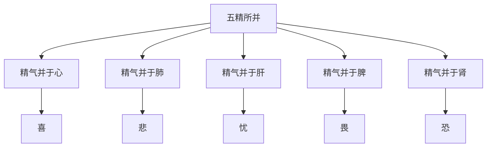

# 素问-宣明五气篇第二十三

> "五味所入：酸入肝，辛入肺，苦入心，咸入肾，甘入脾，是谓五入。" - 岐伯

---

## 📜 原文（节选）/ Original Text (Excerpt)

五味所入：酸入肝，辛入肺，苦入心，咸入肾，甘入脾，是谓五入。

五气所病：心为噫，肺为咳，肝为语，脾为吞，肾为欠、为嚏，胃为气逆、为哕、为恐，大肠小肠为泄，下焦溢为水，膀胱不利为癃，不约为遗溺，胆为怒，是谓五病。

五精所并：精气并于心则喜，并于肺则悲，并于肝则忧，并于脾则畏，并于肾则恐，是谓五并，虚而相并者也。

五脏所恶：心恶热，肺恶寒，肝恶风，脾恶湿，肾恶燥，是谓五恶。

五脏化液：心主汗，肺主涕，肝主泪，脾主涎，肾主唾，是谓五液。

五味所禁：辛走气，气病无多食辛；咸走血，血病无多食咸；苦走骨，骨病无多食苦；甘走肉，肉病无多食甘；酸走筋，筋病无多食酸，是谓五禁，是谓五裁。

五病所发：阴病发于骨，阳病发于血，阴病发于肉，阳病发于冬，阴病发于夏，是谓五发。

五邪所乱：邪入于阳则狂，邪入于阴则痹，搏阳则为巅疾，搏阴则为喑，阳入之阴则静，阴出之阳则怒，是谓五乱。

五劳所伤：久视伤血，久卧伤气，久坐伤肉，久立伤骨，久行伤筋，是谓五劳所伤。

　　五味所入：酸入肝，辛入肺，苦入心，咸入肾，甘入脾，是谓五入。

　　五气所病：心为噫，肺为咳，肝为语，脾为吞，肾为欠为嚏，胃为气逆，为哕为恐，大肠小肠为泄，下焦溢为水，膀胱不利为癃，不约为遗溺，胆为怒，是谓五病。

　　五精所并：精气并于心则喜，并于肺则悲，并于肝则忧，并于脾则畏，并于肾则恐，是谓五并，虚而相并者也。

　　五藏所恶：心恶热，肺恶寒，肝恶风，脾恶湿，肾恶燥，是谓五恶。

　　五藏化液：心为汗，肺为涕，肝为泪，脾为涎，肾为唾，是谓五液。

　　五味所禁：辛走气，气病无多食辛；咸走血，血病无多食咸；苦走骨，骨病无多食苦；甘走肉，肉病无多食甘；酸走筋，筋病无多食酸；是谓五禁，无令多食。

　　五病所发：阴病发于骨，阳病发于血，阴病发于肉，阳病发于冬，阴病发于夏，是谓五发。

　　五邪所乱：邪入于阳则狂，邪入于阴则痹，搏阳则为巅疾，搏阴则为瘖，阳入之阴则静，阴出之阳则怒，是谓五乱。

　　五邪所见：春得秋脉，夏得冬脉，长夏得春脉，秋得夏脉，冬得长夏脉，名曰阴出之阳，病善怒不治，是谓五邪。皆同命，死不治。

　　五藏所藏：心藏神，肺藏魄，肝藏魂，脾藏意，肾藏志，是谓五藏所藏。

　　五藏所主：心主脉，肺主皮，肝主筋，脾主肉，肾主骨，是谓五主。

　　五劳所伤：久视伤血，久卧伤气，久坐伤肉，久立伤骨，久行伤筋，是谓五劳所伤。

　　五脉应象：肝脉弦，心脉钩，脾脉代，肺脉毛，肾脉石，是谓五藏之脉。

---

## 📖 白话文翻译（节选）/ Modern Chinese Translation (Excerpt)

五味所入：酸味入肝，辛味入肺，苦味入心，咸味入肾，甘味入脾，这叫做五入。

五气所病：心气为噫气，肺气为咳嗽，肝气为语声，脾气为吞咽，肾气为欠伸、为喷嚏，胃气为气机上逆、为呃逆、为恐惧，大肠小肠为泄泻，下焦水气溢出为水肿，膀胱不利为癃闭，不约束为遗尿，胆气为发怒，这叫做五病。

五精所并：精气并于心则喜，并于肺则悲，并于肝则忧，并于脾则畏，并于肾则恐，这叫做五并，是虚弱而相并的。

五脏所恶：心厌恶热，肺厌恶寒，肝厌恶风，脾厌恶湿，肾厌恶燥，这叫做五恶。

五脏化液：心主宰汗，肺主宰涕，肝主宰泪，脾主宰涎，肾主宰唾，这叫做五液。

五味所禁：辛味走气，气病不要多吃辛味；咸味走血，血病不要多吃咸味；苦味走骨，骨病不要多吃苦味；甘味走肉，肉病不要多吃甘味；酸味走筋，筋病不要多吃酸味，这叫做五禁，这叫做五裁。

五病所发：阴病发生在骨，阳病发生在血，阴病发生在肉，阳病发生在冬季，阴病发生在夏季，这叫做五发。

五邪所乱：邪气进入阳经则狂躁，邪气进入阴经则痹阻，搏击阳经则为巅顶疾病，搏击阴经则为失音，阳邪进入阴经则安静，阴邪出于阳经则发怒，这叫做五乱。

五劳所伤：久视损伤血液，久卧损伤气机，久坐损伤肌肉，久立损伤骨骼，久行损伤筋脉，这叫做五劳所伤。

　　五味酸、辛、苦、咸、甘所入的分别是肝、肺、心、肾、脾.

　　五脏之气失调后所发生的病变：心气失调则嗳气；肺气失调则咳嗽；肝气失调则多言；脾气失调则吞酸；肾气失调则为呵欠、喷嚏；胃气失调则为气逆为哕，或有恐惧感；大肠、小肠病则不能泌别清浊，传送糟粕，而为泄泻；下焦不能通调水道，则水液泛溢与皮肤而为水肿；膀胱之气化不利，则为癃闭，不能约制，则为遗尿；胆气失调则易发怒。这是五脏之气失调而发生的病变。

　　五脏之精气相并所发生的疾病：精气并与心则喜，精气并于肺则悲，精气并于肝则忧，精气并于脾则畏，精气并于肾则恐。这就是所说的五并，都是由于五脏乘虚相并所致。

　　五脏化生的液体：心之液化为汗，肺之液化为涕，肝之液化为泪，脾之液化为涎，肾之液化为唾。这是五脏化生的五液。

　　五味所禁：辛味走气，气病不可多食辛味；咸味走血，血病不可多食咸味；苦味走骨，骨病不可多食苦味；甜味走肉，肉病不可多食甜味；酸味走筋，筋病不可多食酸味。这就是五味的禁忌，不可使之多食。

　　五种病的发生：阴病发生于骨，阳病发生于血，阴病发生于肉，阳病发生于冬，阴病发生于夏。这是五病所发。

　　五邪所乱：邪入于阳分，则阳偏盛，而发为痹病；邪搏于阳则阳气受伤，而发为癫疾；邪搏于阴侧则阴气受伤，而发为音哑之疾；邪由阳而入于阴，则从阴而为静；邪由阴而出于阳，则从阳而为怒。这就是所谓五乱。

　　五脏克贼之邪所表现的脉象：[春天](https://www.guoxuemeng.com/gushici/chuntiandegushi/)见到[秋天](https://www.guoxuemeng.com/gushici/qiutiandegushi/)的毛脉，是金克木；[夏天](https://www.guoxuemeng.com/gushici/xiatiandegushi/)见到[冬天](https://www.guoxuemeng.com/gushici/dongtiandegushi/)的石脉，是水克火；长夏见到春天的弦脉，是木克土；秋天见到夏天的洪脉，是火克金；冬天见到长夏的濡缓脉，是土克水。这就是所谓的五邪脉。其预后相同，都属于不治的死证。

　　五脏所藏：心藏神、肺藏魄、肝藏魂、脾藏意、肾藏志.这就是五脏所藏。

　　五脏所主：心主脉、肺主皮、肝主筋、脾主肉、肾主骨。这就是五脏所主的部位。

　　五种过度的疲劳可以伤耗五脏的精气：如久视则劳于精气而伤血，久卧则阳气不伸而伤气，久坐则血脉灌输不畅而伤肉，久立则劳于肾及腰、膝、胫等而伤骨，久行则劳于筋脉而伤筋。这就是五劳所伤。

　　五脏应四时的脉象：肝脏应春，端直而长，其脉象弦；心脉应夏，来盛去衰，其脉象钩；脾旺于长夏，其脉弱，随长夏而更代；肺脉应秋，轻虚而浮，其脉象毛；肾脉应冬，其脉沉坚象石。这就是所谓的应于四时的五脏平脉。

---

## 🔑 核心要点 / Core Concepts

### 1. 五味所入 / Five Flavors Entering Five Zang

| 味 | 入脏 |
|------|------|
| 酸 | 肝 |
| 辛 | 肺 |
| 苦 | 心 |
| 咸 | 肾 |
| 甘 | 脾 |

### 2. 五气所病 / Five Qi Diseases

| 脏腑 | 病状 |
|------|------|
| 心 | 噫 |
| 肺 | 咳 |
| 肝 | 语 |
| 脾 | 吞 |
| 肾 | 欠、嚏 |

### 3. 五精所并 / Five Essence Merging

---

## 📚 理论解释 / Theoretical Analysis

### 五味所入理论 / Five Flavors Entering Theory

> [!info] 核心概念
- 五味分别入五脏
- 五味调理五脏
- 五味禁忌

#### 五味所入详解 / Detailed Five Flavors Entering

**1. 酸入肝 / Sour Entering Liver**
- 酸味入肝
- 酸味养肝
- 酸味收涩

**2. 辛入肺 / Pungent Entering Lung**
- 辛味入肺
- 辛味宣肺
- 辛味发散

**3. 苦入心 / Bitter Entering Heart**
- 苦味入心
- 苦味养心
- 苦味清热

**4. 咸入肾 / Salty Entering Kidney**
- 咸味入肾
- 咸味补肾
- 咸味软坚

**5. 甘入脾 / Sweet Entering Spleen**
- 甘味入脾
- 甘味健脾
- 甘味补益

### 五精所并理论 / Five Essence Merging Theory

> [!warning] 核心理念
- 精气相并产生情志变化
- 虚弱而相并
- 情志与脏腑相关

#### 五精所并详解 / Detailed Five Essence Merging

**1. 精气并于心则喜 / Essence Merging in Heart Causes Joy**
- 精气并于心
- 心神兴奋
- 表现为喜

**2. 精气并于肺则悲 / Essence Merging in Lung Causes Sadness**
- 精气并于肺
- 肺气抑郁
- 表现为悲

**3. 精气并于肝则忧 / Essence Merging in Liver Causes Worry**
- 精气并于肝
- 肝气郁结
- 表现为忧

**4. 精气并于脾则畏 / Essence Merging in Spleen Causes Fear**
- 精气并于脾
- 脾气虚弱
- 表现为畏

**5. 精气并于肾则恐 / Essence Merging in Kidney Causes Terror**
- 精气并于肾
- 肾气不足
- 表现为恐

### 五劳所伤理论 / Five Exertions Injuries Theory

> [!note] 五劳所伤
- 久视伤血
- 久卧伤气
- 久坐伤肉
- 久立伤骨
- 久行伤筋

#### 五劳所伤详解 / Detailed Five Exertions Injuries

**1. 久视伤血 / Long Gazing Injures Blood**
- 久视伤血
- 血虚眼花
- 注意休息

**2. 久卧伤气 / Long Lying Down Injures Qi**
- 久卧伤气
- 气机不畅
- 适度运动

**3. 久坐伤肉 / Long Sitting Injures Flesh**
- 久坐伤肉
- 肌肉萎缩
- 站立活动

**4. 久立伤骨 / Long Standing Injures Bone**
- 久立伤骨
- 骨骼劳损
- 适度休息

**5. 久行伤筋 / Long Walking Injures Sinew**
- 久行伤筋
- 筋脉劳损
- 休息按摩

---

## 🏥 中医实践应用 / TCM Practice Application

### 五味饮食调理 / Five Flavors Dietary Regulation

#### 现代五味饮食调理要点 / Modern Five Flavors Dietary Regulation Key Points

**1. 酸味调理 / Sour Flavor Regulation**
- 适应症：肝血不足
- 食物：山楂、乌梅、酸枣仁
- 禁忌：筋病多食酸

**2. 辛味调理 / Pungent Flavor Regulation**
- 适应症：肺气不宣
- 食物：生姜、葱白、辣椒
- 禁忌：气病多食辛

**3. 苦味调理 / Bitter Flavor Regulation**
- 适应症：心火亢盛
- 食物：苦瓜、莲子心、菊花
- 禁忌：骨病多食苦

**4. 咸味调理 / Salty Flavor Regulation**
- 适应症：肾虚不足
- 食物：海带、紫菜、海蜇
- 禁忌：血病多食咸

**5. 甘味调理 / Sweet Flavor Regulation**
- 适应症：脾气虚弱
- 食物：红枣、山药、南瓜
- 禁忌：肉病多食甘

---

## 🔗 相关链接 / Related Links

- [[MOC-黄帝内经知识库]] - 主索引
- [[黄帝内经-素问索引]] - 素问索引
- [[黄帝内经-核心理论]] - 核心理论体系
- [[素问22-脏气法时论篇]] - 五脏病时
- [[素问24-血气形志篇]] - 血气形志

### 易学关联 / Yi Jing Connection

- [[MOC-易经知识库]] - 易经索引
- [[20260201-0002 五行]] - 五行理论

**易学与宣明五气的联系:**
- 五行理论：易学的五行理论与中医五味相通
- 五情对应：易学的五情理论与中医五精所并相通

---

## 💡 学习要点 / Learning Points

### 掌握重点 / Key Points to Master

- [ ] 理解五味所入的关系
- [ ] 掌握五精所并的情志变化
- [ ] 学会五劳所伤的调理
- [ ] 了解五味饮食调理方法

### 思考问题 / Questions for Reflection

1. **为什么说"酸入肝"？**
   - 酸味与肝相应
   - 酸味收敛肝气
   - 食疗养肝

2. **现代医学如何应用"五味所入"？**
   - 营养学理论
   - 食疗调理
   - 个体化饮食方案

---

## 📊 学习进度 / Learning Progress

### 完成情况 / Completion Status

| 学习内容 | 状态 | 备注 |
|---------|------|------|
| 原文诵读 | 📝 进行中 | 建议每日诵读 |
| 白话文理解 | ✅ 已完成 | 理解主要含义 |
| 五味所入 | ✅ 已完成 | 掌握关系 |
| 五精所并 | 📝 进行中 | 需要临床实践 |
| 理论分析 | ✅ 已完成 | 理解理论 |

---

## 🔄 更新日志 / Update Log

### 2026-02-03

- ✅ 创建宣明五气篇第二十三笔记
- ✅ 完成原文、白话文翻译（节选）
- ✅ 整理五味所入和五精所并对照表
- ✅ 编写五味所入和五劳所伤理论

---

**笔记创建日期**：2026年2月3日

**最后更新**：2026年2月3日
