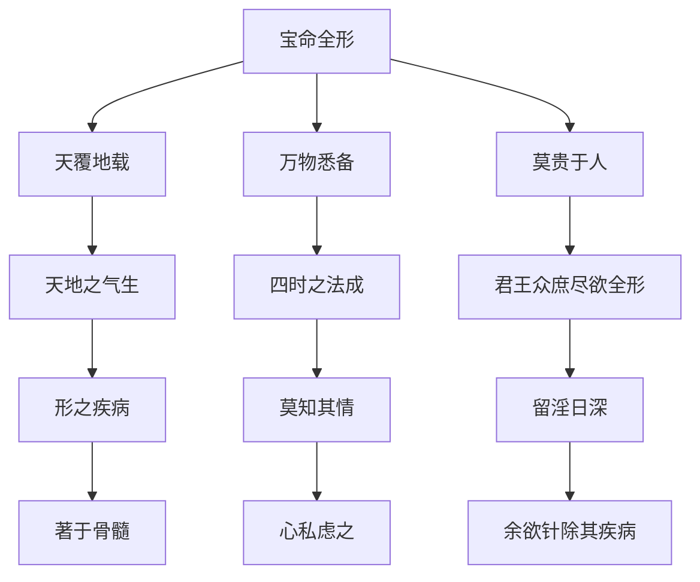

# 素问-宝命全形论篇第二十五

> "黄帝问曰：天覆地载，万物悉备，莫贵于人，人以天地之气生，四时之法成。" - 黄帝

---

## 📜 原文（节选）/ Original Text (Excerpt)

黄帝问曰：天覆地载，万物悉备，莫贵于人，人以天地之气生，四时之法成。

君王众庶，尽欲全形，形之疾病，莫知其情，留淫日深，著于骨髓，心私虑之，余欲针除其疾病，为之奈何？

岐伯对曰：夫盐之味咸者，其气令器津泄；弦绝者，其音嘶败；木敷者，其叶发；病深者，其声哕。人有此三者，是谓坏府，毒药无治，短针无取，此皆绝皮伤肉，血气争黑。

帝曰：余念其痛，心为之乱惑，反更其自，令其不愈，其故何也？

岐伯曰：针有悬布天下者五，黔首共余食，莫知之也。一曰治神，二曰知养身，三曰知毒药为真，四曰知砭石小大，五曰知府藏血气之诊。五法俱立，各有所先。

　　黄帝问曰：天覆地载，万物悉备，莫贵于人，人以天地之气生，四时之法成，君王众庶，尽欲全形，形之疾病，莫知其情，留淫日深，着于骨髓，心私虑之，余欲针除其疾病，为之奈何？

　　岐伯对曰：夫盐之味咸者，其气令器津泄；弦绝者，其音嘶败；木敷者，其叶发；病深者，其声哕。人有此三者，是谓坏府，毒药无治，短针无取，此皆绝皮伤肉，血气争黑。

　　帝曰：余念其痛，心为之乱惑，反甚其病，不可更代，百姓闻之，以为残贼，为之奈何？

　　岐伯曰：夫人生于地，悬命于天，天地合气，命之曰人。人能应四时者，天地为之父母；知万物者，谓之天子。天有阴阳，人有十二节；天有寒暑，人有虚实。能经天地阴阳之化者，不失四时；知十二节之理者，圣智不能欺也；能存八动之变，五胜更立；能达虚实之数者，独出独入，呿吟至微，秋毫在目。

　　帝曰：人生有形，不离阴阳，天地合气，别为九野，分为四时，月有小大，日有短长，万物并至，不可胜量，虚实呿吟，敢问其方。

　　岐伯曰：木得金而伐，火得水而灭，土得木而达，金得火而缺，水得土而绝，万物尽然，不可胜竭。故针有悬布天下者五，黔首共余食，莫知之也。一曰治神，二曰知养身，三曰知毒药为真，四曰制砭石小大，五曰知府藏血气之诊。五法俱立，各有所先。今末世之刺也，虚者实之，满者泄之，此皆众工所共知也。若夫法天则地，随应而动，和之者若响，随之者若影，道无鬼神，独来独往。

　　帝曰：愿闻其道。

　　岐伯曰：凡刺之真，必先治神，五藏已定，九候已备，后乃存针，众脉不见，众凶弗闻，外内相得，无以形先，可玩往来，乃施于人。人有虚实，五虚勿近，五实勿远，至其当发，间不容瞚。手动若务，针耀而匀，静意视义，观适之变，是谓冥冥，莫知其形，见其乌乌，见其稷稷，从见其飞，不知其谁，伏如横弩，起如发机。

　　帝曰：何如而虚？何如而实？

　　岐伯曰：刺虚者须其实，刺实者须其虚，经气已至，慎守勿失，深浅在志，远近若一，如临深渊，手如握虎，神无营于众物。

---

## 📖 白话文翻译（节选）/ Modern Chinese Translation (Excerpt)

黄帝问道：天覆盖地承载，万物都已具备，没有比人更贵的，人依靠天地的气而生存，依靠四时的法则而形成。

君王百姓，都想保全形体，形体有疾病，不知道它的真情，邪气留淫日益深入，附着于骨髓，心里私下思虑它，我想用针刺祛除它的疾病，怎么做？

岐伯回答说：盐的味道是咸的，它的气使器皿中的津液泄漏；琴弦断裂的，它的声音嘶哑败坏；木根敷布的，它的叶子发散；疾病深重的，它的声音呃逆。人有这三种情况，叫做坏府，毒药不能治愈，短针不能取用，这都是绝皮伤肉，血气争黑。

黄帝说：我顾念它的疼痛，心里为此混乱迷惑，反而改变它的自然，使它不愈，这是什么原因？

岐伯说：针刺有布天下的五条，黔首与我共享食物，不知道它。一是治神，二是知养身，三是知毒药为真，四是知砭石大小，五是知脏腑血气的诊断。五法都确立，各有先后。

　　黄帝问道：天地之间，万物俱备，没有一样东西比人更宝贵了。人依靠天地之大气和水谷之精气生存，并随着四时生长收藏的规律而生活着，上至君主，下至平民，任何人都愿意保全形体的健康，但是往往有了病，却因病轻而难于察知，让病邪稽留，逐渐发展，日益深沉，乃至深入骨髓，我为之甚感忧虑。我要想解除他们的痛苦，应该怎样办才好？

　　岐伯回答说：比如盐味是咸的，当贮藏在器具中的时候，看到渗出水来，这就是盐气外泄；比如琴弦将要断的时候，就会发出嘶败的声音；内部已溃的树木，其枝叶好象很繁茂，实际上外盛中空，极容易萎谢；人在疾病深重的时候，就会产生呃逆。人要是有了这样的现象，说明内脏已有严重破坏，药物和针炙都失去治疗作用，因为皮肤肌肉受伤败坏，血气枯槁，就很难挽回了。

　　黄帝道：我很同情病人的痛苦，但思想上有些慌乱疑惑，因治疗不当反使病势加重，又没有更好的方法来替代，人们看起来，将要认为我残忍粗暴，究竟怎麽好呢？

　　岐伯说：一个人的生活，和自然界是密切相关联的。人能适应四时变迁，则自然界的一切，都成为他生命的泉源。能够知道万物生长收藏的道理的人，就有条件承受和运用万物。所以天有阴阳，人有十二经脉；天有寒暑，人有虚实盛衰。能够应天地阴阳的变化，不违背四时的规律，了解十二经脉的道理，就能明达事理，不会被疾病现象弄糊涂了。掌握八风的演变，[五行](https://www.guoxuemeng.com/guoxue/wuxing/)的衰旺，通达病人虚实的变化，就一定能有独到的见解，哪怕病人的呵欠呻吟极微小的动态，也能够明察秋毫，洞明底细。

　　黄帝道：人生而有形体，离不开阴阳的变化，天地二气相合，从经纬上来讲，可以分为九野，从气候上来讲，可以分为四时，月行有小大，日行有短长，这都是阴阳消长变化的体现。天地间万物的生长变化更是不可胜数，根据患者微细呵欠及呻吟，就能判断出疾病的虚实变化。请问运用什麽方法，能够提纲挈领，来加以认识和处理呢？

　　岐伯说：可根据五行变化的道理来分析：木遇到金，就能折伐；火受到水，就能熄灭；土被木殖，就能疏松；金遇到火，就能熔化；水遇到土，就能遏止。这种变化，万物都是一样，不胜枚举。所以用针刺来治疗疾病，能够嘉惠天下人民的，有五大关键，但人们都弃余不顾，不懂得这些道理。所谓五大关键：一是要精神专一，二是要了解养身之道，三是要熟悉药物真正的性能，四要注意制取砭石的大小，五是要懂得脏腑血气的诊断方法。能够懂得这五项要道，就可以掌握缓急先后。近世运用针刺，一般的用补法治虚，泻法制满，这是大家都知道的。若能按照天地阴阳的道理，随机应变，那末疗效就能更好，如响之应，如影随形，医学的道理并没有什麽神秘，只要懂得这些道理，就能运用自如了。

　　黄帝道：希望听你讲讲用针刺的道理。

　　岐伯说：凡用折的关键，必先集中思想，了解五脏的虚实，三部九侯脉象的变化，然后下针。还要注意有没有真脏脉出现，五脏有无败绝现象，外形与内脏是否协调，不能单独以外形为依据，更要熟悉经脉血气往来的情况，才可施针于病人。病人有虚实之分，见到五虚，不可草率下针治疗，见到五实，不可轻易放弃针刺治疗，应该要掌握针刺的时机，不然在瞬息之间就会错过机会。真刺时手的动作要专一协调，针要洁净而均匀，平心静意，看适当的时间，好象鸟一样集合，气盛之时，好象稷一样繁茂。气之往来，正如见鸟之飞翔，而无从捉摸他形迹的起落。所以用针之法，当气未至的时候，应该留针侯气，正如横弩之待发，气应的时候，则当迅速起针，正如弩箭之疾出。

　　黄帝道：怎样治疗虚症？怎样治疗实症？

　　岐伯说：刺虚症，须用补法，刺实症，须用泻法；当针下感到经气至，则应慎重掌握，不失时机地运用补泻方法。针刺无论深浅，全在灵活掌握，取穴无论远近，侯针取气的扫道是一致的，针刺时都必须精神专一，好象面临万丈深渊，小心谨慎，又好象手中捉着猛虎那样坚定有力，全神贯注，不为其他事物所分心。

---

## 🔑 核心要点 / Core Concepts

### 1. 针刺五法 / Five Methods of Acupuncture

| 法 | 内容 |
|------|------|
| 一 | 治神 |
| 二 | 知养身 |
| 三 | 知毒药为真 |
| 四 | 知砭石大小 |
| 五 | 知府藏血气之诊 |

### 2. 坏府三征 / Three Signs of Ruined Fu

| 征 | 表现 |
|------|------|
| 盐之味咸者 | 其气令器津泄 |
| 弦绝者 | 其音嘶败 |
| 木敷者 | 其叶发 |
| 病深者 | 其声哕 |

### 3. 宝命全形理论 / Treasuring Life and Perfecting Form Theory

---

## 📚 理论解释 / Theoretical Analysis

### 宝命全形理论 / Treasuring Life and Perfecting Form Theory

> [!info] 核心概念
- 人以天地之气生
- 四时之法成人
- 宝命全形为要

#### 宝命全形详解 / Detailed Treasuring Life and Perfecting Form

**1. 天地与人 / Heaven Earth and Human**
- 天覆地载：天地覆盖承载
- 万物悉备：万物都已具备
- 莫贵于人：没有比人更贵的

**2. 人生成理 / Human Life Formation Reason**
- 天地之气生：依靠天地之气生存
- 四时之法成：依靠四时的法则形成
- 君王众庶尽欲全形：君王百姓都想保全形体

**3. 疾病深重 / Disease Deep and Severe**
- 形之疾病：形体有疾病
- 莫知其情：不知道它的真情
- 留淫日深：邪气留淫日益深入
- 著于骨髓：附着于骨髓

### 针刺五法理论 / Five Methods of Acupuncture Theory

> [!warning] 核心理念
- 针刺有五法
- 五法俱立，各有所先
- 必须掌握五法

#### 针刺五法详解 / Detailed Five Methods of Acupuncture

**1. 治神 / Treating Spirit**
- 治神第一
- 精神调摄
- 神气通畅

**2. 知养身 / Knowing How to Nourish Body**
- 知养身第二
- 身体调养
- 形体健康

**3. 知毒药为真 / Knowing Toxic Medicine as True**
- 知毒药为真第三
- 药物知识
- 药效判断

**4. 知砭石大小 / Knowing Bian Stone Size**
- 知砭石大小第四
- 工具掌握
- 适当选择

**5. 知府藏血气之诊 / Knowing Diagnosis of Fu Zang Blood Qi**
- 知府藏血气之诊第五
- 诊断能力
- 准确判断

---

## 🏥 中医实践应用 / TCM Practice Application

### 针刺治疗 / Acupuncture Treatment

#### 现代针刺治疗要点 / Modern Acupuncture Treatment Key Points

**1. 治神应用 / Treating Spirit Application**
- 精神调摄：患者精神放松
- 医者神定：医者精神集中
- 神气相通：医患神气相通

**2. 养身应用 / Nourishing Body Application**
- 身体调养：适度运动
- 饮食调理：合理饮食
- 作息规律：按时作息

**3. 药物应用 / Medicine Application**
- 药物知识：了解药物性质
- 药效判断：准确判断药效
- 配合治疗：药物配合针刺

**4. 工具应用 / Tools Application**
- 工具掌握：熟练掌握工具
- 适当选择：根据情况选择工具
- 安全使用：注意安全使用

**5. 诊断应用 / Diagnosis Application**
- 诊断能力：提高诊断能力
- 准确判断：准确判断病情
- 制定方案：制定治疗方案

---

## 🔗 相关链接 / Related Links

- [[MOC-黄帝内经知识库]] - 主索引
- [[黄帝内经-素问索引]] - 素问索引
- [[黄帝内经-核心理论]] - 核心理论体系
- [[素问24-血气形志篇]] - 血气形志
- [[素问26-八正神明论篇]] - 八正神明

### 易学关联 / Yi Jing Connection

- [[MOC-易经知识库]] - 易经索引
- [[20260201-0005 五行]] - 五行理论

**易学与宝命全形的联系:**
- 天人合一：易学的天人合一思想与中医宝命全形相通
- 四时法则：易学的四时理论与中医四时成法相通

---

## 💡 学习要点 / Learning Points

### 掌握重点 / Key Points to Master

- [ ] 理解宝命全形的概念
- [ ] 掌握针刺五法的内容
- [ ] 学会坏府三征的判断
- [ ] 了解针刺治疗的应用

### 思考问题 / Questions for Reflection

1. **为什么说"人以天地之气生，四时之法成"？**
   - 天人合一：人与天地相应
   - 四时法则：顺应四时变化
   - 宝命全形：保全生命形体

2. **现代医学如何应用"针刺五法"？**
   - 针刺治疗：针刺治疗疾病
   - 综合治疗：药物、心理、诊断
   - 个体化治疗：根据患者情况制定方案

---

## 📊 学习进度 / Learning Progress

### 完成情况 / Completion Status

| 学习内容 | 状态 | 备注 |
|---------|------|------|
| 原文诵读 | 📝 进行中 | 建议每日诵读 |
| 白话文理解 | ✅ 已完成 | 理解主要含义 |
| 宝命全形 | ✅ 已完成 | 掌握概念 |
| 针刺五法 | 📝 进行中 | 需要临床实践 |
| 理论分析 | ✅ 已完成 | 理解理论 |

---

## 🔄 更新日志 / Update Log

### 2026-02-03

- ✅ 创建宝命全形论篇第二十五笔记
- ✅ 完成原文、白话文翻译（节选）
- ✅ 整理针刺五法和坏府三征对照表
- ✅ 编写宝命全形和针刺五法理论

---

**笔记创建日期**：2026年2月3日

**最后更新**：2026年2月3日
