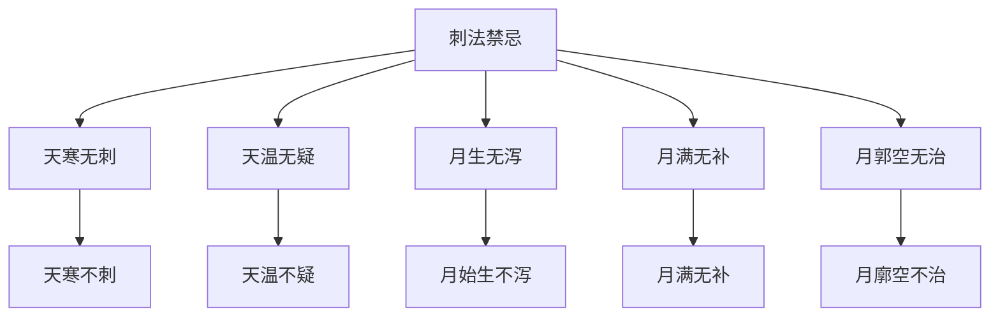

# 素问-八正神明论篇第二十六

> "黄帝问曰：用针之服，必有法则，上视天光，下司八正，以辟奇邪，而观百姓，审于虚实，无犯其邪。" - 黄帝

---

## 📜 原文（节选）/ Original Text (Excerpt)

黄帝问曰：用针之服，必有法则，上视天光，下司八正，以辟奇邪，而观百姓，审于虚实，无犯其邪，其故何也？

岐伯对曰：法天则地，合于天光，必知八正，八正者，所以候八风之虚邪以至者也。

凡刺之法，必候日月星辰，四时八正之气，气定乃刺之。

是故天温日明，则人血淖液而卫气浮，故血易泻，气易行；天寒日阴，则人血凝泣而卫气沉，故血难泻，气难行。

月始生，则血气始精，卫气始行；月郭满，则血气实，肌肉坚；月郭空，则肌肉减，经络虚，卫气去，形独居。

是以因天时而调血气也，是以天寒无刺，天温无疑；月生无泻，月满无补，月郭空无治，是谓得时而调之。

　　黄帝问曰：用针之服，必有法则焉，今何法何则？

　　岐伯对曰：法天则地，合以天光。

　　帝曰：愿卒闻之。

　　岐伯曰：凡刺之法，必候日月星辰四时八正之气，气定乃刺之。是故天温日明，则人血淖液而卫气浮，故血易泻，气易行；天寒日阴，则人血凝泣，而卫气沉。月始生，则血气始精，卫气始行；月郭满，则血气实，肌肉坚；月郭空，则肌肉减，经络虚，卫气去，形独居。是以因天时而调血气也。是以天寒无刺，天温无疑。月生无泻，月满无补，月郭空无治，是谓得时而调之。因天之序，盛虚之时，移光定位，正立而待之。故日月生而泻，是谓藏虚；月满而补，血气扬溢，络有留血，命曰重实；月郭空而治，是谓乱经。阴阳相错，真邪不别，沉以留止，外虚内乱，淫邪乃起。

　　帝曰：星辰八正何候？

　　岐伯曰：星辰者，所以制日月之行也。八正者，所以候八风之虚邪以时至者也。四时者，所以分春秋冬夏之气所在，以时调之也，八正之虚邪，而避之勿犯也。以身之虚，而逢天之虚，两虚相感，其气至骨，入则伤五藏，工候救之，弗能伤也，故曰天忌不可不知也。

　　帝曰：善。其法星辰者，余闻之矣，愿闻法往古者。

　　岐伯曰：法往古者，先知针经也。验于来今者，先知日之寒温、月之虚盛，以候气之浮沉，而调之于身，观其立有验也。观其冥冥者，言形气荣卫之不形于外，而工独知之，以日之寒温，月之虚盛，四时气之浮沉，参伍相合而调之，工常先见之，然而不形于外，故曰观于冥冥焉。通于无穷者，可以传于后世也，是故工之所以异也，然而不形见于外，故俱不能见也。视之无形，尝之无味，故谓冥冥，若神仿佛。虚邪者，八正之虚邪气也。正邪者，身形若用力，汗出，腠理开，逢虚风，其中人也微，故莫知其情，莫见其形。上工救其萌牙，必先见三部九候之气，尽调不败而救之，故曰上工。下工救其已成，救其已败。救其已成者，言不知三部九候之相失，因病而败之也，知其所在者，知诊三部九候之病脉处而治之，故曰守其门户焉，莫知其情而见邪形也。

　　帝曰：余闻补泻，未得其意。

　　岐伯曰：泻必用方，方者，以气方盛也，以月方满也，以日方温也，以身方定也，以息方吸而内针，乃复候其方吸而转针，乃复候其方呼而徐引针，故曰泻必用方，其气而行焉。补必用员，员者行也，行者移也，刺必中其，复以吸排针也。故员与方，非针也。故养神者，必知形之肥瘦，荣卫血气之盛衰。血气者，人之神，不可不谨养。

　　帝曰：妙乎哉论也。合人形于阴阳四时，虚实之应，冥冥之期，其非夫子孰能通之。然夫子数言形与神，何谓形，何谓神，愿卒闻之。

　　岐伯曰：请言形、形乎形、目冥冥，问其所病，索之于经，慧然在前，按之不得，不知其情，故曰形。

　　帝曰：何谓神？

　　岐伯曰：神乎神，耳不闻，目明，心开而志先，慧然独悟，口弗能言，俱视独见，适若昏，昭然独明*请言神*，若风吹云，故曰神。三部九候为之原，九针之论，不必存也。

---

## 📖 白话文翻译（节选）/ Modern Chinese Translation (Excerpt)

黄帝问道：用针的法则，一定有方法，上视天光，下司八正，以避奇邪，而观察百姓，审察虚实，不侵犯其邪，这是什么原因？

岐伯回答说：法天则地，合于天光，必须知道八正，八正，是用来候八风的虚邪而至的。

凡是刺的法则，必须候日月星辰，四时八正的气，气定就刺它。

所以天温日明，则人血淖液而卫气浮，所以血易泻，气易行；天寒日阴，则人血凝涩而卫气沉，所以血难泻，气难行。

月始生，则血气开始精微，卫气开始行；月廓满，则血气充实，肌肉坚实；月廓空，则肌肉减少，经络空虚，卫气离去，形体独居。

因此根据天时调血气，所以天寒不刺，天温不疑；月始生不泻，月满无补，月廓空不治，这叫做得时而调。

　　黄帝问道：用针的技术，必然有他一定的方法准则，究竟有什麽方法，什麽准则呢？

　　岐伯回答说：要在一切自然现象的演变中去体会。

　　黄帝道：愿详尽的了解一下。

　　岐伯说：凡针刺之法，必须观察日月星辰盈亏消长及四时八正之气候变化，方可运用针刺方法。所以气候温和，日色晴朗时，则人的血液流行滑润，而卫气浮于表，血容易泻，气容易行；气候寒冷，天气阴霾，则人的血行也滞涩不畅，而卫气沉于里。[月亮](https://www.guoxuemeng.com/gushici/yueliangdegushi/)初生的时候，血气开始流利，卫气开始畅行；月正圆的时候，则人体血气充实，肌肉坚实；月黑无光的时候，肌肉减弱，经络空虚，卫气衰减，形体独居。所以要顺着天时而调血气。因此天气寒冷，不要针刺；天气温和，不要迟缓；月亮初生的时候，不可用泻法；月亮正圆的时候，不可用补法；月黑无光的时候，不要针刺。这就是所谓顺着天时而调治气血的法则。因天体运行有一定顺序，故月亮有盈亏盛虚，观察日影的长短，可以定四时八正之气。所以说：月牙初生时而泻，就会使内脏虚弱；月正圆时而补，使血气充溢于表，以致络脉中血液留滞，这叫做重实；月黑无光的时候用针刺，就会扰乱经气，叫做乱经。这样的治法必然引起阴阳相错，真气与邪气不分，使病变反而深入，致卫外的阳气虚竭，内守的阴气紊乱，淫邪就要发生了。

　　黄帝道：星辰八正观察些什麽？

　　岐伯说：观察星辰的方位，可以定出日月循行的度数。观察八节常气的交替，可以测出异常八方之风，是什麽时候来的，是怎样为害于人的。观察四时，可以分别春夏秋冬正常气候之所在，以便随时序来调养，可以避免八方不正之气候，不受其侵犯。假如虚弱的体质，再遭受自然界虚邪贼风的侵袭，两虚相感，邪气就可以侵犯筋骨，再深入一步，就可以伤害五脏。懂得气候变化治病的医生，就能及时挽救病人，不至于受到严重的伤害。所以说天时的宜忌，不可不知。

　　黄帝道：讲得好！关于取法于星辰的道理，我已经知道了，希望你讲讲怎样效法于前人？

　　岐伯说：要取法和运用前人的学术，先要懂得《针经》。要想把古人的经验验证于现在，必先要知道日之寒温，月之盈亏，四时气候的浮沉，而用以调治于病人，就可以看到这种方法是确实有效的。所谓观察其冥冥，就是说荣卫气血的变化虽不贤路于外，而医生却能懂得，他从日之寒温，月之盈亏，四时气候之浮沉等，进行综合分析，做出判断，然后进行调治。因此医生对于疾病，每有先见之明，然而疾病并未显露于外，所以说这是观察于冥冥。能够运用这种方法，通达各种事理，他的经验就可以流传于后世，这是学识经验丰富的医生不同于一般人的地方。然而病情是不显露在表面，所以一般人都不容易发现，看不到形迹，尝不出味道，所以叫做冥冥，好象神灵一般。虚邪，就是四时八节的虚邪贼风。正邪，就是人在劳累时汗出腠理开，偶而遭受虚风。正邪伤人轻微，没有明显的感觉，也无明显病状表现，所以一般医生观察不出病情。技术高明的医生，在疾病初起，三部九侯之脉气都调和而未败坏之时，就给以早期救治，所以称为“上工”。“下工”临证，是要等疾病已经形成，甚或至于恶化阶段，才进行治疗。所以说下工要等到病成阶段才能治疗，是因为不懂得三部九侯的相得相失，致使疾病发展而恶化了。要明了疾病之所在，必须从三部九侯的脉象中详细诊察，知道疾病的变化，才能进行早期治疗。所以说掌握三部九侯，好象看守门户一样的重要，虽然外表尚未见到病情，而医者已经知道疾病的形迹了。

　　黄帝道；我听说：针刺有部泻二法，不懂得它的意义。

　　岐伯说：泻法必须掌握一个“方”字。所谓“方”，就是正气方盛，月亮方满，天气方温和，身心方稳定的时候，并且要在病人吸气的时候进针，再等到他吸气的时候转针，还要等他呼气的时候慢慢的拔出针来。所以说泻必用方，才能发挥泻的作用，使邪气泻去而正气运行。补法必须掌握一个“圆”字。所谓“圆”，就是行气。行气就是导移其气以至病所，刺必要中其＃穴，还要在病人吸气时拔针。所谓“圆”与“方”，并不是指针的形状。一个技术高超有修养的医生，必须明了病人形体的肥瘦，营卫血气的盛衰。因为血气是人之神的物质基础，不可不谨慎的保养。

　　黄帝道：多麽奥妙的论述啊！把人身变化和阴阳四时虚实联系起来，这是非常微妙的结合，要不是先生，谁能够弄得懂呢！然而先生屡次说道形如神，究竟什麽叫形？什麽叫神？请你详尽的讲一讲。

　　岐伯说：请让我先讲形。所谓形，就是反映于外的体征，体表只能察之概况，但只要问明发病的原因，再仔细诊察经脉变化，则病情就清楚的摆在面前，要是按寻之仍不可得，那麽便不容易知道他的病情了，因外部有形迹可察，所以叫做形。

　　黄帝道：什麽叫神？

　　岐伯说：请让我再讲神。所谓神，就是望而知之，耳朵虽然没有听到病人的主诉，但通过望诊，眼中就明了它的变化，亦已心中有数，先得出这一疾病的概念，这种心领神会的速度独悟，不能用言语来形容，有如观察一个东西，大家没有看到，但他能运用望诊，就能够独自看到，有如在黑暗之中，大家都很昏黑，但他能运用望诊，就能够昭然独明，好象风吹云散，所以叫做神，诊病时，若一三不九侯为之本原，就不必拘守九针的理论了

---

## 🔑 核心要点 / Core Concepts

### 1. 八正 / Eight Zheng

| 八正 | 含义 |
|------|------|
| 立春 | 春季开始 |
| 立夏 | 夏季开始 |
| 立秋 | 秋季开始 |
| 立冬 | 冬季开始 |
| 春分 | 春季中点 |
| 夏至 | 夏至 |
| 秋分 | 秋季中点 |
| 冬至 | 冬至 |

### 2. 天时与血气 / Heavenly Time and Blood Qi

| 天时 | 血 | 气 |
|------|------|------|
| 天温日明 | 淖液 | 浮 |
| 天寒日阴 | 凝泣 | 沉 |
| 月始生 | 始精 | 始行 |
| 月郭满 | 实 | - |
| 月郭空 | 减 | 去 |

### 3. 刺法禁忌 / Acupuncture Contraindications

---

## 📚 理论解释 / Theoretical Analysis

### 八正理论 / Eight Zheng Theory

> [!info] 核心概念
- 八正是四时八个节气
- 八正候八风之虚邪
- 刺法必候八正

#### 八正详解 / Detailed Eight Zheng

**1. 立春 / Start of Spring**
- 时间：春季开始
- 天气：天气渐暖
- 刺法：适宜刺

**2. 立夏 / Start of Summer**
- 时间：夏季开始
- 天气：天气炎热
- 刺法：适宜刺

**3. 立秋 / Start of Autumn**
- 时间：秋季开始
- 天气：天气渐凉
- 刺法：适宜刺

**4. 立冬 / Start of Winter**
- 时间：冬季开始
- 天气：天气寒冷
- 刺法：不适宜刺

**5. 春分 / Spring Equinox**
- 时间：春季中点
- 天气：天气温和
- 刺法：适宜刺

**6. 夏至 / Summer Solstice**
- 时间：夏至
- 天气：天气最热
- 刺法：适宜刺

**7. 秋分 / Autumn Equinox**
- 时间：秋季中点
- 天气：天气凉爽
- 刺法：适宜刺

**8. 冬至 / Winter Solstice**
- 时间：冬至
- 天气：天气最冷
- 刺法：不适宜刺

### 天时与血气理论 / Heavenly Time and Blood Qi Theory

> [!warning] 核心理念
- 天时影响血气
- 血气随天时变化
- 刺法根据天时

#### 天时与血气详解 / Detailed Heavenly Time and Blood Qi

**1. 天温日明 / Sky Warm Day Bright**
- 血：淖液
- 卫气：浮
- 刺法：易泻易行

**2. 天寒日阴 / Sky Cold Day Dark**
- 血：凝泣
- 卫气：沉
- 刺法：难泻难行

**3. 月始生 / Moon First Appear**
- 血气：始精
- 卫气：始行
- 刺法：不泻

**4. 月郭满 / Moon Outline Full**
- 血气：实
- 肌肉：坚
- 刺法：无补

**5. 月郭空 / Moon Outline Empty**
- 肌肉：减
- 经络：虚
- 卫气：去
- 刺法：不治

---

## 🏥 中医实践应用 / TCM Practice Application

### 八正刺法应用 / Eight Zheng Acupuncture Application

#### 现代八正刺法要点 / Modern Eight Zheng Acupuncture Key Points

**1. 四时刺法 / Four Seasons Acupuncture**
- 春：适宜刺
- 夏：适宜刺
- 秋：适宜刺
- 冬：不适宜刺

**2. 八正刺法 / Eight Zheng Acupuncture**
- 立春：适宜刺
- 立夏：适宜刺
- 立秋：适宜刺
- 立冬：不适宜刺
- 春分：适宜刺
- 夏至：适宜刺
- 秋分：适宜刺
- 冬至：不适宜刺

**3. 月相刺法 / Moon Phase Acupuncture**
- 月始生：不泻
- 月郭满：无补
- 月郭空：不治

---

## 🔗 相关链接 / Related Links

- [[MOC-黄帝内经知识库]] - 主索引
- [[黄帝内经-素问索引]] - 素问索引
- [[黄帝内经-核心理论]] - 核心理论体系
- [[素问25-宝命全形论篇]] - 宝命全形
- [[素问27-离合真邪论篇]] - 离合真邪

### 易学关联 / Yi Jing Connection

- [[MOC-易经知识库]] - 易经索引
- [[20260201-0008 八卦]] - 八卦理论

**易学与八正神明的联系:**
- 四时理论：易学的四时理论与中医八正相通
- 八卦方位：易学的八卦理论与中医八正相通

---

## 💡 学习要点 / Learning Points

### 掌握重点 / Key Points to Master

- [ ] 理解八正的概念
- [ ] 掌握天时与血气的关系
- [ ] 学会刺法禁忌的判断
- [ ] 了解八正刺法的应用

### 思考问题 / Questions for Reflection

1. **为什么说"天寒无刺"？**
   - 天寒血凝泣
   - 卫气沉滞
   - 刺之难泻难行

2. **现代医学如何应用"八正神明"？**
   - 时间医学：根据时间治疗
   - 生物节律：根据生物节律治疗
   - 个体化治疗：根据个体情况治疗

---

## 📊 学习进度 / Learning Progress

### 完成情况 / Completion Status

| 学习内容 | 状态 | 备注 |
|---------|------|------|
| 原文诵读 | 📝 进行中 | 建议每日诵读 |
| 白话文理解 | ✅ 已完成 | 理解主要含义 |
| 八正 | ✅ 已完成 | 掌握概念 |
| 天时血气 | 📝 进行中 | 需要临床实践 |
| 理论分析 | ✅ 已完成 | 理解理论 |

---

## 🔄 更新日志 / Update Log

### 2026-02-03

- ✅ 创建八正神明论篇第二十六笔记
- ✅ 完成原文、白话文翻译（节选）
- ✅ 整理八正和天时血气对照表
- ✅ 编写八正和天时血气理论

---

**笔记创建日期**：2026年2月3日

**最后更新**：2026年2月3日
