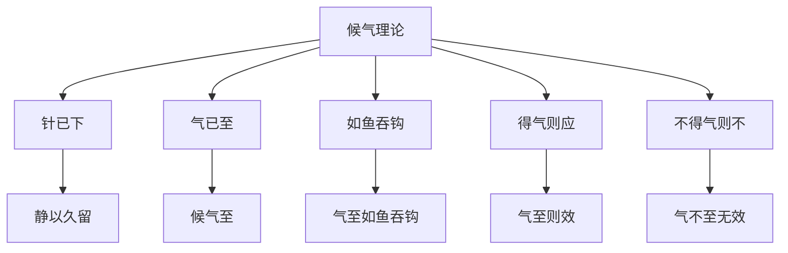

# 素问-离合真邪论篇第二十七

> "黄帝问曰：余闻九针于夫子，众多博大，不可胜数。余愿闻要道，以属子孙，传之后世。" - 黄帝

---

## 📜 原文（节选）/ Original Text (Excerpt)

黄帝问曰：余闻九针于夫子，众多博大，不可胜数。余愿闻要道，以属子孙，传之后世。

岐伯对曰：夫九针者，小之则无内，大之则无外，深不可及，浅不可得，往来之间，针行其上，以神会之，以候息动，以知其内。

黄帝曰：候气奈何？

岐伯曰：夫邪气之中人也，或中于阴，或中于阳，上下左右，无有恒常，其在于阳筋，其在于阴络，其在于阴筋，其在于阳络，其在于阴分，其在于阳分。

是以候之者，在于针下，静以久留，以候气至，气至而效，气不至无效。

黄帝曰：候气何如而至？何如而不至？

岐伯曰：针已下，气已至，如鱼吞钩，如得气则应，如不则不。

　　黄帝问曰：余闻九针九篇，夫子乃因而九之，九九八十一篇，余尽通其意矣。经言气之盛衰，左右顷移，以上调下，以左调右，有余不足，补泻于荥输，余知之矣。此皆荣卫之顷移，虚实之所生，非邪气从外入于经也。余愿闻邪气之在经也，其病人何如？取之奈何？

　　岐伯对曰：夫圣人之起度数，必应于天地，故天有宿度，地有经水，人有经脉。天地温和，则经水安静；天寒地冻，则经水凝泣；天暑地热，则经水沸溢；卒风暴起，则经水波涌而陇起。夫邪之入于脉也，寒则血凝泣，暑则气淖泽，虚邪因而入客，亦如经水之得风也，经之动脉，其至也亦时陇起，其行于脉中循循然，其至寸口中手也，时大时小，大则邪至，小则平，其行无常处，在阴与阳，不可为度，从而察之，三部九候，卒然逢之，早遏其路，吸则内针，无令气忤；静以久留，无令邪布；吸则转针，以得气为故；候呼引针，呼尽乃去；大气皆出，故命曰泻。

　　帝曰：不足者补之，奈何？

　　岐伯曰：必先扪而循之，切而散之，推而按之，弹而怒之，抓而下之，通而取之，外引其门，以闭其神。呼尽内针，静以久留，以气至为故，如待所贵，不知日暮，其气以至，适而自护，候吸引针，气不得出，各在其处，推阖其门，令神气存，大气留止，故命曰补。

　　帝曰：候气奈何？

　　岐伯曰：夫邪去络入于经也，舍于血脉之中，其寒温未相得，如涌波之起也，时来时去，故不常在。故曰方其来也，必按而止之，止而取之，无逢其冲而泻之。真气者，经气也，经气太虚，故曰其来不可逢，此之谓也。故曰候邪不审，大气已过，泻之则真气脱，脱则不复，邪气复至，而病益蓄，故曰其往不可追，此之谓也。不可挂以发者，待邪之至时而发针泻矣，若先若后者，血气已尽，其病不可下，故曰知其可取如发机，不知其取如扣椎，故曰知机道者不可挂以发，不知机者扣之不发，此之谓也。

　　帝曰：补泻奈何？

　　岐伯曰：此攻邪也，疾出以去盛血，而复其真气，此邪新客，溶溶未有定处也，推之则前，引之则止，逆而刺之，温血也。刺出其血，其病立已。

　　帝曰：善。然真邪以合，波陇不起，候之奈何？

　　岐伯曰：审扪循三部九候之盛虚而调之，察其左右上下相失及相减者，审其病藏以期之。不知三部者，阴阳不别，天地不分，地以候地，天以候天，人以候人，调之中府，以定三部，故曰刺不知三部九候病脉之处，虽有后过且至，工不能禁也。诛罚无过，命曰大惑，反乱大经，真不可复，用实为虚，以邪为真，用针无义，反为气贼，夺人正气，以从为逆，荣卫散乱，真气已失，邪独内着，绝人长命，予人夭殃，不知三部九候，故不能久长。因不知合之四时[五行](https://www.guoxuemeng.com/guoxue/wuxing/)，因加相胜，释邪攻正，绝人长命。邪之新客来也，未有定处，推之则前，引之则止，逢而泻之，其病立已。

---

## 📖 白话文翻译（节选）/ Modern Chinese Translation (Excerpt)

黄帝问道：我听您讲九针的道理，众多博大，不可胜数。我希望听到其中的要道，用来传给子孙，传给后世。

岐伯回答说：九针，小则不能进入，大则不能外出，深则不能到达，浅则不能得到，往来之间，针行其上，用神气相会，以候息动，以知其内。

黄帝说：候气怎么样？

岐伯说：邪气中人，有的中于阴，有的中于阳，上下左右，没有恒常，它在阳筋，它在阴络，它在阴筋，它在阳络，它在阴分，它在阳分。

所以候气的，在于针下，静以久留，以候气至，气至则效，气不至无效。

黄帝说：候气怎样而至？怎样而不至？

岐伯说：针已下，气已至，如鱼吞钩，如得气则应，如不则不。

　　黄帝问道：我听说九针有九篇文章，而先生又从九篇上加以发挥，演绎成为九九八十一篇，我已经完全领会它的精神了。《针经》上说的气之盛衰，左右偏盛，取上以调下，去左以调右，有余不足，在荥输之间进行补泻，我亦懂得了。这些变化，都是由于容卫的偏盛、气血虚实而形成的，并不是邪气从侵入经脉而发生的病变。我现在希望知道邪气侵入经脉之时，病人的症状怎样？又怎样来治疗？

　　岐伯回答说：一个有修养的医生，再制定治疗法则时，必定体察于自然的变化。如天有宿度，地有江河，人有经脉，其间是互相影响，可以比类而论的。如天地之气温和，则江河之水安静平稳；天气寒冷，则水冰地冻，江河之水凝涩不流；天气酷热，则江河之水沸腾洋溢；要是暴风骤起，则使江河之水，波涛汹涌。因此病邪侵入了经脉，寒则使血行滞涩，热则使血气滑润流利，要是虚邪贼风的侵入，也就象江河之水遇到暴风一样，经脉的搏动，则出现波涌隆起的现象。虽然血气同样依次在经脉中流动，但在寸口处按脉，指下就感到时大时小，大即表示病邪盛，小即表示病邪退，邪气运行，没有一定的位置，或在阴经或在阳经，就应该进一步，用三部就侯的方法检查，一旦察之邪气所在，应急早治疗，以阻止它的发展。治疗时应在吸气时进针，进针时勿使气逆，进针后要留针静侯其气，不让病邪扩散；当吸气时转念其针，以得气为目的；然后等病人呼气的时候，慢慢地起针，呼气尽时，将针取出。这样，大邪之气尽随针外泄，所以叫做泻。

　　黄帝道：不足之虚症怎样用补法？

　　岐伯说：首先用手抚摸穴位，然后以之按压穴位，再用手指揉按周围肌肤，进而用手指弹其穴位，令脉络怒张，左手按闭孔穴，不让正气外泄。进针方法，是在病人呼气将尽时进针，静侯其气，稍久留针，以得气为目的。进针侯气，要象等待贵客一样，忘掉时间的早晚，当得气时，要好好保护，等病人吸气时候，拔出其针，那末气就不至外出了；出针以后，应在其孔穴上揉按，使针孔关闭，真气存内，大经之气留于营卫而不泄，这便叫做补。

　　黄帝道：对邪气怎样诊侯呢？

　　岐伯说：当邪气从络脉而进入经脉，留舍于血脉之中，这是邪正相争，或寒或温，真邪尚未相合，所以脉气波动，忽起忽伏，时来时去，无有定处。所以说诊得泄气方来，必须按而止之，阻止它的发展，用针泻之，但不要正当邪气冲突，遂用泻法，反十经气大虚，所以说气虚的时候不可用泻，就是指此而言。因此，诊侯邪气而不能审慎，当大邪之气已经过去，而用泻法，则反使真气虚脱，真气虚脱，则不能恢复，而邪气益甚，那病更加重了。所以说，邪气已经随经而去，不可再用泻法，就是指此而言。阻止邪气，使用泻法，是间不容发的事，须待邪气初到的时候，随即下针去泻，在邪至之前，或在邪去之后用泻法，都是不适时的，非但不能去邪，反使血气受伤，病就不容易退了。所以说，懂得用针的，象拨动弩机一样，机智灵活，不善于用针的，就象敲击木椎，顽钝不灵了。所以说，识得机宜的，一霎那时毫不迟疑，不知机宜的，纵然时机以到，亦不会下针，就是指此而言。

　　黄帝道：怎样进行补泻呢？

　　岐伯说：应以攻邪为主。应该及时刺出盛血，以恢复正气，因为病邪刚刚侵入，流动未有定处，推之则前进，引之则留止，迎其气而泻之，以出其毒血，血出之后，病就立即会好。

　　黄帝道：讲得好！假如到了病邪和真气并合以后，脉气不现波动，那麽怎样诊察呢？

　　岐伯说：仔细审察三部九候的盛衰虚实而调治。检查的方法，在它左右上下各部分，观察有无不相称或特别减弱的地方，就可以知道病在那一脏腑，待其气至而刺之。假如不懂得三部九侯，则阴阳不能辨别，上下也不能分清，更不知道从上部脉以诊察下，从上部脉以诊察上，从中部脉以诊察中，结合胃气多少有无来决定疾病在那一部。所以说，针刺而不知三部九侯以了解病脉之处，则虽然有大邪为害，这个医生也没有办法来加以事先防止的。如果诛罚无过，不当泻而泻之，这就叫做“大惑”，反而扰乱脏腑经脉，使真气不能恢复，把实症当作虚症，邪气当作真气，用针毫无道理，反助邪气为害，剥夺病人正气，使顺症变成逆症，使病人荣卫散乱，真气散失，邪气独存于内，断送病人的性命，给人家带来莫大的祸殃。这种不知三部九侯的医生，是不能够久长的，因为不知配合四时[五行](https://www.guoxuemeng.com/guoxue/wuxing/)因加相胜的道理，会放过了邪气，伤害了正气，以致断绝病人性命。病邪新侵入人体，没有定着一处，推它就向前，引它就阻止，迎其气而泻之，其病是立刻可以好的。

---

## 🔑 核心要点 / Core Concepts

### 1. 九针特点 / Nine Needles Characteristics

| 特点 | 含义 |
|------|------|
| 小之 | 无内 |
| 大之 | 无外 |
| 深 | 不可及 |
| 浅 | 不可得 |
| 往来 | 针行其上 |

### 2. 邪气中入部位 / Evil Qi Invasion Locations

| 邪气 | 部位 |
|------|------|
| 中于阴 | 阴分 |
| 中于阳 | 阳分 |
| 在阳筋 | 阳筋 |
| 在阴络 | 阴络 |
| 在阴筋 | 阴筋 |
| 在阳络 | 阳络 |

### 3. 候气理论 / Waiting for Qi Theory

---

## 📚 理论解释 / Theoretical Analysis

### 九针理论 / Nine Needles Theory

> [!info] 核心概念
- 九针大小深浅各有宜
- 九针往来之间
- 针行其上，以神会之

#### 九针详解 / Detailed Nine Needles

**1. 九针特点 / Nine Needles Characteristics**
- 小之则无内：小则不能进入
- 大之则无外：大则不能外出
- 深不可及：深则不能到达
- 浅不可得：浅则不能得到
- 往来之间：往来之间
- 针行其上：针行其上

**2. 九针应用 / Nine Needles Application**
- 以神会之：用神气相会
- 以候息动：以候息动
- 以知其内：以知其内

### 邪气中入理论 / Evil Qi Invasion Theory

> [!warning] 核心理念
- 邪气中人无常处
- 或中于阴，或中于阳
- 上下左右，无有恒常

#### 邪气中入详解 / Detailed Evil Qi Invasion

**1. 邪气中入部位 / Evil Qi Invasion Locations**
- 中于阴：邪气中于阴
- 中于阳：邪气中于阳
- 上下左右：上下左右
- 无有恒常：没有恒常

**2. 邪气所在部位 / Evil Qi Locations**
- 在阳筋：邪气在阳筋
- 在阴络：邪气在阴络
- 在阴筋：邪气在阴筋
- 在阳络：邪气在阳络
- 在阴分：邪气在阴分
- 在阳分：邪气在阳分

### 候气理论 / Waiting for Qi Theory

> [!note] 候气要领
- 候之在于针下
- 静以久留
- 气至而效

#### 候气详解 / Detailed Waiting for Qi

**1. 候气方法 / Waiting for Qi Method**
- 针已下：针已下
- 气已至：气已至
- 如鱼吞钩：如鱼吞钩
- 得气则应：得气则应
- 不得气则不：不得气则不

**2. 候气效果 / Waiting for Qi Effect**
- 静以久留：静以久留
- 候气至：候气至
- 气至而效：气至则效
- 气不至无效：气不至无效

---

## 🏥 中医实践应用 / TCM Practice Application

### 九针应用 / Nine Needles Application

#### 现代九针应用要点 / Modern Nine Needles Application Key Points

**1. 针具选择 / Needle Selection**
- 大小适中：大小适中
- 深浅适宜：深浅适宜
- 根据病情：根据病情选择

**2. 针刺手法 / Acupuncture Technique**
- 针行其上：针行其上
- 以神会之：以神会之
- 以候息动：以候息动

**3. 候气方法 / Waiting for Qi Method**
- 静以久留：静以久留
- 候气至：候气至
- 得气则应：得气则应

---

## 🔗 相关链接 / Related Links

- [[MOC-黄帝内经知识库]] - 主索引
- [[黄帝内经-素问索引]] - 素问索引
- [[黄帝内经-核心理论]] - 核心理论体系
- [[素问26-八正神明论篇]] - 八正神明
- [[素问28-通评虚实论篇]] - 通评虚实

### 易学关联 / Yi Jing Connection

- [[MOC-易经知识库]] - 易经索引
- [[20260201-0002 五行]] - 五行理论

**易学与离合真邪的联系:**
- 阴阳理论：易学的阴阳理论与中医真邪离合相通
- 邪正相争：易学的邪正理论与中医真邪离合相通

---

## 💡 学习要点 / Learning Points

### 掌握重点 / Key Points to Master

- [ ] 理解九针的特点
- [ ] 掌握邪气中入的部位
- [ ] 学会候气的方法
- [ ] 了解九针应用的方法

### 思考问题 / Questions for Reflection

1. **为什么说"如鱼吞钩"？**
   - 得气感觉：如鱼吞钩
   - 针下感觉：针下沉紧
   - 疗效显著：气至而效

2. **现代医学如何应用"候气理论"？**
   - 针刺得气：针刺得气的感觉
   - 疗效判断：根据得气判断疗效
   - 个体化治疗：根据个体情况调整

---

## 📊 学习进度 / Learning Progress

### 完成情况 / Completion Status

| 学习内容 | 状态 | 备注 |
|---------|------|------|
| 原文诵读 | 📝 进行中 | 建议每日诵读 |
| 白话文理解 | ✅ 已完成 | 理解主要含义 |
| 九针特点 | ✅ 已完成 | 掌握特点 |
| 候气方法 | 📝 进行中 | 需要临床实践 |
| 理论分析 | ✅ 已完成 | 理解理论 |

---

## 🔄 更新日志 / Update Log

### 2026-02-03

- ✅ 创建离合真邪论篇第二十七笔记
- ✅ 完成原文、白话文翻译（节选）
- ✅ 整理九针特点和邪气中入对照表
- ✅ 编写九针和候气理论

---

**笔记创建日期**：2026年2月3日

**最后更新**：2026年2月3日
