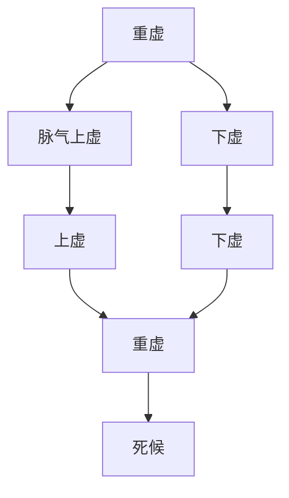

# 素问-通评虚实论篇第二十八

> "黄帝问曰：何谓虚实？岐伯曰：邪气盛则实，精气夺则虚。" - 岐伯

---

## 📜 原文（节选）/ Original Text (Excerpt)

黄帝问曰：何谓虚实？

岐伯曰：邪气盛则实，精气夺则虚。

帝曰：虚实何如？

岐伯曰：气虚者，肺虚也；气逆者，足寒也。非其时则生，当其时则死。

帝曰：何谓重虚？

岐伯曰：脉气上虚，下虚，是谓重虚。重虚者，死。

帝曰：气有余，不足何如？

岐伯曰：气有余，则喘咳上气；不足，则息利少气。

帝曰：血有余，不足何如？

岐伯曰：血有余，则怒；不足，则恐。

　　黄帝问曰：何谓虚实？

　　岐伯对曰：邪气盛则实，精气夺则虚。

　　帝曰：虚实何如？

　　岐伯曰：气虚者肺虚也，气逆者足寒也，非其时则生，当其时则死。余藏皆如此。

　　帝曰：何谓重实？

　　岐伯曰：所谓重实者，言大热病，气热脉满，是谓重实。

　　帝曰：经络俱实何如？何以治之？

　　岐伯曰：经络皆实，是寸脉急而尺缓也，皆当治之，故曰滑则从，涩则逆也。夫虚实者，皆从其物类始，故五藏骨肉滑利，可以长久也。

　　帝曰：络气不足，经气有余，何如？

　　岐伯曰：络气不足，经气有余者，脉口热而尺寒也，秋冬为逆，春夏为从，治主病者。

　　帝曰：经虚络满，何如？

　　岐伯曰：经虚络满者，尺热满，脉口寒涩也，此春夏死秋冬生也。

　　帝曰：治此者奈何？

　　岐伯曰：络满经虚，灸阴刺阳；经满络虚，刺阴灸阳。

　　帝曰：何谓重虚？

　　岐伯曰：脉气上虚尺虚，是谓重虚。

　　帝曰：何以治之？

　　岐伯曰：所谓气虚者，言无常也。尺虚者，行步恇然。脉虚者，不象阴也。如此者，滑则生，涩则死也。

　　帝曰：寒气暴上，脉满而实何如？

　　岐伯曰：实而滑则生，实而逆则死。

　　帝曰：脉实满，手足寒，头热，何如？

　　岐伯曰：春秋则生，冬夏则死。脉浮而涩，涩而身有热者死。

　　帝曰：其形尽满何如？

　　岐伯曰：其形尽满者，脉急大坚，尺涩而不应也，如是者，故从则生，逆则死。

　　帝曰：何谓从则生，逆则死？

　　岐伯曰：所谓从者，手足温也；所谓逆者，手足寒也。

　　帝曰：乳子而病热，脉悬小者何如？

　　岐伯曰：手足温则生，寒则死。

　　帝曰：乳子中风热，喘鸣肩息者，脉何如？

　　岐伯曰：喘鸣肩息者，脉实大也，缓则生，急则死。

　　帝曰：肠澼便血何如？

　　岐伯曰：身热则死，寒则生。

　　帝曰：肠澼下白沫何如？

　　岐伯曰：脉沉则生，脉浮则死。

　　帝曰：肠下脓血何如？

　　岐伯曰：脉悬绝则死，滑大则生。

　　帝曰：肠澼之属，身不热，脉不悬绝何如？

　　岐伯曰：滑大者曰生，悬涩者曰死，以藏期之。

　　帝曰：癫疾何如？

　　岐伯曰：脉搏大滑，久自已；脉小坚急，死不治。

　　帝曰：癫疾之脉，虚实何如？

　　岐伯曰：虚则可治，实则死。

　　帝曰：消瘅虚实何如？

　　岐伯曰：脉实大，病久可治；脉悬小坚，病久不可治。

　　帝曰：形度骨度脉度筋度，何以知其度也？

　　帝曰：春亟治经络；夏亟治经输；秋亟治六府；冬则闭塞，闭塞者，用药而少针石也。所谓少针石者，非痈疽之谓也，痈疽不得顷时回。痈不知所，按之不应手，乍来乍已，刺手太阴傍三痏与缨脉各二，掖痈大热，刺足少阳五；刺而热不止，刺手心主三，刺手太阴经络者大骨之会各三。暴痈筋软，随分而痛，魄汗不尽，胞气不足，治在经俞。

　　腹暴满，按之不下，取手太阳经络者，胃之募也，少阴俞去脊椎三寸傍五，用员利针。霍乱，刺俞傍五，足阳明及上傍三。刺痫惊脉五，针手太阴各五，刺经太阳五，刺手少阴经络傍者一，足阳明一，上踝五寸刺三针。

　　凡治消瘅、仆击、偏枯、痿厥、气满发逆，肥贵人，则高梁之疾也。隔塞闭绝，上下不通，则暴忧之疾也。暴厥而聋，偏塞闭不通，内气暴薄也。不从内，外中风之病，故瘦留着也。跖跛，寒风湿之病也。

　　黄帝曰：黄疸暴痛，癫疾厥狂，久逆之所生也。五藏不平，六府闭塞之所生也。头痛耳鸣，九窍不利，肠胃之所生也。

---

## 📖 白话文翻译（节选）/ Modern Chinese Translation (Excerpt)

黄帝问道：什么是虚实？

岐伯说：邪气旺盛叫做实，精气被夺叫做虚。

黄帝说：虚实是怎样的？

岐伯说：气虚，是肺虚；气逆，是足寒。不是其时则生，当其时则死。

黄帝说：什么是重虚？

岐伯说：脉气上虚，下虚，这叫做重虚。重虚，是死候。

黄帝说：气有余，不足是怎样的？

岐伯说：气有余，则喘咳气机上逆；不足，则呼吸通利少气。

黄帝说：血有余，不足是怎样的？

岐伯说：血有余，则发怒；不足，则恐惧。

　　黄帝问道：什麽叫虚实？

　　岐伯回答说：所谓虚实，是指邪气和正气相比较而言的。如邪气方盛，是为实证若精气不足，就为虚证了。

　　黄帝道：虚实变化的情况怎样？

　　岐伯说：以肺脏为例：肺主气，气虚的，是属于肺脏先虚；气逆的，上实下虚，两足必寒。肺虚弱不在相克的时令，其人可生；若遇克贼之时，其人就要死亡。其他各脏的虚实情况亦可类推。

　　黄帝道：什麽叫重实？

　　岐伯说：所谓重实，如大热病人，邪气甚热，而脉象又盛满，内外俱实，便叫重实。

　　黄帝道：经络俱实是怎样情况？用什麽方法治疗？

　　岐伯说：所谓经络俱实，是指寸口脉急而皮肤弛缓，经和络都应该治疗。所以说：凡是滑利的就有生机为顺，涩滞的缺少生机为逆。因为一般所谓虚实，人与物类相似，如万物有生气则滑利，万物欲死则枯涩。若一个人的五脏骨肉滑利，是精气充足，生气旺盛，边可以长寿。

　　黄帝道：络气不足，经气有余的情况怎样？

　　岐伯说：所谓络气不足，经气有余，是指寸口脉滑而尺肤却寒。秋冬之时见这样现象的为逆，在春夏之时就为顺了，治疗必须结合时令。

　　黄帝道：经虚络满的情况怎样？

　　岐伯说：所谓经虚络满，是指尺肤热而盛满，而寸口脉象迟而涩滞。这种现象，在春夏则死，在秋冬则生。

　　黄帝道：这两种病情应怎样治疗呢？

　　岐伯说：络满经虚，至阴刺阳；经满络虚，刺阴炙阳。

　　黄帝道：什麽叫重虚？

　　岐伯说：脉虚，气虚，尺虚，称为重虚。

　　黄帝道：怎样辨别呢？

　　岐伯说：所谓气虚，是由于精气虚夺，而语言低微，不能接续；所谓尺虚，是尺肤脆弱，而行动怯弱无力；所谓脉虚，是阴血虚少，不似有阴的脉象。所有上面这些现象的病人，可以总的说一句，脉象滑利的，随病可生，要是脉象涩滞，就要死亡了。

　　黄帝道：有一种病证，脉象实满，手足寒冷，头部热的预后又怎样呢？

　　岐伯说：这种病人，在春秋之时可生；脉实而涩滞，这是逆象，主死。

　　黄帝道：有一种病证，脉象实满，手足寒冷，头部热的预后又怎样呢？

　　岐伯说：这种病人，在春秋之时可生，若在冬夏便要死了。又一种脉象浮而涩，脉涩而身有发热的，亦死。

　　黄帝道：身形肿满的将会怎样呢？

　　岐伯说：所谓身形肿满的脉象急而大坚，而尺肤却涩滞，与脉不相适应。象这样的病情，从则生，逆则死。

　　黄帝道：什麽叫从则生，逆则死？

　　岐伯说：所谓从，就是手足温暖；所谓逆，就是手足寒冷。

　　黄帝道：乳子而患热病，脉象悬小，它的预后怎样？

　　岐伯说：手足温暖的可生，若手足厥冷，就要死亡。

　　黄帝道：乳子而感受风热，出现喘息有声，张口抬肩症状，它的脉象怎样？

　　岐伯说：感受风热和之气的，尚有胃气，可生；要是实大而弦急，是胃气已绝，就要死亡。

　　黄帝道：赤痢的变化怎样？

　　岐伯说：痢兼发热的，则死；身寒不发热的，则生。

　　黄帝道：痢疾而下白沫的变化怎样？

　　岐伯说：脉沉则生，脉浮则死。

　　黄帝道：痢疾而下脓血的怎样？

　　岐伯说：脉悬绝者死；滑大者生。

　　黄帝道：痢疾病，身不发热，脉搏也不悬绝，预后如何？

　　岐伯说：脉搏滑大者生；脉搏悬涩者死。五脏病各以相克的时日而预测死期。

　　黄帝道：癫疾的预后怎样？

　　岐伯说：脉来搏而大滑，其病慢慢的会自己痊愈；要是脉象小而坚急，是不治的死证。

　　黄帝道：癫脉象虚实变化怎样？

　　岐伯说：脉虚的可治，脉实的主死。

　　黄帝道：消渴病脉象的虚实怎样？

　　岐伯说：脉见实大，病虽长久，可以治愈；假如脉象悬小而坚，病拖长了，那就不可治疗。

　　黄帝道：形度，骨度，脉度，筋度，怎样才测量的出来呢？

　　黄帝道：春季治病多取各经的络穴；夏季治病多取各经的俞穴；秋季治病多取六腑的合穴；冬季主闭藏，人体的阳气也闭藏在内，治病应多用药品，少用针刺砭石。但所谓少用针石，不包括痈疽等病在内，若痈疽等病，是一刻也不可徘徊迟疑的。痈毒初起，不知他发在何处，摸又摸不出，时有疼痛，此时可针刺手太阴经穴三次，和颈部左右各二次。生腋痈的病人，高热，应该针足少阳经穴五次；针过以后，热仍不退，可折手厥阴心包经穴三三次，针手太阴经的络穴和大骨之会各三次。急性的痈肿，筋肉挛缩，随着痈肿的发展而疼痛加剧，痛得厉害，汗出不止，这是由于膀胱经气不足，应该刺其经的俞穴。

　　腹部突然胀满，按之不减，应取手太阳经的络穴，即胃的募穴和脊椎两傍三寸的少阴肾于穴各刺五次，用员利针。霍乱，应针肾俞旁志室穴五次，和足阳明胃俞及胃仑穴各三次。治疗惊风，要针五条经上的穴位，取手太阴的经穴各五次，太阳的经穴各五次，手少阴通里穴傍的手太阳经支正穴一次，足阳明经之解溪穴一次，足踝上五寸的少阴经筑宾穴三次。

　　凡诊治消瘅、仆击、偏枯、痿厥、气粗急发喘逆等病，如肥胖权贵人患这种病，则是由于偏嗜肉食厚味所造成的。凡是郁结不舒，气粗上下不通，都是暴怒或忧郁所引起的。突然厥逆，不知人事，耳聋，大小便不通，都是因为情志骤然激荡，阳气上迫所致。有的病不从内发，而由于外中风邪，因风邪留恋不去，伏而为热，消烁肌肉，着于肌肉筋骨之间。有的两脚偏跛，是由于风寒湿侵袭而成的疾病。

　　黄帝道：黄疸、骤然的剧痛、癫疾、劂狂等证，是由于经脉之气，久逆于上而不下行所产生的。五脏不和，是六腑闭塞不通所造成的。头痛耳鸣，九窍不利，是肠胃的病变所引起的。

---

## 🔑 核心要点 / Core Concepts

### 1. 虚实定义 / Definition of Deficiency and Excess

| 类型 | 定义 |
|------|------|
| 实 | 邪气盛 |
| 虚 | 精气夺 |

### 2. 气血有余不足 / Qi Blood Excess Deficiency

| 气血 | 有余 | 不足 |
|------|------|------|
| 气 | 喘咳上气 | 息利少气 |
| 血 | 怒 | 恐 |

### 3. 重虚 / Double Deficiency

---

## 📚 理论解释 / Theoretical Analysis

### 虚实理论 / Deficiency and Excess Theory

> [!info] 核心概念
- 邪气盛则实
- 精气夺则虚
- 虚实不同，治法不同

#### 虚实详解 / Detailed Deficiency and Excess

**1. 实证 / Excess Syndrome**
- 定义：邪气旺盛
- 特点：正气不虚，邪气旺盛
- 治法：祛邪

**2. 虚证 / Deficiency Syndrome**
- 定义：精气被夺
- 特点：正气不足，邪气不盛
- 治法：补虚

**3. 虚实并见 / Deficiency and Excess Together**
- 虚实并见：正气不足，邪气旺盛
- 治法：补虚祛邪

### 气血有余不足理论 / Qi Blood Excess Deficiency Theory

> [!warning] 核心理念
- 气有余：喘咳上气
- 气不足：息利少气
- 血有余：怒
- 血不足：恐

#### 气血有余不足详解 / Detailed Qi Blood Excess Deficiency

**1. 气有余 / Qi Excess**
- 表现：喘咳上气
- 病机：气机上逆
- 治法：降气

**2. 气不足 / Qi Deficiency**
- 表现：息利少气
- 病机：气机不足
- 治法：补气

**3. 血有余 / Blood Excess**
- 表现：怒
- 病机：血气旺盛
- 治法：凉血

**4. 血不足 / Blood Deficiency**
- 表现：恐
- 病机：血气不足
- 治法：补血

### 重虚理论 / Double Deficiency Theory

> [!note] 重虚概念
- 脉气上虚，下虚
- 上虚下虚，重虚
- 重虚则死

#### 重虚详解 / Detailed Double Deficiency

**1. 上虚 / Upper Deficiency**
- 定义：脉气上虚
- 表现：上焦虚损
- 预后：不良

**2. 下虚 / Lower Deficiency**
- 定义：下虚
- 表现：下焦虚损
- 预后：不良

**3. 重虚 / Double Deficiency**
- 定义：上虚下虚
- 表现：上下俱虚
- 预后：死候

---

## 🏥 中医实践应用 / TCM Practice Application

### 虚实治疗 / Deficiency Excess Treatment

#### 现代虚实治疗要点 / Modern Deficiency Excess Treatment Key Points

**1. 实证治疗 / Excess Syndrome Treatment**
- 治法：祛邪
- 原则：实则泻之
- 方法：针刺、药物

**2. 虚证治疗 / Deficiency Syndrome Treatment**
- 治法：补虚
- 原则：虚则补之
- 方法：药物、针灸

**3. 虚实并见治疗 / Deficiency Excess Together Treatment**
- 治法：补虚祛邪
- 原则：补泻兼施
- 方法：综合治疗

### 气血调理 / Qi Blood Regulation

#### 现代气血调理要点 / Modern Qi Blood Regulation Key Points

**1. 气有余调理 / Qi Excess Regulation**
- 表现：喘咳上气
- 治法：降气
- 药物：降气药

**2. 气不足调理 / Qi Deficiency Regulation**
- 表现：息利少气
- 治法：补气
- 药物：补气药

**3. 血有余调理 / Blood Excess Regulation**
- 表现：怒
- 治法：凉血
- 药物：凉血药

**4. 血不足调理 / Blood Deficiency Regulation**
- 表现：恐
- 治法：补血
- 药物：补血药

---

## 🔗 相关链接 / Related Links

- [[MOC-黄帝内经知识库]] - 主索引
- [[黄帝内经-素问索引]] - 素问索引
- [[黄帝内经-核心理论]] - 核心理论体系
- [[素问27-离合真邪论篇]] - 离合真邪
- [[素问29-太阴阳明论篇]] - 太阴阳明

### 易学关联 / Yi Jing Connection

- [[MOC-易经知识库]] - 易经索引
- [[20260201-0005 五行]] - 五行理论

**易学与通评虚实的联系:**
- 阴阳理论：易学的阴阳理论与中医虚实相通
- 邪正理论：易学的邪正理论与中医虚实相通

---

## 💡 学习要点 / Learning Points

### 掌握重点 / Key Points to Master

- [ ] 理解虚实的定义
- [ ] 掌握气血有余不足的表现
- [ ] 学会重虚的判断
- [ ] 了解虚实治疗的方法

### 思考问题 / Questions for Reflection

1. **为什么说"邪气盛则实，精气夺则虚"？**
   - 实证：邪气旺盛
   - 虚证：精气被夺
   - 虚实不同，治法不同

2. **现代医学如何应用"虚实理论"？**
   - 虚实证型：判断疾病虚实
   - 治疗方法：根据虚实选择治疗方法
   - 个体化治疗：根据个体情况治疗

---

## 📊 学习进度 / Learning Progress

### 完成情况 / Completion Status

| 学习内容 | 状态 | 备注 |
|---------|------|------|
| 原文诵读 | 📝 进行中 | 建议每日诵读 |
| 白话文理解 | ✅ 已完成 | 理解主要含义 |
| 虚实理论 | ✅ 已完成 | 掌握定义 |
| 气血调理 | 📝 进行中 | 需要临床实践 |
| 理论分析 | ✅ 已完成 | 理解理论 |

---

## 🔄 更新日志 / Update Log

### 2026-02-03

- ✅ 创建通评虚实论篇第二十八笔记
- ✅ 完成原文、白话文翻译（节选）
- ✅ 整理虚实定义和气血有余不足对照表
- ✅ 编写虚实和气血理论

---

**笔记创建日期**：2026年2月3日

**最后更新**：2026年2月3日
