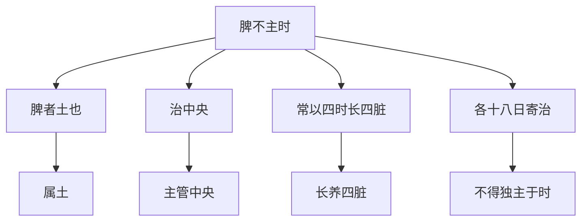

# 素问-太阴阳明论篇第二十九

> "黄帝问曰：太阴阳明为表里，脾胃脉也，生病而异者何也？" - 黄帝

---

## 📜 原文（节选）/ Original Text (Excerpt)

黄帝问曰：太阴阳明为表里，脾胃脉也，生病而异者何也？

岐伯对曰：太阴阳明为表里，脾胃脉也，生病而异者，何也？

脾与胃以膜相连耳，而能为之行其津液？脾主为胃行其津液也。

帝曰：脾病而四支不用，何也？

岐伯曰：脾主身之肌肉，今脾病不能为胃行其津液，四肢不得禀水谷气，气日以衰，脉道不利，筋骨肌肉皆无气以生，故不用焉。

帝曰：脾不主时何也？

岐伯曰：脾者土也，治中央，常以四时长四脏，各十八日寄治，不得独主于时也。

　　黄帝问曰：太阴阳明为表里，脾胃脉也，生病而异者何也？

　　岐伯对曰：阴阳异位，更虚更实，更逆更从，或从内，或从外，所从不同，故病异名也。

　　帝曰：愿闻其异状也。

　　岐伯曰：阳者，天气也，主外；阴者，地气也，主内。故阳道实，阴道虚。故犯贼风虚邪者，阳受之；食饮不节，起居不时者，阴受之。阳受之，则入六府，阴受之，则入五藏。入六府，则身热不时卧，上为喘呼；入五藏，则䐜[chēn]满闭塞，下为飧泄，久为肠澼。故喉主天气，咽主地气。故阳受风气，阴受湿气。故阴气从足上行至头，而下行循臂至指端；阳气从手上行至头，而下行至足。故曰阳病者上行极而下，阴病者下行极而上。故伤于风者，上先受之；伤于湿者，下先受之。

　　帝曰：脾病而四支不用何也？

　　岐伯曰：四支皆禀气于胃，而不得至经，必因于脾，乃得禀也。今脾病不能为胃行其津液，四支不得禀水谷气，气日以衰，脉道不利，筋骨肌肉，皆无气以生，故不用焉。

　　帝曰：脾不主时何也？

　　岐伯曰：脾者土也，治中央，常以四时长四藏，各十八日寄治，不得独主于时也。脾藏者常着胃土之精也，土者生万物而法天地，故上下至头足，不得主时也。

　　帝曰：脾与胃以膜相连耳，而能为之行其津液何也？

　　岐伯曰：足太阴者三阴也，其脉贯胃属脾络嗌，故太阴为之行气于三阴。阳明者表也，五藏六府之海也，亦为之行气于三阳。藏府各因其经而受气于阳明，故为胃行其津液，四支不得禀水谷气，日以益衰，阴道不利，筋骨肌肉无气以生，故不用焉。

---

## 📖 白话文翻译（节选）/ Modern Chinese Translation (Excerpt)

黄帝问道：太阴阳明为表里，是脾胃的脉，生病而不同，为什么？

岐伯回答说：太阴阳明为表里，是脾胃的脉，生病而不同，为什么？

脾与胃以膜相连罢了，而能为它运行其津液？脾主为胃运行其津液。

黄帝说：脾病而四肢不使用，为什么？

岐伯说：脾主管身体的肌肉，现在脾病不能为胃运行其津液，四肢不能禀受水谷的气，气日益衰弱，脉道不通利，筋骨肌肉都没有气以生，所以不使用。

黄帝说：脾不主管时，为什么？

岐伯说：脾属土，主管中央，常以四时长养四脏，各十八日寄治，不能独主管于时。

　　黄帝问道：太阴、阳明两经，互为表里，是脾胃所属的经脉，而所生的疾病不同，是什麽道理？

　　岐伯回答说：太阴属阴经，阳明属阳经，两经循行的部位不同，四时的虚实顺逆不同，病或从内生，或从外入，发病原因也有差异，所以病名也就不同。

　　黄帝道：我想知道它们不同的情况。

　　岐伯说：人身的阳气，犹如天气，主卫互于外；阴气，犹如地气，主营养于内。所以阳气性刚多实，阴气性柔易虚。凡是贼风虚邪伤人，外表阳气先受侵害；饮食起居失调，内在阴气先受损伤。阳分受邪，往往传入六腑；阴气受病，每多累及五脏。邪入六腑，可见发热不得安卧，气上逆而喘促；邪入五脏，则见脘腹胀满，闭塞不通，在下为大便泄泻，病久而产生痢疾。所以喉司呼吸而通天气，咽吞饮食而连地气。因此阳经易受风邪，阴经易感湿邪。手足三阴经脉之气，从足上行至头，再向下沿臂膊到达指端；手足三阳静脉之气，从手上行至头，再向下行到足。所以说，阳经的病邪，先上行至极点，再向下行；阴经的病邪，先下行至极点，再向上行。故风邪为病，上部首先感受；湿邪成疾，下部首先侵害。

　　黄帝道：脾病会引起四肢功能丧失，这是什麽道理？

　　岐伯说：四肢都要承受胃中水谷精气以濡养，但胃中精气不能直接到达四肢经脉，必须依赖脾气的传输，才能营养四肢。如今脾有病不能为胃输送水谷精气，四肢失去营养，则经气日渐衰减，经脉不能畅通，筋骨肌肉都得不到濡养，因此四肢便丧失正常的功能了。

　　黄帝道：脾脏不能主旺一个时季，是什麽道理？

　　岐伯说：脾在[五行](https://www.guoxuemeng.com/guoxue/wuxing/)中属土，主管中央之位，分旺于四时以长养四脏，在四季之末各寄旺十八日，故脾不单独主旺于一个时季。由于脾脏经常为胃土传输水谷精气，譬如天地养育万物一样无时或缺的。所以它能从上到下，从头到足，输送水谷之精于全身各部分，而不专主旺于一时季。

　　黄帝道：脾与胃仅以一膜相连，而脾能为胃转输津液，这是什麽道理？

　　岐伯说：足太阴脾经，属三阴，它的经脉贯通到胃，连属于脾，环绕咽喉，故脾能把胃中水谷之精气输送到手足三阴经；足阳明胃经，为脾经之表，是供给五藏六府营养之处，故胃也能将太阴之气输送到手足三阳经。五藏六府各通过脾经以接受胃中的精气，所以说脾能为胃运行津液。如四肢得不到水谷经气的滋养，经气便日趋衰减，脉道不通，筋骨肌肉都失却营养，因而也就丧失正常的功用了。

---

## 🔑 核心要点 / Core Concepts

### 1. 太阴阳明为表里 / Taiyin and Yangming as Exterior-Interior

| 关系 | 经脉 | 脏腑 |
|------|------|------|
| 表里 | 太阴-阳明 | 脾-胃 |

### 2. 脾胃功能 / Spleen Stomach Function

| 脏腑 | 功能 |
|------|------|
| 脾 | 主身之肌肉，为胃行其津液 |
| 胃 | 受纳腐熟水谷 |

### 3. 脾不主时 / Spleen Not Governing Season

---

## 📚 理论解释 / Theoretical Analysis

### 太阴阳明理论 / Taiyin and Yangming Theory

> [!info] 核心概念
- 太阴阳明为表里
- 脾与胃以膜相连
- 脾主为胃行其津液

#### 太阴阳明详解 / Detailed Taiyin and Yangming

**1. 表里关系 / Exterior-Interior Relationship**
- 太阴-阳明：太阴与阳明为表里
- 脾胃脉：是脾胃的脉
- 生病而异：生病而不同

**2. 脾胃相连 / Spleen Stomach Connected**
- 脾与胃：以膜相连
- 为胃行津液：脾主为胃行其津液
- 津液运行：津液运行全身

### 脾病四肢不用理论 / Spleen Disease Four Limbs Not Use Theory

> [!warning] 核心理念
- 脾主身之肌肉
- 脾病不能为胃行其津液
- 四肢不得禀水谷气

#### 脾病四肢不用详解 / Detailed Spleen Disease Four Limbs Not Use

**1. 脾主肌肉 / Spleen Governing Flesh**
- 脾主身之肌肉：脾主管身体的肌肉
- 四肢肌肉：四肢肌肉
- 肌肉功能：肌肉功能正常

**2. 脾病不运津液 / Spleen Disease Not Transporting Fluids**
- 脾病：脾病
- 不能为胃行其津液：不能为胃运行其津液
- 津液不通：津液运行不畅

**3. 四肢不用 / Four Limbs Not Use**
- 四肢不得禀水谷气：四肢不能禀受水谷的气
- 气日以衰：气日益衰弱
- 脉道不利：脉道不通利
- 筋骨肌肉皆无气以生：筋骨肌肉都没有气以生
- 故不用：所以不使用

### 脾不主时理论 / Spleen Not Governing Season Theory

> [!note] 脾不主时概念
- 脾者土也
- 治中央
- 常以四时长四脏

#### 脾不主时详解 / Detailed Spleen Not Governing Season

**1. 脾属土 / Spleen Belongs to Earth**
- 脾者土也：脾属土
- 土主中央：土主管中央
- 四脏：肝心肺肾

**2. 脾长四脏 / Spleen Nourishes Four Zang**
- 常以四时长四脏：常以四时长养四脏
- 各十八日寄治：各十八日寄治
- 不得独主于时：不能独主管于时

---

## 🏥 中医实践应用 / TCM Practice Application

### 脾胃调理 / Spleen Stomach Regulation

#### 现代脾胃调理要点 / Modern Spleen Stomach Regulation Key Points

**1. 脾病调理 / Spleen Disease Regulation**
- 脾主肌肉：脾病影响肌肉
- 四肢不用：四肢无力
- 治法：健脾运化

**2. 胃病调理 / Stomach Disease Regulation**
- 胃受纳腐熟：胃受纳腐熟水谷
- 脾为胃行津液：脾为胃行其津液
- 治法：养胃和胃

**3. 脾胃同调 / Spleen Stomach Together Regulation**
- 脾胃表里：脾胃表里关系
- 脾胃同治：脾胃同治
- 治法：健脾和胃

---

## 🔗 相关链接 / Related Links

- [[MOC-黄帝内经知识库]] - 主索引
- [[黄帝内经-素问索引]] - 素问索引
- [[黄帝内经-核心理论]] - 核心理论体系
- [[素问28-通评虚实论篇]] - 通评虚实
- [[素问30-阳明脉解篇]] - 阳明脉解

### 易学关联 / Yi Jing Connection

- [[MOC-易经知识库]] - 易经索引
- [[20260201-0002 五行]] - 五行理论

**易学与太阴阳明的联系:**
- 五行理论：易学的五行理论与中医脾胃相通
- 土居中央：易学的土居中央与中医脾不主时相通

---

## 💡 学习要点 / Learning Points

### 掌握重点 / Key Points to Master

- [ ] 理解太阴阳明的表里关系
- [ ] 掌握脾胃的功能
- [ ] 学会脾病四肢不用机理
- [ ] 了解脾不主时的理论

### 思考问题 / Questions for Reflection

1. **为什么说"脾主身之肌肉"？**
   - 脾主运化：脾主运化水谷
   - 肌肉来源：肌肉来源于水谷精微
   - 脾病影响肌肉：脾病则肌肉功能失常

2. **现代医学如何应用"太阴阳明"？**
   - 消化系统：脾胃消化系统
   - 肌肉系统：脾主肌肉系统
   - 综合调理：综合调理脾胃

---

## 📊 学习进度 / Learning Progress

### 完成情况 / Completion Status

| 学习内容 | 状态 | 备注 |
|---------|------|------|
| 原文诵读 | 📝 进行中 | 建议每日诵读 |
| 白话文理解 | ✅ 已完成 | 理解主要含义 |
| 太阴阳明 | ✅ 已完成 | 掌握关系 |
| 脾胃调理 | 📝 进行中 | 需要临床实践 |
| 理论分析 | ✅ 已完成 | 理解理论 |

---

## 🔄 更新日志 / Update Log

### 2026-02-03

- ✅ 创建太阴阳明论篇第二十九笔记
- ✅ 完成原文、白话文翻译（节选）
- ✅ 整理太阴阳明和脾胃功能对照表
- ✅ 编写太阴阳明和脾胃理论

---

**笔记创建日期**：2026年2月3日

**最后更新**：2026年2月3日
