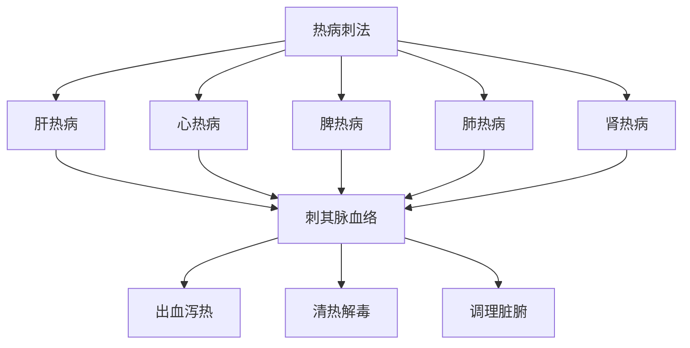

# 素问-刺热篇第三十二

> "黄帝问曰：五脏热病奈何？岐伯曰：肝热病者，小便先黄，腹痛，多卧身热。" - 岐伯

---

## 📜 原文（节选）/ Original Text (Excerpt)

黄帝问曰：五脏热病奈何？

岐伯曰：肝热病者，小便先黄，腹痛，多卧身热。热争则狂言及惊，胁满痛，手足躁，不得安卧。

心热病者，先不乐，数日乃热。热争则卒心痛，烦闷善呕，头痛面赤无汗。

脾热病者，先头重颊痛，心烦颜青，欲呕身热。热争则腰痛不可用俯仰，腹满泄，两颔痛。

肺热病者，淅然厥起毫毛，恶风寒，舌上黄，身热。热争则喘咳，痛走胸膺背，不得太息，头痛不堪，汗出而寒。

肾热病者，先腰痛胻酸，苦渴数饮，身热。热争则项痛强，胻寒且酸，脚下热，不欲言。

　　肝热病者，小便先黄，腹痛多卧身热，热争，则狂言及惊，胁满痛，手足躁，不得安卧；庚辛甚，甲乙大汗，气逆则庚辛死。刺足厥阴少阳。其逆则头痛员员，脉引冲头也。

　　心热病者，先不乐，数日乃热，热争则卒心痛，烦闷善呕，头痛面赤，无汗；壬癸甚，丙丁大汗，气逆则壬癸死。刺手少阴太阳。

　　脾热病者，先头重颊痛，烦心颜青，欲呕身热，热争则腰痛不可用俛仰，腹满泄，两颔痛；甲乙甚，戊己大汗，气逆则甲乙死。刺足太阴阳明。

　　肺热病者，先淅然厥，起毫毛，恶风寒，舌上黄，身热。热争则喘欬，痛走胸膺背，不得大息，头痛不堪，汗出而寒；丙丁甚，庚辛大汗，气逆则丙丁死。刺手太阴阳明，出血如大豆，立已。

　　肾热病者，先腰痛胻痠，苦喝数饮，身热，热争则项痛而强，胻寒且痠，足下热，不欲言，其逆则项痛员员澹澹然；戊己甚，壬癸大汗，气逆则戊己死。刺足少阴太阳。诸汗者，至其所胜日汗出也。

　　肝热病者，左颊先赤；心热病者，颜先赤；脾热病者，鼻先赤；肺热病者，右颊先赤；肾热病者，颐先赤。病虽未发，见赤色者刺之，名曰治未病。热病从部所起者，至期而已；其刺之反者，三周而已；重逆则死。诸当汗者，至其所胜日，汗大出也。

　　诸治热病，以饮之寒水，乃刺之；必寒衣之，居止寒处，身寒而止也。

　　热病先胸胁痛，手足躁，刺足少阳，补足太阴，病甚者为五十九刺。热病始手臂痛者，刺手阳明太阴而汗出止。热病始于头首者，刺项太阳而汗出止。热病始于足胫者，刺足阳明而汗出止。热病先身重骨痛，耳聋好瞑，刺足少阴，病甚为五十九刺。热病先眩冒而热，胸胁满，刺足少阴少阳。

　　太阳之脉，色荣颧骨，热病也，荣未交，曰今且得汗，待时而已。与厥阴脉争见者，死期不过三日。其热病内连肾，少阳之脉色也。少阳之脉，色荣颊前，热病也，荣未交，曰今且得汗，待时而已，与厥阴脉争见者，死期不过三日。

　　热病气穴：三椎下间主胸中热，四椎下间主鬲中热，五椎下间主肝热，六椎下间主脾热，七椎下间主肾热，荣在骶也，项上三椎陷者中也。颊下逆颧为大瘕，下牙车为腹满，颧后为胁痛。颊上者，鬲上也。

---

## 📖 白话文翻译（节选）/ Modern Chinese Translation (Excerpt)

黄帝问道：五脏热病怎样？

岐伯说：肝热病，小便先黄，腹痛，多卧身热。热气相争则狂言及惊恐，胁胀满疼痛，手足躁动，不能安卧。

心热病，先不快乐，数日后发热。热气相争则突然心痛，烦闷时常呕吐，头痛面赤没有汗。

脾热病，先头沉重颊部疼痛，心烦面青，想要呕吐身体发热。热气相争则腰部疼痛不能俯仰，腹部胀满泄泻，两颔疼痛。

肺热病，寒战突然起立毫毛，厌恶风寒，舌上黄，身体发热。热气相争则喘息咳嗽，疼痛行走胸膺背部，不能长叹息，头痛不能忍受，汗出而寒。

肾热病，先腰痛小腿酸楚，苦于口渴频繁饮水，身体发热。热气相争则颈部疼痛强直，小腿寒冷而且酸楚，脚下发热，不想说话。

　　肝脏发生热病，先出现小便黄，腹痛，多卧，身发热。当气邪入脏，与正气相争时，则狂言惊骇，胁部满痛，手足躁扰不得安卧；逢到庚辛日，则因木受金克而病重，若逢甲已日木旺时，便大汗出而热退若将在庚辛日死亡。治疗时，应刺足厥阴肝和足少阳胆经。若肝气上逆，则见头痛眩晕，这是因热邪循肝脉上冲于头所致。

　　心脏发热病，先觉得心中不愉快，数天以后始发热，当热邪入脏与正气相争时，则突然心痛，烦闷，时呕，头痛，面赤，无汗；逢到壬癸日，则因火受水克而病重，若逢丙丁日火旺时，便大汗出而热退，若邪气胜脏，病更严重将在壬癸日死亡。治疗时，应刺手少阴心和手太阳小肠经。

　　脾脏发生热病，先感觉头重，面颊痛，心烦，额部发青，欲呕，身热。当热邪入脏，与正气相争时，则腰痛不可以俯仰，，腹部胀满而泄泻，两颌部疼痛，逢到甲已日木旺时，则因土受木克而病重，若逢庾已日土旺时，便大汗出而热退，若邪气胜脏，病更严重，就会在甲已日死亡。治疗时，刺足太阴脾和足阳明胃经。

　　肺脏发生热病，先感到体表淅淅然寒冷，毫毛竖立，畏恶风寒，舌上发黄，全身发热。当热邪入脏，与正气相争时，则气喘咳嗽，疼痛走窜于胸膺背部，不能太息，头痛的很厉害，汗出而恶寒，逢丙丁日火旺时，则因金受火克而病重，若逢庚辛日金旺时，便大汗出而热退，若邪气胜脏，病更严重，就会在丙丁日死亡。治疗时，刺手太阴肺和手阳明大肠经，刺出其血如大豆样大，则热邪去而经脉和，病可立愈。

　　肾脏发生热病，先觉腰痛和小腿发痠，口渴的很厉害，频频饮水，全身发热。当邪热入脏，与正气相争时，则项痛而强直，小腿寒冷痠痛，足心发热，不欲言语。如果肾气上逆，则项痛头眩晕而摇动不定，逢利戊已日土旺时，则因水受土克而病重，若逢壬癸日水旺时，便大汗出而热退，若邪气胜脏，病更严重，就会在已日死亡。治疗时，刺足少阴肾和足太阳膀胱经。以上所说的诸脏之大汗出，都是到了各脏器旺之日，正胜邪却，即大汗出而热退病愈。

　　肝脏发生热病，左颊部先见赤色；心脏发生热病，额部先见赤色；脾脏发生热病，鼻部先见赤色；肺脏发生热病，右颊部先见赤色，肾脏发生热病，颐部先见赤色。病虽然还没有发作，但面部已有赤色出现，就应予以刺治，这叫做“治未病”。热病只在五脏色部所在出现赤色，并未见到其他症状的，为病尚轻浅，若予以及时治疗，则至其当旺之，病即可愈；若治疗不当，应泻反补，应补反泻，就会延长病程，须通过三次当旺之日，始能病愈；若一再误治，势必使病情恶化而造成死亡。诸脏热病应当汗出的，都是至其当旺之日，大汗出而病愈。

　　凡治疗热病，应在喝些清凉的饮料，以解里热之后，再进行针刺，并且要病人衣服穿的单薄些，居住于凉爽的地方，以解除表热，如此使表里热退身凉而病愈。

　　热病先出现胸胁痛，手足躁扰不安的，是邪在足少阳经，应刺足少阳经以泻阳分之邪，补足太阴经以培补脾土，病重的就用“五十九刺”的方法。热病先手臂痛的，是病在上而发于阳，刺手阳明、太阴二经之穴，汗出则热止。热病开始发于头部的，是太阳为病，刺足太阳颈项部的穴位，汗出则热止。热病先出现身体重，骨节痛，耳聋，昏倦嗜睡的，是发于少阴的热病，刺足少阴经之穴，病重的用“五十九刺”的方法。热病先出现头眩晕昏冒而后发热，胸胁满的，是病发于少阳，并将传入少阴，使阴阳枢机失常，刺足少阴和足少阳二经，使邪从枢转而外出。

　　太阳经脉之病，赤色出现于颧骨部的，这是热病，若色泽尚未暗晦，病尚轻浅，至其当旺之时，可以得汗出而病愈。若同时又见少阴经的脉证，此为木盛水衰的死证，死期不过三日，这是因为热病已连于肾。少阳经脉之病，赤色出现于面颊的前方，这是少阳经脉热病，若色泽尚未暗晦，是病邪尚浅，至其当旺之时，可以得汗出而病愈。若同时又见少阴经的脉证，此为木盛水衰的死证，死期不过三日，这是因为热病已连于肾。少阳经脉之病，赤色出现于面颊的前方，这是少阳经脉热病，若色泽尚未暗晦，是病邪尚浅，至其当旺之时，可以得汗出而病愈。若同时又见厥阴脉色现于颊部，是母胜其子的死证，其死期不过三日。

　　治疗热病的气穴：第三脊椎下方主治胸中的热病，第四脊椎下方主治膈中的热病，第五脊椎下方主治肝热病，第七脊椎下方主治肾热病。治疗热病，即取穴于上，以泻阳邪，当再取穴于下，以补阴气，在下取穴在尾骶骨处。项部第三椎以下凹陷处的中央部位是大椎穴，由此向下便是脊椎的开始。诊察面部之色，可以推知腹部疾病，如架部赤色由下向上到颧骨部，为有“大瘕泄”病；见赤色自颊下行至颊车部，为腹部胀满；赤色见于颧骨后侧，为胁痛；赤色见于颊上，为病在膈上。

---

## 🔑 核心要点 / Core Concepts

### 1. 五脏热病表现 / Five Zang Heat Disease Manifestations

| 脏 | 先兆症状 | 热争症状 |
|------|----------|----------|
| 肝 | 小便先黄，腹痛，多卧身热 | 狂言及惊，胁满痛，手足躁，不得安卧 |
| 心 | 先不乐，数日乃热 | 卒心痛，烦闷善呕，头痛面赤无汗 |
| 脾 | 先头重颊痛，心烦颜青，欲呕身热 | 腰痛不可用俯仰，腹满泄，两颔痛 |
| 肺 | 淅然厥起毫毛，恶风寒，舌上黄，身热 | 喘咳，痛走胸膺背，不得太息，头痛不堪，汗出而寒 |
| 肾 | 先腰痛胻酸，苦渴数饮，身热 | 项痛强，胻寒且酸，脚下热，不欲言 |

### 2. 刺热疗法 / Heat Puncture Therapy

| 脏 | 刺法 |
|------|------|
| 肝 | 刺其脉血络 |
| 心 | 刺其脉血络 |
| 脾 | 刺其脉血络 |
| 肺 | 刺其脉血络 |
| 肾 | 刺其脉血络 |

### 3. 热病刺法特点 / Heat Disease Acupuncture Characteristics

---

## 📚 理论解释 / Theoretical Analysis

### 五脏热病理论 / Five Zang Heat Disease Theory

> [!info] 核心概念
- 五脏各有热病表现
- 热气相争症状明显
- 刺其脉血络以泻热

#### 五脏热病详解 / Detailed Five Zang Heat Disease

**1. 肝热病 / Liver Heat Disease**
- 先兆症状：小便先黄，腹痛，多卧身热
- 热争症状：狂言及惊，胁满痛，手足躁，不得安卧
- 病机：肝火旺盛，热气上炎

**2. 心热病 / Heart Heat Disease**
- 先兆症状：先不乐，数日乃热
- 热争症状：卒心痛，烦闷善呕，头痛面赤无汗
- 病机：心火旺盛，热气上冲

**3. 脾热病 / Spleen Heat Disease**
- 先兆症状：先头重颊痛，心烦颜青，欲呕身热
- 热争症状：腰痛不可用俯仰，腹满泄，两颔痛
- 病机：脾火旺盛，湿热内生

**4. 肺热病 / Lung Heat Disease**
- 先兆症状：淅然厥起毫毛，恶风寒，舌上黄，身热
- 热争症状：喘咳，痛走胸膺背，不得太息，头痛不堪，汗出而寒
- 病机：肺火旺盛，热气上逆

**5. 肾热病 / Kidney Heat Disease**
- 先兆症状：先腰痛胻酸，苦渴数饮，身热
- 热争症状：项痛强，胻寒且酸，脚下热，不欲言
- 病机：肾火旺盛，热气下注

### 刺热疗法理论 / Heat Puncture Therapy Theory

> [!warning] 核心理念
- 刺其脉血络
- 出血泻热
- 调理脏腑

#### 刺热疗法详解 / Detailed Heat Puncture Therapy

**1. 刺法原则 / Acupuncture Principle**
- 刺其脉血络：刺其经脉血络
- 出血泻热：出血以泻热
- 调理脏腑：调理脏腑功能

**2. 刺法要点 / Acupuncture Key Points**
- 选穴：选择相应的经脉穴位
- 手法：刺其脉血络
- 出血：适当出血，泻热清热

---

## 🏥 中医实践应用 / TCM Practice Application

### 五脏热病治疗 / Five Zang Heat Disease Treatment

#### 现代五脏热病治疗要点 / Modern Five Zang Heat Disease Treatment Key Points

**1. 肝热病治疗 / Liver Heat Disease Treatment**
- 症状：小便先黄，腹痛，多卧身热
- 治法：清肝泻火
- 药物：龙胆泻肝汤、丹栀逍遥散
- 针刺：刺其脉血络

**2. 心热病治疗 / Heart Heat Disease Treatment**
- 症状：先不乐，数日乃热
- 治法：清心泻火
- 药物：导赤散、朱砂安神丸
- 针刺：刺其脉血络

**3. 脾热病治疗 / Spleen Heat Disease Treatment**
- 症状：先头重颊痛，心烦颜青，欲呕身热
- 治法：清热健脾
- 药物：清胃散、健脾丸
- 针刺：刺其脉血络

**4. 肺热病治疗 / Lung Heat Disease Treatment**
- 症状：淅然厥起毫毛，恶风寒，舌上黄，身热
- 治法：清肺泻火
- 药物：麻杏石甘汤、清肺散
- 针刺：刺其脉血络

**5. 肾热病治疗 / Kidney Heat Disease Treatment**
- 症状：先腰痛胻酸，苦渴数饮，身热
- 治法：滋阴降火
- 药物：知柏地黄丸、大补阴丸
- 针刺：刺其脉血络

---

## 🔗 相关链接 / Related Links

- [[MOC-黄帝内经知识库]] - 主索引
- [[黄帝内经-素问索引]] - 素问索引
- [[黄帝内经-核心理论]] - 核心理论体系
- [[素问31-热论篇]] - 热论
- [[素问33-评热病论篇]] - 评热病论

### 易学关联 / Yi Jing Connection

- [[MOC-易经知识库]] - 易经索引
- [[20260201-0002 五行]] - 五行理论

**易学与刺热的联系:**
- 五行理论：易学的五行理论与中医五脏热病相通
- 阴阳理论：易学的阴阳理论与中医热病刺法相通

---

## 💡 学习要点 / Learning Points

### 掌握重点 / Key Points to Master

- [ ] 理解五脏热病的表现
- [ ] 掌握刺热疗法的方法
- [ ] 学会热争症状的判断
- [ ] 了解五脏热病的治疗

### 思考问题 / Questions for Reflection

1. **为什么说"刺其脉血络"？**
   - 出血泻热：出血以泻热
   - 清热解毒：清热解毒
   - 调理脏腑：调理脏腑功能

2. **现代医学如何应用"五脏热病"？**
   - 发热疾病：发热疾病治疗
   - 脏腑疾病：脏腑疾病辨证治疗
   - 针刺治疗：针刺治疗发热

---

## 📊 学习进度 / Learning Progress

### 完成情况 / Completion Status

| 学习内容 | 状态 | 备注 |
|---------|------|------|
| 原文诵读 | 📝 进行中 | 建议每日诵读 |
| 白话文理解 | ✅ 已完成 | 理解主要含义 |
| 五脏热病 | ✅ 已完成 | 掌握表现 |
| 刺热疗法 | 📝 进行中 | 需要临床实践 |
| 理论分析 | ✅ 已完成 | 理解理论 |

---

## 🔄 更新日志 / Update Log

### 2026-02-03

- ✅ 创建刺热篇第三十二笔记
- ✅ 完成原文、白话文翻译（节选）
- ✅ 整理五脏热病表现对照表
- ✅ 编写五脏热病和刺热疗法理论

---

**笔记创建日期**：2026年2月3日

**最后更新**：2026年2月3日
