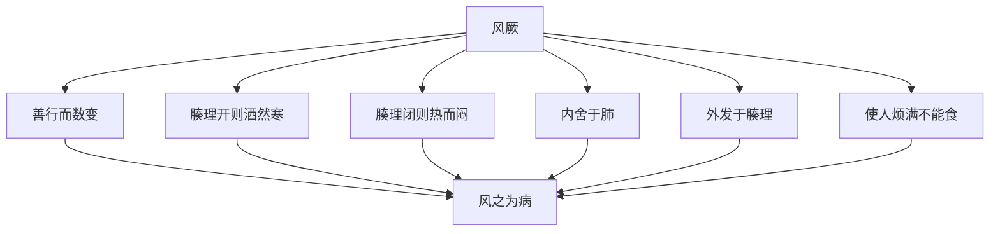

# 素问-评热病论篇第三十三

> "黄帝问曰：有病温者，汗出辄复热，而脉躁疾，不为汗衰，狂言不能食，病名为何？" - 黄帝

---

## 📜 原文（节选）/ Original Text (Excerpt)

黄帝问曰：有病温者，汗出辄复热，而脉躁疾，不为汗衰，狂言不能食，病名为何？

岐伯对曰：病名阴阳交，交者死也。

帝曰：愿闻其说。

岐伯曰：人所以汗出者，皆生于谷，谷生于精。今邪气交争于骨肉之间，而得汗出者，是邪却而精胜也。精胜则当能食而不复热。复热者，是邪胜也。且夫《热论》曰：汗出而脉尚躁盛者死。今脉不与汗相应，此不胜其病也，其死明矣。

汗出而脉尚躁盛者死者，今脉不与汗相应，此不胜其病也，其死明矣。狂言者，是失志，失志者死。今见三死，不见一生，虽愈必死也。

帝曰：有病身热汗出而烦满，烦满不为汗解，此为何病？

岐伯曰：风厥也。

帝曰：愿闻其说。

岐伯曰：风之为病也，善行而数变，腠理开则洒然寒，闭则热而闷。其风之伤人也，内舍于肺，外发于腠理，开则洒然寒，闭则热而闷。使人烦满，不能食，此风厥之病也。

　　黄帝问曰：有病温者，汗出辄复热，而脉躁疾不为汗衰，狂言不能食，病名为何？

　　岐伯对曰：病名阴阳交，交者死也。

　　帝曰：愿闻其说。

　　岐伯曰：人所以汗出者，皆生于谷，谷生于精。今邪气交争于骨肉而得汗者，是邪却而精胜也。精胜，则当能食而不复热，复热者邪气也，汗者精气也；今汗出而辄复热者，是邪胜也，不能食者，精无俾也，病而留者，其寿可立而倾也。且夫《热论》曰：汗出而脉尚躁盛者死。今脉不与汗相应，此不胜其病也，其死明矣。狂言者是失志，失志者死。今见三死，不见一生，虽愈必死也。

　　帝曰：有病身热汗出烦满，烦满不为汗解，此为何病？

　　岐伯曰：汗出而身热者，风也；汗出而烦满不解者，厥也，病名曰风厥。

　　帝曰：愿卒闻之。

　　岐伯曰：巨阳主气，故先受邪；少阴与其为表里也，得热则上从之，从之则厥也。

　　帝曰：治之奈何？

　　岐伯曰：表里刺之，饮之服汤。

　　帝曰：劳风为病何如？

　　岐伯曰：劳风法在肺下，其为病也，使人强上冥视，唾出若涕，恶风而振寒，此为劳风之病。

　　帝曰：治之奈何？

　　岐伯曰：以救俛仰。巨阳引。精者三日，中年者五日，不精者七日，咳出青黄涕，其状如脓，大如弹丸，从口中若鼻中出，不出则伤肺，伤肺则死也。

　　帝曰：有病肾风者，面胕[fū]痝[máng]然，壅害于言，可刺不？

　　岐伯曰：虚不当刺，不当刺而刺，后五日其气必至。

　　帝曰：其至何如？

　　岐伯曰：至必少气时热，时热从胸背上至头，汗出，手热，口干苦渴，小便黄，目下肿，腹中鸣，身重难以行，月事不来，烦而不能食，不能正偃，正偃则欬，病名曰风水，论在《刺法》中。

　　帝曰：愿闻其说。

　　岐伯曰：邪之所凑，其气必虚，阴虚者，阳必凑之，故少气时热而汗出也。小便黄者，少腹中有热也。不能正偃者，胃中不和也。正偃则咳甚，上迫肺也。诸有水气者，微肿先见于目下也。

　　帝曰：何以言？

　　岐伯曰：水者阴也，目下亦阴也，腹者至阴之所居，故水在腹者，必使目下肿也。真气上逆，故口苦舌干，卧不得正偃，正偃则咳出清水也。诸水病者，故不得卧，卧则惊，惊则咳甚也。腹中鸣者，病本于胃也。薄脾则烦不能食，食不下者，胃脘隔也。身重难以行者，胃脉在足也。月事不来者，胞脉闭也，胞脉者属心而络于胞中，今气上迫肺，心气不得下通，故月事不来也。

　　帝曰：善。

---

## 📖 白话文翻译（节选）/ Modern Chinese Translation (Excerpt)

黄帝问道：有患温病的人，汗出就又发热，而且脉象躁急，不因为出汗而衰减，狂言不能进食，病名叫什么？

岐伯回答说：病名叫阴阳交，阴阳交的就会死。

黄帝说：我希望听到它的说明。

岐伯说：人之所以出汗，都产生于谷物，谷物产生于精气。现在邪气在骨肉之间交争，而能够出汗的，是邪气退却而精气战胜。精气战胜就应当能够进食而不再发热。再发热，是邪气战胜。况且《热论》说：汗出而脉象仍然躁急旺盛的会死。现在脉象与出汗不相应，这是不能战胜疾病，它的死亡很明显了。

汗出而脉象仍然躁急旺盛的会死，现在脉象与出汗不相应，这是不能战胜疾病，它的死亡很明显了。狂言的，是失去志意，失去志意的会死。现在见到三种死候，不见一种生候，虽然痊愈也一定会死。

黄帝说：有患身体发热汗出而且烦闷胀满，烦闷胀满不因为出汗而解除，这是什么病？

岐伯说：风厥。

黄帝说：我希望听到它的说明。

岐伯说：风之为病，善于运行而且多次变化，腠理张开就寒战，腠理闭合就发热而且烦闷。风邪伤人，内舍于肺，外发于腠理，张开就寒战，闭合就发热而且烦闷。使人烦闷胀满，不能进食，这是风厥的病。

　　黄帝问道：有的温热病患者，汗出以后，随即又发热，脉象急疾躁动，其病势不仅没有因汗出而衰减，反而出现言语狂乱，不进饮食等症状，这叫什麽病？

　　岐伯回答说：这种病叫阴阳交，阴阳交是死症。

　　黄帝说：我想听听其中的道理。

　　岐伯说：人所以能够出汗，是依赖于水谷所化生的精气，水谷之精气旺盛，便能胜过邪气而出汗，现在邪气与正气交争于骨肉之间，能够得到汗出的是邪气退而精气胜，精气胜的应当能进饮食而不在发热。复发热是邪气尚留，汗出是精气胜邪，现在汗出后又复发热，是邪气胜过精气。不进饮食，则精气得不到继续补益，邪热又逗留不去，这样发展下去，病人的生命就会立即发生危险。《热论》中也曾说：汗出而脉仍躁盛，是死证。现在其脉象不与汗出相应，是精气已经不能胜过邪气，死亡的征象已是很明显的了。况且狂言乱语是神志失常，神志失常是死证。现在已出现了三种死证，却没有一点生机，病虽可能因汗出而暂时减轻，但终究是要死亡的。

　　黄帝说：有的病全身发热，汗出，烦闷，其烦闷并不因汗出而缓解，这是什麽病呢？

　　岐伯说：汗出而全身发热，是因感受了风邪；烦闷不解，是由于下气上逆所致，病名叫风厥。

　　黄帝说：希望你能详尽地讲给我听。

　　岐伯说：太阳为诸阳主气，主人一身之表，所以太阳首先感受风邪的侵袭。少阴与太阳相为表里，表病则里必应之，少阴手太阳发热的影响，其气亦从之而上逆，上逆便称为厥。

　　黄帝说：怎麽治疗呢？

　　岐伯说：治疗时应并刺太阳、少阴表里两经，即刺太阳以泻风热之邪，刺少阴以降上逆之气，并内服汤药。

　　黄帝说：劳风的病情是怎样的呢？

　　岐伯说：劳风的受邪部位常在肺下，其发病的症状，使人头项强直，头昏眩而视物不清，唾出粘痰似涕，恶风而寒栗，这就是劳风病的发病情况。

　　黄帝说：怎样治疗呢？

　　岐伯说：首先应使其胸中通畅，俯仰自如。肾经宠盛的青年人，太阳之气能引肾经外布，则水能济火，经适当治疗，可三日而愈；中年人精气稍衰，须五日可愈；老年人精气已衰，水不济火，须七日始愈。这种病人，咳出青黄色粘痰，其状似脓，凝结成块，大小如弹丸，应使痰从口中或鼻中排出，如果不能咳出，就要伤其肺，肺伤则死。

　　黄帝说：有患肾风的人，面部浮肿，目下壅起，妨害言语，这种病可以用针刺治疗吗？

　　岐伯说：虚证不能用刺。如果不应当刺而误刺，必伤其真气，使其脏气虚，五天以后，则病气复至而病势加重。

　　黄帝说：病气至时情况怎样呢？

　　岐伯说：病气至时，病人必感到少气，时发热，时常觉得热从胸背上至头，汗出手热，口中干渴，小便色黄，目下浮肿，腹中鸣响，身体沉重，行动困难。如患者是妇女则月经闭止，心烦而不能饮食，不能仰卧，仰卧就咳嗽的很厉害，此病叫风水，在《刺法》中有所论述。

　　黄帝说：我想听听其中的道理。

　　岐伯说：邪气之所以能够侵犯人体，是由于其正气先虚。肾脏属阴，风邪属阳。肾阴不足，风阳便乘虚侵入，所以呼吸少气，时时发热而汗出。小便色黄，是因为腹中有热。不能仰卧，是以内水气上乘于胃，而胃中不和。仰卧则咳嗽加剧，是因为水气上迫于肺。凡是有水气病的，目下部先出现微肿。

　　黄帝说：为什麽？

　　岐伯说：水是属阴的，目下也是属阴的部位，腹部也是至阴所在之处，所以腹中有水的，必使目下部位微肿。水邪之气上泛凌心，迫使脏真心火之气上逆，所以口苦咽干，不能仰卧，仰卧则水气上逆而咳出清水。凡是有水气病的人，都因水气上乘于胃而不能卧，卧则水气上凌于心而惊，逆于肺则咳嗽加剧。腹中鸣响，是胃肠中有水气窜动，其病本在于胃。若水迫于脾，则心烦不能进食。饮食不进，是水气阻隔于胃脘。身体沉重而行动困难，是因为胃的经脉下行于足部，水气随经下流所致。妇女月经不来，是因为水气阻滞，胞脉闭塞不通的缘故。胞脉属于心而下络于胞中，现水气上迫于肺，使心气不得下通，所以胞脉闭而月经不来。

　　黄帝说：好。

---

## 🔑 核心要点 / Core Concepts

### 1. 阴阳交 / Yin-Yang Intersection

| 症状 | 表现 | 预后 |
|------|------|------|
| 汗出辄复热 | 汗出就又发热 | 死候 |
| 脉躁疾 | 脉象躁急 | 死候 |
| 不为汗衰 | 不因为出汗而衰减 | 死候 |
| 狂言不能食 | 狂言不能进食 | 死候 |

### 2. 三死 / Three Deaths

| 死候 | 表现 |
|------|------|
| 一死 | 汗出而脉尚躁盛者死 |
| 二死 | 今脉不与汗相应，此不胜其病也 |
| 三死 | 狂言者，是失志，失志者死 |

### 3. 风厥 / Wind Jue

---

## 📚 理论解释 / Theoretical Analysis

### 阴阳交理论 / Yin-Yang Intersection Theory

> [!info] 核心概念
- 阴阳交是死候
- 三死不见一生
- 汗出辄复热

#### 阴阳交详解 / Detailed Yin-Yang Intersection

**1. 阴阳交表现 / Yin-Yang Intersection Manifestations**
- 汗出辄复热：汗出就又发热
- 脉躁疾：脉象躁急
- 不为汗衰：不因为出汗而衰减
- 狂言不能食：狂言不能进食

**2. 三死候 / Three Fatal Signs**
- 一死：汗出而脉尚躁盛者死
- 二死：脉不与汗相应，此不胜其病也
- 三死：狂言者，是失志，失志者死

**3. 不见一生 / No Life Sign**
- 虽愈必死：虽然痊愈也一定会死
- 预后不良：预后不良

### 风厥理论 / Wind Jue Theory

> [!warning] 核心理念
- 风之为病，善行而数变
- 腠理开则洒然寒，闭则热而闷
- 使人烦满，不能食

#### 风厥详解 / Detailed Wind Jue

**1. 风病特点 / Wind Disease Characteristics**
- 善行：善于运行
- 数变：多次变化
- 腠理开：腠理张开
- 腠理闭：腠理闭合

**2. 风邪伤人 / Wind Evil Injuring Human**
- 内舍于肺：内舍于肺
- 外发于腠理：外发于腠理
- 开则洒然寒：张开就寒战
- 闭则热而闷：闭合就发热而且烦闷

**3. 风厥症状 / Wind Jue Symptoms**
- 烦满：烦闷胀满
- 不能食：不能进食
- 身热汗出：身体发热汗出
- 烦满不为汗解：烦闷胀满不因为出汗而解除

---

## 🏥 中医实践应用 / TCM Practice Application

### 阴阳交治疗 / Yin-Yang Intersection Treatment

#### 现代阴阳交治疗要点 / Modern Yin-Yang Intersection Treatment Key Points

**1. 阴阳交诊断 / Yin-Yang Intersection Diagnosis**
- 症状：汗出辄复热，脉躁疾
- 预后：预后不良
- 治疗：难以治愈

**2. 阴阳交治疗 / Yin-Yang Intersection Treatment**
- 治法：调和阴阳
- 药物：回阳救逆
- 针刺：针刺调理

### 风厥治疗 / Wind Jue Treatment

#### 现代风厥治疗要点 / Modern Wind Jue Treatment Key Points

**1. 风厥诊断 / Wind Jue Diagnosis**
- 症状：身热汗出而烦满
- 病机：风邪伤人
- 预后：预后良好

**2. 风厥治疗 / Wind Jue Treatment**
- 治法：疏风解表
- 药物：桂枝汤、麻黄汤
- 针刺：针刺风穴

---

## 🔗 相关链接 / Related Links

- [[MOC-黄帝内经知识库]] - 主索引
- [[黄帝内经-素问索引]] - 素问索引
- [[黄帝内经-核心理论]] - 核心理论体系
- [[素问32-刺热篇]] - 刺热
- [[素问34-逆调论篇]] - 逆调

### 易学关联 / Yi Jing Connection

- [[MOC-易经知识库]] - 易经索引
- [[20260201-0005 五行]] - 五行理论

**易学与评热病论的联系:**
- 阴阳理论：易学的阴阳理论与中医阴阳交相通
- 风邪理论：易学的风邪理论与中医风厥相通

---

## 💡 学习要点 / Learning Points

### 掌握重点 / Key Points to Master

- [ ] 理解阴阳交的概念
- [ ] 掌握三死候的判断
- [ ] 学会风厥的诊断
- [ ] 了解阴阳交和风厥的治疗

### 思考问题 / Questions for Reflection

1. **为什么说"阴阳交，交者死也"？**
   - 阴阳交：阴气阳气相交
   - 病邪深入：病邪深入
   - 预后不良：预后不良

2. **现代医学如何应用"阴阳交"？**
   - 危重疾病：危重疾病诊断
   - 预后判断：预后判断
   - 综合治疗：综合治疗方案

---

## 📊 学习进度 / Learning Progress

### 完成情况 / Completion Status

| 学习内容 | 状态 | 备注 |
|---------|------|------|
| 原文诵读 | 📝 进行中 | 建议每日诵读 |
| 白话文理解 | ✅ 已完成 | 理解主要含义 |
| 阴阳交 | ✅ 已完成 | 掌握概念 |
| 风厥 | 📝 进行中 | 需要临床实践 |
| 理论分析 | ✅ 已完成 | 理解理论 |

---

## 🔄 更新日志 / Update Log

### 2026-02-03

- ✅ 创建评热病论篇第三十三笔记
- ✅ 完成原文、白话文翻译（节选）
- ✅ 整理阴阳交和风厥对照表
- ✅ 编写阴阳交和风厥理论

---

**笔记创建日期**：2026年2月3日

**最后更新**：2026年2月3日
