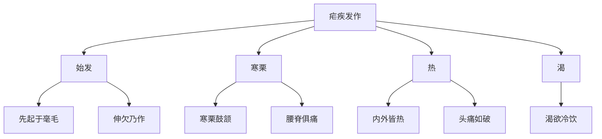

# 素问-疟论篇第三十五

> "黄帝问曰：夫疟疾皆生于风，其蓄作有时，何也？" - 黄帝

---

## 📜 原文（节选）/ Original Text (Excerpt)

黄帝问曰：夫疟疾皆生于风，其蓄作有时，何也？

岐伯对曰：疟之始发也，先起于毫毛，伸欠乃作，寒栗鼓颔，腰脊俱痛，寒去则内外皆热，头痛如破，渴欲冷饮。

帝曰：何气使然？

岐伯曰：阴阳上下交争，虚实更作，阴阳相移也。阳并于阴，则阴实而阳虚，阳明虚则寒栗鼓颔也；巨阳病衰，则阴气逆，阴气逆则外内皆热。

帝曰：疟而不作，何也？

岐伯曰：疟气随经络，沉以内薄，故卫气应乃作。疟气之随也，故日作，间日者，邪气与卫气客于六府，有时相失，不能相得，故间日乃作。

　　黄帝问曰：夫痎疟皆生于风，其蓄作有时者何也？

　　岐伯对曰：疟之始发也，先起于毫毛，伸欠乃作，寒慄鼓颔，腰脊俱痛，寒去则内外皆热，头痛如破，渴欲冷饮。

　　帝曰：何气使然？愿闻其道。

　　岐伯曰：阴阳上下交争，虚实更作，阴阳相移也。阳并于阴，则阴实而阳虚，阳明虚，则寒慄鼓颔也；巨阳虚，则腰背头项痛；三阳俱虚，则阴气胜，阴气胜则骨寒而痛；寒生于内，故中外皆寒；阳盛则外热，阴虚则内热，外内皆热则喘而渴，故欲冷饮也。

　　此皆得之夏伤于暑，热气盛，藏于皮肤之内，肠胃之外，此荣气之所舍也。此令人汗空疏，腠理开，因得秋气，汗出遇风，及得之以浴，水气舍于皮肤之内，与卫气并居。卫气者，昼日行于阳，夜行于阴，此气得阳而外出，得阴而内搏，内外相薄，是以日作。

　　帝曰：其间日而作者何也？

　　岐伯曰：其气之舍深，内薄于阴，阳气独发，阴邪内着，阴与阳争不得出，是以间日而作也。

　　帝曰：善。其作日晏与其日早者，何气使然？

　　岐伯曰：邪气客于风府，循膂而下，卫气一日一夜大会于风府，其明日日下一节，故其作也晏，此先客于脊背也。每至于风府则腠理开，腠理开则邪气入，邪气入则病作，以此日作稍益晏也。其出于风府，日下一节，二十五日下至骶骨，二十六日入于脊内，注于伏膂之脉；其气上行，九日出于缺盆之中，其气日高，故作日益早也。其间日发者，由邪气内薄于五藏，横连募原也。其道远，其气深，其行迟，不能与卫气俱行，不得皆出，故间日乃作也。

　　帝曰：夫子言卫气每至于风府，腠理乃发，发则邪气入，入则病作。今卫气日下一节，其气之发也，不当风府，其日作者奈何？

　　岐伯曰：此邪气客于头项循膂而下者也，故虚实不同，邪中异所，则不得当其风府也。故邪中于头项者，气至头项而病；中于背者，气至背而病；中于腰脊者，气至腰脊而病；中于手足者，气至手足而病。卫气之所在，与邪气相合，则病作。故风无常府，卫气之所发，必开其腠理，邪气之所合，则其府也。

　　帝曰：善。夫风之与疟也，相似同类，而风独常在，疟得有时而休者何也？

　　岐伯曰：风气留其处，故常在，疟气随经络沉以内薄，故卫气应乃作。

　　帝曰：疟先寒而后热者，何也？

　　岐伯曰：夏伤于[大暑](https://www.guoxuemeng.com/ershisijieqi/dashu/)，其汗大出，腠理开发，因遇夏气凄沧之水寒，藏于腠理皮肤之中，秋伤于风，则病成矣，夫寒者，阴气也，风者，阳气也，先伤于寒而后伤于风，故先寒而后热也，病以时作，名曰寒疟。

　　帝曰：先热而后寒者，何也？

　　岐伯曰：此先伤于风而后伤于寒，故先热而后寒也，亦以时作，名曰温疟。

　　其但热而不寒者，阴气先绝，阳气独发，则少气烦冤，手足热而欲呕，名曰瘅疟。

　　帝曰：夫经言有余者泻之，不足者补之。今热为有余，寒为不足。夫疟者之寒，汤火不能温也，及其热，冰水不能寒也，此皆有余不足之类。当此之时，良工不能止，必须其自衰，乃刺之，其故何也？愿闻其说。

　　岐伯曰：经言无刺熇[hè]熇[hè]之热，无刺浑浑之脉，无刺漉漉之汗，故为其病逆，未可治也。夫疟之始发也，阳气并于阴，当是之时，阳虚而阴盛，外无气，故先寒慄也。阴气逆极，则复出之阳，阳与阴复并于外，则阴虚而阳实，故先热而渴。夫疟气者，并于阳则阳胜，并于阴则阴胜，阴胜则寒，阳胜则热。疟者，风寒之气不常也，病极则复，至病之发也，如火之热，如风雨不可当也。故经言曰：方其盛时必毁，因其衰也，事必大昌，此之谓也。夫疟之未发也，阴未并阳，阳未并阴，因而调之，真气得安，邪气乃亡，故工不能治其已发，为其气逆也。

　　帝曰：善。攻之奈何？早晏何如？

　　岐伯曰：疟之且发也，阴阳之且移也，必从四末始也。阳已伤，阴从之，故先其时坚束其处，令邪气不得入，阴气不得出，审候见之，在孙络盛坚而血者皆取之，此真往而未得并者也。

　　帝曰：疟不发，其应何如？

　　岐伯曰：疟气者，必更盛更虚，当气之所在也，病在阳，则热而脉躁；在阴，则寒而脉静；极则阴阳俱衰，卫气相离，故病得休；卫气集，则复病也。

　　帝曰：时有间二日或至数日发，或渴或不渴，其故何也？

　　岐伯曰：其间日者，邪气与卫气客于六府，而有时相失，不能相得，故休数日乃作也。疟者，阴阳更胜也，或甚或不甚，故或渴或不渴。

　　帝曰：论言夏伤于暑，秋必病疟。今疟不必应者，何也？

　　岐伯曰：此应四时者也。其病异形者，反四时也。其以秋病者寒甚，以冬病者寒不甚，以春病者恶风，以夏病者多汗。

　　帝曰：夫病温疟与寒疟而皆安舍，舍于何藏？

　　岐伯曰：温疟者，得之冬中于风，寒气藏于骨髓之中，至春则阳气大发，邪气不能自出，因遇大暑，脑髓烁，肌肉消，腠理发泄，或有所用力，邪气与汗皆出，此病藏于肾，其气先从内出之于外也。如是者，阴虚而阳盛，阳盛则热矣，衰则气复反入，入则阳虚，阳虚则寒矣，故先热而后寒，名曰温疟。

　　帝曰：瘅疟何如？

　　岐伯曰：瘅疟者，肺素有热。气盛于身，厥逆上冲，中气实而不外泄，因有所用力，腠理开，风寒舍于皮肤之内、分肉之间而发，发则阳气盛，阳气盛而不衰则病矣。其气不及于阴，故但热而不寒，气内藏于心，而外舍于分肉之间，令人消烁脱肉，故命曰瘅疟。

　　帝曰：善。

---

## 📖 白话文翻译（节选）/ Modern Chinese Translation (Excerpt)

黄帝问道：疟疾都产生于风，它的蓄积发作有定时，为什么？

岐伯回答说：疟疾开始发作，先起立于毫毛，伸欠就发作，寒战鼓颔，腰脊都痛，寒去则内外都发热，头痛如破裂，口渴想要冷饮。

黄帝说：什么气使它这样？

岐伯说：阴阳上下交争，虚实交替发作，阴阳相互转移。阳气并入于阴，则阴气充实而阳气虚弱，阳明虚弱则寒战鼓颔；巨阳病衰减，则阴气上逆，阴气上逆则内外都发热。

黄帝说：疟疾而不发作，为什么？

岐伯说：疟气随着经络，沉入内而搏击，所以卫气应和就发作。疟气的随着，所以每日发作，隔日发作的，邪气与卫气客居六腑，有时相互失散，不能相互得到，所以隔日才发作。

　　黄帝问道：一般来说，疟疾都由于感受了风邪而引起，他的修作有一定时间，这是什麽道理？

　　岐伯回答说：疟疾开始发作的时候，先起于毫毛竖立，继而四体不舒，欲的引伸，呵欠连连，乃至寒冷发抖，下颌鼓动，腰脊疼痛；及至寒冷过去，便是全身内外发热，头痛有如破裂，口渴喜欢冷饮。

　　黄帝道：这是什麽原因引起的？请说明它的道理。

　　岐伯说：这是由于阴阳上下相争，虚实交替而作，阴阳虚实相互移易转化的关系。阳气并入于阴分，使阴气实而阳气虚，阳明经气虚，就寒冷发抖乃至两颌鼓动；太阳经气虚便腰背头项疼痛；三阳经气都虚，则阴气更胜，阴气胜则骨节寒冷而疼痛，寒从内生，所以内外都觉寒冷。如阴气并入阳分，则阳气实而阴气虚。阳主外，阳盛就发生外热；阴主内，阴虚就发生内热，因此外内都发热，热甚的时候就气喘口渴，所以喜欢冷饮。这都是由于[夏天](https://www.guoxuemeng.com/gushici/xiatiandegushi/)伤于暑气，热气过盛，并留藏于皮肤之内，肠胃之外，亦即荣气居留的所在。由于暑热内伏，使人汗孔疏松，腠理开泄，一遇秋凉，汗出而感受风邪，或者由于洗澡时感受水气，风邪水气停留于皮肤之内，与卫气相合并居于卫气流行的所在；而卫气白天行于阳分，夜里行于阴分，邪气也随之循行于阳分时则外出，循行于阴分时则内搏，阴阳内外相搏，所以每日发作。

　　黄帝道：疟疾有隔日发作，为什麽？

　　岐伯说；因为邪气舍留之处较深，向内迫近与阴分，致使阳气独行于外，而阴分之邪留着于里，阴与阳相争而不能即出，所以隔一天才发作一次。

　　黄帝道：讲得好！疟疾发作的时间，有逐日推迟，或逐日提前的，是什麽缘故？

　　岐伯说：邪气从风府穴侵入后，循脊骨逐日逐节下移，卫气是一昼夜会于风府，而邪气却每日向下移行一节，所以其发作时间也就一天迟一天，这是由于邪气先侵袭于脊骨的关系。每当卫气会于风府时，则腠理开发，腠理开发则邪气侵入，邪气侵入与卫气交争，病就发作，因邪气日下一节，所以发病时间就日益推迟了。这种邪气侵袭风府，逐日下移一节而发病的，约经二十五日，邪气下行至骶骨；骶骨；二十六日，又入于脊内，而流注于伏肿脉；再沿冲脉上行，至九日上至于缺盆之中。因为邪气日渐上升，所以发病的时间也就一天早一天。至于隔一天发病一次的，是因为邪气内迫与五脏，横连与膜原，它所行走的道路较远，邪气深藏，循行迟缓，不能和卫气并行，邪气与卫气不得同时皆出，所以隔一天才能发作一次。

　　黄帝道：您说卫气每至于风府时，腠理开发，邪气乘机袭入，邪气入则病发作。现在又说卫气与邪气相余的部位每日下行一节，那麽发病时，邪气就不恰在于风府，而能每日发作一次，是何道理？

　　岐伯说：以上是指邪气侵入于头项，循着脊骨而下者说的，但人体各部分的虚实不同，而邪气侵犯的部位也不一样，所以邪气所侵，不一定都在风府穴处。例如：邪中于头项的，卫气行至头顶而病发；邪中于背部的，卫气行至背部而病发；邪中于腰脊的，卫气行至腰脊而病发；邪中于手足的，卫气行至手足而病发；凡卫气所行之处，和邪气相合，那病就要发作。所以说风邪侵袭人体没有一定的部位，只要卫气与之相应，腠理开发，邪气得以凑合，这就是邪气侵入的地方，也就是发病的所在。

　　黄帝道：讲得好！风病和疟疾相似而同属一类，为什麽风病的症状持续常在，而疟疾却发作有休止呢？

　　岐伯说：风邪为病是稽留于所中之处，所以症状持续常在；疟邪则是随着经络循行，深入体内，必须与卫气相遇，病才发作。

　　黄帝道：疟疾发作有先寒而后热的，为什麽？

　　岐伯说：夏天感受了严重的暑气，便留藏在腠理皮肤之中，到[秋天](https://www.guoxuemeng.com/gushici/qiutiandegushi/)又伤了风邪，就成为疟疾了。所以水寒，是一种阴气，风邪是一种阳气。先伤于水寒之气，后伤于风邪，所以先寒而后热，病的发作有一定的时间，这名叫寒疟。

　　黄帝道：有一种先热而后寒的，为什麽？

　　岐伯说：这是先伤于风邪，后伤于水寒之气，所以先热而后寒，发作也有一定的时间，这名叫温疟。

　　还有一种只发热而不恶寒的，这是由于病人的阴气先亏损于内，因此阳气独旺于外，病发作时，出现少气烦闷，手足发热，要想呕吐，这名叫瘅疟。

　　黄帝道：医经上说有余的应当泻，不足的应当补。今发热是有余，发冷是不足。而疟疾的寒冷，虽然用热水或向火，亦不能使之温暖，及至发热，即使用冰水，也不能使之凉爽。这些寒热都是有余不足之类。但当其发冷、发热的时候，良医也无法制止，必须待其病势自行衰退之后，才可以施用刺法治疗，这是什麽缘故？请你告诉我。

　　岐伯说：医经上说过，有高热时不能刺，脉搏纷乱时不能刺，汗出不止时不能刺，因为这正当邪盛气逆的时候，所以未可立即治疗。疟疾刚开始发作，阳气并于阴分，此时阳虚而阴盛，外表阳气虚，所以先寒冷发抖；至阴气逆乱已极，势必复出于阳分，于是阳气与阴气相并于外，此时阴分虚而阳分实，所以先热而口渴。因为疟疾并与阳分，则阳气胜，并于阴分，则阴气胜；阴气胜则发寒，阳气胜则发热。由于疟疾感受的风寒之气变化无常，所以其发作至阴阳之气俱逆极时，则寒热休止，停一段时间，又重复发作。当其病发作的时候，象火一样的猛烈，如狂风暴雨一样迅不可当。所以医经上说：当邪气盛极的时候，不可攻邪，攻之则正气也必然受伤，应该乘邪气衰退的时候而攻之，必然获得成功，便是这个意思。因此治疗疟疾，应在未发的时候，阴气尚未并于阳分，阳气尚未并于阴分，便进行适当的治疗，则正气不至于受伤，而邪气可以消灭。所以医生不能在疟疾发病的时候进行治疗，就是因为此时正当正气和邪气交争逆乱的缘故。

　　黄帝道：讲得好！疟疾究竟怎样治疗？时间的早晚应如何掌握？

　　岐伯说：疟疾将发，正是阴阳将要相移之时，它必从四肢开始。若阳气已被邪伤，则阴分也必将受到邪气的影响，所以只有在未发病之先，以索劳缚其四肢末端，使邪气不得入，阴气不得出，两者不能相移；劳缚以后，审察络脉的情况，见其孙络充实而郁血的部分，都要刺出其血，这是当真气尚未与邪气相并之前的一种“迎而夺之”的治法。

　　黄帝道：疟疾在不发作的时候，它的情况应该怎样？

　　岐伯说：疟气留舍于人体，必然使阴阳虚实，更替而作。当邪气所在的地方是阳分，则发热而脉搏躁急；病在阴分，则发冷而脉搏较静；病到极期，则阴阳二气都以衰惫，卫气和邪气互相分离，病就暂时休止；若卫气和邪气再相遇合，则病又发作了。

　　黄帝道：有些疟疾隔二日，或甚隔数日发作一次，发作时有的口渴，有的不渴，是什麽缘故？

　　岐伯说：其所以隔几天再发作，是以为邪气与卫气相会于风府的时间不一致，有时不能相遇，不得皆出，所以停几天才发作。疟疾发病，是由于阴阳更替相胜，但其中程度上也有轻重不同，所以有的口渴，有的不渴。

　　黄帝道：医经上说夏伤于暑，秋必病疟，而有些疟疾，并不是这样，是什麽道理？

　　岐伯说：夏伤于暑，秋必病疟，这是指和四时发病规律相应的而言。亦有些疟疾形症不同，与四时发病规律相反的。如发于秋天的，寒冷较重；发于[冬天](https://www.guoxuemeng.com/gushici/dongtiandegushi/)的，寒冷较轻；发于[春天](https://www.guoxuemeng.com/gushici/chuntiandegushi/)的，多恶风；发于夏天的，汗出得很多。

　　黄帝道：有病温疟和寒疟，邪气如何侵入？逗留在哪一脏？

　　岐伯说：温疟是由于冬天感受风寒，邪气留藏在骨髓之中，虽到春天阳气生发活波，邪气仍不能自行外出，乃至夏天，因夏热炽盛，使人精神倦怠，脑髓消烁，肌肉消瘦腠理发泄，皮肤空疏，或由于劳力过甚，邪气才乘虚与汗一齐外出。这种病邪原是伏藏与肾，故其发作时，是邪气从内而于外。这样的病，阴气先虚，而阳气偏盛，阳盛就发热，热极之时，则邪气又回入于阴，邪入于阴则阳气又虚，阳气虚便出现寒冷，所以这种病是先热而后寒，名叫温疟。

　　黄帝道：瘅疟的情况怎样？

　　岐伯说：瘅疟是由于肺脏素来有热，肺气壅盛，气逆而上冲，以致胸中气实，不能发泄，适因劳力之后，腠理开泄，风寒之邪便乘机侵袭于皮肤之内、肌肉之间而发病，发病则阳气偏盛，阳气盛而不见衰减，于是病就但热不寒了。为什麽不寒？因邪气不入于阴分，所以但热而不恶寒，这种病邪内伏于心脏，而外出则留连于肌肉之间，能使人肌肉瘦削，所以名叫瘅疟。

　　黄帝道：讲得好！

---

## 🔑 核心要点 / Core Concepts

### 1. 疟疾发作症状 / Malaria Onset Symptoms

| 阶段 | 症状 |
|------|------|
| 始发 | 先起于毫毛，伸欠乃作 |
| 寒栗 | 寒栗鼓颔，腰脊俱痛 |
| 热 | 寒去则内外皆热，头痛如破 |
| 渴 | 渴欲冷饮 |

### 2. 阴阳交争 / Yin-Yang Fighting

| 阴阳 | 表现 | 症状 |
|------|------|------|
| 阳并于阴 | 阴实而阳虚 | 寒栗鼓颔 |
| 阴气逆 | 外内皆热 | 头痛如破 |

### 3. 疟疾发作规律 / Malaria Onset Pattern

---

## 📚 理论解释 / Theoretical Analysis

### 疟疾理论 / Malaria Theory

> [!info] 核心概念
- 疟疾皆生于风
- 蓄作有时
- 阴阳上下交争

#### 疟疾详解 / Detailed Malaria

**1. 疟疾发作 / Malaria Onset**
- 始发：先起于毫毛，伸欠乃作
- 寒栗：寒栗鼓颔，腰脊俱痛
- 热：寒去则内外皆热，头痛如破
- 渴：渴欲冷饮

**2. 阴阳交争 / Yin-Yang Fighting**
- 阴阳上下交争：阴阳上下交争
- 虚实更作：虚实交替发作
- 阴阳相移：阴阳相互转移

**3. 阳并于阴 / Yang Merging into Yin**
- 阴实而阳虚：阴气充实而阳气虚弱
- 阳明虚：阳明虚弱
- 寒栗鼓颔：寒战鼓颔

**4. 阴气逆 / Yin Qi Counterflow**
- 外内皆热：内外都发热
- 头痛如破：头痛如破裂
- 渴欲冷饮：口渴想要冷饮

### 疟疾发作规律理论 / Malaria Onset Pattern Theory

> [!warning] 核心理念
- 疟气随经络
- 沉以内薄
- 卫气应乃作

#### 疟疾发作规律详解 / Detailed Malaria Onset Pattern

**1. 每日发作 / Daily Onset**
- 疟气随经络：疟气随着经络
- 沉以内薄：沉入内而搏击
- 卫气应乃作：卫气应和就发作
- 日作：每日发作

**2. 隔日发作 / Intermittent Onset**
- 邪气与卫气：邪气与卫气
- 客于六府：客居六腑
- 有时相失：有时相互失散
- 间日乃作：隔日才发作

---

## 🏥 中医实践应用 / TCM Practice Application

### 疟疾治疗 / Malaria Treatment

#### 现代疟疾治疗要点 / Modern Malaria Treatment Key Points

**1. 寒栗阶段 / Chill Stage**
- 症状：寒栗鼓颔，腰脊俱痛
- 治法：温阳散寒
- 药物：桂枝汤、麻黄汤

**2. 发热阶段 / Fever Stage**
- 症状：内外皆热，头痛如破
- 治法：清热泻火
- 药物：白虎汤、柴胡汤

**3. 口渴阶段 / Thirst Stage**
- 症状：渴欲冷饮
- 治法：滋阴生津
- 药物：生脉散、白虎汤

---

## 🔗 相关链接 / Related Links

- [[MOC-黄帝内经知识库]] - 主索引
- [[黄帝内经-素问索引]] - 素问索引
- [[黄帝内经-核心理论]] - 核心理论体系
- [[素问34-逆调论篇]] - 逆调
- [[素问36-刺疟篇]] - 刺疟

### 易学关联 / Yi Jing Connection

- [[MOC-易经知识库]] - 易经索引
- [[20260201-0002 五行]] - 五行理论

**易学与疟论的联系:**
- 阴阳理论：易学的阴阳理论与中医阴阳交争相通
- 风邪理论：易学的风邪理论与中医疟疾相通

---

## 💡 学习要点 / Learning Points

### 掌握重点 / Key Points to Master

- [ ] 理解疟疾的概念
- [ ] 掌握疟疾发作的症状
- [ ] 学会阴阳交争的机理
- [ ] 了解疟疾的治疗方法

### 思考问题 / Questions for Reflection

1. **为什么说"疟疾皆生于风"？**
   - 风邪致病：风邪导致疟疾
   - 蓄作有时：蓄积发作有定时
   - 阴阳交争：阴阳上下交争

2. **现代医学如何应用"疟论"？**
   - 疟疾治疗：疟疾治疗方法
   - 发热治疗：发热疾病治疗
   - 个体化治疗：根据个体情况治疗

---

## 📊 学习进度 / Learning Progress

### 完成情况 / Completion Status

| 学习内容 | 状态 | 备注 |
|---------|------|------|
| 原文诵读 | 📝 进行中 | 建议每日诵读 |
| 白话文理解 | ✅ 已完成 | 理解主要含义 |
| 疟疾理论 | ✅ 已完成 | 掌握概念 |
| 疟疾治疗 | 📝 进行中 | 需要临床实践 |
| 理论分析 | ✅ 已完成 | 理解理论 |

---

## 🔄 更新日志 / Update Log

### 2026-02-03

- ✅ 创建疟论篇第三十五笔记
- ✅ 完成原文、白话文翻译（节选）
- ✅ 整理疟疾发作症状对照表
- ✅ 编写疟疾和阴阳交争理论

---

**笔记创建日期**：2026年2月3日

**最后更新**：2026年2月3日
