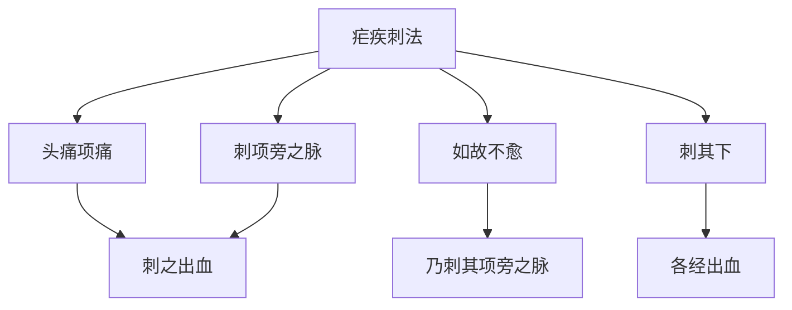

# 素问-刺疟篇第三十六

> "黄帝问曰：刺疟奈何？岐伯曰：疟之始发也，先起于毫毛，伸欠乃作，刺之奈何？" - 黄帝

---

## 📜 原文（节选）/ Original Text (Excerpt)

黄帝问曰：刺疟奈何？

岐伯曰：疟之始发也，先起于毫毛，伸欠乃作，刺之奈何？先刺其头痛项痛，刺之出血，如故不愈，乃刺其项旁之脉，出血如故，乃刺其下。

帝曰：刺疟奈之何也？

岐伯曰：足太阳之疟，令人腰痛头重，寒从背起，先刺郄中出血，又刺太阳之脉，出血如故。

足少阳之疟，令人身体解㑊，寒不甚，热不甚，恶见人，见人心惕惕然，热多汗出，刺足少阳，出血如故。

足阳明之疟，令人先寒，洒淅寒甚，久乃热，热去汗出，喜见日月光火气，乃快然，刺足阳明跗上出血，如故。

足太阴之疟，令人好太息，不乐，寒多热少，汗不出，病至则呕，呕已乃衰，即取之。

　　足太阳之疟，令人腰痛头重，寒从背起，先寒后热，熇[hè]熇[hè]暍暍然，热止汗出，难已，刺郄中出血。

　　足少阳之疟，令人身体解㑊[yì]，寒不甚，热不甚，恶见人，见人心惕惕然，热多汗出甚，刺足少阳。

　　足阳明之疟，令人先寒，洒淅洒淅，寒甚久乃热，热去汗出，喜见日月光火气，乃快然，刺足阳明跗上。

　　足太阴之疟，令人不乐，好太息，不嗜食，多寒热汗出，病至则善呕，呕已乃衰，即取之。

　　足少阴之疟，令人呕吐甚，多寒热，热多寒少，欲闭户牖而处，其病难已。

　　足厥阴之疟，令人腰痛少腹满，小便不利，如癃状，非癃也，数便，意恐惧，气不足，腹中悒悒，刺足厥阴。

　　肺疟者，令人心寒，寒甚热，热间善惊，如有所见者，刺手太阴阳明。

　　心疟者，令人烦心甚，欲得清水，反寒多，不甚热，刺手少阴。

　　肝疟者，令人色苍苍然，太息，其状若死者，刺足厥阴见血。

　　脾疟者，令人寒，腹中痛，热则肠中鸣，鸣已汗出，刺足太阴。

　　肾疟者，令人洒洒然，腰脊痛，宛转，大便难，目眴[xuàn]眴[xuàn]然，手足寒，刺足太阳少阴。

　　胃疟者，令人且病也，善饥而不能食，食而支满腹大，刺足阳明太阴横脉出血。

　　疟发身方热，刺跗上动脉，开其空，出其血，立寒；疟方欲寒，刺手阳明太阴，足阳明太阴。疟脉满大急，刺背俞，用中针，傍伍胠俞各一，适肥瘦出其血也。疟脉小实急，灸胫少阴，刺指井。疟脉满大急，刺背俞，用五胠俞背俞各一，适行至于血也。

　　疟脉缓大虚，便宜用药，不宜用针。凡治疟，先发如食顷乃可以治，过之则失时也。诸疟而脉不见，刺十指间出血，血去必已，先视身之赤如小豆者尽取之。十二疟者，其发各不同时，察其病形，以知其何脉之病也。先其发时如食顷而刺之，一刺则衰，二刺则知，三刺则已；不已，刺舌下两脉出血，不已，刺郄中盛经出血，又刺项已下侠脊者必已。舌下两脉者，廉泉也。

　　刺疟者，必先问其病之所先发者，先刺之。先头痛及重者，先刺头上及两额两眉间出血。先项背痛者，先刺之。先腰脊痛者，先刺郄中出血。先手臂痛者，先刺手少阴阳明十指间。先足胫痠痛者，先刺足阳明十指间出血。风疟，疟发则汗出恶风，刺三阳经背俞之血者。䯒[héng]痠[suān]痛甚， 按之不可，名曰胕髓病，以馋针针绝骨出血，立已。身体小痛，刺至阴，诸阴之井无出血，间日一刺。疟不渴，间日而作，刺足太阳；渴而间日作，刺足少阳；温疟汗不出，为五十九刺。

---

## 📖 白话文翻译（节选）/ Modern Chinese Translation (Excerpt)

黄帝问道：刺疟如何？

岐伯说：疟疾开始发作，先起立于毫毛，伸欠就发作，刺它如何？先刺它的头痛项痛，刺它出血，如旧不痊愈，就刺它的项旁的经脉，出血如旧，就刺它的下部。

黄帝说：刺疟怎么样？

岐伯说：足太阳的疟疾，使人腰部疼痛头部沉重，寒战从背部起，先刺郄中出血，又刺太阳经脉，出血如旧。

足少阳的疟疾，使人身体解㑊，寒战不严重，发热不严重，厌恶看见人，看见人就恐惧战战，发热多汗出，刺足少阳，出血如旧。

足阳明的疟疾，使人先寒战，寒战严重，久才发热，发热去汗出，喜欢看见太阳月亮光火气，就舒畅然，刺足阳明脚背上出血，如旧。

足太阴的疟疾，使人喜欢长叹息，不快乐，寒战多发热少，汗不出，疾病到就呕吐，呕吐已经就衰减，就取它。

　　足太阳经的疟疾，使人腰痛头重，寒冷从脊背而起先寒后热，热势很盛，热止汗出，这种疟疾，不易痊愈，治疗方法，刺委中穴出血。

　　足少阳经的疟疾，使人身倦无力，恶寒发热都不甚厉害，怕见人，看见人就感到恐惧，发热的时间比较长，汗出亦很多，治疗方法，刺足少阳经。

　　足阳明经的疟疾，使人先觉怕冷，逐渐恶寒加剧，很久才发热，退热时便汗出，这种病人，喜欢亮光，喜欢向火取暖，见到亮光以及火气，就感到爽快，治疗方法，刺足阳明经足背上的冲阳穴。

　　足太阴经的疟疾，使人闷闷不乐，时常要叹息，不想吃东西，多发寒热，汗出亦多，病发作时容易呕吐，吐后病势减轻，治疗方法，取足太阴经的孔穴。

　　足少有病的疟疾，使人发生剧烈呕吐，多发寒热，热多寒少，常常喜欢紧闭门窗而居，这种病不易痊愈。

　　足厥有病的疟疾，使人腰痛，少腹胀满，小便不利，似乎癃病，而实非癃病，只是小便频数不爽，病人心中恐惧，气分不足，腹中郁滞不畅，治疗方法，刺足厥有病。

　　肺疟，使人心里感到发冷，冷极则发热，热时容易发惊，好象见到了可怕的事物，治疗方法，刺手太阴，手阳明两经。

　　心虐，使人心中烦热得很厉害，想喝冷水，但身上反觉寒多而不太热，治疗方法，刺手少有病。

　　肝疟，使人面色苍青，时欲太息，厉害的时候，形状如死，治疗方法，刺足厥有病出血。

　　脾疟，使人发冷，腹中痛，待到发热时，则脾气行而肠中鸣响，肠鸣后阳气外达而汗出，治疗方法，刺足太阴经。

　　肾疟，使人洒淅寒冷，腰脊疼痛，难以转侧，大便困难，目视眩动不明，手足冷，治疗方法，刺足太阳、足少阴两经。

　　胃疟，发病时使人易觉饥饿，但又不能进食，进食就感到腕腹胀满膨大，治疗方法，取足阳明、足太阴两经横行的络脉，刺出其血。

　　治疗疟疾，在刚要发热的时候，刺足背上的动脉，开其孔穴，刺出其血，可立即热退身凉；如疟疾刚要发冷的时候可刺手阳明、太阴和足阳明、太阴的俞穴。如疟疾病人的脉搏满大而急，刺背部的俞穴，用中等针按五胠俞各取一穴，并根据病人形体的胖瘦，确定针刺出血的多少。如疟疾病人的脉搏小实而急的，炙足胫部的少有病穴，并刺足指端的井穴。如疟疾病人的脉搏满大而急，刺背部俞穴，取五＃俞、背俞各一穴，并根据病人体质，刺之出血。

　　如疟疾病人的脉搏缓大而虚的，就应该用药治疗，不宜用针刺。大凡治疗疟疾，应在病没有发作之前约一顿饭的时候，予以治疗，过了这个时间，就会失去时机。凡疟疾病人脉沉伏不见的，急刺十指间出血血出病必愈；若先见皮肤上发出象赤小豆的红点，应都用针刺去。上述十二种疟疾，其发作各有不同的时间，应观察病人的症状，从而了解病属于那一经脉。如在没有发作以前约一顿饭的时候就给以针刺，刺一次病势衰减，刺二次病就显著好转，刺三次病即痊愈；如不愈，可刺舌下两脉出血；如再不愈，可取委中血盛的经络，刺出其血，并刺项部以下挟脊两旁的经穴，这样，病一定会痊愈。上面所说的舌下两脉，就是指的廉泉穴。

　　凡刺疟疾，必先问明病人发作时最先感觉症状的部位，给以先刺。如先发头痛头重的，就先刺头上及两额、两眉间出血。先发倾项脊背痛的，就先刺颈项和背部。先发腰脊痛的，就先刺委中出血。先发手臂痛的，就先刺手少阴、手阳明的十指见的孔穴。先发足胫＃痛的，就先刺足阳明十趾间出血。风疟，发作时是汗出怕风，可刺三阳经背部的俞穴出血。小腿疼剧烈而拒按的，名叫腑髓病，可用＃针刺绝骨穴出血，其痛可以立止。如身体稍感疼痛，刺至阴穴。但应注意，凡刺诸有病的井穴，皆不可出血，并应隔日刺一次。疟疾口不渴而间日发作的，刺足太阳经；如口渴而间日发作的，刺足少阳经；温疟而汗不出的，用“五十九刺”的方法。

---

## 🔑 核心要点 / Core Concepts

### 1. 六经疟疾表现 / Six Meridians Malaria Manifestations

| 经脉 | 症状 | 刺法 |
|------|------|------|
| 足太阳 | 腰痛头重，寒从背起 | 刺郄中出血，又刺太阳之脉 |
| 足少阳 | 身体解㑊，寒不甚，热不甚，恶见人 | 刺足少阳，出血如故 |
| 足阳明 | 先寒，洒淅寒甚，久乃热 | 刺足阳明跗上出血，如故 |
| 足太阴 | 好太息，不乐，寒多热少 | 即取之 |

### 2. 疟疾刺法原则 / Malaria Acupuncture Principles

| 原则 | 内容 |
|------|------|
| 先刺 | 头痛项痛 |
| 如故不愈 | 乃刺其项旁之脉 |
| 出血如故 | 各经出血 |

### 3. 疟疾刺法流程 / Malaria Acupuncture Process

---

## 📚 理论解释 / Theoretical Analysis

### 疟疾刺法理论 / Malaria Acupuncture Theory

> [!info] 核心概念
- 先刺头痛项痛
- 如故不愈，乃刺项旁
- 各经出血以泻疟

#### 疟疾刺法详解 / Detailed Malaria Acupuncture

**1. 刺法原则 / Acupuncture Principle**
- 先刺头痛项痛：先刺头痛项痛
- 如故不愈：如旧不痊愈
- 乃刺项旁之脉：就刺项旁的经脉
- 刺其下：刺它的下部

**2. 六经刺法 / Six Meridians Acupuncture**
- 足太阳：刺郄中出血，又刺太阳之脉
- 足少阳：刺足少阳，出血如故
- 足阳明：刺足阳明脚背上出血，如故
- 足太阴：即取之

**3. 出血疗法 / Bleeding Therapy**
- 刺之出血：刺它出血
- 出血如故：出血如旧
- 泻疟：泻疟

### 六经疟疾理论 / Six Meridians Malaria Theory

> [!warning] 核心理念
- 各经疟疾表现不同
- 刺法根据经脉选择
- 出血以泻疟邪

#### 六经疟疾详解 / Detailed Six Meridians Malaria

**1. 足太阳疟疾 / Foot Taiyang Malaria**
- 症状：腰痛头重，寒从背起
- 刺法：刺郄中出血，又刺太阳之脉

**2. 足少阳疟疾 / Foot Shaoyang Malaria**
- 症状：身体解㑊，寒不甚，热不甚，恶见人
- 刺法：刺足少阳，出血如故

**3. 足阳明疟疾 / Foot Yangming Malaria**
- 症状：先寒，洒淅寒甚，久乃热
- 刺法：刺足阳明脚背上出血，如故

**4. 足太阴疟疾 / Foot Taiyin Malaria**
- 症状：好太息，不乐，寒多热少
- 刺法：即取之

---

## 🏥 中医实践应用 / TCM Practice Application

### 疟疾针刺治疗 / Malaria Acupuncture Treatment

#### 现代疟疾针刺治疗要点 / Modern Malaria Acupuncture Treatment Key Points

**1. 足太阳疟疾治疗 / Foot Taiyang Malaria Treatment**
- 症状：腰痛头重，寒从背起
- 刺法：刺郄中出血，又刺太阳之脉
- 穴位：大椎、委中

**2. 足少阳疟疾治疗 / Foot Shaoyang Malaria Treatment**
- 症状：身体解㑊，寒不甚，热不甚
- 刺法：刺足少阳，出血如故
- 穴位：风池、侠溪

**3. 足阳明疟疾治疗 / Foot Yangming Malaria Treatment**
- 症状：先寒，洒淅寒甚，久乃热
- 刺法：刺足阳明脚背上出血，如故
- 穴位：冲阳、解溪

**4. 足太阴疟疾治疗 / Foot Taiyin Malaria Treatment**
- 症状：好太息，不乐，寒多热少
- 刺法：即取之
- 穴位：三阴交、公孙

---

## 🔗 相关链接 / Related Links

- [[MOC-黄帝内经知识库]] - 主索引
- [[黄帝内经-素问索引]] - 素问索引
- [[黄帝内经-核心理论]] - 核心理论体系
- [[素问35-疟论篇]] - 疟论
- [[素问37-气厥论篇]] - 气厥

### 易学关联 / Yi Jing Connection

- [[MOC-易经知识库]] - 易经索引
- [[20260201-0005 五行]] - 五行理论

**易学与刺疟的联系:**
- 六经理论：易学的六经理论与中医六经疟疾相通
- 出血疗法：易学的泻法理论与中医出血疗法相通

---

## 💡 学习要点 / Learning Points

### 掌握重点 / Key Points to Master

- [ ] 理解疟疾刺法的原则
- [ ] 掌握六经疟疾的表现
- [ ] 学会各经的刺法要点
- [ ] 了解疟疾刺法的应用

### 思考问题 / Questions for Reflection

1. **为什么说"刺之出血"？**
   - 出血泻疟：出血以泻疟邪
   - 刺法原则：刺法原则
   - 各经出血：各经出血

2. **现代医学如何应用"刺疟"？**
   - 针刺治疗：针刺治疗疟疾
   - 穴位选择：根据经脉选择穴位
   - 出血疗法：出血疗法应用

---

## 📊 学习进度 / Learning Progress

### 完成情况 / Completion Status

| 学习内容 | 状态 | 备注 |
|---------|------|------|
| 原文诵读 | 📝 进行中 | 建议每日诵读 |
| 白话文理解 | ✅ 已完成 | 理解主要含义 |
| 疟疾刺法 | ✅ 已完成 | 掌握原则 |
| 六经疟疾 | 📝 进行中 | 需要临床实践 |
| 理论分析 | ✅ 已完成 | 理解理论 |

---

## 🔄 更新日志 / Update Log

### 2026-02-03

- ✅ 创建刺疟篇第三十六笔记
- ✅ 完成原文、白话文翻译（节选）
- ✅ 整理六经疟疾对照表
- ✅ 编写疟疾刺法理论

---

**笔记创建日期**：2026年2月3日

**最后更新**：2026年2月3日
