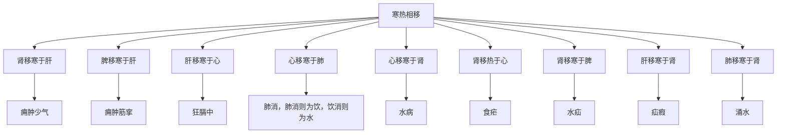

# 素问-气厥论篇第三十七

> "黄帝问曰：五脏六腑，寒热相移者何也？" - 黄帝

---

## 📜 原文（节选）/ Original Text (Excerpt)

黄帝问曰：五脏六腑，寒热相移者何也？

岐伯对曰：肾移寒于肝，痈肿少气。脾移寒于肝，痈肿筋挛。肝移寒于心，狂隔中。心移寒于肺，肺消，肺消则为饮，饮消则为水。

心移寒于肾，为水病。肾移热于心，为食疟。肾移寒于脾，为水疝。肝移寒于肾，为疝瘕。

肾移寒于心，为水疝。心移寒于肺，肺消，肺消则为饮，饮消则为水。肺移寒于肾，为涌水。肾移寒于肝，为痈肿。

　　黄帝问曰：五藏六府，寒热相移者何？

　　岐伯曰：肾移寒于肝，痈肿少气。脾移寒于肝，痈肿筋挛。肝移寒于心，狂隔中。心移寒于肺，肺消，肺消者饮一溲二，死不治。肺移寒于肾，为涌水，涌水者，按腹不坚，水气客于大肠，疾行则鸣濯濯如囊裹浆，水之病也。

　　脾移热于肝，则为惊衄。肝移热于心，则死。心移热于肺，传为鬲消。肺移热于肾，传为柔痓[chì]。肾移热于脾，传为虚，肠澼，死，不可治。

　　胞移热于膀胱，则癃溺血。膀胱移热于小肠，鬲肠不便，上为口糜。小肠移热于大肠，为虙瘕，为沉。大肠移热于胃，善食而瘦入，谓之食亦。胃移热于胆，亦曰食亦。胆移热于脑，则辛頞鼻渊，鼻渊者，浊涕下不止也，传为衄蔑瞑目，故得之气厥也。

---

## 📖 白话文翻译（节选）/ Modern Chinese Translation (Excerpt)

黄帝问道：五脏六腑，寒热相互转移，为什么？

岐伯回答说：肾转移寒于肝，痈肿少气。脾转移寒于肝，痈肿筋脉拘挛。肝转移寒于心，狂膈中。心转移寒于肺，肺消，肺消就成为饮，饮消就成为水。

心转移寒于肾，成为水病。肾转移热于心，成为食疟。肾转移寒于脾，成为水疝。肝转移寒于肾，成为疝瘕。

肾转移寒于心，成为水疝。心转移寒于肺，肺消，肺消就成为饮，饮消就成为水。肺转移寒于肾，成为涌水。肾转移寒于肝，成为痈肿。

皇帝问道：五藏六府的寒热互相转移的情况是怎样的？

　　岐伯说：肾移寒于脾，则病痈肿和少气。脾移寒于肝，则痈肿和筋挛。肝移寒于心，则病发狂和胸中隔塞。心移寒于肺，则为肺消；肺消病的症状是饮水一分，小便要排二分，属无法治疗的死证。肺移寒于肾，则为涌水；涌水病的症状是腹部按之不甚坚硬，但因水气留居于大肠，故快走时肠中濯濯鸣响，如皮囊装水样，这是水气之病。脾移热于肝，则病惊骇和鼻衄。

　　肝移热于心，则引起死亡。心移热于肺，日久则为鬲消。肺移热于肾，日久则为柔庢。肾移热于脾，日久渐成虚损；若再患肠澼，便宜成为无法治疗的死症。

　　胞移热，则病小便不利和尿血。膀胱移热于小肠，使肠道隔塞，大便不通，热气上行，以至口舌糜烂。小肠移热于大肠，则热结不散，成为伏瘕，或为痔痔。大肠移热于胃，则使人饮食增加而体瘦无力，病称为食亦。胃移热于胆，也叫做食亦。胆移热于脑，则鼻梁内感觉辛辣而成为鼻渊，鼻渊症状，是常鼻流浊涕不止，日久可至鼻中流血，两目不明。以上各种病症，皆由于寒热之气厥逆，在脏腑中互相移传而引起的。

---

## 🔑 核心要点 / Core Concepts

### 1. 五脏寒热相移 / Five Zang Cold Heat Mutual Transfer

| 移出 | 移入 | 病证 |
|------|------|------|
| 肾 | 肝 | 痈肿少气 |
| 脾 | 肝 | 痈肿筋挛 |
| 肝 | 心 | 狂膈中 |
| 心 | 肺 | 肺消，肺消则为饮，饮消则为水 |
| 心 | 肾 | 水病 |
| 肾 | 心 | 食疟 |
| 肾 | 脾 | 水疝 |
| 肝 | 肾 | 疝瘕 |
| 肺 | 肾 | 涌水 |

### 2. 气厥机理 / Qi Jue Mechanism

| 机理 | 表现 |
|------|------|
| 寒热相移 | 五脏六腑，寒热相互转移 |
| 气厥 | 气机上逆 |

### 3. 寒热相移规律 / Cold Heat Mutual Transfer Pattern

---

## 📚 理论解释 / Theoretical Analysis

### 寒热相移理论 / Cold Heat Mutual Transfer Theory

> [!info] 核心概念
- 五脏六腑，寒热相移
- 病证不同，移出移入不同
- 气厥，寒热厥逆

#### 寒热相移详解 / Detailed Cold Heat Mutual Transfer

**1. 肾移寒于肝 / Kidney Transfers Cold to Liver**
- 移出：肾
- 移入：肝
- 病证：痈肿少气

**2. 脾移寒于肝 / Spleen Transfers Cold to Liver**
- 移出：脾
- 移入：肝
- 病证：痈肿筋挛

**3. 肝移寒于心 / Liver Transfers Cold to Heart**
- 移出：肝
- 移入：心
- 病证：狂膈中

**4. 心移寒于肺 / Heart Transfers Cold to Lung**
- 移出：心
- 移入：肺
- 病证：肺消，肺消则为饮，饮消则为水

**5. 心移寒于肾 / Heart Transfers Cold to Kidney**
- 移出：心
- 移入：肾
- 病证：水病

**6. 肾移热于心 / Kidney Transfers Heat to Heart**
- 移出：肾
- 移入：心
- 病证：食疟

**7. 肾移寒于脾 / Kidney Transfers Cold to Spleen**
- 移出：肾
- 移入：脾
- 病证：水疝

**8. 肝移寒于肾 / Liver Transfers Cold to Kidney**
- 移出：肝
- 移入：肾
- 病证：疝瘕

**9. 肺移寒于肾 / Lung Transfers Cold to Kidney**
- 移出：肺
- 移入：肾
- 病证：涌水

### 气厥理论 / Qi Jue Theory

> [!warning] 核心理念
- 气机上逆
- 寒热厥逆
- 病机复杂

#### 气厥详解 / Detailed Qi Jue

**1. 气机上逆 / Qi Machine Upward Counterflow**
- 气机上逆：气机上逆
- 寒热相移：寒热相互转移
- 气厥：气厥

**2. 寒热厥逆 / Cold Heat Upward Counterflow**
- 寒厥：寒气上逆
- 热厥：热气上逆
- 混合：寒热混合

---

## 🏥 中医实践应用 / TCM Practice Application

### 寒热相移治疗 / Cold Heat Mutual Transfer Treatment

#### 现代寒热相移治疗要点 / Modern Cold Heat Mutual Transfer Treatment Key Points

**1. 寒厥治疗 / Cold Jue Treatment**
- 病证：寒气上逆
- 治法：温阳散寒
- 药物：四逆汤、真武汤

**2. 热厥治疗 / Heat Jue Treatment**
- 病证：热气上逆
- 治法：清热泻火
- 药物：白虎汤、承气汤

**3. 水病治疗 / Water Disease Treatment**
- 病证：水病
- 治法：利水消肿
- 药物：五苓散、真武汤

---

## 🔗 相关链接 / Related Links

- [[MOC-黄帝内经知识库]] - 主索引
- [[黄帝内经-素问索引]] - 素问索引
- [[黄帝内经-核心理论]] - 核心理论体系
- [[素问36-刺疟篇]] - 刺疟
- [[素问38-咳论篇]] - 咳论

### 易学关联 / Yi Jing Connection

- [[MOC-易经知识库]] - 易经索引
- [[20260201-0002 五行]] - 五行理论

**易学与气厥论的联系:**
- 五行相克：易学的五行相克理论与中医寒热相移相通
- 阴阳理论：易学的阴阳理论与中医气厥相通

---

## 💡 学习要点 / Learning Points

### 掌握重点 / Key Points to Master

- [ ] 理解寒热相移的概念
- [ ] 掌握五脏寒热相移的规律
- [ ] 学会气厥的诊断
- [ ] 了解寒热相移的治疗方法

### 思考问题 / Questions for Reflection

1. **为什么说"五脏六腑，寒热相移"？**
   - 寒热相移：寒热相互转移
   - 病证复杂：病证复杂
   - 预后不良：预后不良

2. **现代医学如何应用"寒热相移"？**
   - 病证转移：疾病转移
   - 综合治疗：综合治疗方案
   - 个体化治疗：根据个体情况治疗

---

## 📊 学习进度 / Learning Progress

### 完成情况 / Completion Status

| 学习内容 | 状态 | 备注 |
|---------|------|------|
| 原文诵读 | 📝 进行中 | 建议每日诵读 |
| 白话文理解 | ✅ 已完成 | 理解主要含义 |
| 寒热相移 | ✅ 已完成 | 掌握规律 |
| 气厥治疗 | 📝 进行中 | 需要临床实践 |
| 理论分析 | ✅ 已完成 | 理解理论 |

---

## 🔄 更新日志 / Update Log

### 2026-02-03

- ✅ 创建气厥论篇第三十七笔记
- ✅ 完成原文、白话文翻译（节选）
- ✅ 整理寒热相移对照表
- ✅ 编写寒热相移理论

---

**笔记创建日期**：2026年2月3日

**最后更新**：2026年2月3日
