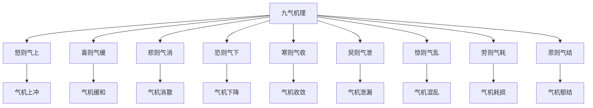

# 素问-举痛论篇第三十九

> "黄帝问曰：余闻善言天者，必有验于人；善言古者，必有合于今；善言人者，必有厌于己。如此则道理不惑，而要道极矣。" - 黄帝

---

## 📜 原文（节选）/ Original Text (Excerpt)

黄帝问曰：余闻善言天者，必有验于人；善言古者，必有合于今；善言人者，必有厌于己。如此则道理不惑，而要道极矣。

岐伯对曰：帝问何也？帝曰：愿闻九气于五脏，何气使然？

岐伯曰：怒则气上，喜则气缓，悲则气消，恐则气下，寒则气收，炅则气泄，惊则气乱，劳则气耗，思则气结。九气不同，何病之同？

帝曰：愿闻之。

岐伯曰：怒则气上，甚则呕血及飧泄，故气上矣。喜则气缓，卫气和利，故气缓矣。悲则气消，脉涩血虚，故气消矣。恐则气下，还于下焦，膀胱不约，遗溺，故气下矣。寒则气收，腠理闭，气不行，故气收矣。炅则气泄，腠理开，汗大泄，故气泄矣。惊则气乱，无所倚，神无所归，虑无所定，故气乱矣。劳则气耗，喘息汗出，内外皆越，故气耗矣。思则气结，神有所止，气留而不行，故气结矣。

　　黄帝问曰：余闻善言天者，必有验于人；善言古者，必有合于今；善言人者，必有厌于己。如此，则道不惑而要数极，所谓明也。今余问于夫子，令言而可知，视而可见，扪而可得，令验于己而发蒙解惑，可得而闻乎？

　　岐伯再拜稽首对曰：何道之问也？

　　帝曰：愿闻人之五藏卒痛，何气使然？

　　岐伯对曰：经脉流行不止、环周不休，寒气入经而稽迟，泣而不行，客于脉外则血少，客于脉中则气不通，故卒然而痛。

　　帝曰：其痛或卒然而止者，或痛甚不休者，或痛甚不可按者，或按之而痛止者，或按之无益者，或喘动应手者，或心与背相引而痛者，或胁肋与少腹相引而痛者，或腹痛引阴股者，或痛宿昔而成积者，或卒然痛死不知人，有少间复生者，或痛而呕者，或腹痛而后泄者，或痛而闭不通者，凡此诸痛，各不同形，别之奈何？

　　岐伯曰：寒气客于脉外则脉寒，脉寒则缩踡，缩踡则脉绌急，绌急则外引小络，故卒然而痛，得炅则痛立止；因重中于寒，则痛久矣。

　　寒气客于经脉之中，与炅气相薄则脉满，满则痛而不可按也。寒气稽留，炅气从上，则脉充大而血气乱，故痛甚不可按也。

　　寒气客于肠胃之间，膜原之下，血不得散，小络急引故痛，按之则血气散，故按之痛止。

　　寒气客于侠脊之脉，则深按之不能及，故按之无益也。

　　寒气客于冲脉，冲脉起于关元，随腹直上，寒气客则脉不通，脉不通则气因之，故揣动应手矣。

　　寒气客于背俞之脉则脉泣，脉泣则血虚，血虚则痛，其俞注于心，故相引而痛，按之则热气至，热气至则痛止矣。

　　寒气客于厥阴之脉，厥阴之脉者，络阴器系于肝，寒气客于脉中，则血泣脉急，故胁肋与少腹相引痛矣。

　　厥气客于阴股，寒气上及少腹，血泣在下相引，故腹痛引阴股。

　　寒气客于小肠膜原之间，络血之中，血泣不得注于大经，血气稽留不得行，故宿昔而成积矣。

　　寒气客于五藏，厥逆上泄，阴气竭，阳气未入，故卒然痛死不知人，气复反则生矣。

　　寒气客于肠胃，厥逆上出，故痛而呕也。

　　寒气客于小肠，小肠不得成聚，故后泄腹痛矣。

　　热气留于小肠，肠中痛，瘅热焦喝，则坚干不得出，故痛而闭不通矣。

　　帝曰：所谓言而可知者也。视而可见奈何？

　　岐伯曰：五藏六府，固尽有部，视其五色，黄赤为热，白为寒，青黑为痛，此所谓视而可见者也。

　　帝曰：扪而可得奈何？

　　岐伯曰：视其主病之脉，坚而血及陷下者，皆可扪而得也。

　　帝曰：善。余知百病生于气也。怒则气上，喜则气缓，悲则气消，恐则气下，寒则气收，炅则气泄，惊则气乱，劳则气耗，思则气结，九气不同，何病之生？

　　岐伯曰：怒则气逆，甚则呕血及飧泄，故气上矣。喜则气和志达，荣卫通利，故气缓矣。悲则心系急，肺布叶举，而上焦不通，荣卫不散，热气在中，故气消矣。恐则精却，却则上焦闭，闭则气还，还则下焦胀，故气不行矣。寒则腠理闭，气不行，故气收矣。炅则腠理开，荣卫通，汗大泄，故气泄。惊则心无所倚，神无所归，虑无所定，故气乱矣。劳则喘息汗出，外内皆越，故气耗矣。思则心有所存，神有所归，正气留而不行，故气结矣。

---

## 📖 白话文翻译（节选）/ Modern Chinese Translation (Excerpt)

黄帝问道：我听说善于谈论天的，一定在人身上验证；善于谈论古的，一定与现在相合；善于谈论人的，一定厌倦于自己。像这样则道理不困惑，而要道达到了极点。

岐伯回答说：黄帝问什么？黄帝说：我希望听到九气在五脏，什么气使它这样？

岐伯说：愤怒则气机上冲，欢喜则气机缓和，悲哀则气机消散，恐惧则气机下降，寒冷则气机收敛，炎热则气机泄漏，惊恐则气机混乱，劳累则气机耗损，思虑则气机郁结。九气不同，什么疾病相同？

黄帝说：我希望听到它。

岐伯说：愤怒则气机上冲，严重就呕血和完谷不化泄泻，所以气机上冲了。欢喜则气机缓和，卫气调和通利，所以气机缓和了。悲哀则气机消散，脉象涩滞血虚，所以气机消散了。恐惧则气机下降，还归于下焦，膀胱不能约束，遗尿，所以气机下降了。寒冷则气机收敛，腠理闭合，气机不能运行，所以气机收敛了。炎热则气机泄漏，腠理张开，汗液大量泄漏，所以气机泄漏了。惊恐则气机混乱，无所倚靠，精神无所归属，思虑无所安定，所以气机混乱了。劳累则气机耗损，喘息汗出，内外都越过，所以气机耗损了。思虑则气机郁结，精神有所止息，气机留滞而不能运行，所以气机郁结了。

　　黄帝问道：我听说善于谈论[天道](https://www.guoxuemeng.com/gushici/72001.html)的，必能应验于人事；善于谈论历史的，必能应合于今事；善于谈论人事的，必能结合自己的情况。这样，才能掌握事物的规律而不迷惑，了解事物的要领极其透彻，这就是所谓明达事理的人。现在我想请教先生，将问诊所知，望诊所见，切诊所得的情况告诉我，使我有所体验，启发蒙昧，解除疑惑，你能告诉我呢？

　　岐伯再次跪拜回答说：你要问的是哪些道理呢？

　　黄帝说：我想听听人体的五脏突然作痛，是什麽邪气造成的呢？

　　岐伯回答说：人体经脉中的气血流行不止，如环无端，如果寒邪侵入了经脉，则经脉气血的循行迟滞，凝涩而不畅行，故寒邪侵袭于经脉内外，则使经脉凝涩而血少，脉气留止而不通，所以突然作痛。

　　黄帝说：其疼痛有突然停止的，有疼得很剧烈而不停止的，有痛得很剧烈而不能按压的，有按压而疼痛停止的，有按压也不见缓解的，有疼痛跳动应手的，有心和背部相互牵引而痛的，有胁肋和腹相互牵引而痛的，有腹痛牵引阴股的，有疼痛日久而成积聚的，有突然疼痛昏厥如死不知人事稍停片刻而又清醒的，有痛而呕吐的，有腹痛而后泄泻的，有痛而大便闭结不通的，以上这些疼痛的情况，其病形各不相同，如何加以区别呢？

　　岐伯说：寒协侵袭于脉外，则经脉受寒，经脉受寒则经脉收缩不伸，收缩不伸则屈曲拘急，因而牵引在外的细小脉络，内外引急，故突然发生疼痛，如果得到热气，则疼痛立刻停止。假如再次感受寒邪，卫阳受损就会久痛不止。寒邪侵袭经脉之中，和人体本身的热气相互搏争，则经脉充满，脉满为实，不任压迫，故痛而不可按。寒邪停留于脉中，人体本身的热气则随之而上，与寒邪相搏，使经脉充满，气血运行紊乱，故疼痛剧烈而不可触按。寒协侵袭于肠胃之间，膜原之下，以致血气凝涩而不散，细小的脉络拘急牵引，所以疼痛；如果以手按揉，则血气散行，故按之疼痛停止。寒邪侵袭于侠脊之脉，由于邪侵的部位较深，按揉难以达到病所，故按揉也无济于事。寒邪侵袭于冲脉之中，冲脉是从小腹关员穴开始，循腹上行，如因寒气侵入则冲脉不通，脉不通则气因之鼓脉欲通，故腹痛而跳动应手。寒邪侵于背俞足太阳之脉，则血脉流行滞涩，脉涩则血虚，血虚则疼痛，因足太阳脉背俞与心相连，故心与背相引而痛，按揉能使热气来复，热气来复则寒邪消散，故疼痛即可停止。寒邪侵袭于足厥阴之脉，足厥阴之脉循股阴入毛中，环阴器抵少腹，布胁肋而属于肝，寒邪侵入于脉中，则血凝涩而脉紧急，故胁肋与少腹牵引作痛。寒厥之气客于阴股。寒邪侵袭于小肠膜原之间、络血之中，使络血凝涩不能流注于大经脉，血气留止不能畅行，故日久便可结成积聚。寒邪侵袭于五脏，迫使五脏之气逆而上行，以致脏气上越外泄，阴气竭于内，阳气不得入，阴阳暂时相离，故突然疼痛昏死，不知人事；如果阳气复返，阴阳相接，则可以苏醒。寒协侵袭于肠胃，迫使肠胃之气逆而上行，故出现疼痛而呕吐。寒协复袭于小肠，小肠为受盛之腑，因寒而阳气不化，水谷不得停留，故泄泻而腹痛。如果是热邪留蓄于小肠，也可发生肠中疼痛，由于内热伤津而唇焦口渴，粪便坚硬难以排出，故腹痛而大便闭结不通。

　　黄帝说：以上所说从问诊中可以了解。至于望诊可见又是怎样的呢？

　　岐伯说：五藏六府在面部各有所属部位，望面部五色的变化就可以诊断疾病，如黄色赤色主热，白色主寒，青色黑色主痛，这就是通过望诊可以了解的。

　　黄帝说：用手切诊而知病情是怎样的呢？

　　岐伯说：看他主病的经脉，然后以手循按，如果脉坚实的，是有邪气结聚；属气血留滞的，荦脉必充盛而高起；如果脉陷下的，是气血不足，多属阴证。这些都是可以用手扪切切按循而得知的。

　　黄帝说：好。我已知道许多疾病的发生，都是由气机失调引起的，如暴怒则气上逆，喜则气舒缓，悲哀则所消沉，恐惧则气下却，遇寒则气收敛，受热则气外泄，受惊则气紊乱，过劳则气耗散，思虑则气郁结。这九种气的变化各不相同，会发生怎样的疾病呢？

　　岐伯说：大怒则使肝气上逆，血随气逆，甚则呕血，或肝气乘脾发生飧泄所以说是气上。喜则气和顺而志意畅达，荣卫之气通利，所以说是气缓。悲哀太过则心系急迫，但悲为肺志，悲伤肺则肺叶张举，上焦虽之闭塞不通，营卫之气得不到布散，热气喻闭于中而耗损肺气，所以说是气消。恐惧则使精气下却，精气下却则升降不交，故上焦闭塞，上焦闭塞则气还归于下，气郁于下则下焦胀满，所以说“恐则气下”。寒冷之气侵袭人体，则使腠理闭密，荣卫之气不得畅行而收敛于内，所以说是气收。火热之气能使人腠理开放，荣卫通畅，汗液大量外出，致使气随津泄，所以说是气泄。受惊则心悸动无所依附，神志无所归宿，心中疑虑不定，所以说是气乱。劳役过度则气动喘息，汗出过多，喘则内气越，汗出过多则外气越，内外之气皆泄越，所以说是气耗。思则精力集中，心有所存，神归一处，以致正气留结而不运行，所以说是气结。

---

## 🔑 核心要点 / Core Concepts

### 1. 九气致痛 / Nine Qi Causing Pain

| 气 | 病机 | 表现 |
|------|------|------|
| 怒 | 气上 | 甚则呕血及飧泄 |
| 喜 | 气缓 | 卫气和利 |
| 悲 | 气消 | 脉涩血虚 |
| 恐 | 气下 | 膀胱不约，遗溺 |
| 寒 | 气收 | 腠理闭，气不行 |
| 炅 | 气泄 | 腠理开，汗大泄 |
| 惊 | 气乱 | 无所倚，神无所归，虑无所定 |
| 劳 | 气耗 | 喘息汗出，内外皆越 |
| 思 | 气结 | 神有所止，气留而不行 |

### 2. 九气相同点 / Nine Qi Similar Points

| 特点 | 说明 |
|------|------|
| 九气不同 | 九气不同 |
| 何病之同 | 什么疾病相同 |
| 气机紊乱 | 气机紊乱 |

### 3. 九气机理 / Nine Qi Mechanism

---

## 📚 理论解释 / Theoretical Analysis

### 九气致痛理论 / Nine Qi Causing Pain Theory

> [!info] 核心概念
- 九气不同，何病之同
- 气机紊乱，疼痛产生
- 情志影响气机

#### 九气致痛详解 / Detailed Nine Qi Causing Pain

**1. 怒则气上 / Anger Makes Qi Rise**
- 病机：气机上冲
- 表现：甚则呕血及飧泄
- 治法：平肝降逆

**2. 喜则气缓 / Joy Makes Qi Relax**
- 病机：气机缓和
- 表现：卫气和利
- 治法：调畅气机

**3. 悲则气消 / Grief Makes Qi Dissipate**
- 病机：气机消散
- 表现：脉涩血虚
- 治法：补气养血

**4. 恐则气下 / Fear Makes Qi Descend**
- 病机：气机下降
- 表现：膀胱不约，遗溺
- 治法：温肾固摄

**5. 寒则气收 / Cold Makes Qi Contract**
- 病机：气机收敛
- 表现：腠理闭，气不行
- 治法：散寒通络

**6. 炅则气泄 / Heat Makes Qi Leak**
- 病机：气机泄漏
- 表现：腠理开，汗大泄
- 治法：清热固表

**7. 惊则气乱 / Startle Makes Qi Chaos**
- 病机：气机混乱
- 表现：无所倚，神无所归，虑无所定
- 治法：安神定志

**8. 劳则气耗 / Labor Makes Qi Consume**
- 病机：气机耗损
- 表现：喘息汗出，内外皆越
- 治法：益气固表

**9. 思则气结 | Thinking Makes Qi Stagnate**
- 病机：气机郁结
- 表现：神有所止，气留而不行
- 治法：解郁行气

---

## 🏥 中医实践应用 / TCM Practice Application

### 九气治疗 / Nine Qi Treatment

#### 现代九气治疗要点 / Modern Nine Qi Treatment Key Points

**1. 怒气治疗 / Anger Qi Treatment**
- 症状：气机上冲，甚则呕血及飧泄
- 治法：平肝降逆
- 药物：龙胆泻肝汤、丹栀逍遥散

**2. 喜气治疗 / Joy Qi Treatment**
- 症状：气机缓和，卫气和利
- 治法：调畅气机
- 药物：逍遥散、越鞠丸

**3. 悲气治疗 / Grief Qi Treatment**
- 症状：气机消散，脉涩血虚
- 治法：补气养血
- 药物：归脾汤、人参养荣汤

**4. 恐气治疗 / Fear Qi Treatment**
- 症状：气机下降，膀胱不约，遗溺
- 治法：温肾固摄
- 药物：金匮肾气丸、桑螵蛸散

**5. 寒气治疗 / Cold Qi Treatment**
- 症状：气机收敛，腠理闭，气不行
- 治法：散寒通络
- 药物：麻黄汤、桂枝汤

**6. 热气治疗 / Heat Qi Treatment**
- 症状：气机泄漏，腠理开，汗大泄
- 治法：清热固表
- 药物：白虎汤、竹叶石膏汤

**7. 惊气治疗 / Startle Qi Treatment**
- 症状：气机混乱，无所倚，神无所归
- 治法：安神定志
- 药物：朱砂安神丸、磁朱丸

**8. 劳气治疗 / Labor Qi Treatment**
- 症状：气机耗损，喘息汗出，内外皆越
- 治法：益气固表
- 药物：玉屏风散、补中益气汤

**9. 思气治疗 / Thinking Qi Treatment**
- 症状：气机郁结，神有所止，气留而不行
- 治法：解郁行气
- 药物：半夏厚朴汤、柴胡疏肝散

---

## 🔗 相关链接 / Related Links

- [[MOC-黄帝内经知识库]] - 主索引
- [[黄帝内经-素问索引]] - 素问索引
- [[黄帝内经-核心理论]] - 核心理论体系
- [[素问38-咳论篇]] - 咳论
- [[素问40-腹中论篇]] - 腹中论

### 易学关联 / Yi Jing Connection

- [[MOC-易经知识库]] - 易经索引
- [[20260201-0005 五行]] - 五行理论

**易学与举痛论的联系:**
- 五行理论：易学的五行理论与中医九气相通
- 情志理论：易学的情志理论与中医气机相通

---

## 💡 学习要点 / Learning Points

### 掌握重点 / Key Points to Master

- [ ] 理解九气致痛的概念
- [ ] 掌握九气的病机
- [ ] 学会九气的治疗方法
- [ ] 了解九气致痛的现代应用

### 思考问题 / Questions for Reflection

1. **为什么说"九气不同，何病之同"？**
   - 九气不同：九气不同
   - 何病之同：什么疾病相同
   - 气机紊乱：气机紊乱

2. **现代医学如何应用"九气致痛"？**
   - 情志疾病：情志疾病治疗
   - 心理治疗：心理治疗应用
   - 综合治疗：综合治疗方案

---

## 📊 学习进度 / Learning Progress

### 完成情况 / Completion Status

| 学习内容 | 状态 | 备注 |
|---------|------|------|
| 原文诵读 | 📝 进行中 | 建议每日诵读 |
| 白话文理解 | ✅ 已完成 | 理解主要含义 |
| 九气致痛 | ✅ 已完成 | 掌握概念 |
| 九气治疗 | 📝 进行中 | 需要临床实践 |
| 理论分析 | ✅ 已完成 | 理解理论 |

---

## 🔄 更新日志 / Update Log

### 2026-02-03

- ✅ 创建举痛论篇第三十九笔记
- ✅ 完成原文、白话文翻译（节选）
- ✅ 整理九气致痛对照表
- ✅ 编写九气致痛理论

---

**笔记创建日期**：2026年2月3日

**最后更新**：2026年2月3日
