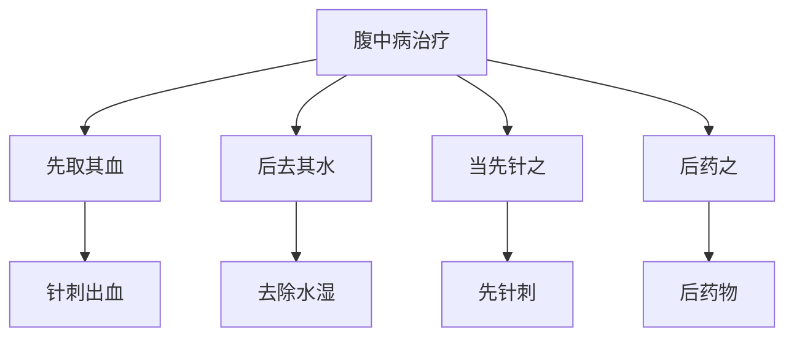

# 素问-腹中论篇第四十

> "黄帝问曰：腹中雷鸣，腹中皆痛，是何病？" - 黄帝

---

## 📜 原文（节选）/ Original Text (Excerpt)

黄帝问曰：腹中雷鸣，腹中皆痛，是何病？

岐伯对曰：此水也。水溢于肠胃之间，故腹中雷鸣，腹中皆痛也。

帝曰：水之所生奈何？

岐伯曰：此得之于水湿之气，其在于下焦，故水溢于肠胃之间。其状也，腹中雷鸣，腹中皆痛，心下结坚，食饮不下，腹中皆痛，甚则不可仰息，不能侧卧，背膺腰股胻皆痛，此其状也。

帝曰：治之奈何？

岐伯曰：治之奈何？当先取其血，后去其水，当先针之，后药之。针之奈何？先取其血，后去其水，当先针之，后药之。

　　黄帝问曰：有病心腹满，旦食则不能暮食，此为何病？

　　岐伯对曰：名为鼓胀。

　　帝曰：治之奈何？

　　岐伯曰：治之以鸡矢醴，一剂知，二剂已。

　　帝曰：其时有复发者何也？

　　岐伯曰：此饮食不节，故时有病也。虽然其病且已，时故当病，气聚于腹也。

　　帝曰：有病胸胁支满者，妨于食，病至则先闻腥臊臭，出清液，先唾血，四支清，目眩，时时前后血，病名为何？何以得之？

　　岐伯曰：病名血枯。此得之年少时，有所大脱血：若醉入房中，气竭肝伤，故月事衰少不来也。

　　帝曰：治之奈何？复以何术？

　　岐伯曰：以四乌骨一藘茹二物并合之，丸以雀卵，大如小豆，以五丸为后饭，饮以鲍鱼汁，利肠中及伤肝也。

　　帝曰：病有少腹盛，上下左右皆有根，此为何病？可治不？

　　岐伯曰：病名曰伏梁。

　　帝曰：伏梁何因而得之？

　　岐伯曰：裹大脓血，居肠胃之外，不可治，治之每切，按之致死。

　　帝曰：何以然？

　　岐伯曰：此下则因阴，必下脓血，上则迫胃脘，生鬲，侠胃脘内痈，此久病也，难治。居齐上为逆，居齐下为从，勿动亟夺，论在《刺法》中。

　　帝曰：人有身体髀股䯒[héng] 皆肿，环齐而痛，是为何病？

　　岐伯曰：病名伏梁，此风根也。其气溢于大肠而着于肓，肓之原在齐下，故环齐而痛也，不可动之，动之为水溺涩之? ?

　　帝曰：夫子数言热中消中，不可服高梁芳草石药，石药发瘨，芳草发狂。夫热中消中者，皆富贵人也，今禁高梁，是不合其心，禁芳草石药，是病不愈，愿闻其说。

　　岐伯曰：夫芳草之气美，石药之气悍，二者其气急疾坚劲，故非缓心和人，不可以服此二者。

　　帝曰：不可以服此二者，何以然？

　　岐伯曰：夫热气慓悍，药气亦然，二者相遇，恐内伤脾，脾者土也而恶木，服此药者，至甲乙日更论。

　　帝曰：善。有病膺肿颈痛胸满腹胀，此为何病？何以得之？

　　岐伯曰：名厥逆。

　　帝曰：治之奈何？

　　岐伯曰：灸之则瘖，石之则狂，须其气并，乃可治也。

　　帝曰：何以然？

　　岐伯曰：阳气重上，有余于上，灸之则阳气入阴，入则瘖，石之则阳气虚，虚则狂；须其气并而治之，可使全也。

　　帝曰：善。何以知怀子之且生也？

　　岐伯曰：身有病而无邪脉也。

　　帝曰：病热而有所痛者何也？

　　岐伯曰：病热者，阳脉也，以三阳之动也，人迎一盛少阳，二盛太阳，三盛阳明，入阴也。夫阳入于阴，故病在头与腹，乃䐜[chēn]胀而头痛也。

　　帝曰：善。

---

## 📖 白话文翻译（节选）/ Modern Chinese Translation (Excerpt)

黄帝问道：腹中雷鸣，腹中都痛，是什么病？

岐伯回答说：这是水。水溢出在肠胃之间，所以腹中雷鸣，腹中都痛。

黄帝说：水的产生如何？

岐伯说：这得到于水湿之气，它在于下焦，所以水溢出在肠胃之间。它的状况，腹中雷鸣，腹中都痛，心下结硬，饮食不能下，腹中都痛，严重就不可以仰息，不能侧卧，背部胸部腰部大腿小腿都痛，这是它的状况。

黄帝说：治疗它如何？

岐伯说：治疗它如何？应当先取它的血，后去除它的水，应当先针刺它，后药物它。针刺它如何？先取它的血，后去除它的水，应当先针刺它，后药物它。

　　黄帝问道：有一种心腹胀满的病，早晨吃了饭晚上就不能再吃，这是什麽病呢？

　　岐伯回答说：这叫鼓胀病。

　　黄帝说：如何治疗呢？

　　岐伯说：可用鸡失醴来治疗，一刺就能见效，两济病就好了。

　　黄帝说：这种病有时还会复发是为什麽呢？

　　岐伯说：这是因为饮食不注意，所以病有时复发。这种情况多是正当疾病将要痊愈时，而又复伤于饮食，使邪气复聚于腹中，因此鼓胀就会再发。

　　黄帝说：有一种胸胁满的病，妨碍饮食，发病时先闻到腥臊的气味，鼻流清涕，先唾血，四肢清冷，头目眩晕，时常大小便出血，这种病叫什麽名字？是什麽原因引起的？

　　岐伯说：这种病的名字叫血枯，得病的原因是在少年的时候患过大的失血病，使内脏有所损伤，或者是醉后肆行房事，使肾气竭，肝血伤，所以月经闭止而不来。

　　黄帝说：怎样治疗呢？要用什麽方法使其恢复？

　　岐伯说：用四份乌贼骨，一份藘菇，二药混合，以雀卵为丸，制成如小豆大的丸药，每次服五丸，饭前服药，饮以鲍鱼汁。这个方法可以通利肠道，补益损伤的肝脏。

　　黄帝说：病有少腹坚硬盛满，上下左右都有根蒂，这是什麽病呢？可以治疗吗？

　　岐伯说：病的名字叫伏梁。

　　黄帝说：伏梁由于什么引起

　　岐伯说：小腹部裹藏着大量脓血，居于肠胃之外，不可能治愈的。在诊治时，不宜重按，每因重按而致死。

　　黄帝说：为什麽会这样呢？

　　岐伯说；此下为小腹及二阴，按摩则使脓血下出；此上是胃脘部，按摩则上迫胃脘，能使横膈与胃脘之间发生痈此为根深蒂固的久病，故难治疗。一般地说，这种病生在脐上的为逆症，生在脐下的为顺症，切不可急切按摩，以使其下夺。关于本病的治法，在《刺法》中有所论述。

　　黄帝说：有人身体髀、股等部位都发肿，且环绕脐部疼痛，这是什麽病呢？

　　岐伯说：病的名字叫伏梁，这是由于宿受风寒所致。风寒之气充溢于大肠而留着于肓，肓的根源在脐下气海，所以绕脐而痛。这种病不可用攻下的方法治疗，如果误用攻下，就会发生小便涩滞不利的病。

　　黄帝说：先生屡次说患热中、消中病的，不能吃肥甘厚，也不能吃芳香药草和金石药，因为金石药物能使人法癫，芳草药物能使人发狂。患热中、消中病的，多是富贵之人，现在如禁止他们吃肥甘厚味，则不适合他们的心理，不使用芳草石药，又治不好他们的病，这种情况如何处理呢？我愿意听听你的意见。

　　岐伯说：芳草之气多香窜，石药之气多猛悍，这两类药物的性能都是疾坚劲的，若非性情和缓的人，不可以服用这两类药物。

　　黄帝说：不可以服用这两类药物，是什麽道理呢？

　　岐伯说：因为这种人平素嗜食肥甘而生内热，热气本身是剽悍的，药物的性能也是这样，两者遇在一起，恐怕会损伤人的脾气，脾属木而恶土，所以服用这类药物，在甲日和已日肝木主令时，病情就会更加严重。

　　黄帝说：好。有人患膺肿颈痛，胸满腹胀，这是什麽病呢？是什麽原因引起的？

　　岐伯说：病名叫厥逆。

　　黄帝说：怎样治疗呢？

　　岐伯说：这种病如果用灸法便会失音，用针刺就会发狂，必须等到阴阳之气上下相合，才能进行治疗。

　　黄帝说：为什麽呢？

　　岐伯说：上本为阳，阳气又逆于上，重阳在上，则有余于上，若再用灸法，是以火济火，阳极乘阴，阴不能上承，故发生失音；若用砭石针刺，阳气随刺外泄则虚，神失其守，故发生神志失常的狂证；必须在阳气从上下降，阴气从下上升，阴阳二气交并以后再进行治疗，才可以获得痊愈。

　　黄帝说：好。妇女怀孕且要生产是如何知道的呢？

　　岐伯说：其身体似有某些病的征候，但不见有病脉，就可以诊为妊娠。

　　黄帝说：有病发热而兼有疼痛的是什麽原因呢？

　　岐伯说：阳脉是主热证的，外感发热是三阳受邪，故三阳脉动甚。若人迎一倍于寸口，是病在太阳；大三倍于寸口，是病在阳明。三阳既毕，则传入于三阴。病在三阳，则发热头痛，今传入于三阴，故又出现腹部胀满，所以病人有腹胀和头痛的症状。

　　黄帝说：好。

---

## 🔑 核心要点 / Core Concepts

### 1. 腹中病表现 / Abdomen Disease Manifestations

| 症状 | 表现 |
|------|------|
| 腹中雷鸣 | 腹中雷鸣 |
| 腹中皆痛 | 腹中都痛 |
| 心下结坚 | 心下结硬 |
| 食饮不下 | 饮食不能下 |
| 不可仰息 | 不可以仰息 |
| 不能侧卧 | 不能侧卧 |
| 背膺腰股胻皆痛 | 背部胸部腰部大腿小腿都痛 |

### 2. 腹中病机理 / Abdomen Disease Mechanism

| 病机 | 说明 |
|------|------|
| 水溢于肠胃之间 | 水溢出在肠胃之间 |
| 水湿之气 | 得之于水湿之气 |
| 在于下焦 | 它在于下焦 |

### 3. 腹中病治疗 / Abdomen Disease Treatment

---

## 📚 理论解释 / Theoretical Analysis

### 腹中病理论 / Abdomen Disease Theory

> [!info] 核心概念
- 腹中雷鸣，腹中皆痛
- 水溢于肠胃之间
- 得之于水湿之气

#### 腹中病详解 / Detailed Abdomen Disease

**1. 腹中病表现 / Abdomen Disease Manifestations**
- 腹中雷鸣：腹中雷鸣
- 腹中皆痛：腹中都痛
- 心下结坚：心下结硬
- 食饮不下：饮食不能下
- 不可仰息：不可以仰息
- 不能侧卧：不能侧卧
- 背膺腰股胻皆痛：背部胸部腰部大腿小腿都痛

**2. 腹中病机理 / Abdomen Disease Mechanism**
- 水溢于肠胃之间：水溢出在肠胃之间
- 水湿之气：得到于水湿之气
- 在于下焦：它在于下焦

**3. 腹中病病机 / Abdomen Disease Pathogenesis**
- 水湿内生：水湿内生
- 气机阻滞：气机阻滞
- 腠理闭塞：腠理闭塞

### 腹中病治疗理论 / Abdomen Disease Treatment Theory

> [!warning] 核心理念
- 先取其血，后去其水
- 当先针之，后药之
- 综合治疗

#### 腹中病治疗详解 / Detailed Abdomen Disease Treatment

**1. 先取其血 / First Take Its Blood**
- 方法：针刺出血
- 目的：活血通络
- 穴位：选择相关穴位

**2. 后去其水 / Then Remove Its Water**
- 方法：利水渗湿
- 目的：去除水湿
- 药物：五苓散、真武汤

**3. 当先针之 / Should First Needle It**
- 方法：先针刺
- 目的：疏通经络
- 手法：根据病情选择手法

**4. 后药之 / Then Medicine It**
- 方法：后药物
- 目的：调理脏腑
- 药物：根据病情选择药物

---

## 🏥 中医实践应用 / TCM Practice Application

### 腹中病治疗 / Abdomen Disease Treatment

#### 现代腹中病治疗要点 / Modern Abdomen Disease Treatment Key Points

**1. 水湿治疗 / Water Dampness Treatment**
- 症状：腹中雷鸣，腹中皆痛
- 治法：利水渗湿
- 药物：五苓散、猪苓汤

**2. 气滞治疗 / Qi Stagnation Treatment**
- 症状：心下结坚，食饮不下
- 治法：行气导滞
- 药物：半夏厚朴汤、枳实薤白桂枝汤

**3. 气血两虚治疗 / Qi Blood Both Deficiency Treatment**
- 症状：不可仰息，不能侧卧，背膺腰股胻皆痛
- 治法：益气养血
- 药物：八珍汤、十全大补汤

---

## 🔗 相关链接 / Related Links

- [[MOC-黄帝内经知识库]] - 主索引
- [[黄帝内经-素问索引]] - 素问索引
- [[黄帝内经-核心理论]] - 核心理论体系
- [[素问39-举痛论篇]] - 举痛论
- [[素问41-刺腰痛篇]] - 刺腰痛

### 易学关联 / Yi Jing Connection

- [[MOC-易经知识库]] - 易经索引
- [[20260201-0005 五行]] - 五行理论

**易学与腹中论的联系:**
- 五行理论：易学的五行理论与中医水湿相通
- 水火理论：易学的水火理论与中医腹中病相通

---

## 💡 学习要点 / Learning Points

### 掌握重点 / Key Points to Master

- [ ] 理解腹中病的表现
- [ ] 掌握腹中病的机理
- [ ] 学会腹中病的治疗方法
- [ ] 了解腹中病的现代应用

### 思考问题 / Questions for Reflection

1. **为什么说"此水也"？**
   - 水溢于肠胃：水溢出在肠胃之间
   - 水湿之气：得到于水湿之气
   - 在于下焦：它在于下焦

2. **现代医学如何应用"腹中病"？**
   - 腹腔疾病：腹腔疾病治疗
   - 消化系统：消化系统疾病治疗
   - 综合治疗：综合治疗方案

---

## 📊 学习进度 / Learning Progress

### 完成情况 / Completion Status

| 学习内容 | 状态 | 备注 |
|---------|------|------|
| 原文诵读 | 📝 进行中 | 建议每日诵读 |
| 白话文理解 | ✅ 已完成 | 理解主要含义 |
| 腹中病 | ✅ 已完成 | 掌握概念 |
| 腹中病治疗 | 📝 进行中 | 需要临床实践 |
| 理论分析 | ✅ 已完成 | 理解理论 |

---

## 🔄 更新日志 / Update Log

### 2026-02-03

- ✅ 创建腹中论篇第四十笔记
- ✅ 完成原文、白话文翻译（节选）
- ✅ 整理腹中病表现和治疗对照表
- ✅ 编写腹中病理论

---

**笔记创建日期**：2026年2月3日

**最后更新**：2026年2月3日
