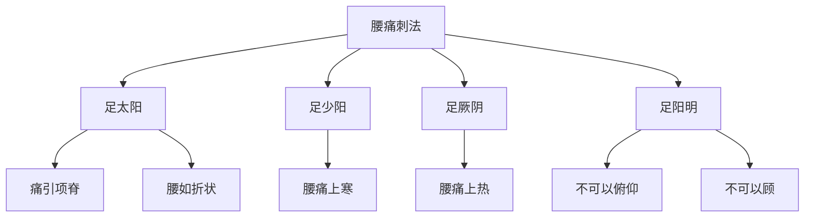

# 素问-刺腰痛篇第四十一

> "黄帝问曰：腰痛，痛上怦心，不可以仰息，刺之奈何？" - 黄帝

---

## 📜 原文（节选）/ Original Text (Excerpt)

黄帝问曰：腰痛，痛上怦心，不可以仰息，刺之奈何？

岐伯对曰：足太阳脉令人腰痛，痛引项脊，腰如折状，不可以仰，不可以顾。刺腰痛，出血如故，血已，令人腰痛益甚，不可刺矣。

腰痛上寒，不可以顾，刺足少阳出血，如故，血已，令人腰痛如解。

腰痛上热，不可以顾，刺足厥阴出血，如故，血已，令人腰痛如解。

腰痛不可以俯仰，不可以顾，刺足阳明出血，如故，血已，令人腰痛如解。

腰痛如折，不可以仰，不可以顾，刺足太阳出血，如故，血已，令人腰痛如解。

　　足太阳脉令人腰痛，引项脊尻背如重状；刺其郄中太阳正经出血，春无见血。

　　少阳令人腰痛，如以针刺其皮中，循循然不可以俯仰，不可以顾，刺少阳成骨之端出血，成骨在膝外廉之骨独起者，夏无见血。

　　阳明令人腰痛，不可以顾，顾如有见者，善悲，刺阳明于䯒[héng] 前三痏，上下和之出血，秋无见血。

　　足少阴令人腰痛，痛引脊内廉，刺少阴于内踝上二痏，春无见血，出血太多，不可复也。

　　厥阴之脉，令人腰痛，腰中如张弓弩弦；刺厥阴之脉，在腨踵鱼腹之外，循之累累然，乃刺之，其病令人善言，默默然不慧，刺之三痏。

　　解脉令人腰痛，痛引肩，目然，时遗溲，刺解脉，在膝筋肉分间郄外廉之横脉出血，血变而止。

　　解脉令人腰痛如引带，常如折腰状，善恐，刺解脉在郄中结络如黍米，刺之血射以黑，见赤血而已。

　　同阴之脉，令人腰痛，痛如小锤居其中，怫然肿；刺同阴之脉，在外踝上绝骨之端，为三痏。

　　阳维之脉，令人腰痛，痛上怫然肿；刺阳维之脉，脉与太阳合腨下间，去地一尺所。

　　衡络之脉，令人腰痛，不可以俛仰，仰则恐仆，得之举重伤腰，衡络绝，恶血归之，刺之在郄阳筋之间，上郄数寸，衡居为二痏出血。

　　会阴之脉，令人腰痛，痛上漯漯然汗出，汗干令人欲饮，饮已欲走，刺直阳之脉上三痏，在蹻上郄下五寸横居，视其盛者出血。

　　飞阳之脉，令人腰痛，痛上怫怫然，甚则悲以恐；刺飞阳之脉，在内踝上五寸，少阴之前，与阴维之会。

　　昌阳之脉，令人腰痛，痛引膺，目䀮[huāng]䀮[huāng]然，甚则反折，舌卷不能言；刺内筋为二痏，在内踝上大筋前，太阴后，上踝二寸所。

　　散脉，令人腰痛而热，热甚生烦，腰下如有横木居其中，甚则遗溲；刺散脉，在膝前骨肉分间，络外廉束脉，为三痏。

　　肉里之脉，令人腰痛，不可以咳，咳则筋缩急；刺肉里之脉为二痏，在太阳之外，少阳绝骨之后。

　　腰痛侠脊而痛至头，几几然，目[huāng]䀮[huāng]欲僵仆，刺足太阳郄中出血。腰痛上寒，刺足太阳阳明；上热，刺足厥阴；不可以俛仰，刺足少阳；中热而喘，刺足少阴，刺郄中出血。

　　腰痛上寒，不可顾，刺足阳明；上热，刺足太阴；中热而喘，刺足少阴。大便难，刺足少阴。少腹满，刺足厥阴。如折，不可以俛仰，不可举，刺足太阳，引脊内廉，刺足少阴。

　　腰痛引少腹控䏚[miǎo]，不可以仰。刺腰尻交者，两髁胂上。以月生死为痏数，发针立已。左取右，右取左。

---

## 📖 白话文翻译（节选）/ Modern Chinese Translation (Excerpt)

黄帝问道：腰痛，疼痛向上冲心，不能仰息，针刺它如何？

岐伯回答说：足太阳经脉使人腰痛，疼痛牵引颈部脊背，腰部像折断的样子，不能仰身，不能回顾。针刺腰痛，出血如旧，血已出，使人腰痛更加严重，不可以针刺了。

腰痛向上寒，不能回顾，针刺足少阳出血，如旧，血已出，使人腰痛如解除。

腰痛向上热，不能回顾，针刺足厥阴出血，如旧，血已出，使人腰痛如解除。

腰痛不能俯仰，不能回顾，针刺足阳明出血，如旧，血已出，使人腰痛如解除。

腰痛像折断，不能仰身，不能回顾，针刺足太阳出血，如旧，血已出，使人腰痛如解除。

　　腰足太阳经脉发病使人腰痛，痛时牵引项脊尻背，好象担负着沉重的东西一样，治疗时应刺其合穴委中，即在委中穴处刺出其恶血。若在春季不要刺出其血。足少阳经脉发病使人腰痛，痛如用针刺于皮肤中，逐渐加重不能前后俯仰，并且不能左右回顾。治疗时应刺足少阳经成骨的起点出血，成骨即膝外侧高骨突起处，若在夏季则不要刺出其血。

　　腰阳明经脉发病而使人腰痛，颈项不能转动回顾，如果回顾则神乱目花犹如妄见怪异，并且容易悲伤，治疗时应刺足阳明经在胫骨前的足三里穴三次，并配合上、下巨虚穴刺出其血，秋季则不要刺出其血。

　　腰足少阴脉发病使人腰痛，痛时牵引到脊骨的内侧，治疗时应刺足少阴经在内踝上的复溜穴两次，若在春季则不要刺出其血。如果出血太多，就会导致肾气损伤而不易恢复。

　　腰厥阴经脉发病使人腰痛，腰部强急如新张的弓弩弦一样，治疗时应刺阻厥阴的经脉，其部位在腿肚和足根之间鱼腹之外的蠡沟穴处，摸之有结络累累然不平者，就用针刺之，如果病人多言语或沉默抑郁不爽，可以针刺三次。

　　腰解脉发病使人腰痛，痛时会牵引到肩部，眼睛视物不清，时常遗尿，治疗时应取解脉在膝后大筋分肉间（委中穴）外侧的委阳穴处，有血络横见，紫黑盛满，要刺出其血直到血色由紫变红才停止。解脉发病使人腰痛，好象有带子牵引一样，常好象腰部被折断一样，并且时常有恐惧的感觉，治疗时应刺解脉，在郄中有络脉结滞如黍米者，刺之则有黑色血液射出，等到血色变红时即停止。

　　腰同阴之脉发病使人腰痛，痛时胀闷沉重，好象有小锤在里面敲击，病处突然肿胀，治疗时应刺同阴之脉，在外踝上绝骨之端的阳辅穴处，针三次。

　　腰衡络之脉发病使人腰痛，不可以前俯和后仰，后仰则恐怕跌倒，这种病大多因为用力举重伤及腰部，使横络阻绝不通，淤血滞在里。治疗时应刺委阳大筋间上行数寸处的殷门穴，视其血络横居满者针刺二次，令其出血。

　　腰会阴之脉发病使人腰痛，痛则汗出，汗止则欲饮水，并表现着行动不安的状态，治疗时应刺直阳之脉上三次，其部位在阳蹻申脉穴上，足太阳郄中穴下五寸的承筋穴处，视其左右有络脉横居、血络盛满的，刺出其血。（本条经文，注家说法亦颇不一，姑从王冰之说以释之。脱阴为腰痛之文，待考。）

　　腰昌阳之脉发病使人腰痛，疼痛牵引胸膺部，眼睛视物昏花，严重时腰背向后反折，舌卷短不能言语，治疗时应取筋内侧的复溜穴刺二次，其穴在内踝上大筋的前面，足太阴经的后面，内踝上二寸处。

　　腰散脉发病使人腰痛而发热，热甚则生心烦，腰下好象有一块横木梗阻其中，甚至会发生遗尿，治疗时应刺散脉下俞之巨虚上廉和巨虚下廉，其穴在膝前外侧骨肉分间，看到有青筋缠束的脉络，即用针刺三次。

　　腰肉里之脉发病使人腰痛，痛得不能咳嗽，咳嗽则筋劢拘急挛缩，治疗时应刺肉里之脉二次，其穴在阻太阳的外前方，阻少阳绝骨之端的后面。

　　腰腰痛挟脊背而痛，上连头部拘强不舒，眼睛昏花，好象要跌倒，治疗时应刺足太阳经的委中穴出血。腰痛时有寒冷感觉的，应刺足太阳经和足阳明经，以散阳分之阴邪；有热感觉的，应刺足厥阴经，以去阴中之风热；腰痛不能俯仰的，应刺足少阳经，以转枢机关；若内热而喘促的，应刺足少阴经，以壮水制火，并刺委中的血络出血。

　　腰腰痛时，感觉上部寒冷，头项强急不能回顾的，应刺足阳明经；感觉上部火热的，应刺足太阴经；感觉内里发热兼有气喘的，应刺足少阴经。大便困难的，应刺足少阴经。少腹胀满的，应刺足厥阴经。腰痛犹如折断一样不可前后俯仰，不能举动的，应刺足太阳经。腰痛牵引脊骨内侧的，应刺足少阴经。

　　腰痛时牵引少腹，引动季胁之下，不能后仰，治疗时应刺腰尻交处的下髎穴，其部位在两踝骨下挟脊两旁的坚肉处，针刺时以[月亮](https://www.guoxuemeng.com/gushici/yueliangdegushi/)的盈亏计算针刺的次数，针后会立即见效，并采用左痛刺右侧、右痛刺左侧的方法。

---

## 🔑 核心要点 / Core Concepts

### 1. 经脉腰痛表现 / Meridian Lumbar Pain Manifestations

| 经脉 | 症状特点 | 刺法 |
|------|----------|------|
| 足太阳 | 痛引项脊，腰如折状 | 刺出血，如故 |
| 足少阳 | 腰痛上寒 | 刺出血，如故 |
| 足厥阴 | 腰痛上热 | 刺出血，如故 |
| 足阳明 | 不可以俯仰，不可以顾 | 刺出血，如故 |

### 2. 腰痛类型 / Lumbar Pain Types

| 类型 | 表现 |
|------|------|
| 腰痛上怦心 | 痛上怦心，不可以仰息 |
| 腰痛上寒 | 上寒，不可以顾 |
| 腰痛上热 | 上热，不可以顾 |
| 腰痛如折 | 腰如折状，不可以仰，不可以顾 |

### 3. 腰痛刺法特点 / Lumbar Pain Acupuncture Characteristics

---

## 📚 理论解释 / Theoretical Analysis

### 腰痛理论 / Lumbar Pain Theory

> [!info] 核心概念
- 腰痛与经脉相关
- 不同经脉有不同表现
- 刺法根据经脉选择

#### 腰痛详解 / Detailed Lumbar Pain

**1. 足太阳腰痛 / Foot Taiyang Lumbar Pain**
- 症状：痛引项脊，腰如折状
- 表现：不可以仰，不可以顾
- 刺法：刺出血

**2. 足少阳腰痛 / Foot Shaoyang Lumbar Pain**
- 症状：腰痛上寒
- 表现：不可以顾
- 刺法：刺出血

**3. 足厥阴腰痛 / Foot Jueyin Lumbar Pain**
- 症状：腰痛上热
- 表现：不可以顾
- 刺法：刺出血

**4. 足阳明腰痛 / Foot Yangming Lumbar Pain**
- 症状：不可以俯仰，不可以顾
- 表现：腰痛如解除
- 刺法：刺出血

### 腰痛刺法理论 / Lumbar Pain Acupuncture Theory

> [!warning] 核心理念
- 刺腰痛，出血如故
- 血已，令人腰痛如解
- 不可复刺

#### 腰痛刺法详解 / Detailed Lumbar Pain Acupuncture

**1. 刺法原则 / Acupuncture Principle**
- 刺出血：针刺出血
- 如故：如旧
- 血已：血已出
- 如解：如解除

**2. 刺法禁忌 / Acupuncture Contraindications**
- 不可复刺：不可以再刺
- 血已，令人腰痛益甚：血已出，使人腰痛更加严重

**3. 各经刺法 / Each Meridian Acupuncture**
- 足太阳：刺出血
- 足少阳：刺出血
- 足厥阴：刺出血
- 足阳明：刺出血

---

## 🏥 中医实践应用 / TCM Practice Application

### 腰痛治疗 / Lumbar Pain Treatment

#### 现代腰痛治疗要点 / Modern Lumbar Pain Treatment Key Points

**1. 经脉腰痛治疗 / Meridian Lumbar Pain Treatment**
- 症状：痛引项脊，腰如折状
- 治法：舒筋活血
- 药物：独活寄生汤、活络效灵丹
- 针刺：针刺太阳经穴

**2. 寒热腰痛治疗 / Cold Heat Lumbar Pain Treatment**
- 上寒：温阳散寒
  - 药物：右归丸、金匮肾气丸
  - 针刺：针刺少阳经穴

- 上热：清热凉血
  - 药物：知柏地黄丸
  - 针刺：针刺厥阴经穴

**3. 腰痛如折治疗 / Lumbar Pain Like Breaking Treatment**
- 症状：腰如折状，不可以俯仰
- 治法：补肾强腰
- 药物：青娥丸、补肾强腰丸
- 针刺：针刺太阳经穴

---

## 🔗 相关链接 / Related Links

- [[MOC-黄帝内经知识库]] - 主索引
- [[黄帝内经-素问索引]] - 素问索引
- [[黄帝内经-核心理论]] - 核心理论体系
- [[素问42-风论篇]] - 风论
- [[素问43-痹论篇]] - 痹论

### 易学关联 / Yi Jing Connection

- [[MOC-易经知识库]] - 易经索引
- [[20260201-0005 五行]] - 五行理论

**易学与刺腰痛的联系:**
- 五行理论：易学的五行理论与中医经脉相通
- 阴阳理论：易学的阴阳理论与中医寒热腰痛相通

---

## 💡 学习要点 / Learning Points

### 掌握重点 / Key Points to Master

- [ ] 理解经脉腰痛的表现
- [ ] 掌握腰痛类型的判断
- [ ] 学会腰痛刺法的方法
- [ ] 了解腰痛的治疗方法

### 思考问题 / Questions for Reflection

1. **为什么说"腰痛如折状"？**
   - 痛引项脊：疼痛牵引颈部脊背
   - 严重程度：像折断一样严重
   - 功能受限：不可以俯仰回顾

2. **现代医学如何应用"刺腰痛"？**
   - 腰椎疾病：腰椎疾病治疗
   - 针刺治疗：针刺治疗腰痛
   - 综合治疗：综合治疗方案

---

## 📊 学习进度 / Learning Progress

### 完成情况 / Completion Status

| 学习内容 | 状态 | 备注 |
|---------|------|------|
| 原文诵读 | 📝 进行中 | 建议每日诵读 |
| 白话文理解 | ✅ 已完成 | 理解主要含义 |
| 经脉腰痛 | ✅ 已完成 | 掌握概念 |
| 腰痛治疗 | 📝 进行中 | 需要临床实践 |
| 理论分析 | ✅ 已完成 | 理解理论 |

---

## 🔄 更新日志 / Update Log

### 2026-02-03

- ✅ 创建刺腰痛篇第四十一笔记
- ✅ 完成原文、白话文翻译（节选）
- ✅ 整理经脉腰痛对照表
- ✅ 编写腰痛刺法理论

---

**笔记创建日期**：2026年2月3日

**最后更新**：2026年2月3日
