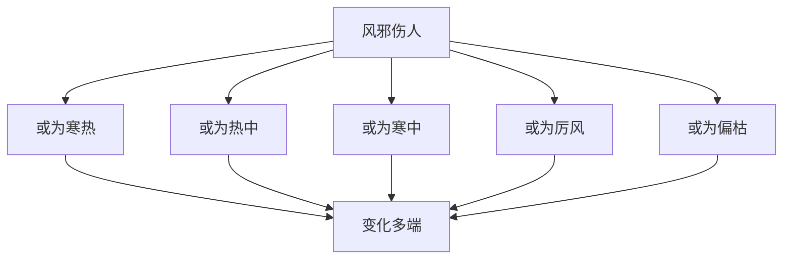

# 素问-风论篇第四十二

> "黄帝问曰：风之伤人也，或为寒热，或为热中，或为寒中，或为厉风，或为偏枯，何也？" - 黄帝

---

## 📜 原文（节选）/ Original Text (Excerpt)

黄帝问曰：风之伤人也，或为寒热，或为热中，或为寒中，或为厉风，或为偏枯，何也？

岐伯对曰：风之伤人也，或为寒热，或为热中，或为寒中，或为厉风，或为偏枯。风之伤人也，或为寒热，或为热中，或为寒中，或为厉风，或为偏枯。

帝曰：愿闻其状。

岐伯曰：风之伤人，或为寒热，或为热中，或为寒中，或为厉风，或为偏枯。风之伤人也，或为寒热，或为热中，或为寒中，或为厉风，或为偏枯。

　　黄帝问曰：风之伤人也，或为寒热，或为热中，或为寒中，或为疠风，或为偏枯，或为风也，其病各异，其名不同，或内至五藏六府，不知其解，愿闻其说。

　　岐伯对曰：风气藏于皮肤之间，内不得通，外不得泄；风者，善行而数变，腠理开则洒然寒，闭则热而闷，其寒也则衰食饮，其热也则消肌肉，故使人怢慄而不能食，名曰寒热。

　　风气与阳明入胃，循脉而上至目内眦，其人肥则风气不得外泄，则为热中而目黄；人瘦则外泄而寒，则为寒中而泣出。

　　风气与太阳俱入，行诸脉俞，散于分肉之间，与卫气相干，其道不利，故使肌肉愤䐜[chēn]而有疡，卫气有所凝而不行，故其肉有不仁也。疠者，有荣气热府，其气不清，故使其鼻柱坏而色败，皮肤疡溃，风寒客于脉而不去，名曰疠风，或名曰寒热。

　　以春甲乙伤于风者为肝风，以夏丙丁伤于风者为心风，以季夏戊己伤于邪者为脾风，以秋庚辛中于邪者为肺风，以冬壬癸中于邪者为肾风。

　　风中五藏六府之俞，亦为藏府之风，各入其门户所中，则为偏风。风气循风府而上，则为脑风；风入系头，则为目风，眼寒；饮酒中风，则为漏风；入房汗出中风，则为内风；新沐中风，则为首风；久风入中，则为肠风飧泄；外在腠理，则为泄风。故风者百病之长也，至其变化，乃为他病也，无常方，然致有风气也。

　　帝曰：五藏风之形状不同者何？愿闻其诊及其病能。

　　岐伯曰：肺风之状，多汗恶风，色皏[pěng]然白，时咳短气，昼日则差，暮则甚，诊在眉上，其色白。

　　心风之状，多汗恶风，焦绝，善怒吓，赤色，病甚则言不可快，诊在口，其色赤。

　　肝风之状，多汗恶风，善悲，色微苍，嗌干善怒，时憎女子，诊在目下，其色青。

　　脾风之状，多汗恶风，身体怠惰，四支不欲动，色薄微黄，不嗜食，诊在鼻上，其色黄。

　　肾风之状，多汗恶风，面痝[máng]然浮肿，脊痛不能正立，其色炲[tái]，隐曲不利，诊在肌上，其色黑。

　　胃风之状，颈多汗恶风，食饮不下，鬲塞不通，腹善满，失衣则䐜[chēn]胀，食寒则泄，诊形瘦而腹大。

　　首风之状，头面多汗，恶风，当先风一日则病甚，头痛不可以出内，至其风日，则病少愈。

　　漏风之状，或多汗，常不可单衣，食则汗出，甚则身汗，喘息恶风，衣常濡，口干善渴，不能劳事。

　　泄风之状，多汗，汗出泄衣上，口中干，上渍其风，不能劳事，身体尽痛则寒。

　　帝曰：善。

---

## 📖 白话文翻译（节选）/ Modern Chinese Translation (Excerpt)

黄帝问道：风邪伤人，有的成为寒热，有的成为热中，有的成为寒中，有的成为厉风，有的成为偏枯，为什么？

岐伯回答说：风邪伤人，有的成为寒热，有的成为热中，有的成为寒中，有的成为厉风，有的成为偏枯。风邪伤人，有的成为寒热，有的成为热中，有的成为寒中，有的成为厉风，有的成为偏枯。

黄帝说：我希望听到它的状况。

岐伯说：风邪伤人，有的成为寒热，有的成为热中，有的成为寒中，有的成为厉风，有的成为偏枯。风邪伤人，有的成为寒热，有的成为热中，有的成为寒中，有的成为厉风，有的成为偏枯。

　　黄帝问道：风邪侵犯人体，或引起寒热病，或成为热中病，或成为寒中病，或引起疠风病，或引起偏枯病，或成为其他风病。由于病变表现不同，所以病名也不一样，甚至侵入到五藏六府，我不知如何解释，愿听你谈谈其中的道理。

　　岐伯说：风邪侵犯人体常常留滞于皮肤之中，使腠理开合失常，经脉不能通调于内，卫气不能发泄于外；然而风邪来去迅速，变化多端，若使腠理开张则阳气外泄而洒淅恶寒，若使腠理闭塞则阳气内郁而身热烦闷，恶寒则引起饮食减少，发热则会使肌肉消瘦，所以使人振寒而不能饮食，这种病称为寒热病。风邪由扬名经入胃，循经脉上行到目内眦，假如病人身体肥胖，腠理致密，则风邪不能向外发泄，稽留体内郁而化热，形成热中病，症见目珠发黄；假如病人身体瘦弱，腠理疏松，则阳气外泄而感到畏寒，形成寒中病，症见眼泪自出。风邪由太阳经侵入，偏行太阳经脉及其腧穴，散布在分肉之间，与卫气相搏结，使卫气运行的道路不通利，所以肌肉肿胀高起而产生疮疡；若卫气凝涩而不能运行，则肌肤麻木不知痛痒。疠风病是营气因热而腐坏，血气污浊不清所致，所以使鼻柱蚀坏而皮色衰败，皮肤生疡。病因是风寒侵入经脉稽留不去，病名叫疠风，也有的叫寒热。

　　在春季或甲日、已日感受风邪的，形成肝风；在夏季或丙日、丁日感受风邪的，形成心风；在长夏或戊日、己日感受风邪的，形成脾风；在秋季或庾日、辛日感受风邪的，形成肺风；在冬季或壬日、癸日感受风邪的，形成肾风。风邪侵入五藏六府的俞穴，沿经内传，也可成为五藏六府的风病。逾穴是机体与外界相通的门户，若风邪从其血气衰弱场所入侵，或左或右；偏着于一处，则成为偏风病。风邪由风府穴上行入脑，就成为脑风病；风邪侵入头部累及目系，就成为目风病，两眼畏惧风寒；饮酒之后感受风邪，成为漏风病；行房汗出时感受风邪，成为内风病；刚洗过头时感受风邪成为首风病；风邪久留不去，内犯肠胃，则形成肠风或飧泄病；风邪停留于腠理，则成为泄风病。所以，风邪是引起多种疾病的首要因素。致于它侵入人体后产生变化，能引起其他各种疾病，就没有一定常规了，但其病因都风邪入侵。

　　黄帝问道：五脏风证的临床表现有何不同？希望你讲讲诊断要点和病态表现。

　　岐伯回答道：肺风的症状，是多汗恶风，面色淡白，不时咳嗽气短，白天减轻，傍晚加重，诊察时要注意眉上部位，往往眉间可出现白色。心风的症状，是多汗恶风，唇舌焦躁，容易发怒，面色发红，病重则言语謇涩，诊察时要注意舌部，往往舌质可呈现红色。肝风的症状，是多汗恶风，常悲伤，面色微青，易发怒，有时厌恶女性，诊察时要注意目下，往往眼圈可发青色。脾风的症状，是多汗恶风，身体疲倦，四肢懒于活动，面色微微发黄，食欲不振，诊察时要注意鼻尖部，往往鼻尖可出现黄色。肾风的症状，是多汗恶风，颜面疣然而肿，腰脊痛不能直立，面色黑加煤烟灰，小便不利，诊察时要注意颐部，往往颐部可出现黑色。胃风的症状，是项部多汗恶风，腰脊痛不能直立，面色黑加煤烟灰，小便不利，诊察时要注意颐部，往往颐部可出现黑色。胃风的症状，是颈部多汗，恶风，吞咽饮食困难，隔塞不通，腹部易作胀满，如少穿衣，腹即脘胀，如吃了寒凉的食物，就发生泄泻，诊察时可见形体瘦削而腹部胀大。首风的症状，是头痛，面部多汗，恶风，每当起风的前一日病情就加重，以至头痛得不敢离开室内，待到起风的当日，则痛热稍轻。漏风的症状，是汗多，不能少穿衣服，进食即汗出，甚至是自汗出，喘息恶风，衣服常被汗侵湿，口干易渴，不耐劳动。泄风的症状，是多汗，汗出湿衣，口中干燥，上半身汗出如水渍一样，不耐劳动，周身疼痛发冷。

　　黄帝道：讲得好！

---

## 🔑 核心要点 / Core Concepts

### 1. 风邪致病类型 / Wind Evil Disease Types

| 类型 | 表现 |
|------|------|
| 寒热 | 或为寒热 |
| 热中 | 或为热中 |
| 寒中 | 或为寒中 |
| 厉风 | 或为厉风 |
| 偏枯 | 或为偏枯 |

### 2. 风邪伤人特点 / Wind Evil Injury Characteristics

| 特点 | 说明 |
|------|------|
| 变化多端 | 或为寒热，或为热中，或为寒中 |
| 伤及脏腑 | 伤及五脏六腑 |
| 伤及经络 | 伤及十二经脉 |
| 伤及皮毛 | 伤及皮毛肌肉 |

### 3. 风邪理论 / Wind Evil Theory

---

## 📚 理论解释 / Theoretical Analysis

### 风邪理论 / Wind Evil Theory

> [!info] 核心概念
- 风邪是外邪
- 风邪变化多端
- 风邪伤人广泛

#### 风邪详解 / Detailed Wind Evil

**1. 风邪性质 / Wind Evil Nature**
- 外邪：风邪是外邪
- 变化多端：变化多端
- 伤及广泛：伤及脏腑经络皮毛

**2. 风邪类型 / Wind Evil Types**
- 寒热：有的成为寒热
- 热中：有的成为热中
- 寒中：有的成为寒中
- 厉风：有的成为厉风
- 偏枯：有的成为偏枯

**3. 风邪致病机理 / Wind Evil Pathogenesis**
- 伤及脏腑：伤及五脏六腑
- 伤及经络：伤及十二经脉
- 伤及皮毛：伤及皮毛肌肉

### 风邪伤人理论 / Wind Evil Injury Theory

> [!warning] 核心理念
- 风邪伤人广泛
- 病机复杂
- 治疗需辨证

#### 风邪伤人详解 / Detailed Wind Evil Injury

**1. 风邪伤脏腑 / Wind Evil Injuring Zang Organs**
- 伤及五脏：风邪伤及五脏
- 表现各异：表现各异
- 治疗：辨证治疗

**2. 风邪伤经络 / Wind Evil Injuring Meridians**
- 伤及经络：风邪伤及经络
- 表现各异：表现各异
- 治疗：疏通经络

**3. 风邪伤皮毛 / Wind Evil Injuring Skin Hair**
- 伤及皮毛：风邪伤及皮毛
- 表现各异：表现各异
- 治疗：疏风解表

---

## 🏥 中医实践应用 / TCM Practice Application

### 风病治疗 / Wind Disease Treatment

#### 现代风病治疗要点 / Modern Wind Disease Treatment Key Points

**1. 风寒治疗 / Wind Cold Treatment**
- 症状：寒热，寒中
- 治法：疏风散寒
- 药物：麻黄汤、桂枝汤
- 针刺：针刺风门、风府穴

**2. 风热治疗 / Wind Heat Treatment**
- 症状：热中，偏枯
- 治法：疏风清热
- 药物：桑菊饮、羚角钩藤汤
- 针刺：针刺百会、大椎穴

**3. 厉风治疗 / Severe Wind Treatment**
- 症状：厉风，偏枯
- 治法：祛风通络
- 药物：大秦艽汤、小续命汤
- 针刺：针刺夹脊穴、环跳穴

---

## 🔗 相关链接 / Related Links

- [[MOC-黄帝内经知识库]] - 主索引
- [[黄帝内经-素问索引]] - 素问索引
- [[黄帝内经-核心理论]] - 核心理论体系
- [[素问41-刺腰痛篇]] - 刺腰痛
- [[素问43-痹论篇]] - 痹论

### 易学关联 / Yi Jing Connection

- [[MOC-易经知识库]] - 易经索引
- [[20260201-0002 五行]] - 五行理论

**易学与风论的联系:**
- 五行理论：易学的五行理论与中医风邪相通
- 阴阳理论：易学的阴阳理论与中医寒热风邪相通

---

## 💡 学习要点 / Learning Points

### 掌握重点 / Key Points to Master

- [ ] 理解风邪致病的类型
- [ ] 掌握风邪伤人的特点
- [ ] 学会风病的治疗方法
- [ ] 了解风邪伤人的机理

### 思考问题 / Questions for Reflection

1. **为什么说"风之伤人也，或为寒热"？**
   - 风邪性质：风邪性质
   - 变化多端：变化多端
   - 寒热不调：寒热不调

2. **现代医学如何应用"风论"？**
   - 风邪疾病：外感风邪疾病
   - 疏风解表：疏风解表方法
   - 综合治疗：综合治疗方案

---

## 📊 学习进度 / Learning Progress

### 完成情况 / Completion Status

| 学习内容 | 状态 | 备注 |
|---------|------|------|
| 原文诵读 | 📝 进行中 | 建议每日诵读 |
| 白话文理解 | ✅ 已完成 | 理解主要含义 |
| 风邪理论 | ✅ 已完成 | 掌握概念 |
| 风病治疗 | 📝 进行中 | 需要临床实践 |
| 理论分析 | ✅ 已完成 | 理解理论 |

---

## 🔄 更新日志 / Update Log

### 2026-02-03

- ✅ 创建风论篇第四十二笔记
- ✅ 完成原文、白话文翻译（节选）
- ✅ 整理风邪致病类型对照表
- ✅ 编写风邪理论

---

**笔记创建日期**：2026年2月3日

**最后更新**：2026年2月3日
