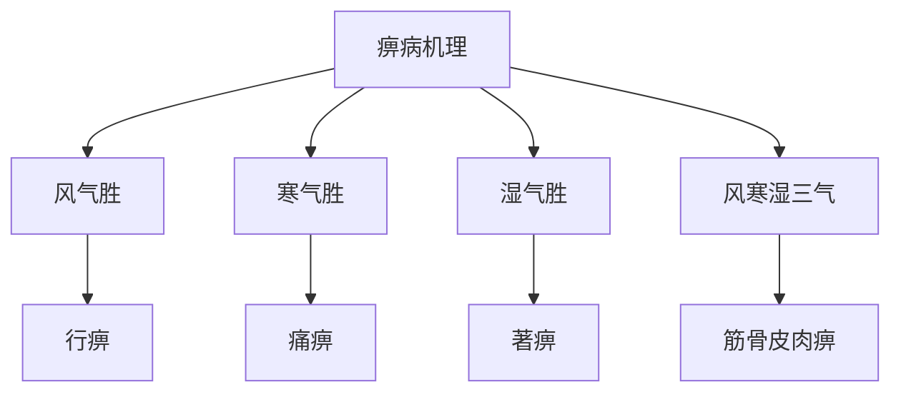

# 素问-痹论篇第四十三

> "黄帝问曰：痹之安生？岐伯曰：风、寒、湿三气杂至，合而为痹也。" - 岐伯

---

## 📜 原文（节选）/ Original Text (Excerpt)

黄帝问曰：痹之安生？

岐伯曰：风、寒、湿三气杂至，合而为痹也。

帝曰：其有别乎？

岐伯曰：风气胜者为行痹，寒气胜者为痛痹，湿气胜者为著痹。风寒湿三气合而为痹，则为筋骨皮肉之痹。

帝曰：愿闻其状。

岐伯曰：风气胜者为行痹，游走上下，无所留止，为行痹。寒气胜者为痛痹，痛不可忍，为痛痹。湿气胜者为著痹，湿气所着之处，为著痹。风寒湿三气合而为痹，则为筋骨皮肉之痹。

　　黄帝问曰：痹之安生？

　　岐伯对曰：风寒湿三气杂至，合而为痹也。其风气胜者为行痹，寒气胜者为痛痹，湿气胜者为着痹也。

　　帝曰：其有五者何也？

　　岐伯曰：以冬遇此者为骨痹，以春遇此者为筋痹，以夏遇此者为脉痹，以至阴遇此者为肌痹，以秋遇此者为皮痹。

　　帝曰：内舍五藏六府，何气使然？

　　岐伯曰：五藏皆有合，病久而不去者，内舍于其合也。故骨痹不已，复感于邪，内舍于肾；筋痹不已，复感于邪，内舍于肝；脉痹不已，复感于邪，内舍于心；肌痹不已，复感于邪，内舍于脾；皮痹不已，复感于邪，内舍于肺。所谓痹者，各以其时，重感于风寒湿之气也。

　　凡痹之客五藏者，肺痹者，烦满喘而呕；心痹者，脉不通，烦则心下鼓，暴上气而喘，嗌干善噫，厥气上则恐；肝痹者，夜卧则惊，多饮数小便，上为引如怀；肾痹者，善胀，尻以代踵，脊以代头；脾痹者，四支懈惰，发咳呕汁，上为大塞；肠痹者，数饮而出不得，中气喘争，时发飧泄；胞痹者，少腹膀胱，按之内痛，若沃以汤，涩于小便，上为清涕。

　　阴气者，静则神藏，躁则消亡，饮食自倍，肠胃乃伤。淫气喘息，痹聚在肺；淫气忧思，痹聚在心；淫气遗溺，痹聚在肾；淫气乏竭，痹聚在肝；淫气肌绝，痹聚在脾。

　　诸痹不巳，亦益内也，其风气胜者，其人易已也。

　　帝曰：痹，其时有死者，或疼久者，或易已者，其故何也？

　　岐伯曰：其入藏者死，其留连筋骨间者疼久，其留皮肤间者易已。

　　帝曰：其客于六府者何也？

　　岐伯曰：此亦其食饮居处，为其病本也。六府亦各有俞，风寒湿气中其俞，而食饮应之，循俞而入，各舍其府也。

　　帝曰：以针治之奈何？

　　岐伯曰：五藏有俞，六府有合，循脉之分，各有所发，各随其过，则病瘳也。

　　帝曰：荣卫之气，亦令人痹乎？

　　岐伯曰：荣者，水谷之精气也，和调于五藏，洒陈于六府，乃能入于脉也。故循脉上下，贯五藏，络六府也。卫者，水谷之悍气也，其气慓疾滑利，不能入于脉也，故循皮肤之中，分肉之间，熏于肓膜，散于胸腹，逆其气则病，从其气则愈，不与风寒湿气合，故不为痹。

　　帝曰：善。痹或痛，或不痛，或不仁，或寒，或热，或燥，或湿，其故何也？

　　岐伯曰：痛者，寒气多也，有寒故痛也。其不痛不仁者，病久入深，荣卫之行涩，经络时疏，故不通，皮肤不营，故为不仁。其寒者，阳气少，阴气多，与病相益，故寒也。其热者，阳气多，阴气少，病气胜，阳遭阴，故为痹热。其多汗而濡者，此其逢湿甚也，阳气少，阴气盛，两气相感，故汗出而濡也。

　　帝曰：夫痹之为病，不痛何也？

　　岐伯曰：痹在于骨则重，在于脉则血凝而不流，在于筋则屈不伸，在于肉则不仁，在于皮则寒，故具此五者则不痛也。凡痹之类，逢寒则虫，逢热则纵。

　　帝曰：善。

---

## 📖 白话文翻译（节选）/ Modern Chinese Translation (Excerpt)

黄帝问道：痹的产生如何？

岐伯回答说：风、寒、湿三气混杂而至，合成为痹。

黄帝说：它有区别吗？

岐伯说：风气旺盛的成为行痹，寒气旺盛的成为痛痹，湿气旺盛的成为著痹。风、寒、湿三气合成为痹，就成为筋、骨、皮、肉的痹。

黄帝说：我希望听到它的状况。

岐伯说：风气旺盛的成为行痹，游走上下，没有停留止，成为行痹。寒气旺盛的成为痛痹，疼痛不能忍受，成为痛痹。湿气旺盛的成为著痹，湿气附着的地方，成为著痹。风、寒、湿三气合成为痹，就成为筋、骨、皮、肉的痹。

　　黄帝问道：痹病是怎样产生的？

　　岐伯回答说：由风、寒、湿三种邪气杂合伤人而形成痹病。其中风邪偏胜的叫行痹，寒邪偏胜的叫痛痹，湿邪偏胜的叫着痹。

　　黄帝问道：痹病又可分为五种，为什么？

　　岐伯说：在[冬天](https://www.guoxuemeng.com/gushici/dongtiandegushi/)得病称为骨痹；在[春天](https://www.guoxuemeng.com/gushici/chuntiandegushi/)得病的称为筋痹；在[夏天](https://www.guoxuemeng.com/gushici/xiatiandegushi/)得病的称为脉痹；在长夏得病的称为肌痹；在[秋天](https://www.guoxuemeng.com/gushici/qiutiandegushi/)得病的称为皮痹。

　　黄帝问道：痹病的病邪又有内侵而累及五藏六府的，是什么道理？

　　岐伯说：五脏都有与其相合的组织器官，若病邪久留不除，就会内犯于相合的内脏。所以，骨痹不愈，再感受邪气，就会内舍于心；肌痹不愈，再感受邪气，就会内舍于脾；皮痹不愈，再感受邪气，就会内舍于肺。总之，这些痹证是各脏在所主季节里重复感受了风、寒、湿气所造成的。

　　凡痹病侵入到五脏，症状各有不同：肺痹的症状是烦闷胀满，喘逆呕吐，心痹的症状是血脉不通畅，烦躁则心悸，突然气逆上壅而喘息，咽干，易暖气，厥阴上逆则引起恐惧。肝痹的症状是夜眠多惊，饮水多而小便频数，疼痛循肝经由上而下牵引少腹如怀孕之状。肾痹的症状是腹部易作胀，骨萎而足不能行，行步时臀部着地，脊柱曲屈畸行，高耸过头。脾痹的症状是四肢倦怠无力，咳嗽，呕吐清水，上腹部痞塞不通。肠痹的症状是频频饮水而小便困难，腹中肠鸣，时而发生完谷不化的泄泻。膀胱痹的症状是少腹膀胱部位按之疼痛，如同灌了热水似的，小便涩滞不爽，上部鼻流青涕。

　　五脏精气，安静则精神内守，躁动则易于耗散。若饮食过量，肠胃就要受损。致痹之邪引起呼吸喘促，是痹发生在肺；致痹之邪引起忧伤思虑，是痹发生在心；致痹之痹引起遗尿，是痹发生在肾；致痹之邪引起疲乏衰竭，是痹发生在肝；致痹之邪引起肌肉瘦削，是痹发生在脾。总之，各种痹病日久不愈，病变就会进一步向内深入。其中风邪偏胜的容易痊愈。

　　黄帝问道：患了痹病后，有的死亡，有的疼痛经久不愈，有的容易痊愈，这是什么缘故？

　　岐伯说：痹邪内犯到五脏则死，痹邪稽留在筋骨间的则痛久难愈，痹邪停留在皮肤间的容易痊愈。

　　黄帝问道：痹邪侵犯六腑是何原因？

　　岐伯说：这也是以饮食不节、起居失度为导致腹痹的根本原因。六腑也各有俞穴，风寒湿邪在外侵及它的俞穴，而内有饮食所伤的病理基础与之相应，于是病邪就循着俞穴如里，留滞在相应的腑。

　　黄帝问道：怎样用针刺治疗呢？

　　岐伯说：五脏各有输穴可取，六腑各有合穴可取，循着经脉所行的部位，各有发病的征兆可察，根据病邪所在的部位，取相应的输穴或合穴进行针刺，病就可以痊愈了。

　　黄帝问道：营卫之气亦能使人发生痹病吗？

　　岐伯说：营是水谷所化生的精气，它平和协调地运行于五脏，散布于六腑，然后汇入脉中，所以营卫气循着经脉上下运行，起到连贯五脏，联络六腑的作用。胃是水谷所化生的悍气，它流动迅疾而滑利，不能进入脉中，所以循行于皮肤肌肉之间，熏蒸于肓膜之间，敷布于胸腹之内。若营卫之气的循行逆乱，就会生病，只要营卫之气顺从调和了，病就会痊愈。总的来说，营卫之气若不于风寒湿邪相合，则不会引起痹病。

　　黄帝说：讲得好！痹病，有的疼痛，有的不痛，有的麻木不仁，有的表现为寒，有的表现为热，有的皮肤干燥，有的皮肤湿润，这是什么缘故？

　　岐伯说：痛是寒气偏多，有寒所以才痛。不痛而麻木不仁的，系患病日久，病邪深入，营卫之气运行涩滞，致使经络中气血空虚，所以不痛；皮肤得不到营养，所以麻木不仁。表现为寒象的，是由于机体阳气不足，阴气偏盛，阴气助长寒邪之势，所以表现为寒象。表现为热象的，是由于机体阳气偏盛，阴气不足，偏胜的阳气与偏胜的风邪相结合而乘阴分，所以出现热象。多汗而皮肤湿润的，是由于感受邪湿太甚，加之机体阳气不足，阴气偏盛，湿邪与偏盛的阴气相结合，所以汗出而皮肤湿润。

　　黄帝问道：痹病而不甚疼痛是什么缘故？

　　岐伯说：痹发生在骨则身重；发生在脉则血凝涩而不畅；发生在筋则曲屈不能伸；发生在肌肉则麻木不仁；发生在皮肤则寒冷。如果有这五种情况，就不甚疼痛。凡痹病一类疾患，遇寒则筋脉拘急，遇热则筋脉弛缓。

　　黄帝道：讲得好！

---

## 🔑 核心要点 / Core Concepts

### 1. 痹病产生 / Arthralgia Production

| 因素 | 作用 |
|------|------|
| 风 | 风气胜者为行痹 |
| 寒 | 寒气胜者为痛痹 |
| 湿 | 湿气胜者为著痹 |
| 风寒湿三气 | 合而为痹，为筋骨皮肉之痹 |

### 2. 痹病类型 / Arthralgia Types

| 类型 | 特点 | 症状 |
|------|------|------|
| 行痹 | 风气胜 | 游走上下，无所留止 |
| 痛痹 | 寒气胜 | 痛不可忍 |
| 著痹 | 湿气胜 | 湿气所着之处 |
| 筋骨皮肉痹 | 风寒湿三气合 | 筋骨皮肉之痹 |

### 3. 痹病机理 / Arthralgia Mechanism

---

## 📚 理论解释 / Theoretical Analysis

### 痹病理论 / Arthralgia Theory

> [!info] 核心概念
- 痹病产生于风、寒、湿
- 三气杂至，合而为痹
- 不同气胜，不同痹型

#### 痹病详解 / Detailed Arthralgia

**1. 痹病产生 / Arthralgia Production**
- 风寒湿三气：风、寒、湿三气
- 杂至：混杂而至
- 合而为痹：合成为痹

**2. 痹病类型 / Arthralgia Types**
- 行痹：风气胜
- 痛痹：寒气胜
- 著痹：湿气胜
- 筋骨皮肉痹：风寒湿三气合

**3. 各型表现 / Each Type Manifestation**
- 行痹：游走上下，无所留止
- 痛痹：痛不可忍
- 著痹：湿气所着之处
- 筋骨皮肉痹：筋、骨、皮、肉之痹

### 风寒湿三气理论 / Wind Cold Damp Three Qi Theory

> [!warning] 核心理念
- 风、寒、湿三气
- 杂至合为痹
- 伤及筋骨皮肉

#### 风寒湿三气详解 / Detailed Wind Cold Damp Three Qi

**1. 风、寒、湿三气 / Wind, Cold, Damp Three Qi**
- 风：风邪
- 寒：寒邪
- 湿：湿邪
- 三气：三气混杂

**2. 三气杂至 / Three Qi Mixed Arrival**
- 杂至：混杂而至
- 合而为痹：合成为痹
- 伤及筋骨皮肉：伤及筋、骨、皮、肉

**3. 各气胜 / Each Qi Victory**
- 风气胜：风气胜
- 寒气胜：寒气胜
- 湿气胜：湿气胜

---

## 🏥 中医实践应用 / TCM Practice Application

### 痹病治疗 / Arthralgia Treatment

#### 现代痹病治疗要点 / Modern Arthralgia Treatment Key Points

**1. 行痹治疗 / Migratory Arthralgia Treatment**
- 症状：游走上下，无所留止
- 治法：疏风通络
- 药物：独活寄生汤、蠲痹汤
- 针刺：针刺风门、膈俞穴

**2. 痛痹治疗 | Painful Arthralgia Treatment**
- 症状：痛不可忍
- 治法：温经散寒
- 药物：乌头汤、附子汤
- 针刺：针刺肾俞、命门穴

**3. 著痹治疗 / Fixed Arthralgia Treatment**
- 症状：湿气所着之处
- 治法：祛湿通络
- 药物：薏苡仁汤、木防己汤
- 针刺：针刺阴陵泉、阳陵泉穴

**4. 筋骨皮肉痹治疗 / Tendon Bone Skin Flesh Arthralgia Treatment**
- 症状：筋、骨、皮、肉之痹
- 治法：祛风散寒除湿
- 药物：独活寄生汤加减
- 针刺：根据部位选择穴位

---

## 🔗 相关链接 / Related Links

- [[MOC-黄帝内经知识库]] - 主索引
- [[黄帝内经-素问索引]] - 素问索引
- [[黄帝内经-核心理论]] - 核心理论体系
- [[素问41-刺腰痛篇]] - 刺腰痛
- [[素问44-痿论篇]] - 痿论

### 易学关联 / Yi Jing Connection

- [[MOC-易经知识库]] - 易经索引
- [[20260201-0005 五行]] - 五行理论

**易学与痹论的联系:**
- 五行理论：易学的五行理论与中医风、寒、湿相通
- 阴阳理论：易学的阴阳理论与中医痹病相通

---

## 💡 学习要点 / Learning Points

### 掌握重点 / Key Points to Master

- [ ] 理解痹病产生的机理
- [ ] 掌握痹病类型的判断
- [ ] 学会痹病的治疗方法
- [ ] 了解风、寒、湿三气理论

### 思考问题 / Questions for Reflection

1. **为什么说"风、寒、湿三气杂至，合而为痹"？**
   - 三气杂至：风、寒、湿三气混杂而至
   - 合而为痹：合成为痹
   - 伤及广泛：伤及筋骨皮肉

2. **现代医学如何应用"痹论"？**
   - 风湿疾病：风湿性疾病治疗
   - 祛风散寒除湿：祛风散寒除湿方法
   - 综合治疗：综合治疗方案

---

## 📊 学习进度 / Learning Progress

### 完成情况 / Completion Status

| 学习内容 | 状态 | 备注 |
|---------|------|------|
| 原文诵读 | 📝 进行中 | 建议每日诵读 |
| 白话文理解 | ✅ 已完成 | 理解主要含义 |
| 痹病理论 | ✅ 已完成 | 掌握概念 |
| 痹病治疗 | 📝 进行中 | 需要临床实践 |
| 理论分析 | ✅ 已完成 | 理解理论 |

---

## 🔄 更新日志 / Update Log

### 2026-02-03

- ✅ 创建痹论篇第四十三笔记
- ✅ 完成原文、白话文翻译（节选）
- ✅ 整理痹病类型对照表
- ✅ 编写痹病和风寒湿三气理论

---

**笔记创建日期**：2026年2月3日

**最后更新**：2026年2月3日
