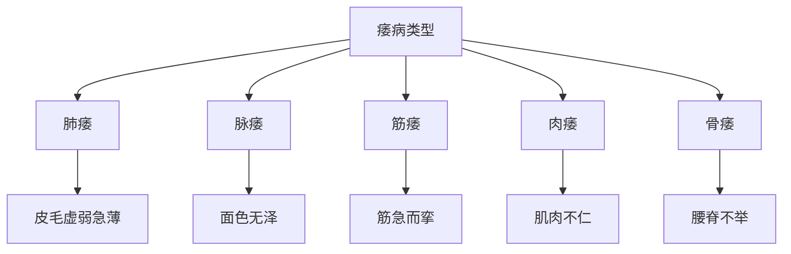

# 素问-痿论篇第四十四

> "黄帝问曰：五脏使人痿，何也？岐伯曰：肺主身之皮毛也，心主身之血脉也，肝主身之筋膜也，脾主身之肌肉也，肾主身之骨髓也。" - 岐伯

---

## 📜 原文（节选）/ Original Text (Excerpt)

黄帝问曰：五脏使人痿，何也？

岐伯曰：肺主身之皮毛也，心主身之血脉也，肝主身之筋膜也，脾主身之肌肉也，肾主身之骨髓也。

帝曰：其状何如？

岐伯曰：肺热者，则焦皮毛虚弱急薄，著则生痿躄也。心气热者，则下血脉虚，脉虚则血虚，血虚则经虚，经虚则脉不通，脉不通则血不流，血不流则色不泽，故面色无泽也。肝气热者，则胆泄口苦，筋膜干则筋急而挛，故为筋痿。脾气热者，则胃干而渴，肌肉不仁，故为肉痿。肾气热者，则腰脊不举，骨枯而髓减，故为骨痿。

　　黄帝问曰：五藏使人痿何也？

　　岐伯对曰：肺主身之皮毛，心主身之血脉，肝主身之筋膜，脾主身之肌肉，肾主身之骨髓。故肺热叶焦，则皮皮毛虚弱，急薄著则生痿躄也；心气热，则下脉厥而上，上则下脉虚，虚则生脉痿，枢折挈，胫纵而不任地也；肝气热，则胆泄口苦筋膜干，筋膜干则筋急而挛，发为筋痿；脾气热，则胃干而渴，肌肉不仁，发为肉痿；肾气热，则腰脊不举，骨枯而髓减，发为骨痿。

　　帝曰：何以得之？

　　岐伯曰：肺者，藏之长也，为心之盖也；有所失亡，所求不得，则发肺鸣，鸣则肺热叶焦，故曰，五藏因肺热叶焦发为痿躄，此之谓也。悲哀太甚，则胞络绝，胞络绝，则阳气内动，发则心下崩,数溲血也。故《本病》曰：大经空虚，发为肌痹，传为脉痿。思想无穷，所愿不得，意淫于外，入房太甚，宗筋弛纵，发为筋痿，及为白淫，故《下经》曰：筋痿者，生于肝使内也。有渐于湿，以水为事，若有所留，居处相湿，肌肉濡渍，痹而不仁，发为肉痿。故《下经》曰：肉痿者，得之湿地也。有所远行劳倦，逢大热而渴，渴则阳气内伐，内伐则热舍于肾，肾者水藏也，今水不胜火，则骨枯而髓虚，故足不任身，发为骨痿。故《下经》曰：骨痿者，生于大热也。

　　帝曰：何以别之？

　　岐伯曰：肺热者色白而毛败，心热者色赤而络脉溢，肝热者色苍而爪枯，脾热者色黄而肉蠕动；肾热者色黑而齿槁。

　　帝曰：如夫子言可矣，论言治痿者独取阳明，何也？

　　岐伯曰：阳明者，五藏六府之海，主润宗筋，宗筋主束骨而利机关也。冲脉者，经脉之海也，主渗灌谿谷，与阳明合于宗筋，阴阳揔宗筋之会，会于气街，而阳明为之长，皆属于带脉，而络于督脉。故阳明虚则宗筋纵，带脉不引，故足痿不用也。

　　帝曰：治之奈何？

　　岐伯曰：各补其荥而通其俞，调其虚实，和其逆顺，筋、脉、骨、肉各以其时受月，则病已矣。

　　帝曰：善。

---

## 📖 白话文翻译（节选）/ Modern Chinese Translation (Excerpt)

黄帝问道：五脏使人痿，为什么？

岐伯回答说：肺主管身体的皮毛，心主管身体的血脉，肝主管身体的筋膜，脾主管身体的肌肉，肾主管身体的骨髓。

黄帝说：它的状况如何？

岐伯说：肺热，则焦灼皮毛虚弱急薄，留滞就产生痿软。心气热，则下泄血脉虚，脉虚则血虚，血虚则经虚，经虚则脉不通，脉不通则血不流通，血不流通则色泽不润泽，所以面容没有光泽。肝气热，则胆泄口苦，筋膜干则筋脉拘急而挛缩，所以成为筋痿。脾气热，则胃干而口渴，肌肉不仁，所以成为肉痿。肾气热，则腰脊不能举起，骨头枯萎而骨髓衰减，所以成为骨痿。

　　黄帝问道：五脏都能使人发生痿病，是什么道理呢？

　　岐伯回答说：肺主全身皮毛，心主全身血脉，肝主全身筋膜，脾主全身肌肉，肾主全身骨髓。所以肺脏有热，灼伤津液，则枯焦，皮毛也成虚弱、干枯不润的状态，热邪不去，则变生痿躃；心脏有热，可使气血上逆，气血上逆就会引起在下的血脉空虚，血脉空虚就会变生脉痿，使关节如折而不能提举，足胫弛缓而不能着地行路；肝脏有热，可使胆汁外溢而口苦，筋膜失养而干枯，以至筋脉挛缩拘急，变生筋痿；脾有邪热，则灼耗胃筋而口渴，肌肉失养而麻木不仁，变生不知痛痒的肉痿；肾有邪热，热浊精枯，致使髓减骨枯，腰脊不能举动，变生骨痿。

　　黄帝问道：痿证是怎样引起的？

　　岐伯说：肺是诸脏之张，又是心脏的华盖。遇有失意的事情，或个人要求得不到满足，则使肺气郁而不畅，于是出现喘息有声，进而则气郁化热，是肺叶枯焦，精气因此而不能敷布于周身，五脏都是因肺叶焦得不到营养而发生痿躃的，说的就是这个道理。如果悲哀过度，就会因气机郁结而使心包络隔绝不通，心包络隔绝不通则导致阳气在内妄动，逼迫心血下崩，于是屡次小便出血。所以《本病》中说：“大经脉空虚，发生肌痹，进一步传变为脉痿。”如果无穷尽地胡思乱想而欲望又不能达到，或意念受外界影响而惑乱，房事不加节制，这些都可致使宗筋弛缓，形成筋痿或白浊、白带之类疾患。所以《下经》中说：筋痿之病发生于肝，是由于房事太过内上精气所致。有的人日渐感受湿邪侵渍，导致了湿邪痹阻而肌肉麻木不仁，最终则发展为肉痿。所以《下经》中说：“肉痿是久居湿地引起的。”如果长途跋涉，劳累太甚，又逢炎热天气而口渴，于是阳气化热内扰，内扰的邪热侵入肾脏，肾为水脏，如水不胜火，灼耗阴精，就会骨枯髓空，致使两足不能支持身体，形成骨痿。所以《下经》中说：“骨痿是由于大热所致。”

　　黄帝问道：用什么办法鉴别五种痿证呢？

　　岐伯说：肺有热的痿，面色白而毛发衰败；心有热的痿，面色红而浅表血络充盈显现；肝有热的痿，面色青而爪甲枯槁；脾有热的痿，面色黄而肌肉蠕动；肾有热的痿，面色黑而牙齿枯槁。

　　黄帝道：先生以上所说是合宜的。医书中说：治痿应独取阳明，这是什么道理呢？

　　岐伯说：阳明是五藏六府营养的源泉，能濡养宗筋，宗筋主管约束骨节，使关节运动灵活。冲脉为十二经气血汇聚之处，输送气血以渗透灌溉分肉肌腠，与足阳明经会合于宗筋，阴经阳经都总汇于宗筋，再会合于足阳明经的气衔穴，故阳明经是它们的统领，诸经又都连属于带脉，系络于督脉。所以阳明经气血不足则宗筋失养而弛缓，带脉也不能收引诸脉，就使两足痿弱不用了。

　　黄帝问道：怎样治疗呢？

　　岐伯说：调补各经的荥穴，疏通各经的输穴，以调机体之虚实和气血之逆顺；无论筋脉骨肉的病变，只要在其所合之脏当旺的月份进行治疗，病就会痊愈。

　　黄帝道：很对！

---

## 🔑 核心要点 / Core Concepts

### 1. 五脏所主 / Five Zang What They Govern

| 脏 | 所主 |
|------|------|
| 肺 | 身之皮毛 |
| 心 | 身之血脉 |
| 肝 | 身之筋膜 |
| 脾 | 身之肌肉 |
| 肾 | 身之骨髓 |

### 2. 五脏致痿 / Five Zang Causing Flaccidity

| 脏 | 致痿原因 | 症状 |
|------|----------|------|
| 肺 | 肺热 | 焦皮毛虚弱急薄，著则生痿躄 |
| 心 | 心气热 | 下血脉虚，脉虚则血虚，经虚，脉不通，血不流，色不泽 |
| 肝 | 肝气热 | 胆泄口苦，筋膜干，筋急而挛，筋痿 |
| 脾 | 脾气热 | 胃干而渴，肌肉不仁，肉痿 |
| 肾 | 肾气热 | 腰脊不举，骨枯髓减，骨痿 |

### 3. 痿病类型 / Flaccidity Disease Types

---

## 📚 理论解释 / Theoretical Analysis

### 痿病理论 / Flaccidity Disease Theory

> [!info] 核心概念
- 五脏致痿
- 各脏所主不同
- 热邪伤脏，致痿

#### 五脏所主详解 / Detailed Five Zang What They Govern

**1. 肺主皮毛 / Lung Governs Skin Hair**
- 所主：身之皮毛
- 病机：肺热则焦灼皮毛

**2. 心主血脉 / Heart Governs Blood Vessels**
- 所主：身之血脉
- 病机：心气热则血脉下泄

**3. 肝主筋膜 / Liver Governs Tendon Membrane**
- 所主：身之筋膜
- 病机：肝气热则筋膜干

**4. 脾主肌肉 / Spleen Governs Muscle**
- 所主：身之肌肉
- 病机：脾气热则肌肉不仁

**5. 肾主骨髓 / Kidney Governs Bone Marrow**
- 所主：身之骨髓
- 病机：肾气热则骨髓衰减

### 五脏致痿理论 / Five Zang Causing Flaccidity Theory

> [!warning] 核心理念
- 五脏致痿，各有其因
- 热邪伤脏，致痿不同
- 治疗需辨证

#### 五脏致痿详解 / Detailed Five Zang Causing Flaccidity

**1. 肺致痿 / Lung Causing Flaccidity**
- 原因：肺热
- 病机：焦灼皮毛，虚弱急薄
- 结果：生痿躄

**2. 心致痿 / Heart Causing Flaccidity**
- 原因：心气热
- 病机：下血脉虚，脉虚血虚，经虚脉不通，血不流，色不泽
- 结果：面色无泽

**3. 肝致痿 / Liver Causing Flaccidity**
- 原因：肝气热
- 病机：胆泄口苦，筋膜干，筋急而挛
- 结果：筋痿

**4. 脾致痿 / Spleen Causing Flaccidity**
- 原因：脾气热
- 病机：胃干而渴，肌肉不仁
- 结果：肉痿

**5. 肾致痿 / Kidney Causing Flaccidity**
- 原因：肾气热
- 病机：腰脊不举，骨枯髓减
- 结果：骨痿

---

## 🏥 中医实践应用 / TCM Practice Application

### 痿病治疗 / Flaccidity Disease Treatment

#### 现代痿病治疗要点 / Modern Flaccidity Disease Treatment Key Points

**1. 肺痿治疗 / Lung Flaccidity Treatment**
- 症状：皮毛虚弱急薄，生痿躄
- 治法：清肺润燥
- 药物：清燥救肺汤、沙参麦冬汤
- 针刺：针刺肺俞、膏肓穴

**2. 心痿治疗 / Heart Flaccidity Treatment**
- 症状：面色无泽，血脉虚
- 治法：养血安神
- 药物：归脾汤、人参养荣汤
- 针刺：针刺心俞、膻中穴

**3. 肝痿治疗 / Liver Flaccidity Treatment**
- 症状：筋急而挛，口苦
- 治法：滋阴养肝
- 药物：虎潜丸、杞菊地黄丸
- 针刺：针刺肝俞、太冲穴

**4. 脾痿治疗 / Spleen Flaccidity Treatment**
- 症状：肌肉不仁，胃干渴
- 治法：健脾养胃
- 药物：参苓白术散、补中益气汤
- 针刺：针刺脾俞、胃俞穴

**5. 肾痿治疗 / Kidney Flaccidity Treatment**
- 症状：腰脊不举，骨枯髓减
- 治法：补肾填精
- 药物：左归丸、金匮肾气丸
- 针刺：针刺肾俞、命门穴

---

## 🔗 相关链接 / Related Links

- [[MOC-黄帝内经知识库]] - 主索引
- [[黄帝内经-素问索引]] - 素问索引
- [[黄帝内经-核心理论]] - 核心理论体系
- [[素问43-痹论篇]] - 痹论
- [[素问45-厥论篇]] - 厥论

### 易学关联 / Yi Jing Connection

- [[MOC-易经知识库]] - 易经索引
- [[20260201-0005 五行]] - 五行理论

**易学与痿论的联系:**
- 五行理论：易学的五行理论与中医五脏致痿相通
- 阴阳理论：易学的阴阳理论与中医痿病相通

---

## 💡 学习要点 / Learning Points

### 掌握重点 / Key Points to Master

- [ ] 理解五脏所主的关系
- [ ] 掌握五脏致痿的机理
- [ ] 学会痿病的治疗方法
- [ ] 了解五脏致痿的理论

### 思考问题 / Questions for Reflection

1. **为什么说"五脏使人痿，何也"？**
   - 五脏致痿：五脏致痿
   - 各有病因：各有其因
   - 治疗需辨证：治疗需辨证

2. **现代医学如何应用"痿论"？**
   - 痿病治疗：痿病治疗方法
   - 神经疾病：神经系统疾病治疗
   - 综合治疗：综合治疗方案

---

## 📊 学习进度 / Learning Progress

### 完成情况 / Completion Status

| 学习内容 | 状态 | 备注 |
|---------|------|------|
| 原文诵读 | 📝 进行中 | 建议每日诵读 |
| 白话文理解 | ✅ 已完成 | 理解主要含义 |
| 五脏所主 | ✅ 已完成 | 掌握关系 |
| 痿病治疗 | 📝 进行中 | 需要临床实践 |
| 理论分析 | ✅ 已完成 | 理解理论 |

---

## 🔄 更新日志 / Update Log

### 2026-02-03

- ✅ 创建痿论篇第四十四笔记
- ✅ 完成原文、白话文翻译（节选）
- ✅ 整理五脏所主和致痿对照表
- ✅ 编写五脏致痿理论

---

**笔记创建日期**：2026年2月3日

**最后更新**：2026年2月3日
