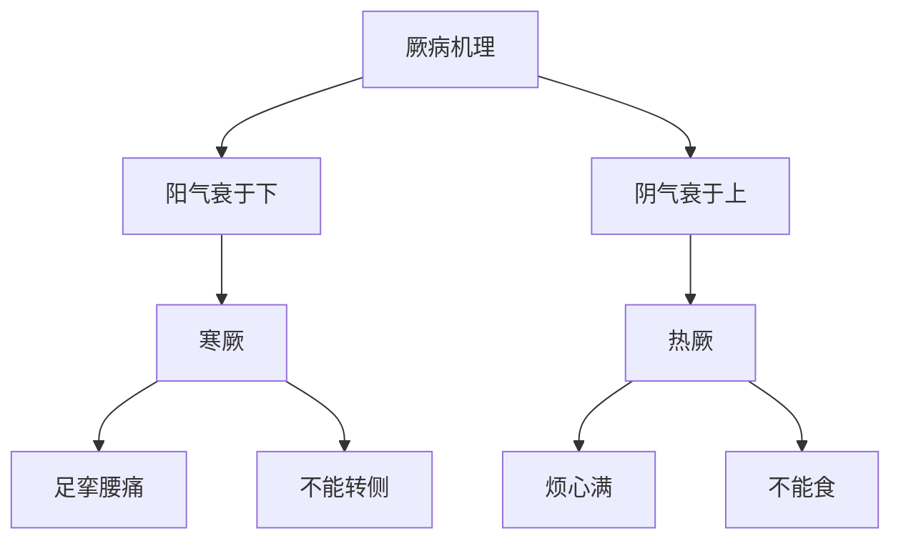

# 素问-厥论篇第四十五

> "黄帝问曰：厥之状何如？岐伯曰：阳气衰于下，则为寒厥；阴气衰于上，则为热厥。" - 岐伯

---

## 📜 原文（节选）/ Original Text (Excerpt)

黄帝问曰：厥之状何如？

岐伯曰：阳气衰于下，则为寒厥；阴气衰于上，则为热厥。

帝曰：愿闻其状。

岐伯曰：阳气衰于下，则为寒厥；阴气衰于上，则为热厥。阳气衰于下，则为寒厥，足挛腰痛，不能转侧，阴气盛于上，则为热厥，烦心满，不能食，足挛腰痛，不能转侧。

帝曰：治之奈何？

岐伯曰：寒厥者，温阳散寒；热厥者，清热养阴。

　　黄帝问曰：厥之寒热者何也？

　　岐伯对曰：阳气衰于下，则为寒厥；阴气衰于下，则为热厥。

　　帝曰：热厥之为热也，必起于足下者何也？

　　岐伯曰：阳气起于足五指之表，阴脉者集于足下，而聚于足心，故阳气盛则足下热也。

　　帝曰：寒厥之为寒也，必从五指而上于膝者何也？

　　岐伯曰：阴气起于五指之里，集于膝下而聚于膝上，故阴气盛，则从五指至膝上寒，其寒也，不从外，皆从内也。

　　帝曰：寒厥何失而然也？

　　岐伯曰：前阴者，宗筋之所聚，太阴阳明之所合也。春夏则阳气多而阴气少，秋冬则阴气盛而阳气衰。此人者质壮，以秋冬夺于所用，下气上争不能复，精气溢下，邪气因从之而上也；气因于中，阳气衰，不能渗营其经络，阳气日损，阴气独在，故手足为之寒也。

　　帝曰：热厥何如而然也？

　　岐伯曰：酒入于胃，则络脉满而经脉虚；脾主为胃行其津液者也，阴气虚则阳气入，阳气入则胃不和，胃不和则精气竭，精气竭则不营其四支也。此人必数醉若饱以入房，气聚于脾中不得散，酒气与谷气相薄，热盛于中，故热偏于身内热而溺赤也。夫酒气盛而慓悍，肾气有衰，阳气独盛，故手足为之热也。

　　帝曰：厥或令人腹满，或令人暴不知人，或至半日远至一日乃知人者何也？

　　岐伯曰：阴气盛于上则下虚，下虚则腹胀满；阳气盛于上，则下气重上，而邪气逆，逆则阳气乱，阳气乱则不知人也。

　　帝曰：善。愿闻六经脉之厥状病能也。

　　岐伯曰：巨阳之厥，则肿首头重，足不能行，发为眴[xuàn] 仆；阳明之厥，则癫疾欲走呼，腹满不得卧，面赤而热，妄见而妄言；少阳之厥，则暴聋颊肿而热，胁痛，䯒[héng]不可以运；太阴之厥，则腹满䐜[chēn]胀，后不利，不欲食，食则呕，不得卧；少阴之厥，则口干溺赤，腹满心痛；厥阴之厥，则少腹肿痛，腹胀，泾溲不利，好卧屈膝，阴缩肿，䯒[héng]内热。盛则泻之，虚则补之，不盛不虚，以经取之。

　　太阴厥逆，䯒[héng]急挛，心痛引腹，治主病者；少阴厥逆，虚满呕变，下泄清，治主病者；厥阴厥逆，挛、腰痛，虚满前闭，谵言，治主病者；三阴俱逆，不得前后，使人手足寒，三日死。太阳厥逆，僵仆，呕血善衄，治主病者；少阳厥逆，机关不利，机关不利者，腰不可以行，项不可以顾，发肠痈不可治，惊者死；阳明厥逆，喘咳身热，善惊，衄，呕血。

　　手太阴厥逆，虚满而咳，善呕沫，治主病者；手心主、少阴厥逆，心痛引喉，身热死，不可治。手太阳厥逆，耳聋泣出，项不可以顾，腰不可以俛仰，治主病者；手阳明、少阳厥逆，发喉痹、嗌肿，治主病者。

---

## 📖 白话文翻译（节选）/ Modern Chinese Translation (Excerpt)

黄帝问道：厥的状况如何？

岐伯回答说：阳气衰于下，就成为寒厥；阴气衰于上，就成为热厥。

黄帝说：我希望听到它的状况。

岐伯说：阳气衰于下，就成为寒厥；阴气衰于上，就成为热厥。阳气衰于下，就成为寒厥，足部拘挛腰部疼痛，不能转侧，阴气旺盛于上，就成为热厥，烦闷胀满，不能进食，足部拘挛腰部疼痛，不能转侧。

黄帝说：治疗它如何？

岐伯说：寒厥，温阳散寒；热厥，清热养阴。

　　黄帝问道：厥证有寒有热，是怎样形成的？

　　岐伯答道：阳气衰竭于下，发为寒厥；阴气衰竭于下，发为热厥。

　　黄帝问道：热厥证的发热，一般从足底开始，这是什么道理？

　　岐伯答道：阳经之气循行于足五趾的外侧端，汇集于足底而聚汇到足心，所以若阴经之气衰竭于下而阳经之气偏胜，就会导致足底发热。

　　黄帝问道：寒厥证的厥冷，一般从足五趾渐至膝部，这是什么道理？

　　岐伯答道：阴经之气起于足五趾的内侧端，汇集于膝下后，上聚于膝部。所以若阳经之气衰竭于下而阴经之气偏胜，就会导致从足五趾至膝部的厥冷，这种厥冷，不是由于外寒的侵入，而是由于内里的阳虚所致。

　　黄帝问道：寒厥是损耗了何种精气而形成的？

　　岐伯说：前阴是许多经脉聚汇之处，也是足太阴和足阳明经脉汇合之处。一般来说，人体在春夏季节是阳气偏多而阴气偏少，秋冬季节是阴气偏盛而阳气偏衰。有些人自恃体质强壮，在秋冬阳气偏衰的季节纵欲、过劳，使肾中精气耗损，精气亏虚于下而与上焦之气相争，虽争亦不能迅速恢复，精气不断溢泄于下，元阳亦随之而虚，阳虚生内寒，阴寒之邪随从上争之气而上逆，便为寒厥。邪气停聚于中焦，是胃气虚衰，不能化生水谷营养经络，以致阳气日益亏损，阴寒之气肚胜于内，所以手足厥冷。

　　黄帝问道：热厥是怎样形成的？

　　岐伯答道：酒入于胃，由于酒性剽悍径行皮肤络脉，所以使络脉中血液充满，而经脉反显得空虚。脾的功能是主管输送胃中的津液营养，若饮酒过度，脾无所输送则阴经亏虚；阴津亏虚则剽悍的酒热之气乘虚入扰于内，导致胃气不和；胃气不和则阴精化生无源而枯竭；阴精枯竭就不能营养四肢。这种人必然是经常酒醉或饱食太过之后行房纵欲，致使酒食之气郁居于脾中不得宣散，酒气与谷气相搏结，酝酿成热，热盛于中焦，进而波及周身，因有内热而小便色赤。酒性是剽悍浓烈的，肾的精气必受其损伤而日益虚衰，阴虚阳胜，形成阳气独盛于内的局面，所以手足发热。

　　黄帝问道：厥证有的使人腹部胀满，有的使人猝然不知人事，或者半天，甚至长达一天时间才能苏醒，这是什么道理？

　　岐伯答道：下部之气充盛于上，下部就空虚，下部气虚则水谷不化而引起腹部胀满；阳气偏盛于上，若下部之气又并聚于上，则气机失常而逆乱，气机逆乱则扰乱阳气，阳气逆乱就不省人事了。

　　黄帝道：对！希望听听六经厥证的病态表现。

　　岐伯说：太阳经厥证，上为头肿发重，下为足不能行走，发作时眼花跌倒。阳明经厥证状，可出现疯癫样表现，奔跑呼叫，腹部胀满不得安卧，面部赤热，神志模糊，出现幻觉，胡言乱语。少阳经厥证，可见到突然性耳聋，面颊肿而发热，两胁疼痛，小腿不能运动。太阴经厥证，可见到腹部胀满，大便不爽，不思饮食，食则呕吐，不能安卧。少阴经厥证，可出现口干，小便色赤，腹胀满，心痛。厥阴经厥证，可见到少腹肿痛，腹胀满，大小便不利，喜欢采取屈膝的体位睡卧，前阴萎缩而肿，小腿内侧发热。厥证的治则是：实证用泻法，虚症用补法，本经自生病，不是受他经虚实证影响的，从本经取穴治疗。

　　足太阴经的经气厥逆，小腿拘集痉挛，心痛牵引腹部，当取主病的本经腧穴治疗。若足三阴经都发生厥逆，身体僵直跌倒，呕血，容易鼻出血，当取主病的本经腧穴治疗。足少阳经的经气厥逆，关节活动不灵，关节不利则腰部不能活动，颈项不能回顾，如果伴发肠痈，就为不可治的危证，如若发惊，就会死亡。足扬名经的经气厥逆，喘促咳嗽，身发热，容易惊骇，鼻出血，呕血。手太阴经的经气厥逆，胸中虚满而咳嗽，常常呕吐涎沫，当取本经主病的腧穴治疗。手厥阴和手少阴经的经气厥逆，心痛连及咽喉，身体发热，是不可治的死症。手太阳经的经气厥逆，耳聋流泪，颈项不能回顾，腰不能前后俯仰，当取主病的本经腧穴治疗。手阳明经和手少阳经的经气厥逆，发为喉部痹塞，咽部肿痛，颈项强直，当取主病的本经腧穴治疗。

---

## 🔑 核心要点 / Core Concepts

### 1. 厥病类型 / Jue Disease Types

| 类型 | 机理 | 症状 |
|------|------|------|
| 寒厥 | 阳气衰于下 | 足挛腰痛，不能转侧 |
| 热厥 | 阴气衰于上 | 烦心满，不能食 |

### 2. 寒热厥表现 / Cold Heat Jue Manifestations

| 厥型 | 机理 | 表现 |
|------|------|------|
| 寒厥 | 阳气衰于下 | 足挛腰痛，不能转侧 |
| 热厥 | 阴气衰于上 | 烦心满，不能食 |

### 3. 厥病机理 / Jue Disease Mechanism

---

## 📚 理论解释 / Theoretical Analysis

### 厥病理论 / Jue Disease Theory

> [!info] 核心概念
- 阳气衰于下，则为寒厥
- 阴气衰于上，则为热厥
- 厥病有寒热之分

#### 厥病详解 / Detailed Jue Disease

**1. 寒厥 / Cold Jue**
- 机理：阳气衰于下
- 症状：足挛腰痛，不能转侧
- 病机：阳气不足，下焦虚寒

**2. 热厥 / Heat Jue**
- 机理：阴气衰于上
- 症状：烦心满，不能食
- 病机：阴气不足，上焦虚热

**3. 厥病特点 / Jue Disease Characteristics**
- 寒热之分：有寒厥、热厥之分
- 阴阳失调：阴气阳气失调
- 气机紊乱：气机紊乱

### 寒热厥理论 / Cold Heat Jue Theory

> [!warning] 核心理念
- 寒厥温阳散寒
- 热厥清热养阴
- 调和阴阳为要

#### 寒热厥详解 / Detailed Cold Heat Jue

**1. 寒厥机理 / Cold Jue Mechanism**
- 阳气衰于下：阳气衰于下
- 病机：阳气不足
- 表现：足挛腰痛，不能转侧

**2. 热厥机理 / Heat Jue Mechanism**
- 阴气衰于上：阴气衰于上
- 病机：阴气不足
- 表现：烦心满，不能食

**3. 治疗原则 / Treatment Principle**
- 寒厥：温阳散寒
- 热厥：清热养阴
- 调和阴阳：调和阴阳

---

## 🏥 中医实践应用 / TCM Practice Application

### 厥病治疗 / Jue Disease Treatment

#### 现代厥病治疗要点 / Modern Jue Disease Treatment Key Points

**1. 寒厥治疗 / Cold Jue Treatment**
- 症状：足挛腰痛，不能转侧
- 治法：温阳散寒
- 药物：四逆汤、当归四逆汤
- 针刺：针刺肾俞、命门、关元穴

**2. 热厥治疗 / Heat Jue Treatment**
- 症状：烦心满，不能食
- 治法：清热养阴
- 药物：黄连阿胶汤、生脉散
- 针刺：针刺心俞、膻中、内关穴

**3. 阴阳调和治疗 / Yin Yang Harmony Treatment**
- 症状：阴气阳气失调
- 治法：调和阴阳
- 药物：右归丸、金匮肾气丸
- 针刺：针刺百会、大椎、命门穴

---

## 🔗 相关链接 / Related Links

- [[MOC-黄帝内经知识库]] - 主索引
- [[黄帝内经-素问索引]] - 素问索引
- [[黄帝内经-核心理论]] - 核心理论体系
- [[素问44-痿论篇]] - 痿论
- [[素问37-气厥论篇]] - 气厥

### 易学关联 / Yi Jing Connection

- [[MOC-易经知识库]] - 易经索引
- [[20260201-0005 五行]] - 五行理论

**易学与厥论的联系:**
- 五行理论：易学的五行理论与中医寒热厥相通
- 阴阳理论：易学的阴阳理论与中医厥病相通

---

## 💡 学习要点 / Learning Points

### 掌握重点 / Key Points to Master

- [ ] 理解厥病的类型
- [ ] 掌握寒热厥的判断
- [ ] 学会厥病的治疗方法
- [ ] 了解阴气阳气失调的理论

### 思考问题 / Questions for Reflection

1. **为什么说"阳气衰于下，则为寒厥"？**
   - 阳气衰：阳气衰退
   - 衰于下：衰退于下焦
   - 寒厥：寒气上逆

2. **现代医学如何应用"厥论"？**
   - 厥病治疗：厥病治疗方法
   - 阴阳平衡：阴阳平衡调节
   - 综合治疗：综合治疗方案

---

## 📊 学习进度 / Learning Progress

### 完成情况 / Completion Status

| 学习内容 | 状态 | 备注 |
|---------|------|------|
| 原文诵读 | 📝 进行中 | 建议每日诵读 |
| 白话文理解 | ✅ 已完成 | 理解主要含义 |
| 厥病理论 | ✅ 已完成 | 掌握概念 |
| 厥病治疗 | 📝 进行中 | 需要临床实践 |
| 理论分析 | ✅ 已完成 | 理解理论 |

---

## 🔄 更新日志 / Update Log

### 2026-02-03

- ✅ 创建厥论篇第四十五笔记
- ✅ 完成原文、白话文翻译（节选）
- ✅ 整理厥病类型对照表
- ✅ 编写厥病和寒热厥理论

---

**笔记创建日期**：2026年2月3日

**最后更新**：2026年2月3日
