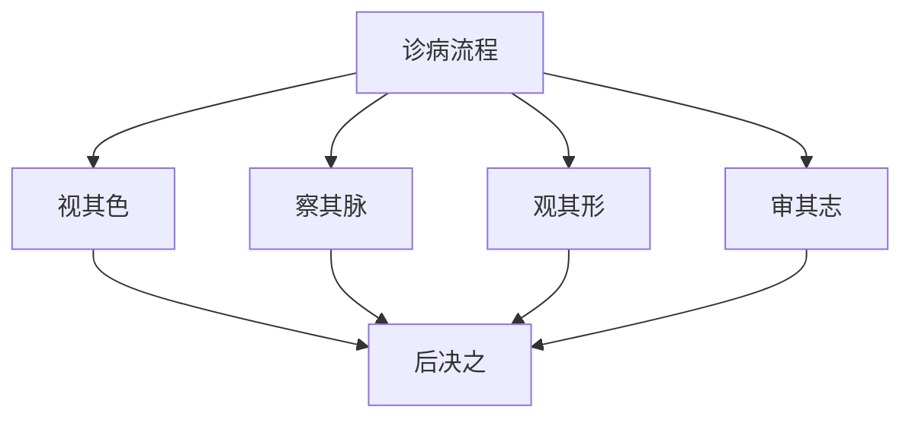

# 素问-病能论篇第四十六

> "黄帝问曰：诊病何如？岐伯曰：诊病者，必先视其色，察其脉，观其形，审其志，而后决之。" - 岐伯

---

## 📜 原文（节选）/ Original Text (Excerpt)

黄帝问曰：诊病何如？

岐伯曰：诊病者，必先视其色，察其脉，观其形，审其志，而后决之。

帝曰：其状何如？

岐伯曰：其状何如？色赤如赭，脉大如钩，形气有余，志意不乱，病在心，名曰心痹。

色白如枯骨，脉涩如毛，形气不足，志意不乱，病在肺，名曰肺痹。

色青如草兹，脉小如弦，形气不足，志意不乱，病在肝，名曰肝痹。

色黄如枳实，脉代如钩，形气不足，志意不乱，病在脾，名曰脾痹。

色黑如炱，脉坚如石，形气不足，志意不乱，病在肾，名曰肾痹。

　　黄帝问曰：人病胃脘痈者，诊当何如？

　　岐伯对曰：诊此者当候胃脉，其脉当沉细，沉细者气逆，逆者人迎甚盛，甚盛则热；人迎者胃脉也，逆而盛，则热聚于胃口而不行，故胃脘为痈也。

　　帝曰：善。人有卧而有所不安者何也？

　　岐伯曰：藏有所伤，及精有所之寄则安，故人不能悬其病也。

　　帝曰：人之不得偃卧者何也？

　　岐伯曰：肺者藏之盖也，肺气盛则脉大，脉大则不得偃卧，论在《奇恒阴阳》中。

　　帝曰：有病厥者，诊右脉沉而紧，左脉浮而迟，不然病主安在？

　　岐伯曰：冬诊之，右脉固当沉紧，此应四时，左脉浮而迟，此逆四时，在左当主病在肾，颇关在肺，当腰痛也。

　　帝曰：何以言之？

　　岐伯曰：少阴脉贯肾络肺，今得肺脉，肾为之病，故肾为腰痛之病也。

　　帝曰：善。有病颈痈者，或石治之，或针灸治之，而皆已，其真安在？

　　岐伯曰：此同名异等者也。夫痈气之息者，宜以针开除去之；夫气盛血聚者，宜石而泻之。此所谓同病异治也。

　　帝曰：有病怒狂者，此病安生？

　　岐伯曰：生于阳也。

　　帝曰：阳何以使人狂？

　　岐伯曰：阳气者，因暴折而难决，故善怒也，病名曰阳厥。

　　帝曰：何以知之？

　　岐伯曰：阳明者常动，巨阳少阳不动，不动而动大疾，此其候也。

　　帝曰：治之奈何？

　　岐伯曰：夺其食即已。夫食入于阴，长气于阳，故夺其食即已。使之服以生铁洛为饮，夫生铁洛者，下气疾也。

　　帝曰：善。有病身热解墯，汗出如浴，恶风少气，此为何病？

　　岐伯曰：病名曰酒风。

　　帝曰：治之奈何？

　　岐伯曰：以泽泻，术各十分，麋衔五分，合，以三指撮，为后饭。

　　所谓深之细者，其中手如针也，摩之切之，聚者坚也，博者大也。《上经》者，言气之通天也；《下经》者，言病之变化也；《金匮》者，决死生也；《揆度》者，切度之也；《奇恒》者，言奇病也。所谓奇者，使奇病不得以四时死也；恒者，得以四时死也。所谓揆者，方切求之也，言切求其脉理也；度者，得其病处，以四时度之也。

---

## 📖 白话文翻译（节选）/ Modern Chinese Translation (Excerpt)

黄帝问道：诊察疾病如何？

岐伯回答说：诊察疾病，必须先观察它的气色，察看它的脉象，观察它的形体，审察它的志意，然后决断它。

黄帝说：它的状况如何？

岐伯说：它的状况如何？气色红如赭石，脉象大如钩，形体气机有余，志意不紊乱，疾病在心，名叫心痹。

气色白如枯骨，脉象涩滞如毛，形体气机不足，志意不紊乱，疾病在肺，名叫肺痹。

气色青如枯草，脉象小如弦，形体气机不足，志意不紊乱，疾病在肝，名叫肝痹。

气色黄如枳实，脉象代止如钩，形体气机不足，志意不紊乱，疾病在脾，名叫脾痹。

气色黑如烟灰，脉象坚硬如石，形体气机不足，志意不紊乱，疾病在肾，名叫肾痹。

　　黄帝问道：有患胃脘痈病的，应当如何诊断呢？

　　岐伯回答说：诊断这种病，应当先诊其胃脉，他的脉搏必然沉细，沉细主胃气上逆，上逆则人迎脉过盛，过盛则有热。人迎属于胃脉，胃气逆则跳动过盛，说明热气聚集于胃口而不得散发，所以胃脘发生痈肿。

　　黄帝说：好。有人睡卧不能安宁的，是什么原因呢？  
岐伯说：五脏有所伤及，要等到损伤恢复，精神有所寄托，睡卧才能安宁，所以一般人不能测知他是什么病。

　　黄帝说：人不能仰卧的是什么原因呢？

　　岐伯说：肺居胸上，为五藏六府的华盖，如果肺脏为邪气所犯，邪气盛与内则肺的脉络胀大，肺气不利，呼吸急促，故不能仰卧。在《奇恒阴阳》中有这方面的论述。

　　黄帝说：有患厥病的，诊得右脉沉而紧，左脉浮而迟，不知主病在何处？

　　岐伯说：因为是[冬天](https://www.guoxuemeng.com/gushici/dongtiandegushi/)诊察其脉象，右脉本来应当沉紧，这是和四时相应的正常脉象，左脉浮迟，则是逆四时的反常脉象，所以与肺脏关联。腰为肾之府，故当有腰痛的症状。

　　黄帝说：为什么这样说呢？

　　岐伯说：少阴的经脉贯肾络于肺，现于冬季肾脉部位诊得了浮迟的肺脉，是肾气不足的表现，虽与肺有关，但主要是肾病，故肾病当主为腰痛。

　　黄帝说：好。有患颈痈病的，或用砭石治疗，或用针灸治疗，都能治好，其治愈的道理何在？

　　岐伯说：这是因为病名虽同而程度有所不同的缘故。颈痈属于气滞不行的，宜用针刺开导以除去其病，若是气盛壅滞而血液结聚的，宜用砭石以泻其淤血，这就是所谓同病异治。

　　黄帝说：有患怒狂病的，这种病是怎样发生的呢？

　　岐伯说：由于阳气而生。

　　黄帝说：阳气怎么能使人发狂呢？

　　岐伯说：阳气因为受到突然强烈的刺激，郁而不畅，气厥而上逆，因而使人善怒发狂，由于此病为阳气厥逆所生，故名“阳厥”。

　　黄帝说：怎样知道是阳气受病呢？

　　岐伯说：在正常的情况下，足阳明经脉是常动不休的，太阳、少阳有病脉是不甚搏动的，现在不甚搏动的太阳、少阳经脉也搏动的大而急疾，这就是病生于阳气的征象。

　　黄帝说：如何治疗呢？

　　岐伯说：病人禁止饮食就可以好了。因为饮食经过脾的运化，能够助长阳气，所以禁止病人的饮食，使过盛的阳气得以衰少，病就可以痊愈。同时，再给以生铁洛煎水服之，因为生铁洛有降气开结的作用。

　　黄帝说：好。有患全身发热，腰体懈怠无力，汗出多得象洗澡一样，怕风，呼吸短而不畅，这是什么病呢？

　　岐伯说：病名叫酒风。

　　黄帝说：如何治疗呢？

　　岐伯说：用泽泻和白术各十分，麋衔五分，合沿为末，每次服三指撮，在饭前服下。所谓深按而得细脉的，其脉在指下细小如针，必须仔细地按摩切循，凡脉气聚而不散的是坚脉；搏击手指下的是大脉。《上经》是论述人体功能与自然界相互关系的；《下经》是论述疾病变化的；《金匮》是论述疾病诊断决定死生的；《揆度》是论述脉搏以诊断疾病的；《奇恒》是论述特殊疾病的。所谓奇病，就是不受四时季节的影响而死亡的疾病。所谓恒病，就是随着四时气候的变化死亡的疾病。所谓揆，是说切按脉搏，以推求疾病的所在及其病理；所谓度，是从切脉得其病处，并结合四时气候的变化进行判断，以知道疾病的轻重宜忌。

---

## 🔑 核心要点 / Core Concepts

### 1. 诊病四要 / Four Essentials of Diagnosis

| 要点 | 内容 |
|------|------|
| 视其色 | 先观察气色 |
| 察其脉 | 察看脉象 |
| 观其形 | 观察形体 |
| 审其志 | 审察志意 |

### 2. 五脏痹表现 / Five Zang Bi Manifestations

| 脏 | 气色 | 脉象 | 形气 | 志意 | 病名 |
|------|------|------|------|------|------|
| 心 | 赤如赭 | 大如钩 | 有余 | 不乱 | 心痹 |
| 肺 | 白如枯骨 | 涩如毛 | 不足 | 不乱 | 肺痹 |
| 肝 | 青如草兹 | 小如弦 | 不足 | 不乱 | 肝痹 |
| 脾 | 黄如枳实 | 代如钩 | 不足 | 不乱 | 脾痹 |
| 肾 | 黑如炱 | 坚如石 | 不足 | 不乱 | 肾痹 |

### 3. 诊病流程 / Diagnosis Process

---

## 📚 理论解释 / Theoretical Analysis

### 诊病理论 / Diagnosis Theory

> [!info] 核心概念
- 诊病四要：视色、察脉、观形、审志
- 四诊合参：四诊合参
- 后决之：然后决断疾病

#### 诊病详解 / Detailed Diagnosis

**1. 视其色 / Observe Its Color**
- 观察气色：观察气色
- 气色判断：气色判断疾病
- 五色生死：五色生死判断

**2. 察其脉 / Observe Its Pulse**
- 察看脉象：察看脉象
- 脉象判断：脉象判断疾病
- 脉象生死：脉象生死判断

**3. 观其形 / Observe Its Form**
- 观察形体：观察形体
- 形体判断：形体判断疾病
- 气有余不足：气机有余不足

**4. 审其志 / Examine Its Will**
- 审察志意：审察志意
- 志意判断：志意判断疾病
- 志意不乱：志意不紊乱

### 五脏痹理论 / Five Zang Bi Theory

> [!warning] 核心理念
- 五脏痹，各有所主
- 气色、脉象、形体、志意合参
- 诊断五脏痹

#### 五脏痹详解 / Detailed Five Zang Bi

**1. 心痹 / Heart Bi**
- 气色：赤如赭
- 脉象：大如钩
- 形体气机：有余
- 志意：不乱
- 病名：心痹

**2. 肺痹 / Lung Bi**
- 气色：白如枯骨
- 脉象：涩如毛
- 形体气机：不足
- 志意：不乱
- 病名：肺痹

**3. 肝痹 / Liver Bi**
- 气色：青如草兹
- 脉象：小如弦
- 形体气机：不足
- 志意：不乱
- 病名：肝痹

**4. 脾痹 / Spleen Bi**
- 气色：黄如枳实
- 脉象：代如钩
- 形体气机：不足
- 志意：不乱
- 病名：脾痹

**5. 肾痹 / Kidney Bi**
- 气色：黑如炱
- 脉象：坚如石
- 形体气机：不足
- 志意：不乱
- 病名：肾痹

---

## 🏥 中医实践应用 / TCM Practice Application

### 诊病治疗 / Diagnosis Treatment

#### 现代诊病治疗要点 / Modern Diagnosis Treatment Key Points

**1. 心痹治疗 / Heart Bi Treatment**
- 症状：气色赤如赭，脉大如钩，形体气机有余
- 治法：清心泻火
- 药物：导赤散、朱砂安神丸
- 针刺：针刺心俞、内关、神门穴

**2. 肺痹治疗 / Lung Bi Treatment**
- 症状：气色白如枯骨，脉涩如毛，形体气机不足
- 治法：补肺益气
- 药物：补肺汤、生脉散
- 针刺：针刺肺俞、太渊、膏肓穴

**3. 肝痹治疗 / Liver Bi Treatment**
- 症状：气色青如草兹，脉小如弦，形体气机不足
- 治法：疏肝解郁
- 药物：柴胡疏肝散、逍遥散
- 针刺：针刺肝俞、太冲、期门穴

**4. 脾痹治疗 / Spleen Bi Treatment**
- 症状：气色黄如枳实，脉代如钩，形体气机不足
- 治法：健脾益气
- 药物：参苓白术散、六君子汤
- 针刺：针刺脾俞、胃俞、三阴交穴

**5. 肾痹治疗 / Kidney Bi Treatment**
- 症状：气色黑如炱，脉坚如石，形体气机不足
- 治法：补肾填精
- 药物：左归丸、金匮肾气丸
- 针刺：针刺肾俞、命门、太溪穴

---

## 🔗 相关链接 / Related Links

- [[MOC-黄帝内经知识库]] - 主索引
- [[黄帝内经-素问索引]] - 素问索引
- [[黄帝内经-核心理论]] - 核心理论体系
- [[素问41-刺腰痛篇]] - 刺腰痛
- [[素问48-大奇论篇]] - 大奇论

### 易学关联 / Yi Jing Connection

- [[MOC-易经知识库]] - 易经索引
- [[20260201-0005 五行]] - 五行理论

**易学与病能论的联系:**
- 五行理论：易学的五行理论与中医五脏痹相通
- 阴阳理论：易学的阴阳理论与中医气口脉相通

---

## 💡 学习要点 / Learning Points

### 掌握重点 / Key Points to Master

- [ ] 理解诊病四要的方法
- [ ] 掌握五脏痹的判断
- [ ] 学会五脏痹的治疗方法
- [ ] 了解四诊合参的理论

### 思考问题 / Questions for Reflection

1. **为什么说"必先视其色，察其脉，观其形，审其志"？**
   - 四诊合参：四诊合参
   - 全面诊断：全面诊断疾病
   - 准确判断：准确判断疾病

2. **现代医学如何应用"病能论"？**
   - 四诊合参：四诊合参方法
   - 望闻问切：望闻问切方法
   - 综合诊断：综合诊断疾病

---

## 📊 学习进度 / Learning Progress

### 完成情况 / Completion Status

| 学习内容 | 状态 | 备注 |
|---------|------|------|
| 原文诵读 | 📝 进行中 | 建议每日诵读 |
| 白话文理解 | ✅ 已完成 | 理解主要含义 |
| 诊病四要 | ✅ 已完成 | 掌握方法 |
| 五脏痹治疗 | 📝 进行中 | 需要临床实践 |
| 理论分析 | ✅ 已完成 | 理解理论 |

---

## 🔄 更新日志 / Update Log

### 2026-02-03

- ✅ 创建病能论篇第四十六笔记
- ✅ 完成原文、白话文翻译（节选）
- ✅ 整理五脏痹表现对照表
- ✅ 编写诊病四要和五脏痹理论

---

**笔记创建日期**：2026年2月3日

**最后更新**：2026年2月3日
