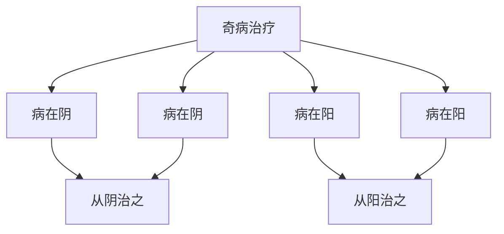

# 素问-奇病论篇第四十七

> "黄帝问曰：人身有奇病，何也？岐伯曰：奇病者，非常之病也。" - 岐伯

---

## 📜 原文（节选）/ Original Text (Excerpt)

黄帝问曰：人身有奇病，何也？

岐伯曰：奇病者，非常之病也。

帝曰：愿闻其状。

岐伯曰：奇病者，非常之病也。其状也，病在阴，则寒热；病在阳，则寒热；病在阴，则寒热；病在阳，则寒热；病在阴，则寒热；病在阳，则寒热。

帝曰：治之奈何？

岐伯曰：治之奈何？病在阴，则从阴治之；病在阳，则从阳治之；病在阴，则从阴治之；病在阳，则从阳治之。

　　黄帝问曰：人有重身，九月而瘖，此为何也？

　　岐伯对曰：胞之络脉绝也。

　　帝曰：何以言之？

　　岐伯曰：胞络者系于肾，少阴之脉，贯肾系舌本，故不能言。

　　帝曰：治之奈何？

　　岐伯曰：无治也，当十月复。《刺法》曰：无损不足，益有余，以成其疹，然后调之。所谓无损不足者，身羸瘦，无用镵石也；无益其有余者，腹中有形而泄之，泄之则精出而病独擅中，故曰疹成也。

　　帝曰：病胁下满气逆，二三岁不已，是为何病？

　　岐伯曰：病名曰息积，此不妨于食，不可灸刺，积为导引服药，药不能独治也。

　　帝曰：人有身体髀股䯒[héng]皆肿，环齐而痛，是为何病？

　　岐伯曰：病名曰伏梁。此风根也，其气溢于大肠，而着于肓，肓之原在齐下，故环齐而痛也。不可动之，动之为水溺濇之病也。

　　帝曰：人有尺脉数甚，筋急而见，此为何病？

　　岐伯曰：此所谓疹筋，是人腹必急，白色黑色见，则病甚。

　　帝曰：人有病头痛以数岁不已，此安得之？名为何病？

　　岐伯曰：当有所犯[大寒](https://www.guoxuemeng.com/ershisijieqi/dahan/)，内至骨髓，髓者以脑为主，脑逆故令头痛，齿亦痛，病名曰厥逆。

　　帝曰：善。

　　帝曰：有病口甘者，病名为何？何以得之？

　　岐伯曰：此五气之溢也，名曰脾瘅。夫五味入口，藏于胃，脾为之行其精气，津液在脾，故令人口甘也；此肥美之所发也，此人必数食甘美而多肥也，肥者令人内热，甘者令人中满，故其气上溢，转为消渴。治之以兰，除陈气也。

　　帝曰：有病口苦，取阳陵泉，口苦者病名为何？何以得之？

　　岐伯曰：病名曰胆瘅。夫肝者中之将也，取决于胆，咽为之使。此人者，数谋虑不决，故胆虚气上溢，而口为之苦。治之以胆募俞，治在《阴阳十二官相使》中。

　　帝曰：有癃者，一日数十溲，此不足也。身热如炭，颈膺如格，人迎躁盛，喘息气逆，此有余也。太阴脉微细如发者，此不足也。其病安在？名为何病？

　　岐伯曰：病在太阴，其盛在胃，颇在肺，病名曰厥，死不治。此所谓得五有余二不足也。

　　帝曰：何谓五有余二不足？

　　岐伯曰：所谓五有余者，五病之气有余也；二不足者，亦病气之不足也。今外得五有余，内得二不足，此其身不表不里，亦正死明矣。

　　帝曰：人生而有病巅疾者，病名曰何？安所得之？

　　岐伯曰：病名为胎病。此得之在母腹中时，其母有所大惊，气上而不下，精气并居，故令子发为巅疾也。

　　帝曰：有病痝[máng]然如有水状，切其脉大紧，身无痛者，形不瘦，不能食，食少，名为何病？

　　岐伯曰：病生在肾，名为肾风。肾风而不能食，善惊，惊已，心气痿者死。

　　帝曰：善。

---

## 📖 白话文翻译（节选）/ Modern Chinese Translation (Excerpt)

黄帝问道：人身有奇病，为什么？

岐伯回答说：奇病，是非常的疾病。

黄帝说：我希望听到它的状况。

岐伯说：奇病，是非常的疾病。它的状况，疾病在阴，就寒热；疾病在阳，就寒热；疾病在阴，就寒热；疾病在阳，就寒热；疾病在阴，就寒热；疾病在阳，就寒热。

黄帝说：治疗它如何？

岐伯说：治疗它如何？疾病在阴，就从阴治疗它；疾病在阳，就从阳治疗它；疾病在阴，就从阴治疗它；疾病在阳，就从阳治疗它。

　　黄帝问道：有的妇女怀孕九个月，而不能说话的，这是什么缘故呢？

　　岐伯回答说：这是因为胞中的络脉被胎儿压迫，阻绝不通所致。

　　黄帝说：为什么这样说呢？

　　岐伯说：宫的络脉系于肾脏，而足少阴肾脉贯肾上系于舌本，今胞宫的络脉受阻，肾脉亦不能上通于舌，舌本失养，故不能言语。

　　黄帝说：如何治疗呢？

　　岐伯说：不需要治疗，待至十月分娩之后，胞络通，声音就会自然恢复。《刺法》上说：正气不足的不可用泻法，邪气有余的不可用补法，以免因误治而造成疾病。所谓“无损不足”，就是怀孕九月而身体瘦弱的，不可再用针石治疗以伤其正气。所谓“无益有余”，就是说腹中已经怀孕而又妄用泻法，用泻法则精气耗伤，使病邪独据于中，正虚邪实，所以说疾病形成了。

　　黄帝说：有病胁下胀满，气逆喘促，二三年不好的，是什么疾病呢？

　　岐伯说：病名叫息积，这种病在胁下而不在胃，所以不妨碍饮食，治疗时切不可用艾灸和针刺，必须逐渐地用导引法疏通气血，并结合药物慢慢调治，若单靠药物也是不能治愈的。

　　黄帝说：人有身体髀部、大腿、小腿都肿胀，并且环绕肚脐周围疼痛，这是什么疾病呢？

　　岐伯说：病名叫伏梁，这是由于风邪久留于体内所致。邪气流溢于大肠，而流着于肓膜，因为肓膜的起源在肚脐下部，所以环绕脐部作痛。这种病不可用按摩方法治疗，否则就会造成小便涩滞不利的疾病。

　　黄帝说：人有尺部脉搏跳动数疾，筋脉拘急外现的，这是什么病呢？

　　岐伯说：这就是所谓诊筋病，此人腹部必然拘急，如果面部见到或白或黑的颜色，病情则更加严重。

　　黄帝说：有人患头痛已经多年不愈这是怎么得的？叫做什么病呢？

　　岐伯说：此人当受过严重的寒邪侵犯，寒气向内侵入骨髓，脑为髓海，寒气由骨髓上逆于脑，所以使人头痛，齿为骨之余，故牙齿也痛，病由寒邪上逆所致，所以病名叫做“厥逆”。

　　黄帝说：好。

　　黄帝说：有患口中发甜的，病名叫什么？是怎样得的呢？

　　岐伯说：这是由于五味的经气向上泛溢所致，病名叫脾瘅。五味入于口，藏于胃，其精气上输于脾，脾为胃输送食物的精华，因病津液停留在脾，致使脾气向上泛溢，就会使人口中发甜，这是由于肥甘美味所引起的疾病。患这种病的人，必然经常吃甘美而肥腻的食物，肥腻能使人生内热，甘味能使人中满，所以脾运失常，脾热上溢，就会转成消渴病。本病可用兰草治疗，以排除蓄积郁热之气。

　　黄帝说：有病口中发苦的，应取足少阳胆经的阳陵泉治疗仍然不愈，这是什么病？是怎样得的呢？

　　岐伯说：病名叫胆瘅。肝为将军之官，主谋虑，胆为中正之官，主决断，诸谋虑取决于胆，咽部为之外使。患者因屡次谋略而不能决断，情绪苦闷，遂使胆失却正常的功能，胆汁循经上泛，所以口中发苦。治疗时应取胆募日月穴和背部的胆俞穴，这种治法。记载于《阴阳十二官相使》中。

　　黄帝说：有患癃病，一天要解数十次小便，这是正气不足的现象。同时又有身热如炭火，咽喉与胸膺之间有格塞不通的感觉，人迎脉躁动急数，呼吸喘促，肺气上逆，这又是邪气有余的现象。寸口脉微细如头发，这也是正气不足的表现。这种病的原因究竟在哪里？叫做什么病呢？

　　岐伯说：此病是太阴脾脏不足，热邪炽盛在胃，症状却偏重在肺，病的名字叫做厥，属于不能治的死症。这就是所谓“五有余、二不足”的证候。

　　黄帝说：什么叫“五有余、二不足”呢？

　　岐伯说：所谓“五有余”就是身热如炭，喘息，气逆等五种病气有余的证侯。所谓“二不足”，就是癃一日数十溲，脉微细如发两种正气不足证候。现在患者外见五有余，内见二不足，这种病既不能依有余而攻其表，又不能从不足而补其里，所以说是必死无疑了。

　　黄帝说：人出生以后就患有癫痫病的，病的名字叫什么？是怎样得的呢？

　　岐伯说：病的名字叫胎病，这种病是胎儿在母腹中得的，由于其母曾受到很大的惊恐，气逆于上而不下，精也随而上逆，精气并聚不散，影响及胎儿故其子生下来就患癫痫病。

　　黄帝说：面目浮肿，象有水状，切按脉搏大而且紧，身体没有痛处，形体也不消瘦，但不能吃饭，或者吃的很少，这种病叫什么呢？

　　岐伯说：这种病发生在肾脏，名叫肾风。肾风病人到了不能吃饭，常常惊恐的阶段，若惊后心气不能恢复，心肾俱败，神气消亡，而为死症。

　　黄帝说：好。

---

## 🔑 核心要点 / Core Concepts

### 1. 奇病特点 / Extraordinary Disease Characteristics

| 特点 | 说明 |
|------|------|
| 非常之病 | 非常的疾病 |
| 病在阴阳 | 疾病在阴或阳 |
| 寒热不调 | 寒热不调 |

### 2. 奇病表现 / Extraordinary Disease Manifestations

| 病位 | 表现 |
|------|------|
| 病在阴 | 寒热 |
| 病在阳 | 寒热 |
| 病在阴 | 寒热 |
| 病在阳 | 寒热 |

### 3. 奇病治疗 / Extraordinary Disease Treatment

---

## 📚 理论解释 / Theoretical Analysis

### 奇病理论 / Extraordinary Disease Theory

> [!info] 核心概念
- 奇病是非常之病
- 病在阴阳，寒热不调
- 治疗从阴从阳

#### 奇病详解 / Detailed Extraordinary Disease

**1. 奇病特点 / Extraordinary Disease Characteristics**
- 非常之病：非常的疾病
- 病机复杂：病机复杂
- 治疗困难：治疗困难

**2. 病位与表现 / Disease Location and Manifestations**
- 病在阴：疾病在阴，就寒热
- 病在阳：疾病在阳，就寒热
- 寒热不调：寒热不调

**3. 治疗原则 / Treatment Principle**
- 病在阴：从阴治之
- 病在阳：从阳治之
- 分清阴阳：分清阴阳

### 奇病机理理论 / Extraordinary Disease Mechanism Theory

> [!warning] 核心理念
- 奇病非常之病
- 病在阴阳，寒热不调
- 治疗需辨证

#### 奇病机理详解 / Detailed Extraordinary Disease Mechanism

**1. 病在阴 / Disease in Yin**
- 机理：疾病在阴
- 表现：寒热
- 治法：从阴治之

**2. 病在阳 / Disease in Yang**
- 机理：疾病在阳
- 表现：寒热
- 治法：从阳治之

**3. 寒热不调 / Cold Heat Disharmony**
- 寒热不调：寒热不调
- 病机：病机复杂
- 治法：调和阴阳

---

## 🏥 中医实践应用 / TCM Practice Application

### 奇病治疗 / Extraordinary Disease Treatment

#### 现代奇病治疗要点 / Modern Extraordinary Disease Treatment Key Points

**1. 病在阴治疗 / Disease in Yin Treatment**
- 症状：疾病在阴，寒热
- 治法：从阴治之
- 药物：根据辨证选择方药
- 针刺：针刺阴经穴位

**2. 病在阳治疗 / Disease in Yang Treatment**
- 症状：疾病在阳，寒热
- 治法：从阳治之
- 药物：根据辨证选择方药
- 针刺：针刺阳经穴位

**3. 寒热不调治疗 / Cold Heat Disharmony Treatment**
- 症状：寒热不调
- 治法：调和阴阳
- 药物：根据辨证选择方药
- 针刺：阴阳经穴同取

**4. 综合治疗 / Comprehensive Treatment**
- 病机复杂：病机复杂
- 治法：综合治疗
- 药物：根据辨证选择方药
- 针刺：根据辨证选择穴位

---

## 🔗 相关链接 / Related Links

- [[MOC-黄帝内经知识库]] - 主索引
- [[黄帝内经-素问索引]] - 素问索引
- [[黄帝内经-核心理论]] - 核心理论体系
- [[素问46-病能论篇]] - 病能
- [[素问48-大奇论篇]] - 大奇论

### 易学关联 / Yi Jing Connection

- [[MOC-易经知识库]] - 易经索引
- [[20260201-0002 五行]] - 五行理论

**易学与奇病论的联系:**
- 五行理论：易学的五行理论与中医奇病相通
- 阴阳理论：易学的阴阳理论与中医寒热不调相通

---

## 💡 学习要点 / Learning Points

### 掌握重点 / Key Points to Master

- [ ] 理解奇病的特点
- [ ] 掌握奇病的表现
- [ ] 学会奇病的治疗方法
- [ ] 了解病在阴阳的理论

### 思考问题 / Questions for Reflection

1. **为什么说"奇病者，非常之病也"？**
   - 非常之病：非常的疾病
   - 病机复杂：病机复杂
   - 治疗困难：治疗困难

2. **现代医学如何应用"奇病论"？**
   - 疑难杂症：疑难杂症治疗
   - 综合治疗：综合治疗方案
   - 个体化治疗：个体化治疗方案

---

## 📊 学习进度 / Learning Progress

### 完成情况 / Completion Status

| 学习内容 | 状态 | 备注 |
|---------|------|------|
| 原文诵读 | 📝 进行中 | 建议每日诵读 |
| 白话文理解 | ✅ 已完成 | 理解主要含义 |
| 奇病理论 | ✅ 已完成 | 掌握概念 |
| 奇病治疗 | 📝 进行中 | 需要临床实践 |
| 理论分析 | ✅ 已完成 | 理解理论 |

---

## 🔄 更新日志 / Update Log

### 2026-02-03

- ✅ 创建奇病论篇第四十七笔记
- ✅ 完成原文、白话文翻译（节选）
- ✅ 整理奇病表现对照表
- ✅ 编写奇病和治疗理论

---

**笔记创建日期**：2026年2月3日

**最后更新**：2026年2月3日
