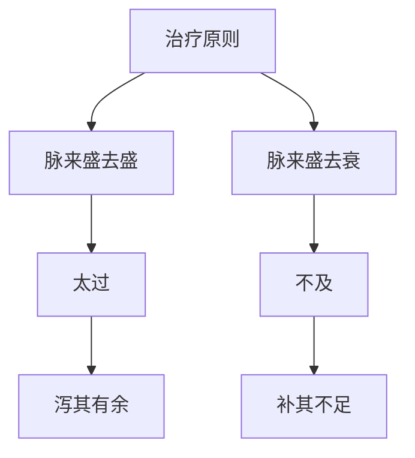

# 素问-大奇论篇第四十八

> "黄帝问曰：脉有奇恒，何也？岐伯曰：脉来盛去盛，是为太过；脉来盛去衰，是为不及。" - 岐伯

---

## 📜 原文（节选）/ Original Text (Excerpt)

黄帝问曰：脉有奇恒，何也？

岐伯曰：脉来盛去盛，是为太过；脉来盛去衰，是为不及。

帝曰：愿闻其状。

岐伯曰：脉来盛去盛，是为太过；脉来盛去衰，是为不及。脉来盛去盛，是为太过；脉来盛去衰，是为不及。脉来盛去盛，是为太过；脉来盛去衰，是为不及。

帝曰：治之奈何？

岐伯曰：治之奈何？脉盛去盛，是为太过，当泻其有余；脉来盛去衰，是为不及，当补其不足。

　　肝满肾满肺满皆实，即为肿。肺之雍，喘而两胠满；肝雍，两胠满，卧则惊，不得小便；肾雍，脚下至少腹满，胫有大小，髀䯒[héng]大跛，易偏枯。

　　心脉满大，痫瘛筋挛；肝脉小急，痫瘛筋挛；肝脉骛，暴有所惊骇，脉不至若瘖，不治自已。

　　肾脉小急，肝脉小急，心脉小急，不鼓皆为瘕。

　　肾肝并沉为石水，并浮为风水，并虚为死，并小弦欲惊。

　　肾脉大急沉，肝脉大急沉，皆为疝。

　　心脉搏滑急为心疝，肺脉沉搏为肺疝。

　　三阳急为瘕，三阴急为疝，二阴急为痫厥，二阳急为惊。

　　脾脉外鼓，沉为肠澼，久自已。肝脉小缓为肠澼，易治。肾脉小搏沉，为肠澼下血，血温身热者死。心肝澼亦下血，二藏同病者可治。其脉小沉濇为肠澼，其身热者死，热见七日死。

　　胃脉沉鼓濇，胃外鼓大，心脉小坚急，皆鬲偏枯。男子发左，女子发右，不瘖舌转，可治，三十日起，其从者，瘖，三岁起。年不满二十者，三岁死。

　　脉至而搏，血衄身热者死，脉来悬钩浮为常脉。

　　脉至如喘，名曰暴厥。暴厥者，不知与人言。脉至如数，使人暴惊，三四日自已。

　　脉至浮合，浮合如数，一息十至以上，是经气予不足也，微见九十日死；脉至如火薪然，是心精之予夺也，草干而死；脉至如散叶，是肝气予虚也，木叶落而死；脉至如省客，省客者，脉塞而鼓，是肾气予不足也，悬去枣华而死；脉至如丸泥，是胃精予不足也，榆荚落而死；脉至如横格，是胆气予不足也，[禾熟](https://www.guoxuemeng.com/gushici/80961.html)而死；脉至如弦缕，是胞精予不足也，病善言，下霜而死，不言可治；脉至如交漆，交漆者，左右傍至也，微见三十日死；脉至如涌泉，浮鼓肌中，太阳气予不足也，少气味，韭英而死；脉至如颓土之状，按之不得，是肌气予不足也，五色先见，黑白垒发死；脉至如悬雍，悬雍者，浮揣切之益大，是十二俞之予不足也，水凝而死；脉至如偃刀，偃刀者，浮之小急，按之坚大急，五藏菀熟，寒热独并于肾也，如此其人不得坐，[立春](https://www.guoxuemeng.com/ershisijieqi/lichun/)而死；脉至如丸滑不直手，不直手者，按之不可得也，是大肠气予不足也，枣叶生而死；脉至如华者，令人善恐，不欲坐卧，行立常听，是小肠气予不足也，季秋而死。

---

## 📖 白话文翻译（节选）/ Modern Chinese Translation (Excerpt)

黄帝问道：脉有奇恒，为什么？

岐伯回答说：脉来旺盛去旺盛，这是太过；脉来旺盛去衰退，这是不及。

黄帝说：我希望听到它的状况。

岐伯说：脉来旺盛去旺盛，这是太过；脉来旺盛去衰退，这是不及。脉来旺盛去旺盛，这是太过；脉来旺盛去衰退，这是不及。脉来旺盛去旺盛，这是太过；脉来旺盛去衰退，这是不及。

黄帝说：治疗它如何？

岐伯说：治疗它如何？脉来旺盛去旺盛，这是太过，应当泻除它的有余；脉来旺盛去衰退，这是不及，应当补益它的不足。

　　肝经、肾经、肺经胀满者，其脉搏必实，当即发为浮肿。

　　肺脉壅滞，则喘息而两胁胀满。肺脉壅滞，则两胁胀满，睡卧时惊惕不安，小便不利。肺脉壅滞，则胁下至少腹部胀满，两侧胫部粗细大小不同，患侧脾胫肿大，活动受限，日久且易发生偏枯病。

　　心脉满大，是心经热盛，耗劫肝阴，心神被伤，筋脉失养，故发生癫痫、抽搐及筋脉拘挛等症。肝脉小急，是肝血虚而寒滞肝脉，血不养心，筋脉不利，也能出现癫痫、抽搐和筋脉拘挛。肝脉的搏动急疾而乱，是由于受了惊吓，如果按不到脉搏或突然出现失音的，这是因惊吓一时气逆而致脉气不通不需治疗，待其气通即可恢复。肾、肝、心三脉细小而急疾，指下浮取鼓击不明显，是气血积聚在腹中，皆当发为瘕病。

　　肾脉和肝脉均见沉脉，为石水病；均见浮脉，为风水病；均见虚脉，为死症；均见小儿兼弦之脉，将要发生惊病。肾脉沉大急疾，肝脉沉大急疾，均为疝病。心脉搏动急疾流利，为心疝；肺脉沉而搏击于指下，为肺疝。

　　太阳之脉急疾，是受寒血凝为瘕；太阴之脉急疾，是受寒气聚为疝；少阴之脉急疾，是邪乘心肾，发为痫厥；阳明之脉急疾，是木邪乘胃，发为惊骇。脾脉见沉而又有向外鼓动之象，是痢疾，为里邪出表的脉象日久必然自愈。肝脉小而缓慢的，为痢疾邪气较轻，容易治愈。肾脉沉小而动，是痢疾，或大便下血，若血热身热，是邪热有余，真阴伤败，为预后不良的死症。心肝二脏所发生的痢疾，亦见下血，如果是两脏同病的，可以治疗，若其脉都出现小沉而涩滞的痢疾，兼有身热的，预后多不良，如连续身热七天以上，多属死症。

　　胃脉沉而应指涩滞，或者浮而应指甚大，以及心脉细小坚硬急疾的，都属气血隔塞不通，当病偏枯半身不遂。若男子发病在左侧，女子发病在右侧，说话正常，舌体转动灵活，可以治疗，经过三十天可以痊愈。如果男病在右，女病在左，说话发不出声音的，需要三年才能痊愈。如果患者年龄不满二十岁，此为禀赋不足，不出三年就要死亡。脉来搏指有力，病见衄血而身发热，为真阴脱败的死证。若是脉来浮钩如悬的，则是失血的常见之脉。脉来喘急，突然昏厥，不能言语的，名叫暴厥。脉来如热盛之数，得之暴受惊吓，经过三四天就会自行恢复。

　　脉来如浮波之合，象热盛时的数脉一样急疾，一呼一吸跳动十次以上，这是经脉之气均已不足的现象，从开始见到这种脉象起，经过九十天就要死亡。脉来如新燃之火，临势很盛，这是心脏的精气已经虚失，至秋末冬初野草干枯的时候就要死亡。脉来如散落的树叶，浮泛无根，这是肝脏精气虚极，至深秋树木落叶时就要死亡。脉来如访问之客，或来或去，或停止不动，或搏动鼓指，这是肾脏的精气不足，在初夏枣花开落的时候，火旺水败，就会死亡。脉来如泥丸，坚强短涩，这是胃腑精气不足，在春末夏初榆荚枯落的时候就要死亡。脉来如有横木在指下，长而坚硬，这是胆的精气不足，到秋后谷类成熟的时候，金旺木败，就要死亡。脉来紧急如弦，细小如缕是胞脉的精气不足，若患者反多言语，是真阴亏损而虚阳外现，在下霜时，阳气虚败，就会死亡；若患者静而不言，则可以治疗；脉来如交漆，缠绵不清，左右旁至，为阴阳偏败，从开始见到这种脉象起三十日就会死亡。脉来如泉水上涌，浮而有力，鼓动于肌肉中，这是足太阳膀胱的精气不足，症状是呼吸气短，到[春天](https://www.guoxuemeng.com/gushici/chuntiandegushi/)尝到新韭菜的时候就要死亡。脉来如倾颓的腐士，虚大无力，重按则无，这是脾脏精气不足，若面部先见到五色中的黑色，是土败水侮的现象，到春天发生的时候，木旺土衰，就要死亡。如悬雍之上大下小，浮取揣摩则愈觉其大，按之益大，与筋骨相离，这是十二俞的精气不足，十二俞均属太阳膀胱经，故在冬季结冰的时候，阴盛阳绝，就要死亡。

　　脉来如仰卧的刀口，浮取小而急疾，重按坚大而急疾，这是五脏郁热形成的寒热交并于肾脏，这样的病人尽能睡卧，不能坐起，至[立春](https://www.guoxuemeng.com/ershisijieqi/lichun/)阳盛阴衰时就要死亡。脉来如弹丸，短小而滑，按之无根，这是大肠的精气不足，在初夏枣草树生叶的时候，火旺金衰，就要死亡。脉来如草木之花，轻浮柔弱，其人易发惊恐，坐卧不宁，内心多疑，所以不论行走或站立时，经常偷听别人的谈话，这是小肠的精气不足，到秋末阴盛阳衰的季节就要死亡。

---

## 🔑 核心要点 / Core Concepts

### 1. 奇恒脉象 / Extraordinary Pulse

| 脉象类型 | 机理 | 表现 |
|------|------|------|
| 太过 | 脉来盛去盛 | 脉来旺盛去旺盛 |
| 不及 | 脉来盛去衰 | 脉来旺盛去衰退 |

### 2. 脉象诊断 / Pulse Diagnosis

| 脉象 | 判断 | 治法 |
|------|------|------|
| 脉来盛去盛 | 太过 | 泻其有余 |
| 脉来盛去衰 | 不及 | 补其不足 |

### 3. 治疗原则 / Treatment Principles

---

## 📚 理论解释 / Theoretical Analysis

### 奇恒脉象理论 / Extraordinary Pulse Theory

> [!info] 核心概念
- 脉有奇恒之分
- 太过：脉来盛去盛
- 不及：脉来盛去衰

#### 奇恒脉象详解 / Detailed Extraordinary Pulse

**1. 奇恒脉象 / Extraordinary Pulse Types**
- 奇脉：奇脉，不同于常脉
- 恒脉：恒脉，正常脉象
- 太过：脉来盛去盛
- 不及：脉来盛去衰

**2. 脉象表现 / Pulse Manifestations**
- 太过：脉来旺盛去旺盛
- 不及：脉来旺盛去衰退
- 判断：盛去盛为太过，盛去衰为不及

**3. 治疗原则 / Treatment Principles**
- 太过：泻其有余
- 不及：补其不足
- 调和：调和平秘

### 奇恒脉机理理论 / Extraordinary Pulse Mechanism Theory

> [!warning] 核心理念
- 脉来盛去盛为太过
- 脉来盛去衰为不及
- 治疗需辨证

#### 奇恒脉详解 / Detailed Extraordinary Pulse

**1. 太过机理 / Excess Mechanism**
- 机理：脉来旺盛去旺盛
- 表现：气血有余
- 治法：泻其有余

**2. 不及机理 / Deficiency Mechanism**
- 机理：脉来旺盛去衰退
- 表现：气血不足
- 治法：补其不足

**3. 治疗辨证 / Treatment Differentiation**
- 盛泻：盛则泻之
- 虚补：虚则补之
- 调和：调和平秘

---

## 🏥 中医实践应用 / TCM Practice Application

### 脉象诊断 / Pulse Diagnosis Application

#### 现代脉象诊断要点 / Modern Pulse Diagnosis Key Points

**1. 太过脉治疗 / Excess Pulse Treatment**
- 脉象：脉来盛去盛
- 治法：泻其有余
- 药物：根据辨证选择泻热药物
- 针刺：泻法针刺

**2. 不及脉治疗 / Deficiency Pulse Treatment**
- 脉象：脉来盛去衰
- 治法：补其不足
- 药物：根据辨证选择补益药物
- 针刺：补法针刺

**3. 调和脉治疗 / Harmonious Pulse Treatment**
- 脉象：脉来平和
- 治法：调和平秘
- 药物：根据辨证选择调和药物
- 针刺：平补平泻

---

## 🔗 相关链接 / Related Links

- [[MOC-黄帝内经知识库]] - 主索引
- [[黄帝内经-素问索引]] - 素问索引
- [[黄帝内经-核心理论]] - 核心理论体系
- [[素问46-病能论篇]] - 病能
- [[素问49-脉解篇]] - 脉解

### 易学关联 / Yi Jing Connection

- [[MOC-易经知识库]] - 易经索引
- [[20260201-0005 五行]] - 五行理论

**易学与大奇论的联系:**
- 五行理论：易学的五行理论与中医脉象相通
- 阴阳理论：易学的阴阳理论与中医太过不及相通

---

## 💡 学习要点 / Learning Points

### 掌握重点 / Key Points to Master

- [ ] 理解奇恒脉象的概念
- [ ] 掌握太过不及的判断
- [ ] 学会脉象诊断的方法
- [ ] 了解奇恒脉象的理论

### 思考问题 / Questions for Reflection

1. **为什么说"脉来盛去盛，是为太过"？**
   - 脉来旺盛：脉来旺盛
   - 去旺盛：去旺盛
   - 太过：气血有余

2. **现代医学如何应用"大奇论"？**
   - 脉象诊断：脉象诊断疾病
   - 盛泻虚补：盛则泻之，虚则补之
   - 综合治疗：综合治疗方案

---

## 📊 学习进度 / Learning Progress

### 完成情况 / Completion Status

| 学习内容 | 状态 | 备注 |
|---------|------|------|
| 原文诵读 | 📝 进行中 | 建议每日诵读 |
| 白话文理解 | ✅ 已完成 | 理解主要含义 |
| 奇恒脉象 | ✅ 已完成 | 掌握概念 |
| 脉象诊断 | 📝 进行中 | 需要临床实践 |
| 理论分析 | ✅ 已完成 | 理解理论 |

---

## 🔄 更新日志 / Update Log

### 2026-02-03

- ✅ 创建大奇论篇第四十八笔记
- ✅ 完成原文、白话文翻译（节选）
- ✅ 整理奇恒脉象对照表
- ✅ 编写奇恒脉象理论

---

**笔记创建日期**：2026年2月3日

**最后更新**：2026年2月3日
