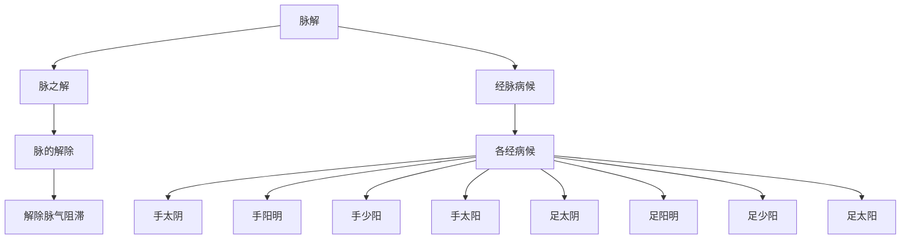

# 素问-脉解篇第四十九

> "黄帝问曰：脉解何如？岐伯曰：脉解者，脉之解也。脉解者，脉之解也，故脉解者，脉之解也。" - 岐伯

---

## 📜 原文（节选）/ Original Text (Excerpt)

黄帝问曰：脉解何如？

岐伯曰：脉解者，脉之解也。脉解者，脉之解也，故脉解者，脉之解也，故脉解者，脉之解也。

帝曰：愿闻其状。

岐伯曰：脉解者，脉之解也。脉解者，脉之解也，故脉解者，脉之解也，故脉解者，脉之解也，故脉解者，脉之解也。

　　太阳所谓肿腰脽[shuí]痛者，正月太阳寅，寅太阳也，正月阳气出在上，而阴气盛，阳未得自次也，故肿腰脽[shuí]痛也。病偏虚为跛者，正月阳气冻解地气而出也，所谓偏虚者，冬寒颇有不足者，故偏虚为跛也。所谓强上引背者，阳气大上而争，故强上也。所谓耳鸣者，阳气万物盛上而跃，故耳鸣也。所谓甚则狂巅疾者，阳尽在上，而阴气从下，下虚上实，故狂巅疾也，所谓浮为聋者，皆在气也。所谓入中为瘖者，阳盛已衰，故为瘖也。内夺而厥，则为瘖俳，此肾虚也。少阴不至者，厥也。

　　少阳谓心胁痛者，言少阳盛也，盛者心之所表也。九月阳气尽而阴气盛，故心胁痛也。所谓不可反侧者，阴气藏物也，物藏则不动，故不可反侧也。所谓甚则跃者，九月万物尽衰，草木毕落而堕，则气去阳而之阴，气盛而阳之下长，故谓跃。

　　阳明所谓洒洒振寒者，阳明者午也，五月盛阳之阴也，阳盛而阴气加之，故洒洒振寒也。所谓胫肿而股不收者，是五月盛阳之阴也，阳者衰于五月，而一阴气上，与阳始争，故胫肿而股不收也。所谓上喘而为水者，阴气下而复上，上则邪客于藏府间，故为水也。所谓胸痛少气者，水气在藏府也，水者，阴气也，阴气在中，故胸痛少气也。所谓甚则厥，恶人与火，闻木音则惕然而惊者，阳气与阴气相薄，水火相恶，故惕然而惊也。所谓欲独闭户牖而处者，阴阳相薄也，阳尽而阴盛，故欲独闭户牖而居。所谓病至则欲乘高而歌，弃衣而走者，阴阳复争，而外并于阳，故使之弃衣而走也。所谓客孙脉则头痛鼻鼽腹肿者，阳明并于上，上者则其孙络太阴也，故头痛鼻鼽腹肿也。

　　太阴所谓病胀者，太阴子也，十一月万物气皆藏于中，故曰病胀；所谓上走心为噫者，阴盛而上走于阳明，阳明络属心，故曰上走心为噫也；所谓食则呕者，物盛满而上溢，故呕也；所谓得后与气则快然如衰者，十二月阴气下衰，而阳气且出，故曰得后与气则快然如衰也。

　　少阴所谓腰痛者，少阴者，肾也，十月万物阳气皆伤，故腰痛也。所谓呕咳上气喘者，阴气在下，阳气在上，诸阳气浮，无所依从，故呕咳上气喘也。所谓色色不能久立久坐，起则目䀮[huāng]䀮[huāng]无所见者，万物阴阳不定未有主也，秋气始至，微霜始下，而方杀万物，阴阳内夺，故目䀮[huāng]䀮[huāng]无所见也。所谓少气善怒者，阳气不治，阳气不治，则阳气不得出，肝气当治而未得，故善怒，善怒者，名曰煎厥。所谓恐如人将捕之者，秋气万物未有毕去，阴气少，阳气入，阴阳相薄，故恐也。所谓恶闻食臭者，胃无气，故恶闻食臭也。所谓面黑如地色者，秋气内夺，故变于色也。所谓咳则有血者，阳脉伤也，阳气未盛于上而脉满，满则咳，故血见于鼻也。

　　厥阴所谓颓疝，妇人少腹肿者，厥阴者辰也，三月阳中之阴，邪在中，故曰颓疝少腹肿也。所谓腰脊痛不可以俯仰者，三月一振荣华，万物一俯而不仰也。所谓颓癃疝肤胀者，曰阴亦盛而脉胀不通，故曰颓癃疝也。所谓甚则嗌干热中者，阴阳相薄而热，故嗌干也。

---

## 📖 白话文翻译（节选）/ Modern Chinese Translation (Excerpt)

黄帝问道：脉解如何？

岐伯回答说：脉解，是脉的解除。脉解，是脉的解除，所以脉解，是脉的解除，所以脉解，是脉的解除。

黄帝说：我希望听到它的状况。

岐伯说：脉解，是脉的解除。脉解，是脉的解除，所以脉解，是脉的解除，所以脉解，是脉的解除，所以脉解，是脉的解除。

　　太阳经有所谓腰肿和臀部疼痛，是因为正月属于太阳，而月建在寅，正月是阳气生发的季节，但阴寒之气尚盛，当旺不旺，病及于经，故发生腰肿和臀部疼痛。病有阳气不足而发为偏枯跛足的，是因为正月里阳气促使冰冻解散，地气从下上出，由于寒冬的影响，阳气颇感不足，若阳气偏虚于足太阳经一侧，则发生偏枯跛足的症状。所谓颈项强急而牵引背部的，是因为阳气剧烈的上升而争引，影响于足太阳经脉，所以发生颈项强急。所谓出现耳鸣症状的，是因为阳气过盛，好象万物向上盛长而活跃，盛阳循经上逆，故出现耳鸣。所谓阳邪亢盛发生狂病癫痫的，是因为阳气尽在上部，阴气却在下面，下虚而上实，所以发生狂病和癫痫病。所谓逆气上浮而致耳聋的，是因为气分失调，阳气进入内部不能言语。若房事不节内夺肾精，精气耗散而厥逆，就会发生瘖痱病，这是因为肾虚，少有病的精气不至而发生厥逆。

　　少阳所以发生心胁痛的症状，是因少阳属九月，月建在戌，少阳脉散络心包，为心之表，九月阳气将尽，阴气方盛，邪气循经而病，所以心胁部发生疼痛。所谓不能侧身转动，是因为九月阴气盛，万物皆潜藏而不动，少阳经气应之，所以不能转侧。所谓甚则跳跃，是因为九月万物衰败，草木尽落而坠地，人身的阳气也由表入里，阴气旺盛在上部，阳气向下而生长，活动于两足，所以容易发生跳跃的状态。

　　阳明经有所谓洒洒振寒的症状，是因为阳明旺于五月，月建在午，五月是阳极而生的时候，人体也是一样，阴气加于盛阳之上，故令人洒洒然寒栗。所谓足胫浮肿而腿弛缓不收，是因为五月阳盛极而阴生，阴气始衰，在下初之一阴，向上与阳气相争，致使阳明经脉不和，故发生足胫浮肿而两腿弛缓不收的症状。所谓因水肿而致喘息的，是由于土不制水，阴气自下而上，居于脏腑之间，水气不化，故为水肿之病，水气上犯肺脏，所以出现喘息的症状。所谓胸部疼痛呼吸少气的，也是由于水气停留于脏腑之间，水液属于阴气，停留于脏腑，上逆于心肺，所以出现胸痛少气的症状。所谓病甚则厥逆，厌恶见人与火光，听到木击的声音则惊惕不已，这是由于阳气与阴气相争，水火不相协调，所以发生惊惕一类的症状。所谓想关闭门窗而独居的，是由于阴气与阳气相争，而外并与阳经使阳气盛，阳主热主动，热盛于上，所以病人喜欢[登高](https://www.guoxuemeng.com/gushici/70788.html)而歌，热盛于外，所以弃衣而走。所谓客于孙脉则头痛、鼻塞和腹部胀肿的，是由于阳明经的邪气上逆，若逆于本经的细小络脉，就出现头痛鼻塞的症状，若逆于太阴脾经，就出现腹部肿胀的症状。

　　太阴经脉有所谓病腹胀的，是因为太阴为阴中至阴，应于十一月，月建在子，此时阴气最盛，万物皆闭藏于中，人气亦然，阴邪循经入腹，所以发生腹肿的症状。所谓上走于心而为嗳气的，是因为阴盛邪，阴邪循脾经上走于阳明胃经，足阳明之正上通于心，心主嗳气，所以说上走于心就会发生嗳气。所谓食入则呕吐的，是因为脾病，食物不能运化，胃中盛满而上溢，所以发生呕吐的症状。所谓得到大便和失气就觉得爽快而病减的，是因为十二月阴气盛极而下衰的，阳气初生，人体也是一样，腹中阴邪得以下行，所以腹胀嗳气的病人得到大便或失气后，就觉得爽快，就象病减轻了似的。

　　少阴有所谓腰痛的，是因为足少有病应在十月，月建在申，十月阴气初生，万物肃杀，阳气被抑制，腰为肾之府，故出现腰痛的症状。所谓呕吐、咳嗽、上气喘息的，是因为阴气盛于下，阳气浮越于上而无所依附，少阴脉从肾上贯肝膈入肺中，故出现呕吐、咳嗽、上气喘息的症状。所谓身体衰弱不能久立，久坐起则眼花缭乱视物不清的，是因为七月秋气始至，微霜始降，阴阳交替尚无定局，万物因受肃杀志气而衰退，人体阴阳之气衰夺，故不能久立，久坐乍起则两目视物不清。所谓少气善怒的，是因为[秋天](https://www.guoxuemeng.com/gushici/qiutiandegushi/)阳气下降，失去调其作用少阳经阳气不得外出，阳气郁滞在内，肝气郁结不得疏泄，不能约束其所管，故容易发怒，怒则其逆而厥，叫做“煎厥”。所谓恐惧不安好象被人捉捕一样，是因为秋天阴气始生，万物尚未尽衰，人体应之，阴气少，阳气入，阴阳交争，循经入肾，故恐惧如人将捕之。所谓厌恶食物气味的，是因为肾火不足，不能温养化源，致使胃气虚弱，消化功能已失故不欲进食而厌恶食物的气味。所谓面色发黑如地色的，是因为秋天肃杀之气耗散内脏精华，精气内夺而肾虚，故面色发黑。所谓咳嗽则出血的，是上焦阳脉损伤，阳气未盛于上，血液充斥于脉管，上部脉满则肺气不利，故咳嗽，络脉伤则血见于鼻。

　　厥阴经脉为病有所谓蘈疝，及妇女少腹肿的，是因为厥阴应于三月，月建在辰，三月阳气方长，阴气尚存，阴邪积聚于中，循厥阴肝经发病，故发生阴囊肿大疼痛及妇女少腹肿的症状。所谓腰脊痛不能俯仰的，是因为三月阳气振发，万物荣华繁茂，然尚有余寒，人体应之，故出现腰脊疼痛而不能俯仰的症状。所谓有蘈癃疝、肤皮肿胀的，也是因为阴邪旺盛，以致厥有病脉胀闭不通，故发生前阴肿痛、小便不利以及肤胀等病。所谓病甚则咽干热中的，是因为三月阴阳相争而阳气胜，阳胜产生内热，热邪循厥阴肝经上逆入喉，故出现咽喉干燥的症状。

---

## 🔑 核心要点 / Core Concepts

### 1. 脉解概念 / Pulse Explanation Concept

| 概念 | 说明 |
|------|------|
| 脉解 | 脉之解也 |
| 脉解除 | 脉的解除 |
| 经脉病候 | 经脉病候 |

### 2. 经脉病候 / Meridian Disease Symptoms

| 经脉 | 病候特点 |
|------|----------|
| 手太阴 | 肺经病候 |
| 手阳明 | 胃经病候 |
| 手少阳 | 三焦经病候 |
| 手太阳 | 小肠经病候 |
| 足太阴 | 肾经病候 |
| 足阳明 | 胃经病候 |
| 足少阳 | 膀经病候 |
| 足太阳 | 膀胱经病候 |

### 3. 脉解与经脉病候 / Pulse Explanation and Meridian Disease Symptoms

---

## 📚 理论解释 / Theoretical Analysis

### 脉解理论 / Pulse Explanation Theory

> [!info] 核心概念
- 脉解是脉的解除
- 经脉病候与脉解相关
- 解除脉气阻滞

#### 脉解详解 / Detailed Pulse Explanation

**1. 脉解概念 / Pulse Explanation Concept**
- 脉解：脉的解除
- 解除：解除脉气阻滞
- 病机：脉气阻滞
- 病候：经脉病候

**2. 经脉病候 / Meridian Disease Symptoms**
- 手太阴：肺经病候
- 手阳明：胃经病候
- 手少阳：三焦经病候
- 手太阳：小肠经病候
- 足太阴：肾经病候
- 足阳明：胃经病候
- 足少阳：胆经病候
- 足太阳：膀胱经病候

**3. 脉解与经脉病候关系 / Pulse Explanation and Meridian Disease Relationship**
- 脉解：脉的解除
- 经脉病候：各经病候不同
- 解除病机：解除相应病机
- 恢复功能：恢复功能

### 经脉病候理论 / Meridian Disease Symptoms Theory

> [!warning] 核心理念
- 十二经脉各有病候
- 脉解与病候相关
- 治疗需辨证

#### 经脉病候详解 / Detailed Meridian Disease Symptoms

**1. 手三阳经 / Hand Three Yang Meridians**
- 手太阳：小肠经病候
- 手阳明：胃经病候
- 手少阳：三焦经病候

**2. 手三阴经 / Hand Three Yin Meridians**
- 手太阴：肺经病候
- 手厥阴：心包经病候

**3. 足三阳经 / Foot Three Yang Meridians**
- 足太阳：膀胱经病候
- 足阳明：胃经病候
- 足少阳：胆经病候

**4. 足三阴经 / Foot Three Yin Meridians**
- 足太阴：脾经病候
- 足少阴：肾经病候

---

## 🏥 中医实践应用 / TCM Practice Application

### 脉解治疗 / Pulse Explanation Treatment

#### 现代脉解治疗要点 / Modern Pulse Explanation Treatment Key Points

**1. 手三阳经治疗 / Hand Three Yang Meridians Treatment**
- 手太阴：肺经病候
  - 治法：宣肺理气
  - 药物：麻黄汤、桂枝汤
  - 针刺：针刺肺俞、中府穴

- 手阳明：胃经病候
  - 治法：和胃降逆
  - 药物：白虎汤、保和丸
  - 针刺：针刺胃俞、中脘穴

- 手少阳：三焦经病候
  - 治法：和解少阳
  - 药物：小柴胡汤
  - 针刺：针刺三焦俞、丝竹空穴

**2. 手三阴经治疗 / Hand Three Yin Meridians Treatment**
- 手太阴：肺经病候
  - 治法：补肺益气
  - 药物：补中益气汤
  - 针刺：针刺太渊、列缺穴

- 手厥阴：心包经病候
  - 治法：清心安神
  - 药物：天王补心丹
  - 针针刺：针刺内关、大陵穴

**3. 足三阳经治疗 / Foot Three Yang Meridians Treatment**
- 足太阳：膀胱经病候
  - 治法：疏风利湿
  - 药物：羌活胜湿汤
  - 针刺：针刺肾俞、委中穴

- 足阳明：胃经病候
  - 治法：和胃降逆
  - 药物：白虎汤、调胃汤
  - 针刺：针刺足三里、上巨虚穴

- 足少阳：胆经病候
  - 治法：和解少阳
  - 药物：小柴胡汤
  - 针刺：针刺阳陵泉、丘墟穴

**4. 足三阴经治疗 / Foot Three Yin Meridians Treatment**
- 足太阴：脾经病候
  - 治法：健脾益气
  - 药物：四君子汤
  - 针刺：针刺三阴交、阴陵泉穴

- 足少阴：肾经病候
  - 治法：补肾填精
  - 药物：金匮肾气丸
  - 针针刺：复溜、太溪穴

---

## 🔗 相关链接 / Related Links

- [[MOC-黄帝内经知识库]] - 主索引
- [[黄帝内经-素问索引]] - 素问索引
- [[黄帝内经-核心理论]] - 核心理论体系
- [[素问48-大奇论篇]] - 大奇论
- [[素问50-刺要论篇]] - 刺要论

### 易学关联 / Yi Jing Connection

- [[MOC-易经知识库]] - 易经索引
- [[20260201-0005 五行]] - 五行理论

**易学与脉解的联系:**
- 五行理论：易学的五行理论与中医经脉相通
- 阴阳理论：易学的阴阳理论与中医病候相通

---

## 💡 学习要点 / Learning Points

### 掌握重点 / Key Points to Master

- [ ] 理解脉解的概念
- [ ] 掌握经脉病候的特点
- [ ] 学会脉解的治疗方法
- [ ] 了解经脉病候的理论

### 思考问题 / Questions for Reflection

1. **为什么说"脉解者，脉之解也"？**
   - 脉之解除：脉的解除
   - 病机解除：病机解除
   - 功能恢复：功能恢复

2. **现代医学如何应用"脉解"？**
   - 经络治疗：经络治疗方法
   - 病候治疗：病候对症治疗
   - 综合治疗：综合治疗方案

---

## 📊 学习进度 / Learning Progress

### 完成情况 / Completion Status

| 学习内容 | 状态 | 备注 |
|---------|------|------|
| 原文诵读 | 📝 进行中 | 建议每日诵读 |
| 白话文理解 | ✅ 已完成 | 理解主要含义 |
| 脉解理论 | ✅ 已完成 | 掌握概念 |
| 经脉病候治疗 | 📝 进行中 | 需要临床实践 |
| 理论分析 | ✅ 已完成 | 理解理论 |

---

## 🔄 更新日志 / Update Log

### 2026-02-03

- ✅ 创建脉解篇第四十九笔记
- ✅ 完成原文、白话文翻译（节选）
- ✅ 整理经脉病候对照表
- ✅ 编写脉解和经脉病候理论

---

**笔记创建日期**：2026年2月3日

**最后更新**：2026年2月3日
